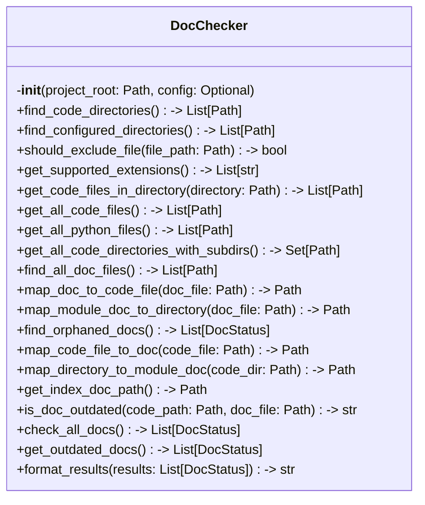

# Classes from doc_checker.py

Source: `autocode\core\doc_checker.py`

## DocStatus

**Metrics:** LOC: 6 | Methods: 0

```mermaid
classDiagram
    class DocStatus {
    }
    NamedTuple <|-- DocStatus

```

## DocChecker

**Metrics:** LOC: 322 | Methods: 20

```mermaid
classDiagram
    class DocChecker {
        -__init__(project_root: Path, config: Optional)
        +find_code_directories() -> List[Path]
        +find_configured_directories() -> List[Path]
        +should_exclude_file(file_path: Path) -> bool
        +get_supported_extensions() -> List[str]
        +get_code_files_in_directory(directory: Path) -> List[Path]
        +get_all_code_files() -> List[Path]
        +get_all_python_files() -> List[Path]
        +get_all_code_directories_with_subdirs() -> Set[Path]
        +find_all_doc_files() -> List[Path]
        +map_doc_to_code_file(doc_file: Path) -> Path
        +map_module_doc_to_directory(doc_file: Path) -> Path
        +find_orphaned_docs() -> List[DocStatus]
        +map_code_file_to_doc(code_file: Path) -> Path
        +map_directory_to_module_doc(code_dir: Path) -> Path
        +get_index_doc_path() -> Path
        +is_doc_outdated(code_path: Path, doc_file: Path) -> str
        +check_all_docs() -> List[DocStatus]
        +get_outdated_docs() -> List[DocStatus]
        +format_results(results: List[DocStatus]) -> str
    }

```

