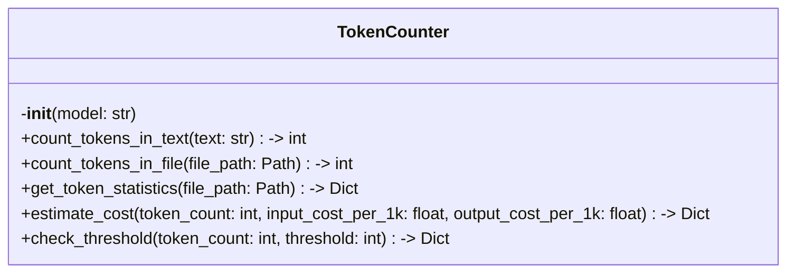

# Classes from token_counter.py

Source: `autocode\core\token_counter.py`

## TokenCounter

**Metrics:** LOC: 123 | Methods: 6

```mermaid
classDiagram
    class TokenCounter {
        -__init__(model: str)
        +count_tokens_in_text(text: str) -> int
        +count_tokens_in_file(file_path: Path) -> int
        +get_token_statistics(file_path: Path) -> Dict
        +estimate_cost(token_count: int, input_cost_per_1k: float, output_cost_per_1k: float) -> Dict
        +check_threshold(token_count: int, threshold: int) -> Dict
    }

```

