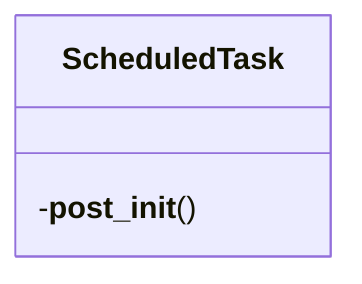
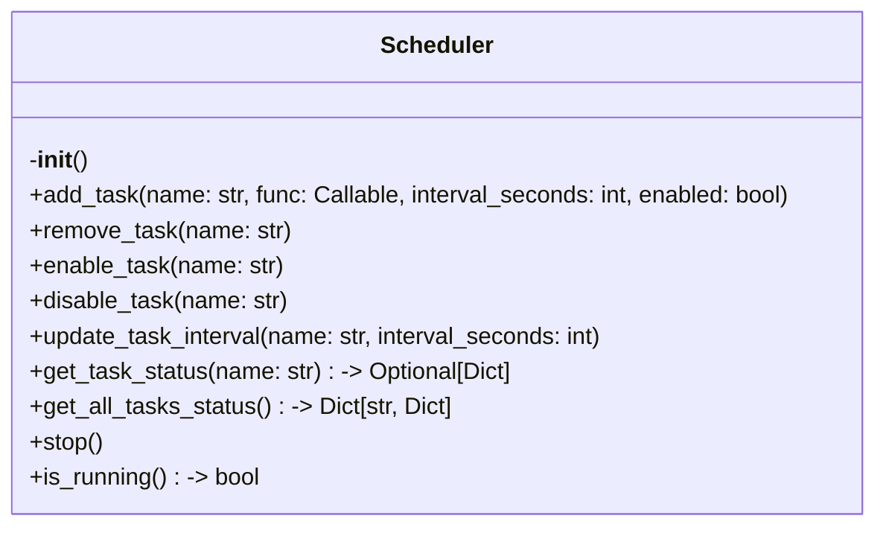

# Classes from scheduler.py

Source: `autocode\orchestration\scheduler.py`

## ScheduledTask

**Metrics:** LOC: 12 | Methods: 1

```mermaid
classDiagram
    class ScheduledTask {
        -__post_init__()
    }

```

## Scheduler

**Metrics:** LOC: 152 | Methods: 10

```mermaid
classDiagram
    class Scheduler {
        -__init__()
        +add_task(name: str, func: Callable, interval_seconds: int, enabled: bool)
        +remove_task(name: str)
        +enable_task(name: str)
        +disable_task(name: str)
        +update_task_interval(name: str, interval_seconds: int)
        +get_task_status(name: str) -> Optional[Dict]
        +get_all_tasks_status() -> Dict[str, Dict]
        +stop()
        +is_running() -> bool
    }

```

