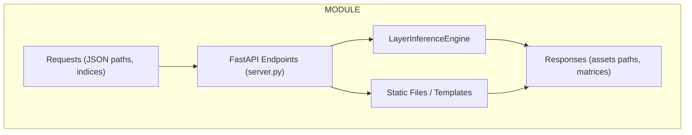
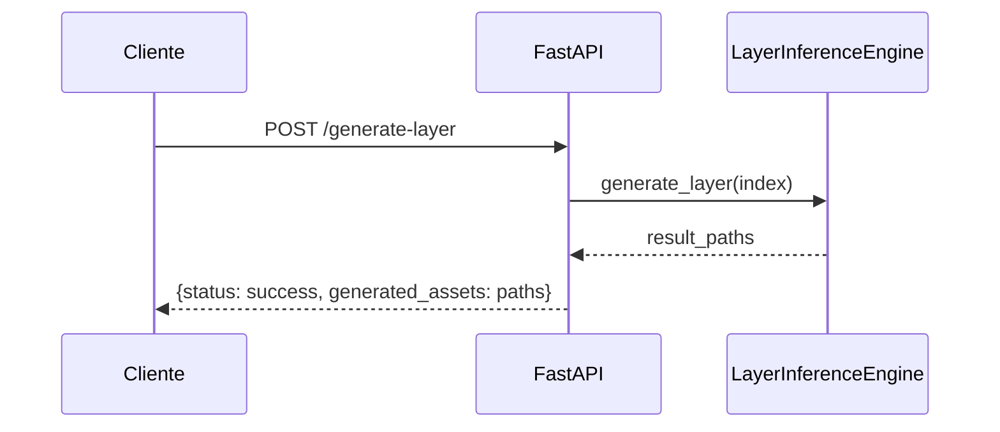
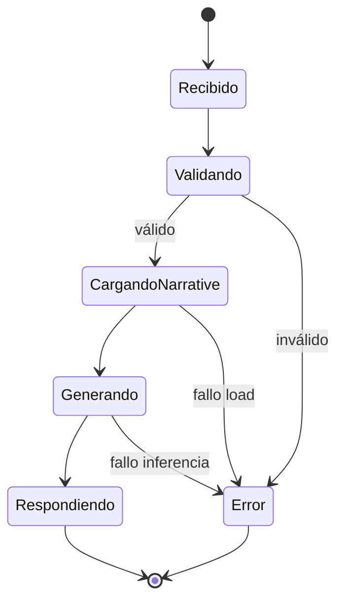
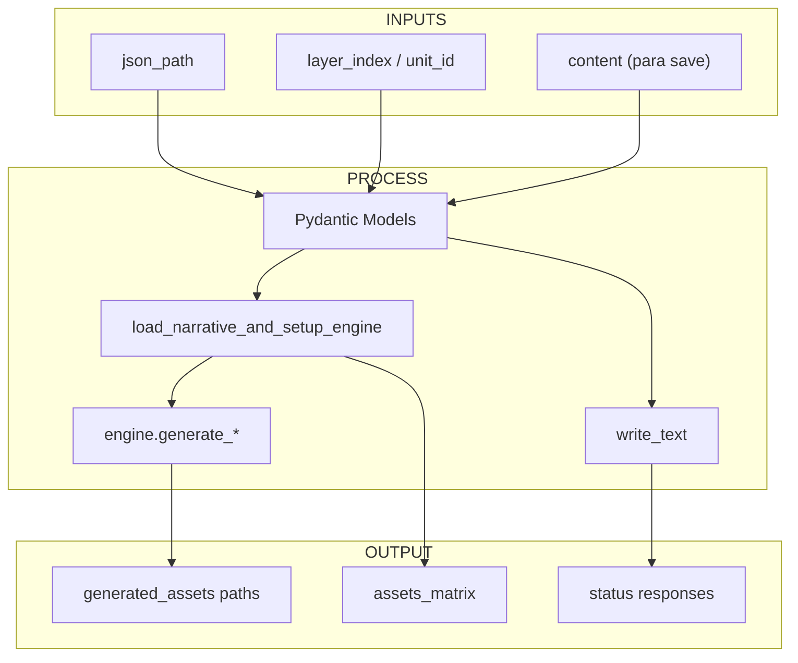
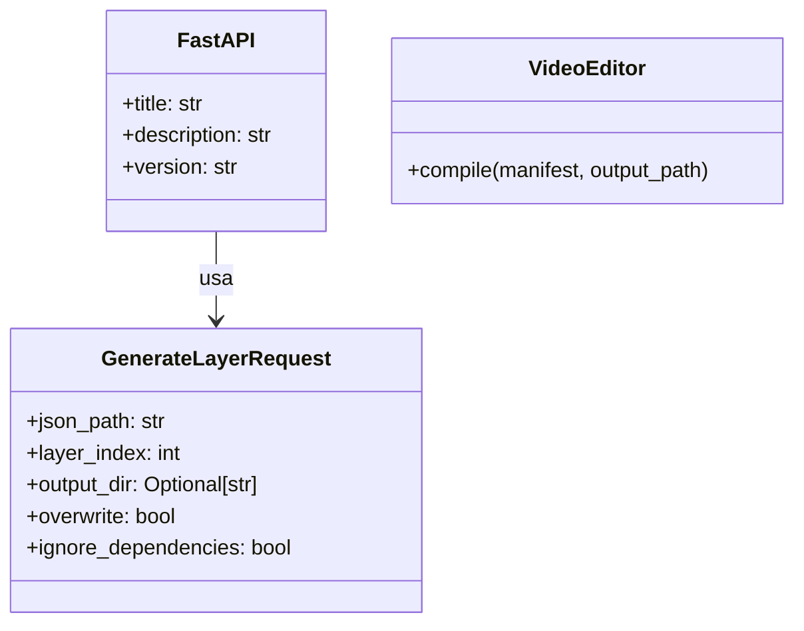

# Informe para el Módulo `vidi/api`

## Resumen Ejecutivo
- El módulo `vidi/api` implementa un servidor FastAPI para servicios de inferencia granular, permitiendo operaciones como generación de assets por capa, unidad o individual, manejo de narratives JSON, listado de assets y edición experimental vía chat.
- `server.py` es el núcleo, configurando la app FastAPI con endpoints, middleware, templates Jinja2 y montaje de archivos estáticos.
- Integra `LayerInferenceEngine` para orquestar inferencias, con soporte para validación Pydantic y logging.
- `__init__.py` expone la API pública re-exportando la app.
- El módulo sigue principios de modularidad, seguridad (restricciones en paths) y usabilidad, con UI dashboard para interacción.

## Componentes Principales por Archivo/Directorio
- **`server.py`**
  - Configura la app FastAPI con título, descripción y versión.
  - Define middleware para no-cache en assets generados.
  - Monta directorios estáticos y templates Jinja2.
  - Inicializa `LayerInferenceEngine` global.
  - Modelos Pydantic para requests: `GenerateLayerRequest`, `GenerateUnitRequest`, etc.
  - Funciones helpers: `_resolve_json_full_path`, `load_narrative_and_setup_engine`, `_build_enhanced_context`.
  - Endpoints: dashboard (`/`), generación (`/generate-layer`, `/generate-unit`, `/generate-single`), utilities (`/get-units`, `/examples`, `/get-json`, `/save-json`, `/chat-modify`, `/list-assets`, `/assets-matrix`, `/health`).
- **`__init__.py`**
  - Re-exporta la app de FastAPI para importación fácil.

## Flujos y Procesos Clave
1. Inicialización: Carga configs, crea directorios, monta static/templates.
2. Carga de narrative: Valida path, parsea JSON a `VideoNarrative`, resuelve hierarchy a layers_dict, configura engine.
3. Generación: Para layer/unit/single, resuelve placeholders, genera assets con overwrite/ignore options, retorna paths.
4. Manejo de JSON: Lee/guarda con validación Pydantic y schema.
5. Listado de assets: Escanea directorio por patrones de nombres, construye matrices con flags de existencia.
6. Edición chat: Usa DSPy para modificar JSON basado en mensajes.
7. Health check: Retorna status simple.

## Dependencias y Relaciones
- **Internas**
  - Integra `LayerInferenceEngine`, `VideoNarrative`, `HierarchyResolver` de otros módulos vidi.
  - Usa `edit_json` de experimental para chat-modify.
- **Externas**
  - FastAPI, Pydantic para API y validación.
  - Jinja2 para templates, uvicorn para run.
  - Bibliotecas: json, logging, pathlib, typing, collections.
  - Opcionales: DSPy para edición experimental.

## Gestión de Estado y Recursos
- Directorios: STATIC_DIR y TEMPLATES_DIR para assets y UI.
- Middleware: Desactiva caché en /static/assets/.
- Engine global: Configurable con output_dir y overwrite.
- Logging: Básico con level INFO, errores en endpoints.

## Artefactos de Entrada y Salida
- **Entradas**: Paths JSON, índices/ID para generación, contenido raw para save.
- **Artefactos Intermedios**: Narratives parseadas, layers_dict, assets generados.
- **Salidas**: JSON responses con status, paths, matrices; HTML dashboard.

## Diagramas Mermaid

### Vista del Módulo


### Pipeline de Generación


### Secuencia de Interacción


### Estados del Flujo


### Mapa de Entrada/Salida


### Modelo de Clases


## Ejemplos de Uso
### Generación de Capa
```json
{
  "json_path": "static/examples/example.json",
  "layer_index": 0,
  "output_dir": "static/assets",
  "overwrite": true
}
```
Llama a /generate-layer, genera assets para la capa 0 en todas las units.

### Guardar JSON Editado
```json
{
  "json_path": "static/examples/edited.json",
  "content": "{\"key\": \"value\"}"
}
```
Llama a /save-json, valida y guarda el contenido.

## Manejo de Errores y Casos Límite
- HTTPExceptions para paths inválidos, JSON no encontrado, validación fallida.
- Logging de errores en endpoints.
- Restricciones: Solo paths bajo static/examples/.

## Consideraciones de Rendimiento y Escalabilidad
- Middleware para no-cache evita issues de stale assets.
- Logging básico; escalable con más workers en uvicorn.
- Dependiente de LayerInferenceEngine para paralelismo.

## Suposiciones y Limitaciones
- Requiere JSON válidos bajo static/examples/.
- No soporta paths arbitrarios por seguridad.
- Edición chat es experimental.

## Estrategia de Testing
- **Unitarios**: Validación de models, helpers como _resolve_json_full_path.
- **Integración**: Flujos de endpoints con mocks de engine.
- **E2E**: Llamadas reales a API, verificación de assets generados.

## Inventario de Tests
### Tests Unitarios (`tests/unit/api/`)
- `test_server.py`: `test_resolve_json_full_path`, `test_load_narrative_and_setup_engine`.
- `test_models.py`: Validaciones Pydantic.

### Tests de Integración (`tests/integration/api/`)
- `test_generate_endpoints`, `test_json_handling`.

### Tests End-to-End (`tests/e2e/api/`)
- `test_full_generation_flow`, `test_dashboard_render`.
