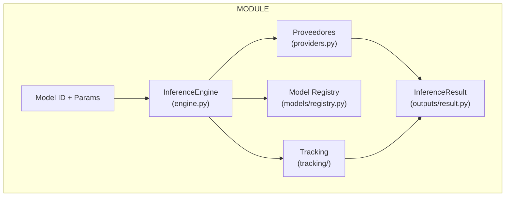
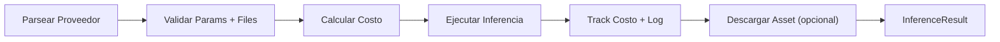
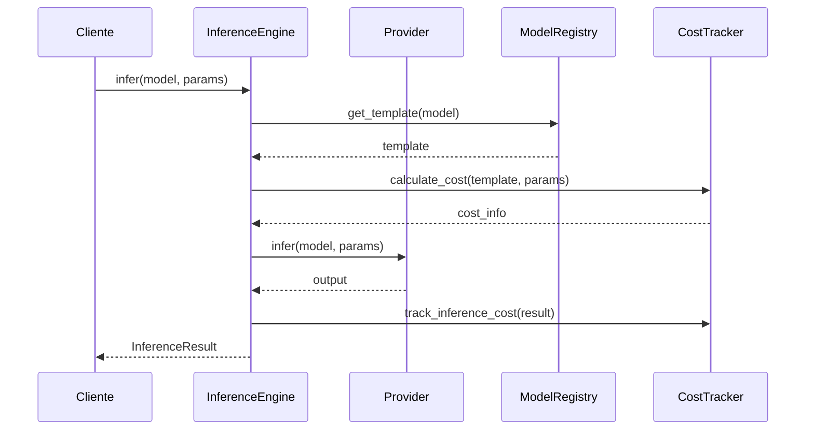
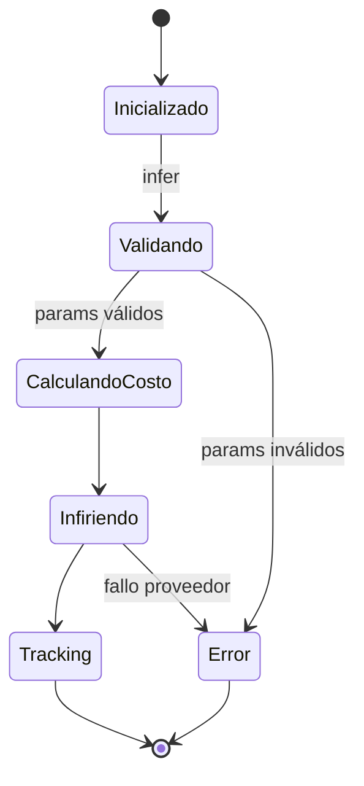
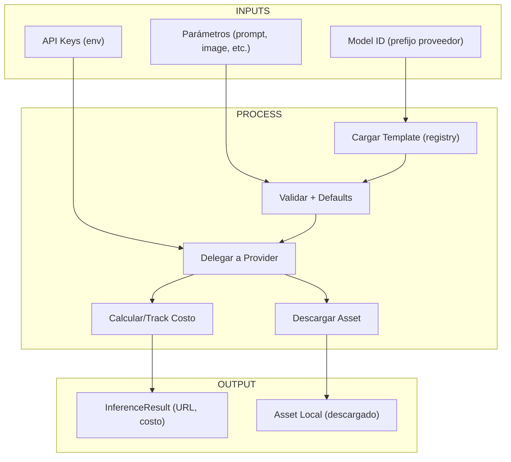
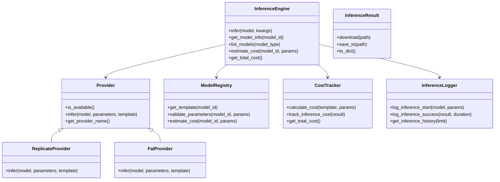

# Informe para el Módulo `vidi/inference`

## Resumen Ejecutivo
- El módulo `vidi/inference` proporciona el motor de inferencia **core** multi-proveedor (Replicate y Fal AI) para ejecutar inferencias individuales de modelos.
- `engine.py` orquesta la inferencia principal, validando parámetros y delegando a proveedores específicos.
- `models/` gestiona un registro de plantillas JSON para modelos, organizadas por proveedor en `templates/replicate/` y `templates/fal/`.
- `tracking/` incluye seguimiento de costos (`costs.py`) y logging (`logger.py`) para monitoreo de inferencias.
- `outputs/` define resultados de inferencia con tipos (imagen, video, audio, texto) y métodos para descarga.
- `__init__.py` expone la API pública core, re-exportando clases como `InferenceEngine`, `ModelRegistry`, etc.
- **Para orquestación multi-capa y resolución de placeholders, ver `vidi/inference_matrix`.**
- El módulo sigue principios de modularidad, validación y escalabilidad, enfocándose en inferencias individuales.

## Componentes Principales por Archivo/Directorio
- **`engine.py`**
  - Clase principal `InferenceEngine` con métodos: `__init__`, `infer`, `get_model_info`, `list_models`, y wrappers para costos/historial.
  - Inicializa proveedores, registro de modelos, tracker de costos y logger.
  - Maneja inferencia individual delegando a proveedores, calculando costos y logging.
- **`providers.py`**
  - Clase abstracta `Provider` y implementaciones `ReplicateProvider`, `FalProvider`.
  - Manejan configuración (API keys), disponibilidad y ejecución de inferencia específica por proveedor.
- **`models/registry.py`**
  - Clase `ModelRegistry` carga plantillas JSON de subdirectorios `templates/`, valida parámetros y estima costos.
  - `ModelInfo` modela información de modelos con tipos, params requeridos/opcionales y costos.
- **`models/templates/replicate/`** y **`models/templates/fal/`**
  - Archivos JSON por modelo (e.g., `black-forest-labs_flux-schnell.json`, `elevenlabs-tts-eleven-v3.json`).
  - Definen schema (parámetros, tipos, defaults), costos, output_type y ejemplos.
- **`tracking/costs.py`**
  - Clase `CostTracker` calcula y trackea costos totales, diarios, semanales, mensuales y por modelo.
  - Soporta alertas por umbrales y reseteo de costos.
- **`tracking/logger.py`**
  - Clase `InferenceLogger` maneja logging de inicio/exito/error de inferencias, con sanitización de parámetros (e.g., files).
  - Proporciona historial de inferencias desde archivo de log.
- **`outputs/result.py`**
  - Enum `OutputType` y dataclass `InferenceResult` para resultados con URL, costo, metadata y métodos de descarga.
- **`__init__.py`**
  - Re-exporta clases clave: `InferenceEngine`, `ModelRegistry`, `InferenceResult`, etc.

## Flujos y Procesos Clave
1. Inicialización de `InferenceEngine` carga env vars, inicializa componentes.
2. `infer` parsea proveedor, valida params (incluyendo files), calcula costo, ejecuta via proveedor y trackea.
3. Tracking: Calcula costos basados en base + factors (e.g., duración, resolución), logs eventos con timestamps.
4. Errores: Raise explícitos para configs inválidas, fallos de descarga o inferencia.

## Dependencias y Relaciones
- **Internas**
  - `InferenceEngine` usa `ModelRegistry`, `CostTracker`, `InferenceLogger` y proveedores.
  - Proveedores dependen de templates en `models/`.
- **Externas**
  - Bibliotecas: replicate, fal_client, dotenv, httpx, pathlib.
  - APIs: Replicate y Fal AI (requieren keys en env).
  - Opcionales: logging estándar.

## Gestión de Estado y Recursos
- Tracking persiste en memoria (costos, daily) y logs en archivo.
- Sanitiza params para logging (reemplaza files por descriptores).
- Maneja descarga de assets con retry automático y validación de paths.

## Artefactos de Entrada y Salida
- **Entradas**: Model ID (con prefijo proveedor), params (prompts, images, files, etc.).
- **Artefactos Intermedios**: Params resueltos y validados, logs de inferencia.
- **Salidas**: `InferenceResult` con URL, costo, metadata; assets descargados via método `download()`.

## Diagramas Mermaid

### Vista del Módulo


### Pipeline de Inferencia Simple


### Secuencia de Interacción


### Estados del Flujo


### Mapa de Entrada/Salida


### Modelo de Clases


## Ejemplos de Uso
### Inferencia Simple con Replicate (Text-to-Image)
```python
engine = InferenceEngine()
result = engine.infer(
    model="replicate/black-forest-labs/flux-schnell",
    prompt="Una imagen de un bosque negro",
    aspect_ratio="16:9",
    num_outputs=1
)
print(f"Imagen generada: {result.url}")
print(f"Costo: ${result.cost}")
```
Genera una imagen usando FLUX.1 [schnell], con costo base de 0.003.

### Inferencia Simple con Fal (Text-to-Speech)
```python
engine = InferenceEngine()
result = engine.infer(
    model="fal/fal-ai/elevenlabs/tts/eleven-v3",
    text="Hola mundo, esto es una prueba de síntesis de voz",
    voice="Rachel"
)
# Descargar el audio
audio_path = result.download("./audio_output.mp3")
print(f"Audio guardado en: {audio_path}")
```
Genera audio usando ElevenLabs TTS, con descarga local del resultado.

## Manejo de Errores y Casos Límite
- **Fail Fast**: Validaciones en params requeridos, existencia de templates, configs de proveedores.
- **Archivos Faltantes**: Errores en conversión de URLs a archivos locales durante descarga.
- **Costos**: Desactivables via env, alertas por umbrales configurables.
- **Proveedores**: Verificación de disponibilidad (API keys) antes de ejecutar inferencia.

## Consideraciones de Rendimiento y Escalabilidad
- Costos variables por factors (e.g., duración, resolución).
- Logging dual (file + console) para monitoreo.
- Soporte para largos prompts/textos hasta límites de proveedores.
- Tracking en memoria con persistencia opcional en logs.

## Suposiciones y Limitaciones
- Requiere keys de API en env para proveedores.
- Templates JSON deben estar en subdirs por proveedor.
- No soporta proveedores adicionales sin extender `providers.py`.
- Costos son estimados; tracking en memoria (no persistente).
- Descarga de assets requiere conectividad de red estable.

## Estrategia de Testing
- **Tests Unitarios**: Validación de params, cálculos de costo, providers, registry y logging.
- **Tests de Integración**: Flujos completos de inferencia simple con mocks de proveedores.
- **Tests End-to-End**: Generación real con keys, verificación de assets descargados.
- **Cobertura**: ≥80%, enfocada en errores y casos límite.

## Inventario de Tests
### Tests Unitarios (`tests/unit/inference/`)
- `test_engine.py`: `test_infer_success`, `test_infer_invalid_model`, `test_validate_parameters`.
- `test_providers.py`: `test_replicate_infer`, `test_fal_infer`, `test_is_available`.
- `test_registry.py`: `test_load_templates`, `test_estimate_cost`, `test_validate_parameters`.
- `test_costs.py`: `test_calculate_cost`, `test_track_inference`, `test_get_periodic_costs`.
- `test_logger.py`: `test_log_start_success`, `test_get_history`, `test_sanitize_parameters`.
- `test_result.py`: `test_download`, `test_get_extension`.

### Tests de Integración (`tests/integration/inference/`)
- `test_simple_inference`, `test_multi_provider`.

### Tests End-to-End (`tests/e2e/inference/`)
- `test_text_to_image_replicate`, `test_text_to_speech_fal`.
