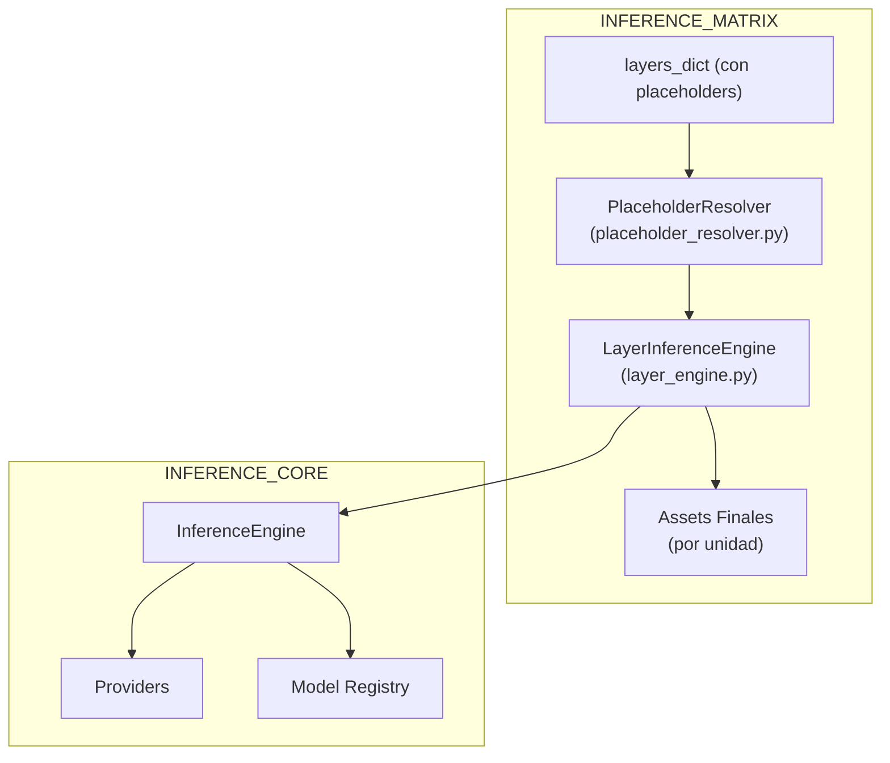
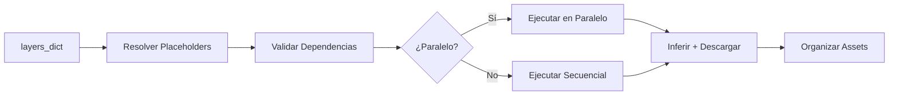
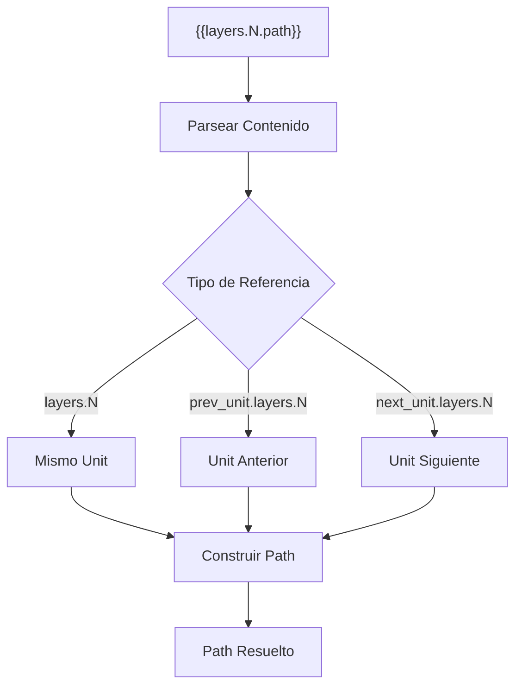
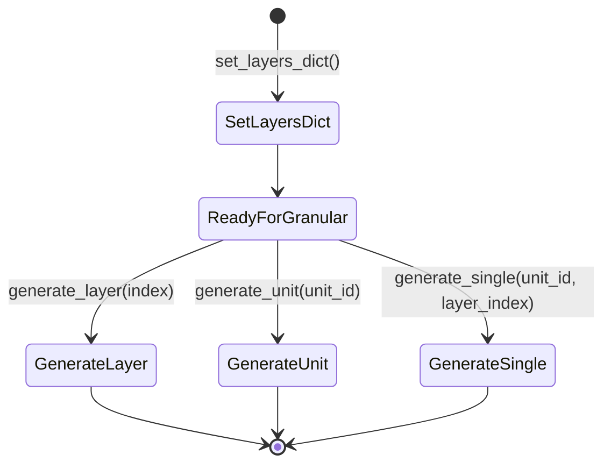
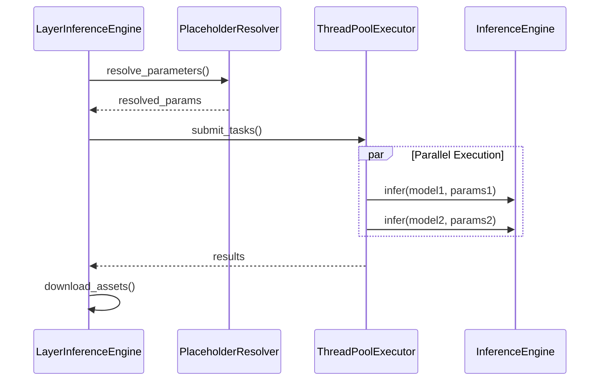

# Informe para el Módulo `vidi/inference_matrix`

## Resumen Ejecutivo
- El módulo `vidi/inference_matrix` proporciona orquestación de inferencias multi-capa y resolución de placeholders para generación avanzada de assets.
- `layer_engine.py` maneja inferencia por capas para generación multi-paso, resolviendo placeholders dinámicamente y coordinando proveedores de inferencia.
- `placeholder_resolver.py` resuelve referencias dinámicas en parámetros basadas en paths de assets generados siguiendo convenciones de nombres.
- El módulo está diseñado para trabajar con `vidi/inference` como backend, proporcionando una capa de orquestación sobre la inferencia core.
- Soporta paralelismo, dependencias entre capas, operaciones granulares y manejo robusto de errores.

## Componentes Principales por Archivo/Directorio
- **`layer_engine.py`**
  - Clase principal `LayerInferenceEngine` con métodos: `generate`, `generate_layer`, `generate_unit`, `generate_single`, `set_layers_dict`.
  - Orquesta inferencia multi-paso procesando capas por índice, resolviendo placeholders y coordinando paralelismo.
  - Maneja descarga de assets, conversión de paths a archivos y validación de dependencias.
  - Integra con `InferenceEngine` del módulo core para ejecutar inferencias individuales.
- **`placeholder_resolver.py`**
  - Clase `PlaceholderResolver` con `resolve`, `resolve_parameters` para placeholders como `{{layers.N.path}}`, `{{prev_unit.layers.N.path}}`.
  - Construye paths basados en convención de nombres y output_dir, sin depender de estado mutable.
  - Soporta resolución recursiva en estructuras complejas (listas, diccionarios anidados).
- **`__init__.py`**
  - Re-exporta clases clave: `LayerInferenceEngine`, `PlaceholderResolver`, excepciones relacionadas.

## Flujos y Procesos Clave
1. **Generación Multi-Paso**: `LayerInferenceEngine.generate` procesa layers_dict por índice de capa, permitiendo dependencias entre capas.
2. **Resolución de Placeholders**: `PlaceholderResolver` construye paths previstos (e.g., `{unit_id}_layer{layer_index}_{asset_type}.ext`) antes de la inferencia.
3. **Orquestación de Paralelismo**: Detecta layers con `parallel_inference=True` y ejecuta en paralelo con ThreadPoolExecutor.
4. **Operaciones Granulares**: Permite generación específica por capa (`generate_layer`), por unidad (`generate_unit`) o celda individual (`generate_single`).
5. **Manejo de Dependencias**: Validación estricta de archivos referenciados y manejo de placeholders no resueltos.
6. **Descarga y Conversión**: Descarga assets remotos y convierte paths a objetos file para parámetros que requieren formato URI.

## Dependencias y Relaciones
- **Internas**
  - `LayerInferenceEngine` depende de `vidi.inference.InferenceEngine` para inferencias individuales.
  - `PlaceholderResolver` trabaja con `vidi.narrative.models.InferenceLayer` y `ResolvedInferenceLayer`.
  - Ambos componentes interactúan con `vidi.video_editor.models.Asset` para resultados finales.
- **Externas**
  - Bibliotecas: requests, concurrent.futures, pathlib, collections.
  - El módulo es agnóstico a proveedores específicos, delegando a `vidi.inference`.

## Gestión de Estado y Recursos
- **Estado de Capas**: `LayerInferenceEngine` puede mantener un `layers_dict` para operaciones granulares.
- **Directorios de Salida**: Maneja directorios temporales o especificados, con advertencias sobre limpieza automática.
- **Paralelismo**: Usa ThreadPoolExecutor con fail-fast para errores en operaciones paralelas.
- **Recursos de Archivo**: Manejo automático de apertura/cierre de archivos durante conversión path-to-file.

## Artefactos de Entrada y Salida
- **Entradas**: `OrderedDict[str, List[InferenceLayer]]` con placeholders, configuraciones de output_dir y paralelismo.
- **Artefactos Intermedios**: Parámetros resueltos, archivos abiertos para URIs, paths construidos.
- **Salidas**: `List[Tuple[str, List[Asset]]]` con assets descargados localmente y organizados por unidad.

## Diagramas Mermaid

### Vista del Módulo


### Pipeline de Orquestación Multi-Capa


### Resolución de Placeholders


### Operaciones Granulares


### Manejo de Paralelismo


## Ejemplos de Uso

### Generación Multi-Capa Básica
```python
from collections import OrderedDict
from vidi.inference_matrix import LayerInferenceEngine
from vidi.narrative.models import InferenceLayer

layers_dict = OrderedDict([
    ("unit1", [
        InferenceLayer(
            model="replicate/black-forest-labs/flux-schnell",
            asset_type="image",
            parameters={"prompt": "Una imagen base"}
        ),
        InferenceLayer(
            model="replicate/bytedance/seedance-1-lite", 
            asset_type="video",
            parameters={
                "image": "{{layers.0.path}}",
                "prompt": "Animar la imagen base"
            }
        )
    ])
])

engine = LayerInferenceEngine(output_dir="./outputs")
assets = engine.generate(layers_dict)
```

### Operaciones Granulares
```python
engine = LayerInferenceEngine(output_dir="./outputs")
engine.set_layers_dict(layers_dict)

# Generar solo la primera capa de todas las unidades
layer_0_paths = engine.generate_layer(0)

# Generar todas las capas de una unidad específica
unit_paths = engine.generate_unit("unit1")

# Generar una celda específica
single_path = engine.generate_single("unit1", 0)
```

### Placeholders Cross-Unit
```python
layers_dict = OrderedDict([
    ("intro", [
        InferenceLayer(
            model="replicate/black-forest-labs/flux-schnell",
            asset_type="image", 
            parameters={"prompt": "Escena inicial"}
        )
    ]),
    ("continuation", [
        InferenceLayer(
            model="replicate/bytedance/seedream-4",
            asset_type="image",
            parameters={"prompt": "Basado en {{prev_unit.layers.0.path}}"}
        )
    ])
])
```

## Manejo de Errores y Casos Límite
- **LayerDependencyError**: Se lanza cuando placeholders no pueden resolverse o archivos referenciados no existen.
- **AssetDownloadError**: Maneja fallos en descarga de assets con retry automático.
- **Fail Fast**: En operaciones paralelas, un error detiene toda la ejecución inmediatamente.
- **Validación Estricta**: `strict_mode` controla si placeholders no resueltos causan errores o se ignoran.
- **Overwrite Handling**: Control granular sobre sobrescritura de assets existentes.

## Consideraciones de Rendimiento y Escalabilidad
- **Paralelismo Configurable**: `max_threads` permite ajustar concurrencia según recursos disponibles.
- **Resolución Path-Based**: No requiere estado mutable, facilita operaciones concurrentes.
- **Operaciones Granulares**: Permite optimizaciones específicas por capa o unidad.
- **Gestión de Memoria**: Cierre automático de file handles y limpieza de recursos temporales.

## Suposiciones y Limitaciones
- **Convención de Nombres**: Asume formato específico para nombres de assets generados.
- **Dependencia de Inference Core**: Requiere `vidi.inference.InferenceEngine` funcionalmente completo.
- **Orden de Capas**: Las dependencias verticales dentro de una unidad se procesan secuencialmente.
- **Tipos de Asset**: Mapeo fijo de tipos a extensiones (image->jpg, video->mp4, audio->wav).

## Estrategia de Testing
- **Tests Unitarios**: Validación de resolución de placeholders, generación de paths, manejo de paralelismo.
- **Tests de Integración**: Flujos completos de generación multi-capa con dependencias reales.
- **Tests End-to-End**: Generación real con APIs, validación de assets descargados y dependencias cross-unit.
- **Cobertura**: Enfoque en casos límite de dependencias, errores de paralelismo y validación de placeholders.

## Inventario de Tests
### Tests Unitarios (`tests/unit/inference_matrix/`)
- `test_layer_engine.py`: Generación single layer, paralelismo, overwrite handling, dependencias.
- `test_placeholder_resolver.py`: Resolución de paths, cross-unit references, casos de error, tipos de asset.

### Tests de Integración (`tests/integration/inference_matrix/`)
- `test_layered_inference.py`: Flujos completos, operaciones granulares, propagación de errores.

### Tests End-to-End (`tests/e2e/inference_matrix/`)
- `test_layered_generation_with_placeholders.py`: Generación real con APIs, dependencias complejas, overwrite behavior.

## Separación de Responsabilidades
Este módulo `inference_matrix` se enfoca específicamente en:
- **Orquestación multi-capa** y dependencias entre capas
- **Resolución de placeholders** dinámicos
- **Paralelismo** y operaciones granulares
- **Coordinación** de múltiples inferencias

Mientras que `vidi.inference` maneja:
- **Ejecución de inferencias individuales**
- **Gestión de proveedores** (Replicate, Fal)
- **Tracking de costos** y logging
- **Templates y registry** de modelos
