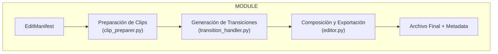
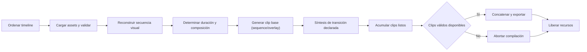
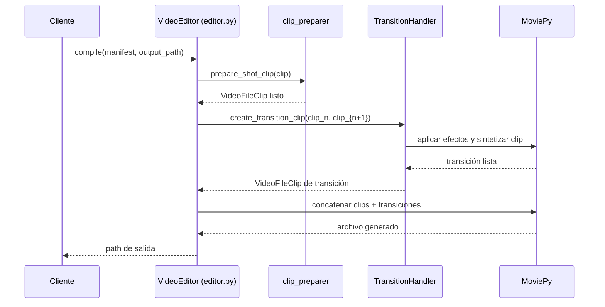
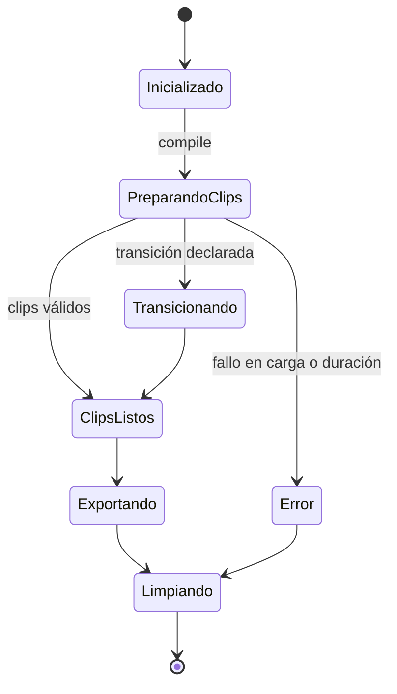
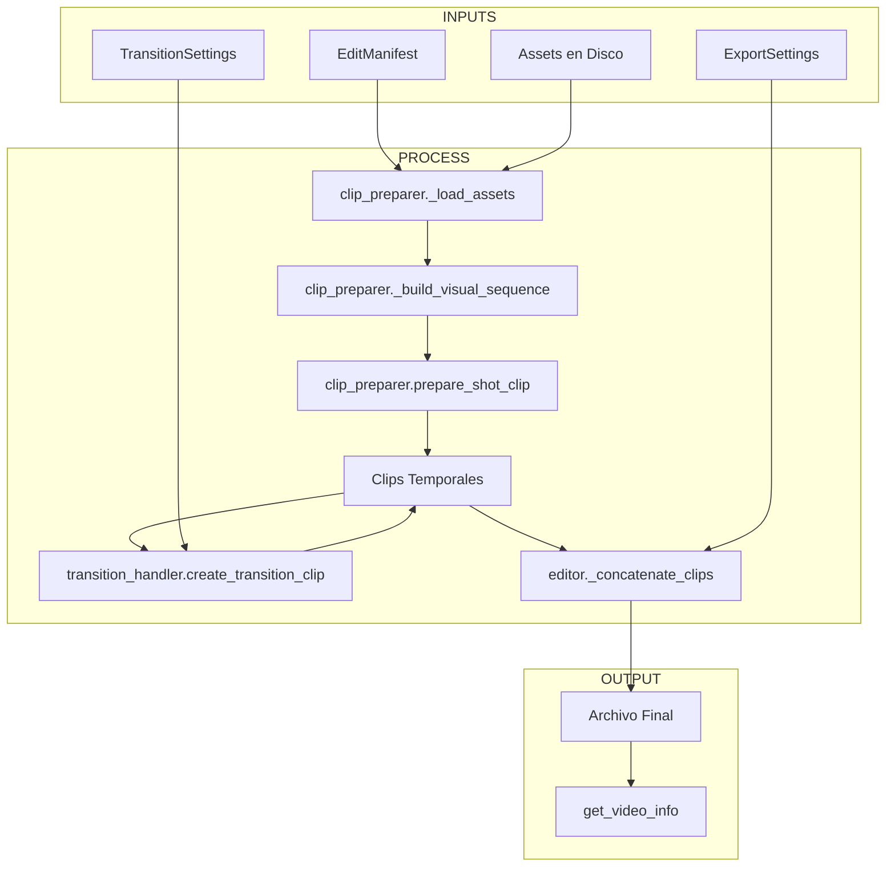
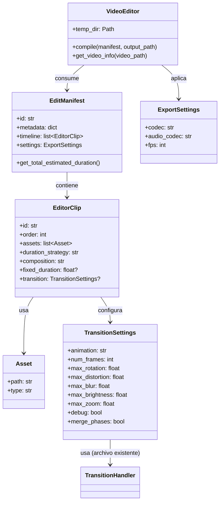

# Informe para el Módulo `vidi/video_editor`

## Resumen Ejecutivo
- El directorio `vidi/video_editor` actúa como un motor independiente que transforma un `EditManifest` (definido en `models.py`) en un video final utilizando MoviePy, siguiendo el principio KISS para mantener claridad y simplicidad.
- `editor.py` orquesta la preparación de clips, delega la preparación detallada a `clip_preparer.py`, aplica transiciones a través de `transition_handler.py` y exporta con códecs configurables.
- `clip_preparer.py` encapsula la lógica para construir clips individuales (carga de assets, composición visual, audio, ajustes de duración), reduciendo la longitud y complejidad de `editor.py`.
- `transition_handler.py` se enfoca en sintetizar transiciones parametrizables entre clips adyacentes, respetando el principio de responsabilidad única.
- `models.py` proporciona modelos Pydantic (`Asset`, `EditorClip`, `TransitionSettings`, `ExportSettings`, `EditManifest`) que validan el manifest y normalizan la entrada declarativa.
- `__init__.py` expone la API pública re-exportando los modelos y la clase `VideoEditor`, y debe actualizarse para incluir nuevos módulos si se refactoriza.

## Componentes Principales por Archivo
- **`editor.py`**
  - Clase principal `VideoEditor` con métodos de alto nivel: `__init__`, `compile`, `_generate_transition_clip`, `_concatenate_clips`, `_cleanup_clips`, `get_video_info`.
  - Orquesta el flujo general de compilación y delega tareas especializadas a módulos auxiliares.
- **`clip_preparer.py`** *(archivo existente)*
  - `prepare_shot_clip`: coordina la preparación completa de un clip individual.
  - `load_assets`, `build_visual_sequence`, `determine_target_duration`, `create_base_clip`, `add_audio_to_clip`, `ensure_visual_duration`: funciones responsables de cargar y normalizar assets, asegurando coherencia audiovisual.
  - `apply_speedx_effect`: maneja el escalado de velocidad utilizando el método `with_speed_scaled` de MoviePy para ajustes de duración, con manejo de errores de fallback para compatibilidad.
  - Centraliza la lógica de construcción para reducir la longitud de `editor.py` y mejorar la legibilidad.
- **`transition_handler.py`** *(archivo existente)*
  - Clase `TransitionHandler` con métodos `create_transition_clip`, `_extract_frames`, `_apply_animation`, `_apply_frame_effects` y helpers (rotación, zoom, traducción, brillo, blur, distorsión).
  - Efectos de mirroring especializados: `_apply_mirror_effect` con direcciones (ALL_DIRECTIONS_1, LEFT_1, RIGHT_1, LEFT_3, RIGHT_3) para transiciones visuales mejoradas.
  - Funcionalidad de cropping: `_apply_crop_effect` y `_get_crop_values` para animaciones de traducción con interpolación polinomial.
  - Soporte para variantes "long" de transiciones que usan patrones de mirroring extendidos y secuencias de frames más largas.
  - Encapsula transiciones inspiradas en `vid_transition`, reutilizables y testeables independientemente.
- **`models.py`**
  - `Asset`: valida paths y tipos (`video`, `audio`, `image`).
  - `EditorClip`: asegura orden secuencial, presencia de assets, coherencia entre estrategia y `fixed_duration`, declara composición (`overlay`, `sequence`) y referencia opcional a `transition`.
  - `TransitionSettings`: define tipo de animación con enumeración completa (`rotation`, `rotation_inv`, `zoom_in`, `zoom_out`, `translation`, `translation_inv`, `long_translation`, `long_translation_inv`), parámetros numéricos y flags de debug.
  - `ExportSettings`: establece códecs y FPS (1–120) con validación.
  - `EditManifest`: integra metadata, timeline, settings de exportación y valida órdenes consecutivas; ofrece `get_total_estimated_duration`.
- **`__init__.py`**
  - Re-exporta `EditManifest`, `EditorClip`, `Asset`, `TransitionSettings`, `ExportSettings`, `VideoEditor`. Debe incluir símbolos públicos si se produce refactoring.

## Flujos y Procesos Clave
1. Recepción de un `EditManifest` validado por Pydantic.
2. `compile` (en `editor.py`) ordena clips por `order` y delega su preparación a funciones en `clip_preparer.py`.
3. `prepare_shot_clip` construye la secuencia visual, determina la duración objetivo y sintetiza el clip base según la composición.
4. `TransitionHandler.create_transition_clip` (de `transition_handler.py`) produce clips de transición cuando se especifica en el manifest.
5. Se agregan capas visuales y audio según la estrategia declarada.
6. Clips válidos, junto con transiciones intermedias, se concatenan; si no hay clips finales, se lanza un error explícito.
7. La exportación aprovecha los códecs de `ExportSettings` y el paralelismo disponible.
8. `_cleanup_clips` libera recursos de MoviePy y expone utilidades de introspección (`get_video_info`).

## Dependencias y Relaciones
- **Internas**
  - `VideoEditor` consume `EditManifest.timeline`, delega carga y preparación a `clip_preparer.py` y transiciones a `transition_handler.py`.
  - `TransitionHandler` depende de `TransitionSettings` e instancias preparadas de `VideoFileClip`.
  - Funciones en `clip_preparer.py` aseguran coherencia entre duración y composición.
- **Externas**
  - MoviePy (`VideoFileClip`, `ImageClip`, `AudioFileClip`, `CompositeVideoClip`, `ImageSequenceClip`, `concatenate_videoclips`, `ColorClip`).
  - PIL para efectos de imagen en transiciones (mirror, blur, brightness, distortion).
  - Biblioteca estándar (`tempfile`, `pathlib.Path`, `os`, `logging`, `math`) para gestión temporal, paths y trazabilidad.

## Gestión de Estado y Recursos
- `VideoEditor` crea `self.temp_dir` en inicialización; el flujo puede persistir artefactos temporales para debug de transiciones.
- `_cleanup_clips` elimina referencias duplicadas y purga listas, mitigando fugas de memoria.
- Estrategias de duración sincronizan capas audiovisuales, y transiciones interpolan frames adicionales cuando se requiere.
- Efectos PIL se aplican en copias temporales para preservar clips originales.

## Artefactos de Entrada y Salida
- **Entradas**: `EditManifest` con timeline válida, assets en disco (`video`, `audio`, `image`), placeholders `"__placeholder__"` para omisiones.
- **Artefactos Intermedios**: clips temporales de MoviePy, frames generados para transiciones, logs detallados.
- **Salidas**: archivo de video final (`output_path`) y metadata accesible vía `get_video_info`.

## Diagramas Mermaid

### Vista del Módulo


### Pipeline de Compilación


### Secuencia de Interacción


### Estados del Flujo


### Mapa de Entrada/Salida


### Modelo de Clases


## Ejemplos de Uso
### Ejemplo de Overlay con Transición de Rotación
```json
{
  "id": "overlay-with-rotation",
  "timeline": [
    {
      "id": "clip-intro",
      "order": 1,
      "assets": [
        {"path": "path/to/base.mp4", "type": "video"},
        {"path": "path/to/logo.png", "type": "image"}
      ],
      "duration_strategy": "longest",
      "composition": "overlay",
      "transition": {
        "animation": "rotation",
        "num_frames": 12,
        "max_rotation": 30,
        "max_blur": 0.15,
        "max_distortion": 0.5,
        "max_brightness": 1.1,
        "max_zoom": 1.4,
        "debug": false,
        "merge_phases": true
      }
    },
    {
      "id": "clip-body",
      "order": 2,
      "assets": [
        {"path": "path/to/body.mp4", "type": "video"}
      ],
      "duration_strategy": "video",
      "composition": "sequence"
    }
  ],
  "settings": {"codec": "libx264", "audio_codec": "aac", "fps": 25}
}
```
El primer clip mezcla video base con overlay de logo; la transición de rotación conecta al segundo clip aplicando blur y distorsión controlados.

### Ejemplo de Secuencia con Transición de Zoom
```json
{
  "id": "sequence-with-zoom",
  "timeline": [
    {
      "id": "clip-sequence",
      "order": 1,
      "assets": [
        {"path": "path/to/intro.mp4", "type": "video"},
        {"path": "path/to/still.png", "type": "image"},
        {"path": "path/to/outro.mp4", "type": "video"}
      ],
      "duration_strategy": "longest",
      "composition": "sequence",
      "transition": {
        "animation": "zoom_in",
        "num_frames": 8,
        "max_zoom": 1.6,
        "max_blur": 0.05,
        "max_distortion": 0.4,
        "max_brightness": 1.0,
        "max_rotation": 10,
        "debug": false,
        "merge_phases": false
      }
    },
    {
      "id": "clip-end",
      "order": 2,
      "assets": [
        {"path": "path/to/endcard.mp4", "type": "video"}
      ],
      "duration_strategy": "video",
      "composition": "overlay"
    }
  ],
  "settings": {"codec": "libx264", "audio_codec": "aac", "fps": 24}
}
```
El clip principal concatena recursos visuales y la transición aplica un zoom progresivo enlazando al endcard.

### Ejemplo de Long Translation Inverse
```json
{
  "id": "long-translation-inverse",
  "timeline": [
    {
      "id": "clip-start",
      "order": 1,
      "assets": [
        {"path": "path/to/opening.mp4", "type": "video"},
        {"path": "path/to/overlay.png", "type": "image"}
      ],
      "duration_strategy": "video",
      "composition": "overlay",
      "transition": {
        "animation": "long_translation_inv",
        "num_frames": 12,
        "max_rotation": 5.0,
        "max_blur": 0.1,
        "max_distortion": 0.6,
        "max_brightness": 1.2,
        "max_zoom": 1.3,
        "debug": false,
        "merge_phases": false
      }
    },
    {
      "id": "clip-finale",
      "order": 2,
      "assets": [
        {"path": "path/to/finale.mp4", "type": "video"}
      ],
      "duration_strategy": "video",
      "composition": "sequence"
    }
  ],
  "settings": {"codec": "libx264", "audio_codec": "aac", "fps": 30}
}
```
Este ejemplo demuestra el efecto de traducción larga inversa con patrones de mirroring extendidos (RIGHT_3 en phase2) e interpolación polinomial de cropping para transiciones suaves de derecha a izquierda.

## Manejo de Errores y Casos Límite
- **Fail Fast**: `_load_assets` valida existencia y carga de assets; transiciones fallidas generan `ValueError` con detalle.
- **Visuales Faltantes**: `create_base_clip` sintetiza un `ColorClip` de 1280x720 con duración objetivo.
- **Duraciones Incompatibles**: Aplica escalado de velocidad o `with_duration`.
- **Audio Más Largo**: `add_audio_to_clip` recorta vía `subclip`.
- **Múltiples Audios**: Registra warning y usa la primera pista.
- **Transiciones No Soportadas**: `TransitionHandler` valida nombre de animación y límites numéricos, abortando temprano si fuera de rango.
- **Debug**: `TransitionSettings.debug` habilita preservación de frames intermedios en el directorio temporal.

## Consideraciones de Rendimiento y Escalabilidad
- `os.cpu_count()` se usa para paralelizar la exportación.
- Transiciones basadas en PIL involucran procesamiento intensivo; limita `num_frames` y habilita caching si se reutiliza.
- Múltiples overlays aumentan el costo de render, especialmente con altas resoluciones.
- Recomendado chunking para timelines muy largas (>100 clips) y limpieza periódica del directorio temporal.
- Distorción y blur combinados con zoom pueden demandar memoria significativa; se aconseja monitoreo al generar transiciones densas.

## Suposiciones y Limitaciones
- Formatos compatibles con MoviePy (MP4, WAV, JPG/PNG).
- FPS configurado entre 1 y 120.
- Timeline con órdenes consecutivas sin gaps.
- Transiciones operan en pares adyacentes; no se soportan transiciones cruzadas múltiples.
- Solo mezcla la primera pista de audio.
- No hay transiciones de efectos personalizados fuera de la enumeración soportada (rotación, zoom, traducción, long_translation y variantes invertidas).
- Fases de transición se sintetizan por default sin merging con otras capas de audio.

## Estrategia de Testing
- **Tests Unitarios**:
  - Modelos Pydantic: validaciones para `TransitionSettings`, `EditorClip`, `Asset`, `ExportSettings`, `EditManifest`.
  - Funciones internas en `clip_preparer.py`: `determine_target_duration`, `ensure_visual_duration`, `build_visual_sequence`, `prepare_shot_clip` (con mocks de MoviePy).
  - `transition_handler.py`: interpolación de frames, límites de parámetros, efectos aplicados en frames sintéticos.
- **Tests de Integración**:
  - Flujo de `compile` con manifests incluyendo transiciones (`rotation`, `zoom_in`, `translation`), verificando duración total, FPS, códecs y continuidad audiovisual.
  - Tests asegurando interacción correcta entre `VideoEditor`, `clip_preparer` y `transition_handler`.
- **Tests End-to-End**:
  - Generación completa de video con transiciones declaradas y validación vía `get_video_info`.
  - Simulación de manifest con placeholders y revisión de comportamiento de fallback.
- **Cobertura**: Objetivo ≥80%; se deben incorporar tests cubriendo nuevas unidades modulares para evitar regresiones visuales.

## Inventario de Tests

### Tests Unitarios (`tests/unit/video_editor/`)
- `test_clip_preparer.py`: `test_load_assets_success`, `test_load_assets_missing_file`, `test_load_assets_unknown_type`, `test_fixed_strategy`, `test_audio_strategy`, `test_video_strategy`, `test_longest_strategy`, `test_fallback_no_assets`, `test_video_clip_speed_adjustment`, `test_video_clip_no_adjustment_when_close`, `test_image_clip_duration_and_fps`, `test_creates_color_clip_when_no_visuals`, `test_add_audio_trims_longer_clip`, `test_add_audio_no_audio_returns_original`, `test_prepare_shot_clip_success_pipeline`, `test_prepare_shot_clip_failure_returns_none`.
- `test_transition_handler.py`: `test_create_transition_clip_success`, `test_create_transition_clip_invalid_animation_returns_none`, `test_get_mirror_direction_for_long_translation`, `test_apply_crop_effect_for_long_translation`, `test_create_transition_clip_long_translation`, `test_create_transition_clip_long_translation_inv`.
- `test_editor.py`: `test_concatenate_multiple_clips`, `test_concatenate_single_clip_skips_merge`, `test_compile_success`, `test_compile_raises_without_timeline`, `test_compile_raises_when_no_valid_clips`, `test_compile_inserts_transition_when_configured`, `test_get_video_info_success`, `test_get_video_info_error`.
- `test_models.py`: `test_asset_path_cannot_be_empty`, `test_asset_strips_path`, `test_editor_clip_requires_assets`, `test_editor_clip_order_must_be_positive`, `test_fixed_strategy_requires_fixed_duration`, `test_non_fixed_strategy_rejects_fixed_duration`, `test_export_settings_invalid_fps`, `test_manifest_id_cannot_be_empty`, `test_manifest_requires_timeline`, `test_manifest_requires_sequential_orders`, `test_manifest_total_estimated_duration`.

### Tests de Integración (`tests/integration/video_editor/`)
- `test_compile_manifest_with_mixed_assets`, `test_compile_manifest_with_longest_and_fixed_strategies`, `test_compile_audio_only_creates_black_clip`, `test_compile_with_transition_between_clips`, `test_compile_with_long_translation_transition`.

### Tests End-to-End (`tests/e2e/video_editor/`)
- `test_video_editor_happy_path_generates_video`, `test_video_editor_missing_asset_raises_and_no_output`, `test_video_editor_with_rotation_transition`, `test_video_editor_with_zoom_transition_and_overlay`, `test_video_editor_with_invalid_transition_fails`, `test_video_editor_with_long_translation_inv_and_overlay`.
