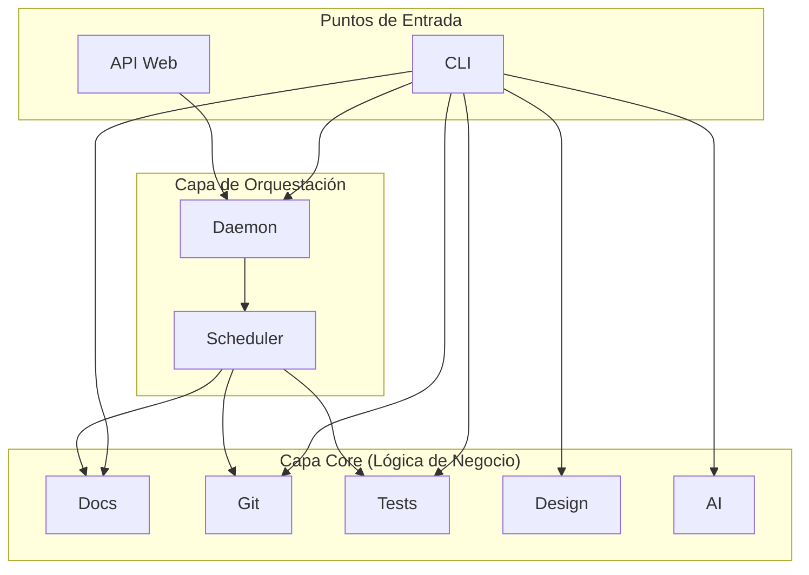

# Autocode - Documentación Técnica

## 🎯 Visión General
Autocode es un sistema de herramientas de desarrollo y calidad de código diseñado para automatizar tareas de mantenimiento, análisis y monitoreo. Integra funcionalidades para la verificación de documentación, análisis de cambios en Git, validación de tests y generación de documentación de diseño, todo ello accesible a través de una CLI y una interfaz web de monitoreo en tiempo real.

## 🏗️ Arquitectura de Alto Nivel
La aplicación está estructurada en capas, con una clara separación entre la interfaz de usuario (CLI y Web), la orquestación y la lógica de negocio principal.



## 📁 Estructura de Módulos
### `/autocode` - [Módulo Principal]
Contiene toda la lógica de la aplicación, dividida en submódulos con responsabilidades claras.
**Documentación**: [autocode/_module.md](autocode/_module.md)

### `/examples` - [Ejemplos de Uso]
Proporciona scripts que demuestran cómo utilizar las herramientas de `autocode` de forma programática.
**Documentación**: [examples/_module.md](examples/_module.md)

## 🔄 Flujos de Trabajo Principales
### Flujo 1: Verificación desde la CLI
1.  El usuario ejecuta un comando como `autocode check-docs`.
2.  La **CLI** (`cli.py`) parsea el comando.
3.  Invoca al componente correspondiente del **Core** (ej. `DocChecker`).
4.  El componente realiza el análisis.
5.  La **CLI** formatea y muestra el resultado en la consola.

### Flujo 2: Monitoreo Continuo
1.  El usuario ejecuta `autocode daemon`.
2.  La **CLI** inicia el servidor **API** (`api/server.py`).
3.  El servidor, al arrancar, instancia y corre el **Daemon** (`orchestration/daemon.py`).
4.  El **Daemon** utiliza el **Scheduler** para ejecutar periódicamente las verificaciones del **Core**.
5.  El usuario abre el dashboard web, que consume los endpoints de la **API** para mostrar el estado en tiempo real.

## 🔧 Configuración y Dependencias
- **Configuración**: El proyecto se configura a través del archivo `autocode_config.yml`.
- **Dependencias Principales**:
  - `fastapi` y `uvicorn` para el servidor web.
  - `pydantic` para la validación de la configuración y los modelos de la API.
  - `pyyaml` para leer la configuración.
  - `beautifulsoup4` y `tiktoken` para los analizadores.
- **Gestión de Dependencias**: Se utiliza `uv` y se define en `pyproject.toml`.

## 🚀 Inicio Rápido
**Instalar dependencias:**
```bash
uv install
```

**Verificar el estado de la documentación:**
```bash
uv run -m autocode.cli check-docs
```

**Iniciar el dashboard de monitoreo:**
```bash
uv run -m autocode.cli daemon
```

## 📖 Navegación
- [Documentación del Módulo `autocode`](autocode/_module.md)
- [Documentación de Ejemplos](examples/_module.md)
