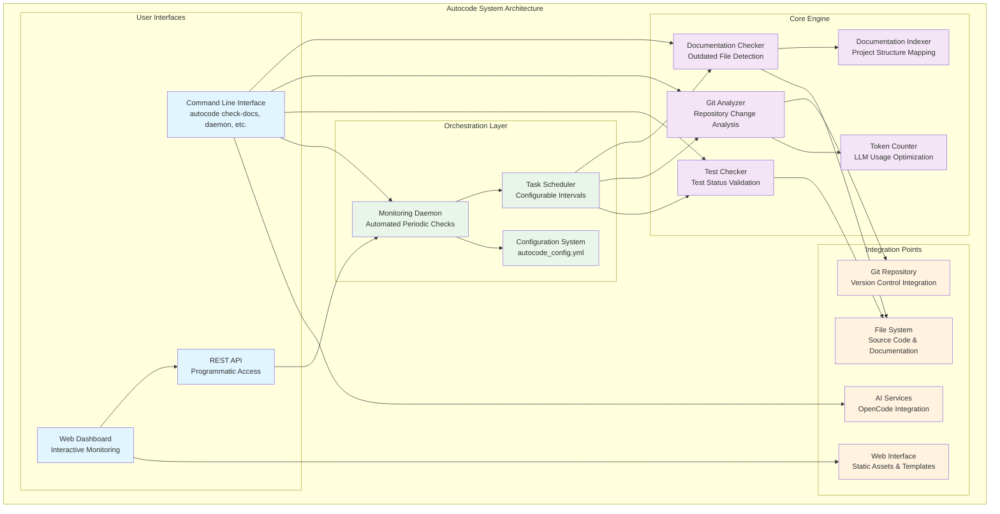
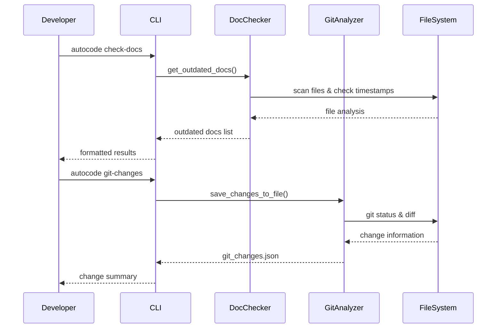
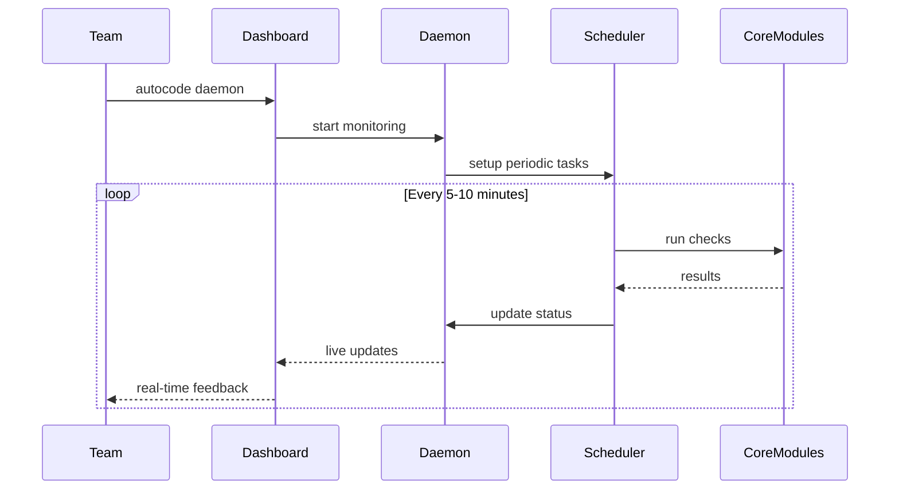
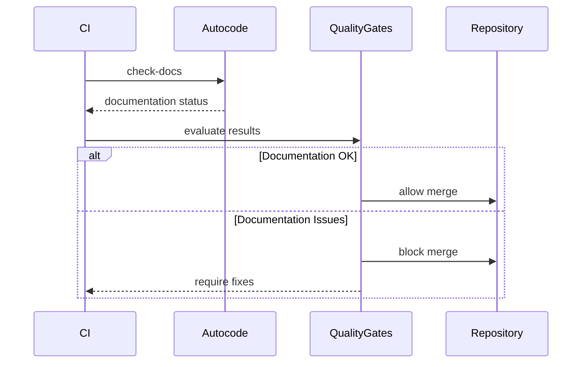

# Autocode - Documentación Técnica

## 🎯 Visión General

**Autocode** es una plataforma integral de automatización de calidad de código que combina verificación de documentación, análisis de cambios git, validación de tests y monitoreo en tiempo real. Diseñado como una solución modular y extensible, autocode proporciona tanto herramientas de línea de comandos como una interfaz web interactiva para mantener la calidad y consistencia del código en proyectos de desarrollo.

### Características Principales

- **🔍 Verificación de Documentación**: Detección automática de documentación desactualizada
- **📊 Análisis de Cambios Git**: Monitoreo de actividad del repositorio con exportación JSON
- **🧪 Validación de Tests**: Verificación de tests faltantes y estado de ejecución
- **⚡ Monitoreo en Tiempo Real**: Dashboard web con actualizaciones automáticas
- **🤖 Integración con AI**: Análisis de código con OpenCode y gestión de tokens
- **📋 Generación de Índices**: Documentación automática de estructura del proyecto

## 🏗️ Arquitectura de Alto Nivel



## 📁 Estructura de Módulos

### Módulos Principales

#### `/autocode` - Núcleo del Sistema
**Propósito**: Módulo principal que integra todas las funcionalidades
**Documentación**: [autocode/_module.md](autocode/_module.md)

**Submódulos**:
- **`cli.py`**: Interfaz de línea de comandos con 6 comandos principales
- **`core/`**: Funcionalidades centrales (doc_checker, git_analyzer, test_checker, etc.)
- **`api/`**: Servidor FastAPI y modelos de datos
- **`orchestration/`**: Daemon y programador de tareas
- **`web/`**: Dashboard web interactivo

#### `/examples` - Ejemplos de Uso
**Propósito**: Demostraciones prácticas de uso programático
**Documentación**: [examples/_module.md](examples/_module.md)

**Contenido**:
- **`basic_usage.py`**: Ejemplo básico de uso de DocChecker y GitAnalyzer
- Patrones de integración y mejores prácticas
- Casos de uso para CI/CD y automatización

## 🔄 Flujos de Trabajo Principales

### Flujo de Verificación Individual


### Flujo de Monitoreo Continuo


### Flujo de Integración CI/CD


## 🚀 Inicio Rápido

### Instalación
```bash
# Clonar repositorio
git clone https://github.com/brunvelop/autocode.git
cd autocode

# Instalar dependencias con uv
uv sync

# Verificar instalación
uv run -m autocode.cli --help
```

### Uso Básico
```bash
# Verificar documentación
uv run -m autocode.cli check-docs

# Analizar cambios git
uv run -m autocode.cli git-changes --verbose

# Verificar tests
uv run -m autocode.cli check-tests

# Iniciar dashboard de monitoreo
uv run -m autocode.cli daemon
```

### Uso Programático
```python
from pathlib import Path
from autocode.core.doc_checker import DocChecker
from autocode.core.git_analyzer import GitAnalyzer

# Verificar documentación
doc_checker = DocChecker(Path.cwd())
outdated_docs = doc_checker.get_outdated_docs()

# Analizar cambios git
git_analyzer = GitAnalyzer(Path.cwd())
status = git_analyzer.get_repository_status()
```

## 🔧 Configuración Global

### Archivo de Configuración Principal
```yaml
# autocode_config.yml
daemon:
  doc_check:
    enabled: true
    interval_minutes: 10
  git_check:
    enabled: true
    interval_minutes: 5
  test_check:
    enabled: true
    interval_minutes: 5
  token_alerts:
    enabled: true
    threshold: 50000
    model: "gpt-4"

api:
  port: 8080
  host: "127.0.0.1"

docs:
  source_dirs: ["autocode"]
  doc_dir: "docs"
  patterns: ["*.py"]

doc_index:
  enabled: true
  auto_generate: true
  output_file: ".clinerules/docs_index.json"

tests:
  enabled: true
  auto_execute: true
  test_dirs: ["tests"]
  patterns: ["test_*.py"]
```

### Variables de Entorno
```bash
# Configuración del daemon
export AUTOCODE_DOC_CHECK_INTERVAL=10
export AUTOCODE_GIT_CHECK_INTERVAL=5
export AUTOCODE_TEST_CHECK_INTERVAL=5

# Configuración de tokens
export AUTOCODE_TOKEN_THRESHOLD=50000
export AUTOCODE_TOKEN_MODEL=gpt-4

# Configuración de la API
export AUTOCODE_API_PORT=8080
export AUTOCODE_API_HOST=127.0.0.1
```

## 🎯 Casos de Uso Principales

### 1. Desarrollo Individual
**Escenario**: Desarrollador trabajando en un proyecto personal
```bash
# Verificar antes de commit
uv run -m autocode.cli check-docs
uv run -m autocode.cli git-changes

# Generar reporte completo
uv run -m autocode.cli check-docs --doc-index-output=project_index.json
```

### 2. Equipo de Desarrollo
**Escenario**: Team usando dashboard compartido
```bash
# Iniciar monitoreo compartido
uv run -m autocode.cli daemon --host=0.0.0.0 --port=8080

# Acceder a dashboard: http://team-server:8080
```

### 3. Integración CI/CD
**Escenario**: Automatización en pipeline de CI/CD
```yaml
# .github/workflows/quality.yml
- name: Check Documentation
  run: uv run -m autocode.cli check-docs
  
- name: Analyze Changes
  run: uv run -m autocode.cli git-changes --output=changes.json
  
- name: Verify Tests
  run: uv run -m autocode.cli check-tests
```

### 4. Análisis de Proyecto
**Escenario**: Análisis profundo de calidad del código
```bash
# Análisis completo con métricas
uv run -m autocode.cli check-docs --doc-index-output=docs_analysis.json
uv run -m autocode.cli git-changes --output=git_analysis.json --verbose
uv run -m autocode.cli count-tokens --directory=autocode --threshold=100000
```

## 📊 Métricas y Monitoreo

### Métricas de Documentación
- **Coverage**: Porcentaje de archivos con documentación
- **Freshness**: Archivos con documentación actualizada
- **Structure**: Completitud de la estructura de documentación
- **Index Generation**: Estadísticas de generación de índices

### Métricas de Repositorio
- **Activity**: Frecuencia de commits y cambios
- **File Changes**: Tipos de modificaciones (M/A/D)
- **Token Usage**: Análisis de tokens para LLM
- **Branch Status**: Estado de branches y merges

### Métricas de Tests
- **Test Coverage**: Archivos con tests asociados
- **Test Status**: Tests passing/failing/missing
- **Test Types**: Distribución unit/integration tests
- **Execution Results**: Resultados de ejecución automática

## 🔍 Comandos Principales

### `check-docs` - Verificación de Documentación
```bash
# Verificación básica
uv run -m autocode.cli check-docs

# Con generación de índice
uv run -m autocode.cli check-docs --doc-index-output=custom_index.json

# Ejemplo de salida
# ✅ All documentation is up to date! + Index updated: docs_index.json
```

### `git-changes` - Análisis de Cambios
```bash
# Análisis básico
uv run -m autocode.cli git-changes

# Con detalles verbosos
uv run -m autocode.cli git-changes --verbose --output=detailed_changes.json

# Ejemplo de salida
# 📊 Repository Status: 3 files changed (M:2 A:1 D:0)
```

### `check-tests` - Verificación de Tests
```bash
# Verificación básica
uv run -m autocode.cli check-tests

# Ejemplo de salida
# ✅ All tests found and passing (15 tests)
```

### `daemon` - Monitoreo Continuo
```bash
# Daemon local
uv run -m autocode.cli daemon

# Daemon compartido
uv run -m autocode.cli daemon --host=0.0.0.0 --port=8080 --verbose

# Acceso web: http://localhost:8080
```

### `count-tokens` - Análisis de Tokens
```bash
# Análisis de archivo
uv run -m autocode.cli count-tokens --file=autocode/cli.py

# Análisis de directorio
uv run -m autocode.cli count-tokens --directory=autocode --threshold=50000

# Ejemplo de salida
# 📊 Token Analysis: 12,450 tokens (within threshold)
```

### `opencode` - Integración con AI
```bash
# Validar configuración
uv run -m autocode.cli opencode --validate

# Listar prompts disponibles
uv run -m autocode.cli opencode --list-prompts

# Ejecutar análisis
uv run -m autocode.cli opencode --prompt="Analyze code quality"
```

## 🌐 Dashboard Web Interactivo

### Funcionalidades del Dashboard
- **Real-time Updates**: Actualización automática cada 5 segundos
- **System Status**: Estado del daemon y métricas del sistema
- **Check Status**: Estado de documentación, git y tests
- **Interactive Controls**: Botones para ejecutar checks manualmente
- **Configuration Panel**: Ajustes de intervalos y configuración
- **Token Monitoring**: Alertas de límites de tokens

### Acceso al Dashboard
```bash
# Iniciar dashboard
uv run -m autocode.cli daemon

# Acceder en navegador
open http://localhost:8080
```

### Características Técnicas
- **Auto-pause**: Pausa automática cuando no está visible
- **Keyboard Shortcuts**: Space (refresh), R (toggle auto-refresh)
- **Error Handling**: Reconexión automática en caso de fallos
- **Responsive Design**: Optimizado para diferentes resoluciones

## 📖 Navegación de Documentación

### Documentación Principal
- **[Autocode Module](autocode/_module.md)** - Núcleo del sistema y arquitectura
- **[Examples Module](examples/_module.md)** - Ejemplos de uso y casos prácticos

### Documentación Detallada por Módulo
- **[CLI Interface](autocode/cli.md)** - Interfaz de línea de comandos
- **[Core Functionality](autocode/core/_module.md)** - Módulos centrales
- **[API Server](autocode/api/_module.md)** - Servidor REST y modelos
- **[Orchestration](autocode/orchestration/_module.md)** - Daemon y scheduler
- **[Web Interface](autocode/web/_module.md)** - Dashboard web

### Documentación Específica
- **[Documentation Checker](autocode/core/doc_checker.md)** - Verificación de documentación
- **[Git Analyzer](autocode/core/git_analyzer.md)** - Análisis de cambios
- **[Test Checker](autocode/core/test_checker.md)** - Verificación de tests
- **[Token Counter](autocode/core/token_counter.md)** - Análisis de tokens
- **[Web Dashboard](autocode/web/static/app.md)** - Lógica del dashboard

## 🔧 Desarrollo y Extensión

### Configuración de Desarrollo
```bash
# Clonar y configurar
git clone https://github.com/brunvelop/autocode.git
cd autocode
uv sync

# Ejecutar tests
uv run pytest tests/

# Desarrollo con auto-reload
uv run -m autocode.cli daemon --verbose
```

### Extensibilidad
- **Nuevos Checkers**: Agregar verificaciones personalizadas
- **Custom Prompts**: Plantillas personalizadas para AI
- **Dashboard Extensions**: Componentes adicionales para el dashboard
- **Integration Points**: APIs para integración externa

### Arquitectura Modular
- **Loose Coupling**: Módulos independientes
- **Plugin System**: Extensibilidad via plugins (futuro)
- **Configuration Driven**: Comportamiento configurable
- **API First**: Todas las funcionalidades accesibles via API

## 📈 Métricas de Rendimiento

### Benchmarks Típicos
- **Documentation Check**: ~500 archivos en <2 segundos
- **Git Analysis**: Repositorios grandes en <5 segundos
- **Token Counting**: 10K tokens analizados en <1 segundo
- **Dashboard Response**: <100ms para updates típicos

### Optimizaciones
- **Parallel Processing**: Análisis concurrente donde es posible
- **Caching**: Caché de resultados para evitar recálculos
- **Incremental Updates**: Solo procesar cambios cuando es posible
- **Resource Management**: Uso eficiente de memoria y CPU

## 🔄 Integración y Ecosystem

### Herramientas de Desarrollo
- **VS Code**: Extensión para integración directa (futuro)
- **Git Hooks**: Pre-commit hooks para verificación automática
- **GitHub Actions**: Workflows para CI/CD
- **Docker**: Contenedores para despliegue

### Plataformas de CI/CD
- **GitHub Actions**: Integración nativa
- **GitLab CI**: Pipelines de calidad
- **Jenkins**: Jobs de verificación
- **Azure DevOps**: Pipelines de release

### Servicios de Monitoreo
- **Prometheus**: Métricas de sistema
- **Grafana**: Dashboards de monitoreo
- **ELK Stack**: Logging y análisis
- **DataDog**: Monitoreo APM

## 🎓 Mejores Prácticas

### Configuración Recomendada
```yaml
# Para proyectos pequeños
daemon:
  doc_check:
    interval_minutes: 5
  git_check:
    interval_minutes: 3

# Para proyectos grandes
daemon:
  doc_check:
    interval_minutes: 15
  git_check:
    interval_minutes: 10
```

### Patrones de Uso
- **Pre-commit**: Verificación antes de commits
- **CI/CD Gates**: Verificación en pipelines
- **Continuous Monitoring**: Monitoreo continuo en desarrollo
- **Release Validation**: Verificación antes de releases

### Optimización de Performance
- **Selective Checking**: Solo verificar archivos modificados
- **Parallel Execution**: Múltiples checks en paralelo
- **Smart Caching**: Caché inteligente de resultados
- **Resource Limits**: Límites de CPU y memoria

## 🚀 Roadmap

### Próximas Funcionalidades
- **Multi-language Support**: Soporte para más lenguajes
- **Advanced Analytics**: Análisis avanzado de métricas
- **Plugin System**: Sistema de plugins extensible
- **Cloud Integration**: Integración con servicios cloud

### Mejoras Planificadas
- **Performance Optimization**: Optimizaciones de rendimiento
- **Enhanced UI**: Interfaz mejorada del dashboard
- **Better Error Handling**: Manejo de errores más robusto
- **Mobile Support**: Soporte para dispositivos móviles

### Integraciones Futuras
- **IDE Extensions**: Extensiones para editores populares
- **Slack/Discord**: Notificaciones en tiempo real
- **Jira/Asana**: Integración con herramientas de proyecto
- **AI Models**: Soporte para más modelos de AI

Este sistema autocode representa una solución integral para la automatización de calidad de código, proporcionando herramientas potentes pero fáciles de usar para equipos de desarrollo de cualquier tamaño.
