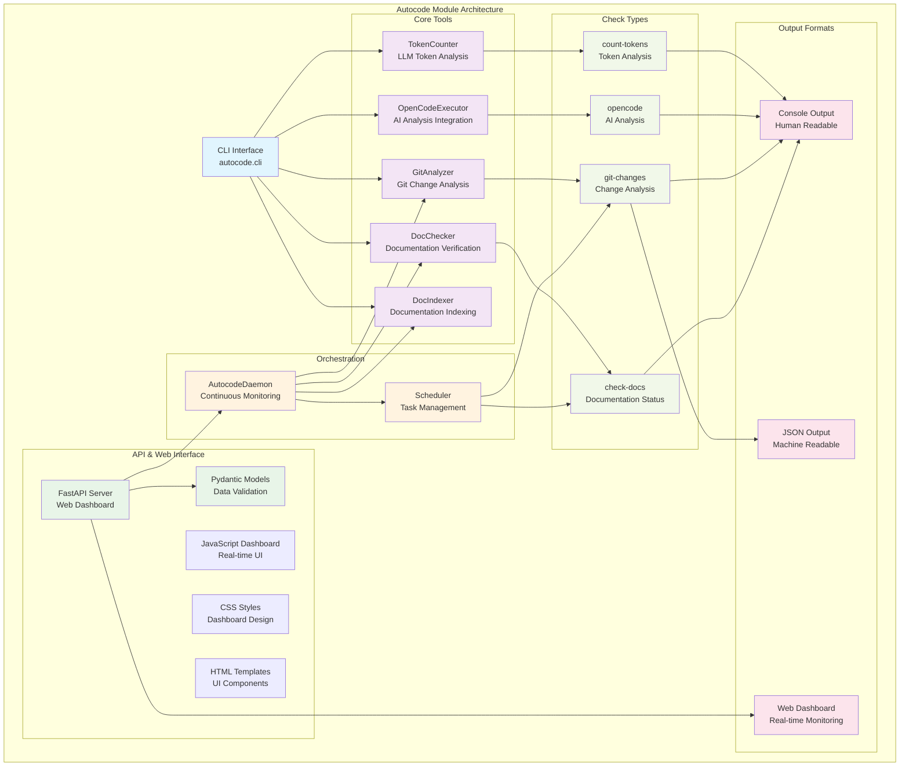
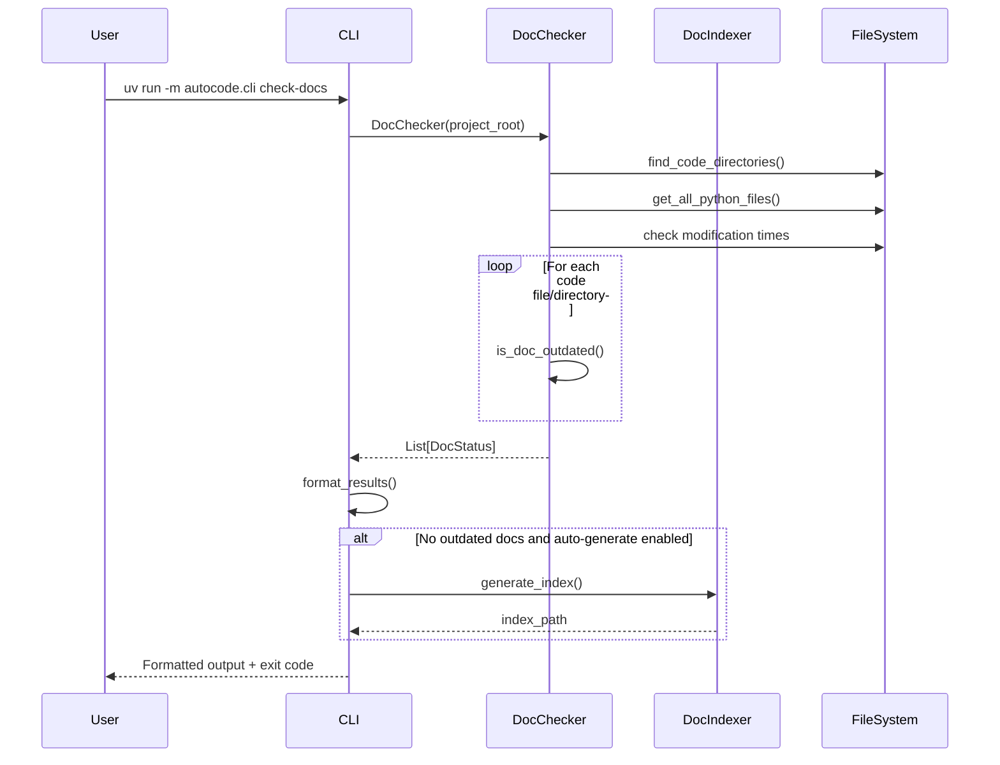
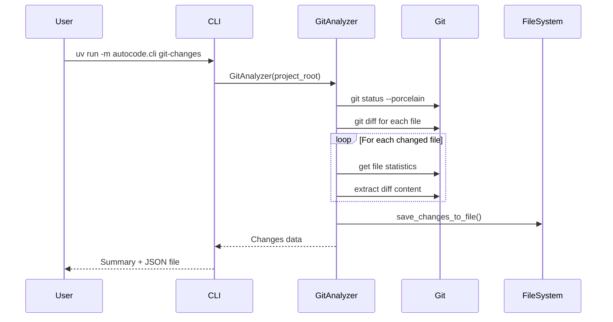
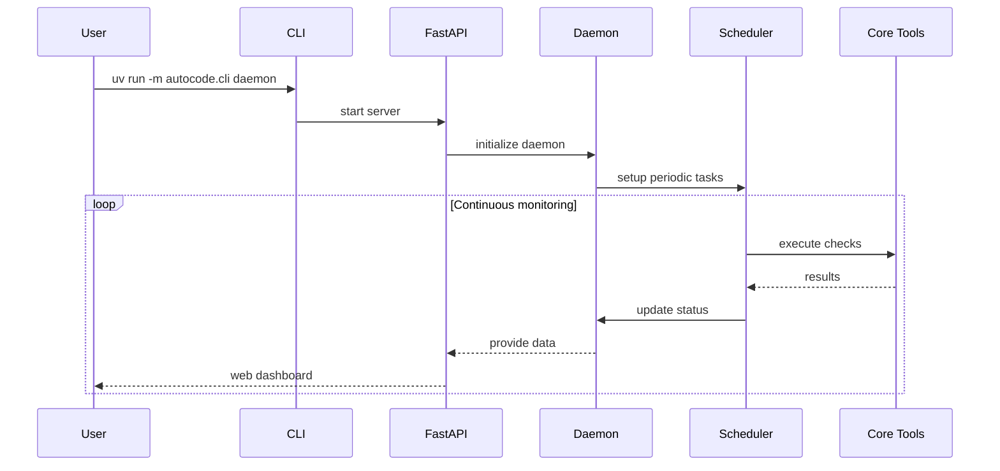

# Autocode Module - Documentación

## 🎯 Propósito del Módulo

El módulo `autocode` proporciona herramientas automatizadas para la calidad del código y el desarrollo del proyecto Vidi. Su responsabilidad principal es automatizar tareas de mantenimiento como la verificación de documentación, el análisis de cambios en git, y la integración con OpenCode AI para análisis inteligente de código, incluyendo tanto herramientas CLI como un sistema de monitoreo continuo con interfaz web.

## 🏗️ Arquitectura del Módulo



## 📁 Estructura del Módulo

### Nivel Principal

#### `cli.py` - Interfaz de Línea de Comandos
**Propósito**: Punto de entrada unificado para todas las herramientas de autocode
**Documentación**: [cli.md](cli.md)

**Comandos disponibles**:
- `check-docs`: Verificar estado de documentación modular
- `git-changes`: Analizar cambios en git para mensajes de commit
- `daemon`: Iniciar servidor web de monitoreo continuo
- `opencode`: Ejecutar análisis de código con OpenCode AI
- `count-tokens`: Analizar tokens para modelos LLM

### `/core` - Herramientas Fundamentales
**Propósito**: Componentes principales de análisis y verificación
**Documentación**: [core/_module.md](core/_module.md)

#### `core/doc_checker.py` - Verificador de Documentación
**Propósito**: Compara fechas de modificación entre código fuente y documentación siguiendo estructura modular
**Documentación**: [core/doc_checker.md](core/doc_checker.md)

#### `core/git_analyzer.py` - Analizador de Cambios Git
**Propósito**: Analiza cambios en el repositorio git para generar información útil para commits
**Documentación**: [core/git_analyzer.md](core/git_analyzer.md)

#### `core/opencode_executor.py` - Ejecutor de OpenCode AI
**Propósito**: Integración con OpenCode AI para análisis inteligente de código en modo headless
**Documentación**: [core/opencode_executor.md](core/opencode_executor.md)

#### `core/token_counter.py` - Contador de Tokens LLM
**Propósito**: Análisis y conteo de tokens para modelos de lenguaje grandes (LLM)
**Documentación**: [core/token_counter.md](core/token_counter.md)

#### `core/doc_indexer.py` - Indexador de Documentación
**Propósito**: Genera índices estructurados de documentación modular en formato JSON
**Documentación**: [core/doc_indexer.md](core/doc_indexer.md)

#### `core/test_checker.py` - Verificador de Tests
**Propósito**: Verifica el estado de tests siguiendo estructura modular y mapea código a tests esperados
**Documentación**: [core/test_checker.md](core/test_checker.md)

### `/api` - Interfaz Web y API REST
**Propósito**: Sistema de monitoreo web y API RESTful
**Documentación**: [api/_module.md](api/_module.md)

#### `api/models.py` - Modelos de Datos
**Propósito**: Modelos Pydantic para validación y serialización de datos del API
**Documentación**: [api/models.md](api/models.md)

#### `api/server.py` - Servidor Web
**Propósito**: Servidor FastAPI para interfaz web y API RESTful de monitoreo
**Documentación**: [api/server.md](api/server.md)

### `/web` - Dashboard Web Interactivo
**Propósito**: Interfaz web moderna con JavaScript para monitoreo visual en tiempo real
**Documentación**: [web/_module.md](web/_module.md)

#### `web/static/app.js` - Dashboard JavaScript
**Propósito**: Dashboard interactivo con actualización automática en tiempo real
**Documentación**: [web/static/app.js.md](web/static/app.js.md)

#### `web/static/style.css` - Estilos CSS
**Propósito**: Hoja de estilos para la interfaz web del dashboard
**Documentación**: [web/static/style.css.md](web/static/style.css.md)

#### `web/templates/index.html` - Template Principal
**Propósito**: Template HTML principal del dashboard de monitoreo
**Documentación**: [web/templates/index.html.md](web/templates/index.html.md)

### `/orchestration` - Automatización y Programación
**Propósito**: Sistema de monitoreo continuo y programación de tareas
**Documentación**: [orchestration/_module.md](orchestration/_module.md)

#### `orchestration/daemon.py` - Daemon de Monitoreo
**Propósito**: Proporciona monitoreo continuo con ejecución programada y alertas avanzadas
**Documentación**: [orchestration/daemon.md](orchestration/daemon.md)

#### `orchestration/scheduler.py` - Programador de Tareas
**Propósito**: Sistema de programación de tareas para ejecución periódica
**Documentación**: [orchestration/scheduler.md](orchestration/scheduler.md)

## 🔗 Dependencias del Módulo

### Internas (otros módulos del proyecto)
- **Ninguna**: Este es un módulo de utilidades independiente

### Externas por Componente

#### Core Dependencies
- `pathlib`: Manipulación de rutas de archivos
- `argparse`: Parsing de argumentos de línea de comandos
- `json`: Serialización de datos
- `subprocess`: Ejecución de comandos del sistema
- `typing`: Type hints para mejor desarrollo
- `tiktoken`: Conteo de tokens para modelos LLM

#### API Dependencies
- `fastapi`: Framework web para API RESTful
- `pydantic`: Validación y serialización de datos
- `uvicorn`: Servidor ASGI para FastAPI
- `jinja2`: Motor de templates para interfaz web

#### Orchestration Dependencies
- `asyncio`: Programación asíncrona para daemon y scheduler
- `logging`: Sistema de logging para monitoreo
- `yaml`: Configuración del sistema

## 💡 Flujo de Trabajo Típico

### Verificación de Documentación


### Análisis de Cambios Git


### Monitoreo Continuo


## 🔧 Configuración del Módulo

### Archivo de Configuración: `autocode_config.yml`
```yaml
# Configuración de verificación de documentación
doc_checker:
  enabled: true
  exclude_patterns:
    - "__pycache__"
    - "*.pyc"
    - ".git"

# Configuración de indexación de documentación
doc_index:
  enabled: true
  auto_generate: true
  output_path: ".clinerules/docs_index.json"

# Configuración del daemon
daemon:
  enabled: true
  check_interval: 300  # 5 minutos
  web_port: 8080
  web_host: "127.0.0.1"

# Configuración del scheduler
scheduler:
  enabled: true
  tasks:
    check_docs:
      enabled: true
      interval: 300
    git_changes:
      enabled: false
      interval: 600

# Configuración de OpenCode
opencode:
  enabled: true
  config_file: ".opencode.json"
  prompts_dir: "autocode/prompts"
  debug: false
  quiet: false

# Configuración de conteo de tokens
token_counter:
  enabled: true
  default_model: "gpt-4"
  warning_threshold: 100000
  models:
    - "gpt-4"
    - "gpt-3.5-turbo"
    - "claude-3-opus"
```

### Uso Básico
```bash
# Verificar documentación
uv run -m autocode.cli check-docs

# Analizar cambios git
uv run -m autocode.cli git-changes

# Ejecutar análisis con OpenCode
uv run -m autocode.cli opencode --prompt "Analizar calidad del código"

# Contar tokens en archivos
uv run -m autocode.cli count-tokens --directory . --pattern "*.py"

# Iniciar daemon de monitoreo
uv run -m autocode.cli daemon
```

## ⚠️ Consideraciones Especiales

### Detección de Código
- **Auto-discovery**: Detecta automáticamente directorios con código Python
- **Exclusiones**: Ignora archivos `__init__.py` por ser archivos de inicialización
- **Filtros**: Solo considera archivos `.py` para documentación

### Estructura Modular Esperada
- **_index.md**: Documentación principal del proyecto
- **_module.md**: Documentación por cada directorio de código  
- **archivo.md**: Documentación individual para cada archivo de código

### Limitaciones
- **Python First**: Principalmente optimizado para proyectos Python
- **Git Dependency**: Algunas funciones requieren repositorio git inicializado
- **File System**: Depende de fechas de modificación del sistema de archivos

### Consideraciones de Rendimiento
- **Lazy Loading**: Los módulos se cargan solo cuando es necesario
- **Asynchronous Operations**: El daemon usa operaciones asíncronas
- **Memory Efficient**: No carga contenido completo de archivos en memoria
- **Caching**: Cachea resultados cuando es posible

## 🧪 Testing y Validación

### Verificar Funcionamiento
```bash
# Test básico de documentación
uv run -m autocode.cli check-docs
echo $?  # Debe ser 0 si toda la documentación está actualizada

# Test de análisis git (requiere cambios)
echo "test" > test_file.txt
git add test_file.txt
uv run -m autocode.cli git-changes

# Test de conteo de tokens
uv run -m autocode.cli count-tokens --file main.py

# Test de OpenCode (requiere setup)
uv run -m autocode.cli opencode --validate
```

### Validación de Estructura
```python
from autocode.core.doc_checker import DocChecker
from autocode.core.git_analyzer import GitAnalyzer

# Verificar DocChecker
checker = DocChecker()
code_dirs = checker.find_code_directories()
assert len(code_dirs) > 0, "Should find at least one code directory"

# Verificar GitAnalyzer
analyzer = GitAnalyzer()
status = analyzer.get_repository_status()
assert 'total_files' in status, "Should return valid status"
```

## 🔄 Flujo de Datos

### Entrada de Datos
1. **Project Root**: Directorio base del proyecto (detectado automáticamente)
2. **Code Files**: Archivos `.py` en directorios de código
3. **Git Repository**: Estado actual del repositorio git
4. **Documentation Files**: Archivos `.md` en estructura docs/
5. **Configuration**: Archivo `autocode_config.yml`

### Procesamiento Interno
1. **Discovery**: Encuentra automáticamente archivos de código relevantes
2. **Mapping**: Mapea archivos de código a su documentación esperada
3. **Comparison**: Compara timestamps para detectar desactualizaciones
4. **Analysis**: Extrae información relevante de cambios git
5. **Indexing**: Genera índices estructurados de documentación
6. **Monitoring**: Ejecuta verificaciones continuas

### Salida de Datos
1. **Console Output**: Información formateada para humanos
2. **Exit Codes**: 0 para éxito, 1 para issues encontrados
3. **JSON Files**: Datos estructurados para procesamiento posterior
4. **Web Dashboard**: Interfaz web en tiempo real
5. **Documentation Index**: Índice JSON de documentación modular

## 📖 Navegación Detallada

### Módulos Principales
- [CLI Interface Documentation](cli.md) - Punto de entrada y comandos
- [Core Tools Module](core/_module.md) - Herramientas fundamentales
- [API & Web Interface Module](api/_module.md) - Interfaz web y API REST
- [Orchestration Module](orchestration/_module.md) - Automatización y programación

### Herramientas Core
- [DocChecker API Reference](core/doc_checker.md) - Verificación de documentación
- [GitAnalyzer API Reference](core/git_analyzer.md) - Análisis de cambios
- [OpenCodeExecutor Documentation](core/opencode_executor.md) - Integración con OpenCode AI
- [TokenCounter Documentation](core/token_counter.md) - Análisis de tokens LLM
- [DocIndexer Documentation](core/doc_indexer.md) - Indexación de documentación

### API & Web
- [Data Models Documentation](api/models.md) - Modelos Pydantic
- [API Server Documentation](api/server.md) - Servidor FastAPI

### Orchestration
- [AutocodeDaemon Documentation](orchestration/daemon.md) - Monitoreo continuo
- [Scheduler Documentation](orchestration/scheduler.md) - Programación de tareas

## 🚀 Extensibilidad

### Añadir Nuevos Tipos de Archivos
```python
# Extender DocChecker para otros lenguajes
class EnhancedDocChecker(DocChecker):
    def get_all_source_files(self):
        """Extend to support .js, .ts, etc."""
        files = super().get_all_python_files()
        # Add logic for other file types
        return files
```

### Nuevos Comandos CLI
```python
# En cli.py, añadir nuevo subcommand
def create_parser():
    # ... existing code ...
    
    # New command
    new_parser = subparsers.add_parser(
        "validate-code",
        help="Validate code quality"
    )
    # Add command logic
```

### Integración con Otros Tools
```python
# Usar autocode en otros scripts
from autocode.core.doc_checker import DocChecker
from autocode.core.git_analyzer import GitAnalyzer

def project_health_check():
    doc_checker = DocChecker()
    git_analyzer = GitAnalyzer()
    
    # Combine checks
    docs_ok = len(doc_checker.get_outdated_docs()) == 0
    changes_ok = len(git_analyzer.get_changes_summary()['modified_files']) == 0
    
    return docs_ok and changes_ok
```

## 🎯 Casos de Uso Comunes

### Development Workflow
1. **Pre-commit**: Verificar documentación antes de commit
2. **Code Review**: Generar análisis automático de cambios
3. **Documentation Maintenance**: Mantener docs sincronizadas
4. **Token Analysis**: Verificar límites de contexto para LLM

### CI/CD Integration
1. **Pipeline Validation**: Verificar documentación en CI
2. **Automated Reporting**: Generar reportes de calidad
3. **Continuous Monitoring**: Monitoreo 24/7 de documentación

### Team Collaboration
1. **Shared Standards**: Mantener estándares de documentación
2. **Progress Tracking**: Seguir progreso de documentación
3. **Quality Metrics**: Métricas de calidad de código y docs

## 📈 Monitoreo y Métricas

### Métricas Disponibles
- **Documentation Coverage**: Porcentaje de código documentado
- **Outdated Documentation**: Archivos de documentación desactualizados
- **Git Activity**: Análisis de cambios y actividad del repositorio
- **Token Usage**: Análisis de tokens para optimización LLM
- **System Health**: Estado general del sistema de documentación

### Alertas Configurables
- **Documentation Drift**: Cuando documentación se desactualiza
- **Token Threshold**: Cuando archivos exceden límites de tokens
- **System Errors**: Errores en verificaciones automáticas
- **Performance**: Tiempo de respuesta del sistema 

### Dashboard Features
- **Real-time Updates**: Actualizaciones cada 5 segundos
- **Historical Data**: Tendencias y patrones históricos
- **Interactive Charts**: Visualización de métricas
- **Export Capabilities**: Exportar datos para análisis
