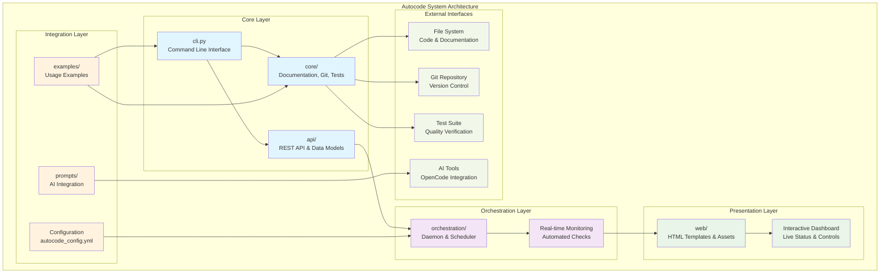
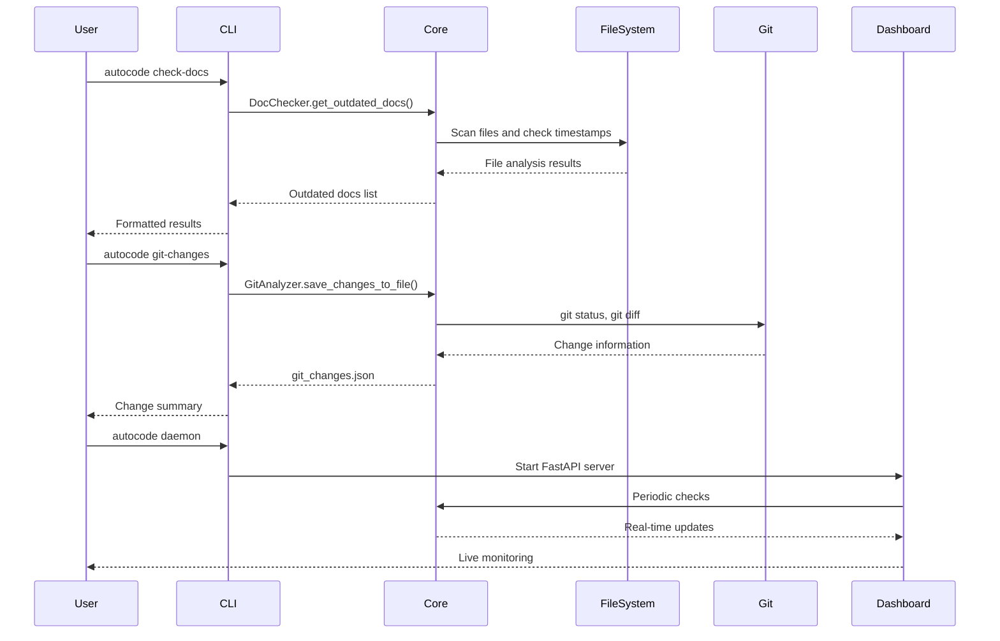
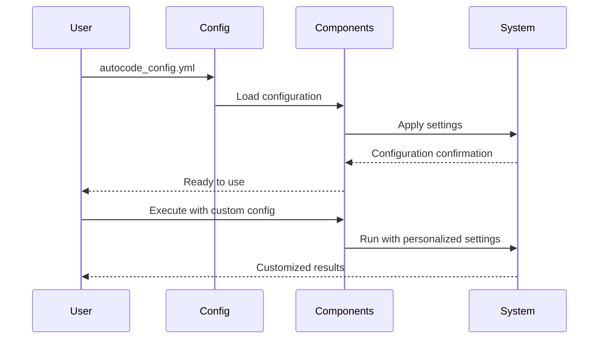

# Autocode Module - Documentación

## 🎯 Propósito del Módulo

El módulo `autocode` es el núcleo central del sistema de automatización de calidad de código. Su responsabilidad principal es proporcionar una plataforma integrada que combina verificación de documentación, análisis de cambios git, validación de tests, y monitoreo en tiempo real, todo a través de una arquitectura modular y extensible que puede ser utilizada tanto programáticamente como mediante interfaz de línea de comandos y dashboard web.

## 🏗️ Arquitectura del Módulo



## 📁 Componentes del Módulo

### `cli.py` - Interfaz de Línea de Comandos
**Propósito**: Interfaz principal para interactuar con autocode desde la línea de comandos
**Documentación**: [cli.md](cli.md)

**Comandos implementados**:
- **`check-docs`**: Verificación de documentación desactualizada con generación automática de índices
- **`check-tests`**: Verificación de tests faltantes y estado de ejecución
- **`git-changes`**: Análisis de cambios git con exportación a JSON
- **`daemon`**: Servidor de monitoreo con dashboard web interactivo
- **`opencode`**: Integración con OpenCode AI para análisis de código
- **`count-tokens`**: Análisis de tokens para optimización de uso de LLM

### `/core` - Funcionalidades Centrales
**Propósito**: Módulos centrales para verificación y análisis de código
**Documentación**: [core/_module.md](core/_module.md)

**Componentes principales**:
- **`doc_checker.py`**: Verificación de documentación actualizada
- **`git_analyzer.py`**: Análisis de cambios en repositorio git
- **`test_checker.py`**: Verificación de tests y ejecución
- **`doc_indexer.py`**: Generación de índices de documentación
- **`token_counter.py`**: Análisis de tokens para LLM
- **`opencode_executor.py`**: Ejecución de análisis OpenCode AI

### `/api` - API REST y Modelos de Datos
**Propósito**: Servidor FastAPI y modelos Pydantic para integración web
**Documentación**: [api/_module.md](api/_module.md)

**Componentes principales**:
- **`server.py`**: Servidor FastAPI con endpoints REST
- **`models.py`**: Modelos Pydantic para datos estructurados

### `/orchestration` - Automatización y Monitoreo
**Propósito**: Sistema de daemon y programación de tareas automáticas
**Documentación**: [orchestration/_module.md](orchestration/_module.md)

**Componentes principales**:
- **`daemon.py`**: Daemon principal para monitoreo continuo
- **`scheduler.py`**: Programador de tareas periódicas

### `/web` - Interfaz Web
**Propósito**: Dashboard web interactivo para monitoreo visual
**Documentación**: [web/_module.md](web/_module.md)

**Componentes principales**:
- **`static/app.js`**: Lógica JavaScript del dashboard
- **`static/style.css`**: Estilos CSS del dashboard
- **`templates/index.html`**: Template HTML principal

### `/prompts` - Integración con AI
**Propósito**: Plantillas para integración con OpenCode AI
**Documentación**: [prompts/_module.md](prompts/_module.md)

**Componentes principales**:
- Plantillas de prompts para análisis de código con AI

## 🔗 Dependencias del Módulo

### Dependencias Internas
- **Módulos Core**: doc_checker, git_analyzer, test_checker, etc.
- **Módulos API**: server, models para integración web
- **Módulos Orchestration**: daemon, scheduler para automatización
- **Módulos Web**: templates, static assets para dashboard

### Dependencias Externas Principales
- **FastAPI**: Framework web para API REST (>=0.104.1)
- **Uvicorn**: Servidor ASGI para FastAPI (>=0.24.0)
- **Pydantic**: Validación y serialización de datos (>=2.11.5)
- **Jinja2**: Motor de templates HTML (>=3.1.4)
- **PyYAML**: Procesamiento de archivos YAML (>=6.0.1)
- **tiktoken**: Análisis de tokens para LLM (>=0.9.0)
- **httpx**: Cliente HTTP asíncrono (>=0.24.0)

### Dependencias de Desarrollo
- **pytest**: Framework de testing (>=8.4.1)
- **pytest-mock**: Mocking para tests (>=3.14.1)

### Dependencias del Sistema
- **Python 3.12+**: Versión mínima requerida
- **Git**: Sistema de control de versiones
- **uv**: Gestor de dependencias y entorno virtual

## 💡 Flujo de Trabajo Principal

### Flujo de Verificación Completa


### Flujo de Configuración y Personalización


## 🔧 Configuración del Sistema

### Estructura de Archivos
```
autocode/
├── __init__.py           # Inicialización del módulo
├── cli.py               # Interfaz de línea de comandos
├── core/                # Funcionalidades centrales
│   ├── doc_checker.py   # Verificación de documentación
│   ├── git_analyzer.py  # Análisis de cambios git
│   ├── test_checker.py  # Verificación de tests
│   ├── doc_indexer.py   # Generación de índices
│   ├── token_counter.py # Análisis de tokens
│   └── opencode_executor.py # Integración OpenCode
├── api/                 # API REST
│   ├── server.py        # Servidor FastAPI
│   └── models.py        # Modelos de datos
├── orchestration/       # Automatización
│   ├── daemon.py        # Daemon principal
│   └── scheduler.py     # Programador de tareas
├── web/                 # Interfaz web
│   ├── static/          # Assets CSS/JS
│   └── templates/       # Templates HTML
└── prompts/             # Integración AI
    └── hola-mundo.md    # Prompt de ejemplo
```

### Configuración Principal
```yaml
# autocode_config.yml
daemon:
  doc_check:
    enabled: true
    interval_minutes: 10
  git_check:
    enabled: true
    interval_minutes: 5
  test_check:
    enabled: true
    interval_minutes: 5
  token_alerts:
    enabled: true
    threshold: 50000
    model: "gpt-4"

api:
  port: 8080
  host: "127.0.0.1"

docs:
  source_dirs: ["autocode"]
  doc_dir: "docs"
  patterns: ["*.py"]

doc_index:
  enabled: true
  auto_generate: true
  output_file: ".clinerules/docs_index.json"

tests:
  enabled: true
  auto_execute: true
  test_dirs: ["tests"]
  patterns: ["test_*.py"]
```

## ⚠️ Consideraciones Especiales

### Arquitectura Modular
- **Loose Coupling**: Módulos independientes con interfaces claras
- **Single Responsibility**: Cada módulo tiene una responsabilidad específica
- **Extensibilidad**: Fácil adición de nuevas funcionalidades
- **Testabilidad**: Componentes testables independientemente

### Gestión de Estado
- **Stateless Components**: Componentes sin estado interno donde sea posible
- **Configuration Management**: Gestión centralizada de configuración
- **Error Isolation**: Errores en un módulo no afectan otros
- **Resource Management**: Gestión eficiente de recursos del sistema

### Performance y Escalabilidad
- **Asynchronous Operations**: Operaciones no bloqueantes donde sea apropiado
- **Caching**: Caché de resultados para evitar recálculos
- **Resource Optimization**: Uso eficiente de CPU y memoria
- **Concurrent Processing**: Procesamiento paralelo cuando es beneficioso

### Compatibilidad y Portabilidad
- **Cross-platform**: Funciona en Windows, macOS, Linux
- **Python Version**: Compatible con Python 3.12+
- **Dependencies**: Dependencias mínimas y bien mantenidas
- **Git Integration**: Compatible con diferentes versiones de Git

## 🧪 Testing y Validación

### Estrategia de Testing
- **Unit Tests**: Tests unitarios para cada módulo
- **Integration Tests**: Tests de integración entre módulos
- **End-to-End Tests**: Tests completos del flujo de trabajo
- **Performance Tests**: Validación de performance y memoria

### Ejecutar Tests
```bash
# Tests unitarios
uv run pytest tests/

# Tests específicos
uv run pytest tests/test_doc_checker.py

# Tests con coverage
uv run pytest --cov=autocode tests/
```

### Validación de Funcionalidad
```bash
# Verificar instalación
uv run -m autocode.cli check-docs

# Verificar todos los comandos
uv run -m autocode.cli --help

# Verificar daemon
uv run -m autocode.cli daemon --help
```

## 📊 Métricas y Monitoreo

### Métricas del Sistema
- **Documentation Coverage**: Porcentaje de archivos con documentación
- **Git Activity**: Frecuencia y tipo de cambios en el repositorio
- **Test Coverage**: Porcentaje de código cubierto por tests
- **System Performance**: Tiempo de respuesta y uso de recursos

### Métricas de Calidad
- **Documentation Freshness**: Actualización de documentación
- **Code Quality**: Análisis de calidad del código
- **Test Health**: Estado de la suite de tests
- **Error Rate**: Frecuencia de errores en el sistema

### Dashboard de Monitoreo
- **Real-time Updates**: Actualización en tiempo real cada 5 segundos
- **Visual Indicators**: Indicadores visuales de estado
- **Interactive Controls**: Controles para ejecutar verificaciones
- **Configuration Management**: Gestión de configuración en vivo

## 🎯 Casos de Uso Principales

### Desarrollo Individual
```bash
# Verificar antes de commit
uv run -m autocode.cli check-docs
uv run -m autocode.cli git-changes

# Monitoreo continuo
uv run -m autocode.cli daemon
```

### Integración CI/CD
```yaml
# En .github/workflows/quality.yml
- name: Check Documentation
  run: uv run -m autocode.cli check-docs
  
- name: Verify Tests
  run: uv run -m autocode.cli check-tests
```

### Análisis de Proyecto
```bash
# Análisis completo
uv run -m autocode.cli check-docs --doc-index-output=project_docs.json
uv run -m autocode.cli git-changes --output=project_changes.json
uv run -m autocode.cli count-tokens --directory=autocode --threshold=100000
```

### Monitoreo de Equipo
```bash
# Dashboard compartido
uv run -m autocode.cli daemon --host=0.0.0.0 --port=8080
```

## 🚀 Extensibilidad y Personalización

### Agregar Nuevas Verificaciones
```python
# Crear nuevo checker
from autocode.core.base_checker import BaseChecker

class CustomChecker(BaseChecker):
    def get_custom_status(self):
        # Implementar lógica personalizada
        pass
```

### Personalizar Configuración
```yaml
# autocode_config.yml personalizado
custom_checks:
  enabled: true
  interval_minutes: 15
  
custom_patterns:
  - "*.tsx"
  - "*.vue"
  - "*.svelte"
```

### Extender Dashboard
```javascript
// Personalizar dashboard
class CustomDashboard extends AutocodeDashboard {
    updateCustomMetrics(data) {
        // Implementar métricas personalizadas
    }
}
```

## 🔄 Integración con Ecosistema

### Integración con IDEs
- **VS Code**: Extensión para integración directa
- **PyCharm**: Plugin para automatización
- **Vim/Neovim**: Scripts para línea de comandos
- **Emacs**: Packages para integración

### Integración con Herramientas
- **Pre-commit Hooks**: Verificaciones antes de commit
- **GitHub Actions**: Automatización CI/CD
- **Docker**: Contenedores para despliegue
- **Kubernetes**: Orquestación de servicios

### Integración con AI
- **OpenCode**: Análisis de código con AI
- **Custom Prompts**: Plantillas personalizadas
- **Token Management**: Gestión eficiente de tokens
- **Model Selection**: Soporte para múltiples modelos

## 📖 Navegación Detallada

### Módulos Principales
- [CLI Interface](cli.md) - Interfaz de línea de comandos
- [Core Functionality](core/_module.md) - Funcionalidades centrales
- [API Server](api/_module.md) - Servidor REST y modelos
- [Orchestration](orchestration/_module.md) - Daemon y automatización
- [Web Interface](web/_module.md) - Dashboard web interactivo

### Recursos Adicionales
- [Examples](../examples/_module.md) - Ejemplos de uso
- [Configuration Guide](../configuration.md) - Guía de configuración
- [API Reference](../api_reference.md) - Referencia completa de API
- [Troubleshooting](../troubleshooting.md) - Solución de problemas

## 🔧 Desarrollo y Contribución

### Configuración de Desarrollo
```bash
# Clonar repositorio
git clone https://github.com/brunvelop/autocode.git
cd autocode

# Instalar dependencias
uv sync

# Ejecutar tests
uv run pytest

# Ejecutar en modo desarrollo
uv run -m autocode.cli daemon --verbose
```

### Estructura de Contribución
- **Feature Branches**: Ramas para nuevas funcionalidades
- **Pull Requests**: Revisión de código antes de merge
- **Tests Required**: Tests obligatorios para nuevas funcionalidades
- **Documentation**: Documentación actualizada para cambios

### Estándares de Código
- **Type Hints**: Uso obligatorio de type hints
- **Docstrings**: Documentación de funciones y clases
- **Error Handling**: Manejo robusto de errores
- **Performance**: Consideraciones de performance en diseño

## 🔮 Roadmap y Futuro

### Próximas Funcionalidades
- **WebSocket Support**: Updates en tiempo real más eficientes
- **Plugin System**: Sistema de plugins para extensibilidad
- **Multi-language Support**: Soporte para más lenguajes
- **Advanced Analytics**: Análisis avanzado de métricas

### Mejoras Planificadas
- **Performance Optimization**: Optimización de rendimiento
- **Better Error Handling**: Manejo de errores mejorado
- **Enhanced UI**: Interfaz de usuario mejorada
- **Mobile Support**: Soporte para dispositivos móviles

### Integraciones Futuras
- **More AI Models**: Soporte para más modelos de AI
- **Cloud Integration**: Integración con servicios cloud
- **Enterprise Features**: Funcionalidades empresariales
- **Multi-project Support**: Soporte para múltiples proyectos

## 🎓 Filosofía de Diseño

### Principios Fundamentales
- **Simplicity**: Interfaz simple pero poderosa
- **Reliability**: Funcionamiento confiable y consistente
- **Extensibility**: Fácil de extender y personalizar
- **Performance**: Optimizado para rendimiento
- **User Experience**: Experiencia de usuario centrada

### Valores del Proyecto
- **Quality First**: Calidad como prioridad principal
- **Developer Friendly**: Diseñado para desarrolladores
- **Open Source**: Transparencia y colaboración
- **Community Driven**: Dirigido por la comunidad
- **Continuous Improvement**: Mejora continua

Este módulo representa el corazón del sistema autocode, proporcionando una plataforma integral para la automatización de calidad de código que puede adaptarse a las necesidades específicas de cualquier proyecto o equipo de desarrollo.
