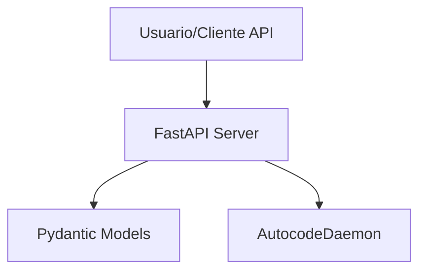

# Módulo: API

## 🎯 Propósito del Módulo
Este módulo proporciona la interfaz web y la API RESTful para el sistema `autocode`. Su responsabilidad principal es ofrecer un dashboard en tiempo real para monitorear el estado del sistema y una API programática para la integración con otras herramientas y flujos de trabajo.

## 🏗️ Arquitectura del Módulo
El módulo está construido con **FastAPI** y se divide en dos componentes principales:

1.  **`server.py`**: Contiene la aplicación FastAPI, que define todos los endpoints de la API y gestiona el ciclo de vida del `AutocodeDaemon`.
2.  **`models.py`**: Define todos los modelos de datos Pydantic utilizados para la validación de peticiones, la serialización de respuestas y la configuración del sistema.

## 📁 Componentes del Módulo
### `server.py` - Servidor FastAPI
**Propósito**: Implementa el servidor web, define los endpoints de la API y orquesta la interacción con el daemon de monitoreo.
**Documentación**: [server.md](server.md)

### `models.py` - Modelos de Datos Pydantic
**Propósito**: Define las estructuras de datos para la configuración, las peticiones y las respuestas de la API, garantizando la validación y la consistencia de los datos.
**Documentación**: [models.md](models.md)

## 🔗 Dependencias del Módulo
### Internas
- `autocode.orchestration.daemon`: El servidor controla el daemon para ejecutar las verificaciones.
- `autocode.core`: Los endpoints pueden invocar directamente a componentes del core para tareas síncronas.

### Externas
- `fastapi`: Framework web.
- `uvicorn`: Servidor ASGI para ejecutar la aplicación.
- `pydantic`: Para la validación de modelos de datos.

## 💡 Flujo de Trabajo Típico
El servidor se inicia a través del comando `autocode daemon`. Una vez en ejecución, los usuarios pueden abrir el dashboard en un navegador, que a su vez consume los endpoints de la API para mostrar datos en tiempo real. Otros servicios o scripts pueden llamar directamente a los endpoints `/api/...` para automatizar tareas.
