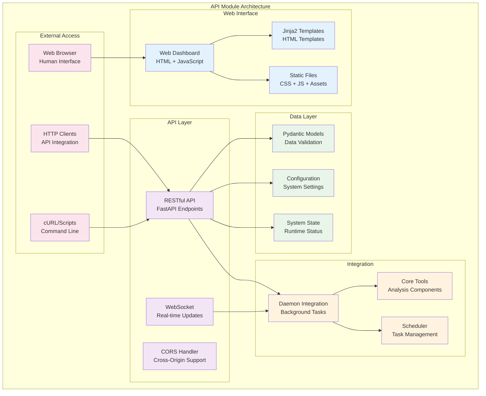
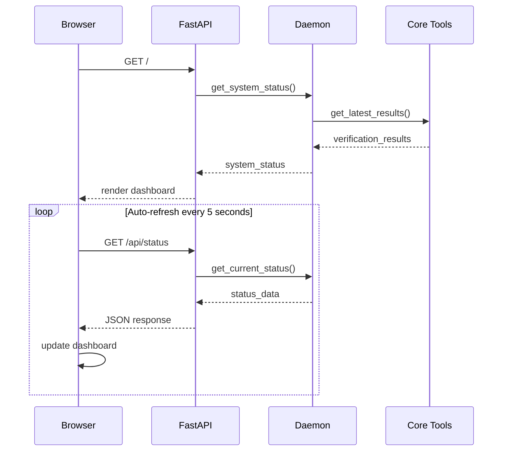
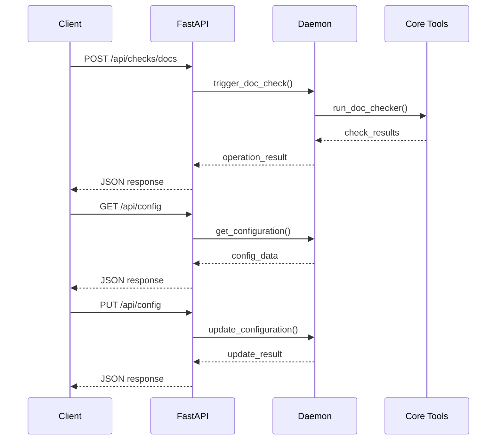
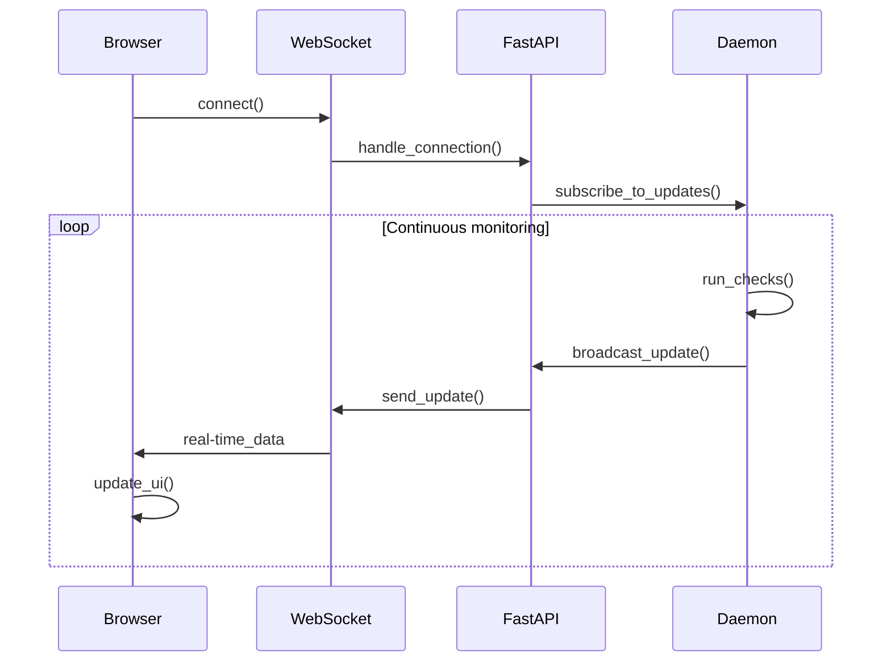

# API Module - Documentación

## 🎯 Propósito del Módulo

El módulo api proporciona la interfaz web y API RESTful para el sistema autocode. Su responsabilidad principal es ofrecer un dashboard web en tiempo real para monitorear el estado del sistema, gestionar la configuración, y proporcionar una API programática para integración con otros sistemas. Combina una interfaz amigable para humanos con endpoints RESTful para automatización.

## 🏗️ Arquitectura del Módulo



## 📁 Componentes del Módulo

### `models.py` - Modelos de Datos
**Propósito**: Modelos Pydantic para validación y serialización de datos del API
**Documentación**: [models.md](models.md)

**Funcionalidades principales**:
- Validación automática de tipos con Pydantic
- Serialización JSON automática
- Modelos para configuración del sistema
- Modelos para estado y resultados de verificaciones
- Modelos para comunicación API con type safety

### `server.py` - Servidor FastAPI
**Propósito**: Servidor web FastAPI que proporciona tanto el dashboard web como la API REST
**Documentación**: [server.md](server.md)

**Funcionalidades principales**:
- Dashboard web en tiempo real con auto-refresh
- API RESTful completa para integración programática
- WebSocket para actualizaciones en tiempo real
- Gestión de configuración a través de la web
- Integración con el daemon de monitoreo continuo

### `/web` - Archivos Web Estáticos
**Propósito**: Archivos estáticos para la interfaz web (HTML, CSS, JavaScript)

#### `/web/static/`
- `app.js`: Lógica JavaScript para el dashboard
- `style.css`: Estilos CSS para la interfaz web

#### `/web/templates/`
- `index.html`: Template principal del dashboard

## 🔗 Dependencias del Módulo

### Internas (otros módulos del proyecto)
- **autocode.orchestration.daemon**: Integración con daemon de monitoreo
- **autocode.core**: Acceso a herramientas fundamentales (indirectamente)

### Externas

#### FastAPI Stack
- `fastapi`: Framework web principal
- `uvicorn`: Servidor ASGI
- `pydantic`: Validación y serialización de datos
- `jinja2`: Motor de templates HTML

#### Web Technologies
- `starlette`: Framework base de FastAPI
- `websockets`: Comunicación WebSocket
- `python-multipart`: Manejo de formularios

#### Standard Library
- `json`: Serialización de datos
- `pathlib`: Manipulación de rutas
- `typing`: Type hints
- `datetime`: Manejo de fechas y tiempos

## 💡 Flujo de Trabajo Típico

### Dashboard Web


### API RESTful


### WebSocket Real-time


## 🔧 Configuración del Módulo

### Configuración del Servidor
```yaml
# En autocode_config.yml
api:
  enabled: true
  host: "127.0.0.1"
  port: 8080
  debug: false
  auto_reload: false
  cors_origins:
    - "http://localhost:3000"
    - "http://127.0.0.1:3000"

# Configuración de la interfaz web
web:
  title: "Autocode Monitoring Dashboard"
  refresh_interval: 5000  # ms
  theme: "light"
  show_detailed_logs: true
```

### Variables de Entorno
```env
# Configuración del servidor
AUTOCODE_API_HOST=127.0.0.1
AUTOCODE_API_PORT=8080
AUTOCODE_API_DEBUG=false

# Configuración de CORS
AUTOCODE_CORS_ORIGINS=["http://localhost:3000"]

# Configuración de WebSocket
AUTOCODE_WS_ENABLED=true
```

## 📊 Endpoints de la API

### Endpoints Principales

#### Status y Monitoreo
```
GET /api/status
- Obtener estado actual del sistema
- Response: SystemStatus

GET /api/health  
- Health check del sistema
- Response: {"status": "healthy", "timestamp": "..."}

GET /api/metrics
- Métricas del sistema
- Response: SystemMetrics
```

#### Verificaciones
```
POST /api/checks/docs
- Ejecutar verificación de documentación
- Response: CheckResult

POST /api/checks/git
- Ejecutar análisis de cambios git
- Response: GitAnalysisResult

POST /api/checks/tokens
- Ejecutar análisis de tokens
- Request: TokenAnalysisRequest
- Response: TokenAnalysisResult
```

#### Configuración
```
GET /api/config
- Obtener configuración actual
- Response: AutocodeConfig

PUT /api/config
- Actualizar configuración
- Request: AutocodeConfig
- Response: ConfigUpdateResult

POST /api/config/reset
- Resetear configuración a defaults
- Response: ConfigResetResult
```

#### Tareas y Scheduler
```
GET /api/tasks
- Listar tareas programadas
- Response: List[ScheduledTask]

POST /api/tasks/{task_id}/run
- Ejecutar tarea manualmente
- Response: TaskExecutionResult

PUT /api/tasks/{task_id}/toggle
- Habilitar/deshabilitar tarea
- Response: TaskToggleResult
```

### WebSocket Endpoints
```
WS /ws
- Conexión WebSocket para updates en tiempo real
- Messages: SystemUpdate, CheckResult, TaskUpdate
```

## 🎨 Interfaz Web

### Dashboard Principal
- **Status Overview**: Estado general del sistema
- **Recent Checks**: Resultados de verificaciones recientes
- **Active Tasks**: Tareas programadas y su estado
- **System Metrics**: Métricas de rendimiento
- **Configuration**: Panel de configuración

### Características de la UI
- **Auto-refresh**: Actualización automática cada 5 segundos
- **Real-time Updates**: WebSocket para actualizaciones instantáneas
- **Interactive Charts**: Gráficos de métricas y tendencias
- **Responsive Design**: Compatible con móviles y tablets
- **Dark/Light Theme**: Temas personalizables

### Componentes Interactivos
- **Check Triggers**: Botones para ejecutar verificaciones manuales
- **Config Editor**: Editor de configuración en línea
- **Task Manager**: Gestión de tareas programadas
- **Log Viewer**: Visualizador de logs en tiempo real

## ⚠️ Consideraciones Especiales

### Seguridad
- **CORS Configuration**: Configuración de orígenes permitidos
- **Input Validation**: Validación de todos los inputs con Pydantic
- **Rate Limiting**: Limitación de requests por IP (futuro)
- **Authentication**: Sin autenticación por defecto (desarrollo local)

### Rendimiento
- **Async Operations**: Todas las operaciones son asíncronas
- **Connection Pooling**: Gestión eficiente de conexiones
- **Caching**: Cache de resultados cuando es apropiado
- **Lightweight**: Interfaz web minimalista y eficiente

### Limitaciones
- **Single User**: Diseñado para uso en desarrollo local
- **No Persistence**: Estado se pierde al reiniciar el servidor
- **Memory Usage**: Puede consumir memoria con muchas conexiones WebSocket
- **Network Dependency**: Requiere acceso de red para funcionar

## 🧪 Testing y Validación

### Test del Servidor
```bash
# Iniciar servidor en modo test
uv run -m autocode.cli daemon --port 8081

# Verificar endpoints básicos
curl http://localhost:8081/api/health
curl http://localhost:8081/api/status
curl http://localhost:8081/api/config
```

### Test de la API
```python
import requests

# Test básico de la API
response = requests.get("http://localhost:8080/api/status")
assert response.status_code == 200
assert "system_status" in response.json()

# Test de verificación de docs
response = requests.post("http://localhost:8080/api/checks/docs")
assert response.status_code == 200
assert "results" in response.json()
```

### Test de WebSocket
```python
import asyncio
import websockets

async def test_websocket():
    uri = "ws://localhost:8080/ws"
    async with websockets.connect(uri) as websocket:
        message = await websocket.recv()
        data = json.loads(message)
        assert "type" in data
        assert "data" in data

asyncio.run(test_websocket())
```

## 🔄 Flujo de Datos

### Entrada de Datos
1. **HTTP Requests**: Requests REST de clientes
2. **WebSocket Connections**: Conexiones de navegadores
3. **Daemon Updates**: Actualizaciones del daemon de monitoreo
4. **Configuration**: Archivos de configuración del sistema

### Procesamiento Interno
1. **Request Validation**: Validación de requests con Pydantic
2. **Business Logic**: Lógica de negocio en endpoints
3. **Data Transformation**: Transformación de datos para respuestas
4. **Real-time Updates**: Distribución de actualizaciones WebSocket

### Salida de Datos
1. **JSON Responses**: Respuestas estructuradas de la API
2. **HTML Pages**: Páginas web renderizadas
3. **WebSocket Messages**: Mensajes en tiempo real
4. **Static Files**: Archivos CSS, JS, imágenes

## 📖 Navegación Detallada

### Documentación de Componentes
- [Models Documentation](models.md) - Modelos Pydantic y estructuras de datos
- [Server Documentation](server.md) - Servidor FastAPI y endpoints

### Casos de Uso Típicos
- **Development Monitoring**: Monitoreo durante desarrollo
- **CI/CD Integration**: Integración con pipelines de CI/CD
- **Team Dashboards**: Dashboard compartido para equipos
- **Automated Reporting**: Generación automatizada de reportes

## 🚀 Extensibilidad

### Añadir Nuevos Endpoints
```python
# En server.py
@app.get("/api/custom/endpoint")
async def custom_endpoint():
    """Nuevo endpoint personalizado"""
    return {"message": "Custom endpoint"}

@app.post("/api/custom/action")
async def custom_action(request: CustomRequest):
    """Acción personalizada"""
    # Lógica personalizada
    return CustomResponse(result="success")
```

### Nuevos Modelos de Datos
```python
# En models.py
class CustomRequest(BaseModel):
    """Modelo para request personalizado"""
    parameter: str
    options: Dict[str, Any]

class CustomResponse(BaseModel):
    """Modelo para response personalizado"""
    result: str
    data: Optional[Dict[str, Any]] = None
```

### Extensiones de la UI
```javascript
// En app.js
function addCustomWidget() {
    // Añadir widget personalizado al dashboard
    const widget = createCustomWidget();
    dashboard.appendChild(widget);
}

function handleCustomUpdate(data) {
    // Manejar actualizaciones personalizadas
    updateCustomWidget(data);
}
```

## 📈 Métricas y Monitoreo

### Métricas del API
- **Request Count**: Número de requests por endpoint
- **Response Time**: Tiempo de respuesta promedio
- **Error Rate**: Tasa de errores por endpoint
- **Active Connections**: Conexiones WebSocket activas

### Métricas del Sistema
- **System Health**: Estado general del sistema
- **Check Results**: Resultados de verificaciones
- **Task Execution**: Estadísticas de ejecución de tareas
- **Resource Usage**: Uso de memoria y CPU

### Dashboard Widgets
- **Status Cards**: Tarjetas de estado del sistema
- **Charts**: Gráficos de métricas temporales
- **Activity Feed**: Feed de actividad reciente
- **Quick Actions**: Acciones rápidas para verificaciones

## 🔧 Configuración Avanzada

### Personalización de la UI
```yaml
ui:
  theme: "dark"  # light, dark, auto
  refresh_interval: 3000  # ms
  show_debug_info: true
  charts:
    enabled: true
    max_data_points: 100
  notifications:
    enabled: true
    sound: false
```

### Configuración de WebSocket
```yaml
websocket:
  enabled: true
  max_connections: 100
  heartbeat_interval: 30  # seconds
  message_queue_size: 1000
```

### Configuración de Logging
```yaml
logging:
  level: "INFO"
  format: "%(asctime)s - %(name)s - %(levelname)s - %(message)s"
  file: "logs/api.log"
  max_size: "10MB"
  backup_count: 5
