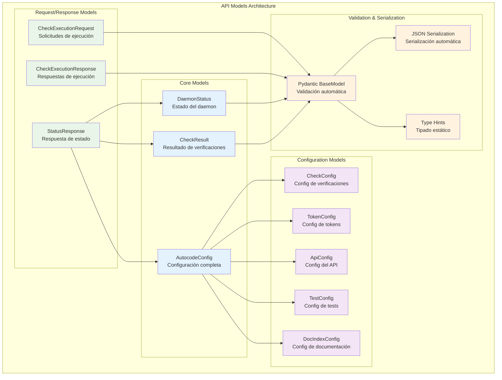
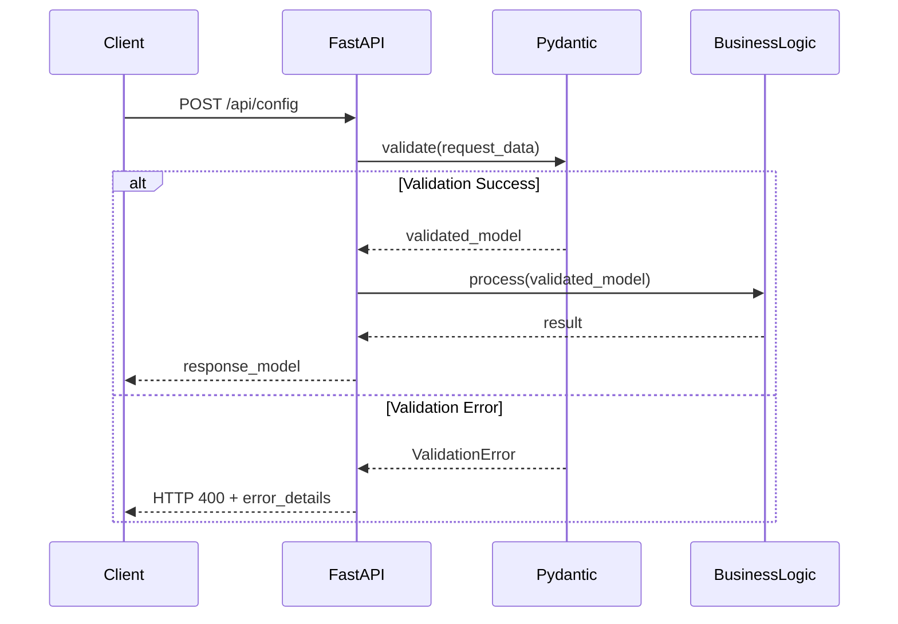
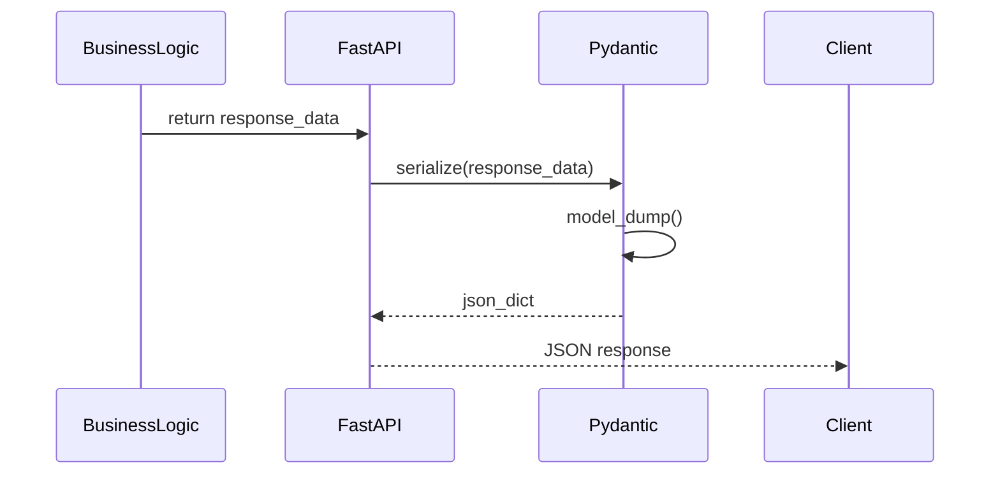

# Modelos de Datos Pydantic para la API de Autocode

## 🎯 Propósito

Los modelos de datos Pydantic proporcionan estructuras tipificadas y validadas para toda la comunicación de la API de autocode. Su responsabilidad principal es garantizar la integridad de los datos, validación automática de tipos, y serialización JSON consistente entre el servidor FastAPI y los clientes de la API.

## 🏗️ Arquitectura



## 📋 Responsabilidades

### Validación de Datos
- **Validación automática de tipos** con Pydantic BaseModel
- **Conversión de tipos** automática cuando es posible
- **Validación de valores** (rangos, formatos, restricciones)
- **Mensajes de error descriptivos** para datos inválidos

### Serialización y Deserialización
- **Serialización JSON automática** para respuestas de API
- **Deserialización segura** de requests JSON
- **Compatibilidad con tipos Python** estándar
- **Soporte para tipos complejos** (datetime, Path, etc.)

### Documentación Automática
- **Esquemas OpenAPI** generados automáticamente
- **Documentación de campos** con descriptions
- **Ejemplos de uso** en la documentación de la API
- **Validación de constraints** documentada

## 🔗 Dependencias

### Internas
- Ninguna dependencia interna directa (modelos puros)

### Externas
- **pydantic**: Framework de validación de datos principal
- **typing**: Type hints para Python
- **datetime**: Manejo de fechas y tiempos

## 📊 Modelos Principales

### CheckResult
```python
class CheckResult(BaseModel):
    """Resultado de una verificación ejecutada."""
    check_name: str                           # Nombre de la verificación
    status: str                              # 'success', 'warning', 'error'
    message: str                             # Mensaje descriptivo
    details: Optional[Dict[str, Any]] = None # Detalles adicionales
    timestamp: datetime                      # Momento de ejecución
    duration_seconds: Optional[float] = None # Duración en segundos
```

**Uso típico**:
```python
result = CheckResult(
    check_name="doc_check",
    status="warning",
    message="5 archivos necesitan documentación",
    details={"outdated_count": 5, "files": [...]},
    timestamp=datetime.now(),
    duration_seconds=2.5
)
```

### DaemonStatus
```python
class DaemonStatus(BaseModel):
    """Estado actual del daemon de monitoreo."""
    is_running: bool                                # Si está ejecutándose
    uptime_seconds: Optional[float] = None         # Tiempo en funcionamiento
    last_check_run: Optional[datetime] = None      # Última verificación
    total_checks_run: int = 0                      # Total de verificaciones
```

**Uso típico**:
```python
status = DaemonStatus(
    is_running=True,
    uptime_seconds=3600.5,
    last_check_run=datetime.now(),
    total_checks_run=150
)
```

### AutocodeConfig
```python
class AutocodeConfig(BaseModel):
    """Configuración completa del sistema autocode."""
    daemon: DaemonConfig = DaemonConfig()        # Config del daemon
    api: ApiConfig = ApiConfig()                 # Config del API
    doc_index: DocIndexConfig = DocIndexConfig() # Config de indexación
    tests: TestConfig = TestConfig()             # Config de tests
```

**Configuración por defecto**:
```python
config = AutocodeConfig()  # Usa todos los defaults
# Equivale a:
config = AutocodeConfig(
    daemon=DaemonConfig(
        doc_check=CheckConfig(enabled=True, interval_minutes=10),
        git_check=CheckConfig(enabled=True, interval_minutes=5),
        test_check=CheckConfig(enabled=True, interval_minutes=5),
        token_alerts=TokenConfig(enabled=True, threshold=50000, model="gpt-4")
    ),
    api=ApiConfig(port=8080, host="127.0.0.1"),
    doc_index=DocIndexConfig(enabled=True, auto_generate=True),
    tests=TestConfig(enabled=True, auto_execute=True)
)
```

## 🔧 Modelos de Configuración

### CheckConfig
```python
class CheckConfig(BaseModel):
    """Configuración para una verificación específica."""
    enabled: bool = True              # Si está habilitada
    interval_minutes: int = 5         # Intervalo en minutos
```

### TokenConfig
```python
class TokenConfig(BaseModel):
    """Configuración para conteo de tokens y alertas."""
    enabled: bool = True              # Si están habilitadas las alertas
    threshold: int = 50000           # Umbral de tokens (50k por defecto)
    model: str = "gpt-4"             # Modelo para encoding
```

### ApiConfig
```python
class ApiConfig(BaseModel):
    """Configuración del servidor API."""
    port: int = 8080                 # Puerto del servidor
    host: str = "127.0.0.1"         # Host del servidor
```

### DocIndexConfig
```python
class DocIndexConfig(BaseModel):
    """Configuración para indexación de documentación."""
    enabled: bool = True                                    # Si está habilitada
    output_path: str = ".clinerules/docs_index.json"      # Archivo de salida
    auto_generate: bool = True                             # Generación automática
    update_on_docs_change: bool = True                     # Actualizar en cambios
```

### TestConfig
```python
class TestConfig(BaseModel):
    """Configuración para verificación de tests."""
    enabled: bool = True                                   # Si está habilitada
    directories: List[str] = ["vidi/", "autocode/", "tools/"]  # Directorios a revisar
    exclude: List[str] = ["__pycache__/", "*.pyc", "__init__.py"]  # Exclusiones
    test_frameworks: List[str] = ["pytest"]               # Frameworks soportados
    auto_execute: bool = True                             # Ejecución automática
```

## 📡 Modelos de Request/Response

### CheckExecutionRequest
```python
class CheckExecutionRequest(BaseModel):
    """Solicitud para ejecutar una verificación específica."""
    check_name: str                   # Nombre de la verificación
    force: bool = False              # Forzar ejecución
```

**Ejemplo de uso**:
```python
request = CheckExecutionRequest(
    check_name="doc_check",
    force=True
)
```

### CheckExecutionResponse
```python
class CheckExecutionResponse(BaseModel):
    """Respuesta de la ejecución de una verificación."""
    success: bool                               # Si fue exitosa
    result: Optional[CheckResult] = None        # Resultado de la verificación
    error: Optional[str] = None                 # Error si falló
```

**Respuesta exitosa**:
```python
response = CheckExecutionResponse(
    success=True,
    result=CheckResult(...),
    error=None
)
```

**Respuesta con error**:
```python
response = CheckExecutionResponse(
    success=False,
    result=None,
    error="Error al ejecutar la verificación"
)
```

### StatusResponse
```python
class StatusResponse(BaseModel):
    """Respuesta completa del estado del sistema."""
    daemon: DaemonStatus                        # Estado del daemon
    checks: Dict[str, CheckResult]              # Resultados de verificaciones
    config: AutocodeConfig                      # Configuración actual
```

**Respuesta típica del endpoint `/api/status`**:
```python
response = StatusResponse(
    daemon=DaemonStatus(is_running=True, uptime_seconds=3600),
    checks={
        "doc_check": CheckResult(...),
        "git_check": CheckResult(...),
        "test_check": CheckResult(...)
    },
    config=AutocodeConfig(...)
)
```

## 💡 Patrones de Uso

### Validación de Entrada
```python
from fastapi import HTTPException

@app.post("/api/config")
async def update_config(config: AutocodeConfig):
    try:
        # Pydantic valida automáticamente
        daemon.update_config(config)
        return {"message": "Configuration updated"}
    except ValidationError as e:
        raise HTTPException(status_code=400, detail=str(e))
```

### Serialización de Salida
```python
@app.get("/api/status", response_model=StatusResponse)
async def get_status():
    # Los modelos se serializan automáticamente a JSON
    return StatusResponse(
        daemon=daemon.get_status(),
        checks=daemon.get_all_results(),
        config=daemon.config
    )
```

### Configuración con Defaults
```python
# Configuración parcial - Pydantic aplica defaults automáticamente
partial_config = {
    "daemon": {
        "doc_check": {"interval_minutes": 15}  # Solo este campo cambia
    }
}

config = AutocodeConfig(**partial_config)
# Resultado: config con doc_check.interval_minutes=15 y todos los demás defaults
```

## ⚠️ Consideraciones Especiales

### Validación Estricta
- **Tipos estrictos**: Los tipos deben coincidir exactamente
- **Campos obligatorios**: Todos los campos sin default son obligatorios
- **Validación de rangos**: Algunos campos tienen validaciones adicionales

### Serialización JSON
- **Datetime handling**: Los datetime se serializan como ISO strings
- **Optional fields**: Los campos opcionales se omiten si son None
- **Nested models**: Los modelos anidados se serializan recursivamente

### Compatibilidad
- **Versioning**: Los modelos deben mantener compatibilidad hacia atrás
- **Migration**: Cambios de esquema requieren migración de datos
- **Documentation**: Los cambios afectan la documentación OpenAPI automática

## 🧪 Testing de Modelos

### Validación de Datos
```python
def test_check_result_validation():
    # Test datos válidos
    result = CheckResult(
        check_name="test",
        status="success",
        message="Test passed",
        timestamp=datetime.now()
    )
    assert result.check_name == "test"
    
    # Test datos inválidos
    with pytest.raises(ValidationError):
        CheckResult(
            check_name="",  # String vacío no válido
            status="invalid",  # Status no válido
            message="Test",
            timestamp="not-a-date"  # Fecha inválida
        )
```

### Serialización JSON
```python
def test_serialization():
    config = AutocodeConfig()
    
    # Serializar a JSON
    json_data = config.model_dump()
    assert isinstance(json_data, dict)
    
    # Deserializar desde JSON
    new_config = AutocodeConfig(**json_data)
    assert new_config == config
```

### Defaults y Opcionales
```python
def test_defaults():
    # Config con defaults
    config = AutocodeConfig()
    assert config.daemon.doc_check.enabled == True
    assert config.daemon.doc_check.interval_minutes == 10
    assert config.api.port == 8080
    
    # Config parcial
    partial = AutocodeConfig(api=ApiConfig(port=9000))
    assert partial.api.port == 9000
    assert partial.daemon.doc_check.enabled == True  # Default mantenido
```

## 🔄 Flujo de Datos

### Request → Validation → Processing


### Response → Serialization → JSON


## 📈 Métricas y Monitoreo

### Validación de Performance
- **Validation Speed**: Tiempo de validación por modelo
- **Memory Usage**: Uso de memoria por instancia de modelo
- **Serialization Time**: Tiempo de serialización a JSON

### Error Tracking
- **Validation Errors**: Errores de validación por endpoint
- **Type Errors**: Errores de tipo más comunes
- **Field Errors**: Campos que fallan validación más frecuentemente

## 🚀 Extensibilidad

### Añadir Nuevos Modelos
```python
class NewFeatureConfig(BaseModel):
    """Configuración para nueva funcionalidad."""
    enabled: bool = True
    parameter: str = "default_value"
    options: Dict[str, Any] = {}

# Extender AutocodeConfig
class ExtendedAutocodeConfig(AutocodeConfig):
    """Configuración extendida con nueva funcionalidad."""
    new_feature: NewFeatureConfig = NewFeatureConfig()
```

### Validadores Personalizados
```python
from pydantic import validator

class EnhancedCheckConfig(CheckConfig):
    """CheckConfig con validación mejorada."""
    
    @validator('interval_minutes')
    def validate_interval(cls, v):
        if v < 1:
            raise ValueError('interval_minutes must be >= 1')
        if v > 1440:  # 24 hours
            raise ValueError('interval_minutes must be <= 1440')
        return v
```

### Campos Computados
```python
from pydantic import computed_field

class EnhancedDaemonStatus(DaemonStatus):
    """DaemonStatus con campos computados."""
    
    @computed_field
    @property
    def uptime_formatted(self) -> str:
        """Uptime formateado como string legible."""
        if self.uptime_seconds is None:
            return "Unknown"
        
        hours = int(self.uptime_seconds // 3600)
        minutes = int((self.uptime_seconds % 3600) // 60)
        return f"{hours}h {minutes}m"
```

## 🔧 Configuración Avanzada

### Configuración de Pydantic
```python
class ConfiguredModel(BaseModel):
    """Modelo con configuración personalizada."""
    
    class Config:
        # Permitir campos extra
        extra = "allow"
        
        # Validar en asignación
        validate_assignment = True
        
        # Usar enum values
        use_enum_values = True
        
        # Schema extra para documentación
        schema_extra = {
            "example": {
                "field": "example_value"
            }
        }
```

### Aliases de Campos
```python
class ApiResponse(BaseModel):
    """Response con aliases para compatibilidad."""
    
    check_name: str = Field(alias="checkName")
    created_at: datetime = Field(alias="createdAt")
    is_success: bool = Field(alias="isSuccess")
    
    class Config:
        allow_population_by_field_name = True
```

### Validación Condicional
```python
class ConditionalConfig(BaseModel):
    """Configuración con validación condicional."""
    
    enabled: bool
    api_key: Optional[str] = None
    
    @validator('api_key')
    def api_key_required_when_enabled(cls, v, values):
        if values.get('enabled') and not v:
            raise ValueError('api_key required when enabled=True')
        return v
