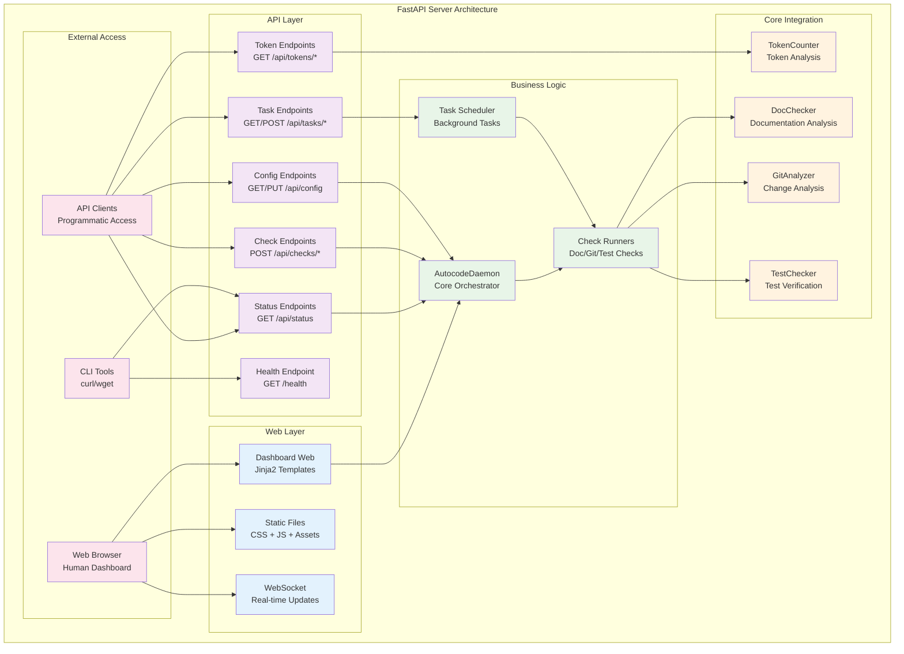
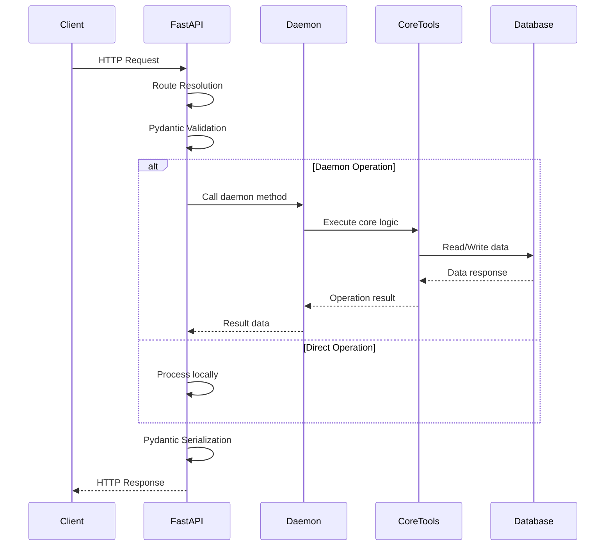
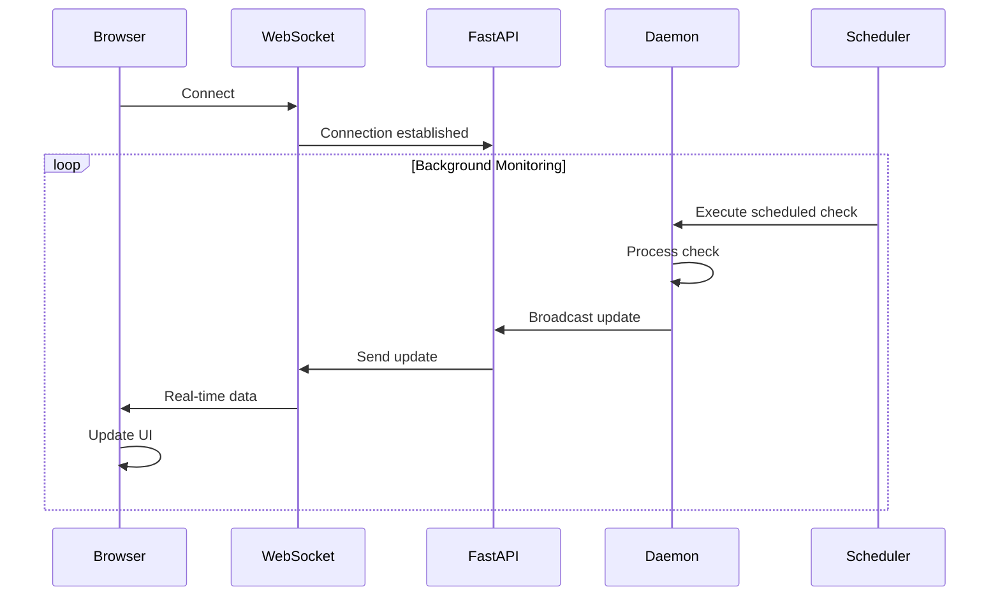
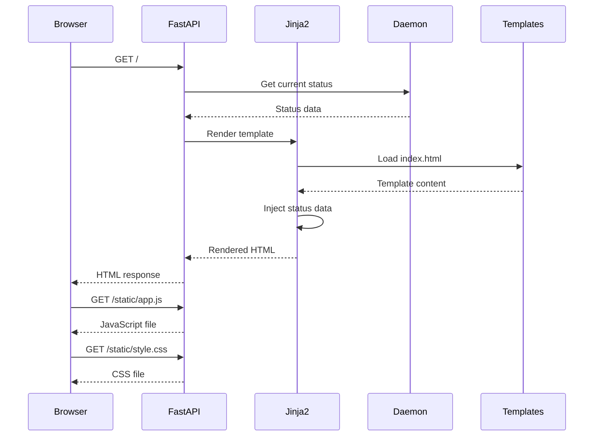

# Servidor FastAPI para la API de Autocode

## 🎯 Propósito

El servidor FastAPI proporciona la interfaz web y API RESTful para el sistema autocode. Su responsabilidad principal es orquestar todas las operaciones de monitoreo, exponer endpoints para integración programática, y ofrecer un dashboard web en tiempo real para supervisión visual del estado del sistema.

## 🏗️ Arquitectura



## 📋 Responsabilidades

### Gestión del Servidor Web
- **Inicialización de FastAPI** con configuración optimizada
- **Gestión del ciclo de vida** del daemon de autocode
- **Manejo de conexiones WebSocket** para actualizaciones en tiempo real
- **Servicio de archivos estáticos** (CSS, JS, imágenes)

### API RESTful Completa
- **Endpoints de estado** para monitoreo del sistema
- **Endpoints de verificación** para ejecutar checks manuales
- **Endpoints de configuración** para gestión dinámica
- **Endpoints de tareas** para control del scheduler
- **Endpoints de tokens** para análisis de contenido

### Dashboard Web Interactivo
- **Interfaz visual** para monitoreo en tiempo real
- **Templates Jinja2** para renderizado dinámico
- **Auto-refresh** automático de datos
- **Controles interactivos** para gestión del sistema

### Integración con Core Systems
- **AutocodeDaemon** como orquestador principal
- **Scheduler** para gestión de tareas programadas
- **Core tools** (DocChecker, GitAnalyzer, etc.) indirectamente
- **Token counting** para análisis de contenido

## 🔗 Dependencias

### Internas
- **autocode.orchestration.daemon**: AutocodeDaemon principal
- **autocode.api.models**: Modelos Pydantic para validación
- **autocode.core.token_counter**: Análisis de tokens (opcional)

### Externas
- **fastapi**: Framework web principal
- **uvicorn**: Servidor ASGI para desarrollo y producción
- **jinja2**: Motor de templates para HTML
- **python-multipart**: Manejo de formularios multipart
- **websockets**: Comunicación WebSocket en tiempo real

## 📊 Endpoints de la API

### Status y Monitoreo

#### GET /
```python
@app.get("/", response_class=HTMLResponse)
async def dashboard(request: Request):
    """Serve the main dashboard."""
```
**Propósito**: Servir el dashboard web principal  
**Response**: HTML renderizado con Jinja2  
**Uso**: Acceso visual al sistema de monitoreo

#### GET /api/status
```python
@app.get("/api/status", response_model=StatusResponse)
async def get_status():
    """Get current status of daemon and all checks."""
```
**Propósito**: Obtener estado completo del sistema  
**Response**: StatusResponse con daemon + checks + config  
**Uso**: Monitoreo programático del estado general

#### GET /api/daemon/status
```python
@app.get("/api/daemon/status", response_model=DaemonStatus)
async def get_daemon_status():
    """Get daemon status."""
```
**Propósito**: Estado específico del daemon  
**Response**: DaemonStatus (uptime, checks_run, etc.)  
**Uso**: Monitoreo del daemon de background

#### GET /health
```python
@app.get("/health")
async def health_check():
    """Simple health check."""
```
**Propósito**: Health check básico del servidor  
**Response**: `{"status": "healthy", "daemon_running": bool}`  
**Uso**: Load balancers, monitoring systems

### Verificaciones (Checks)

#### GET /api/checks
```python
@app.get("/api/checks", response_model=Dict[str, CheckResult])
async def get_all_checks():
    """Get results of all checks."""
```
**Propósito**: Obtener resultados de todas las verificaciones  
**Response**: Dict con check_name → CheckResult  
**Uso**: Dashboard, reportes de estado

#### GET /api/checks/{check_name}
```python
@app.get("/api/checks/{check_name}", response_model=CheckResult)
async def get_check_result(check_name: str):
    """Get result of a specific check."""
```
**Propósito**: Resultado de una verificación específica  
**Parameters**: check_name (doc_check, git_check, test_check)  
**Response**: CheckResult individual  
**Uso**: Análisis detallado de verificaciones específicas

#### POST /api/checks/{check_name}/run
```python
@app.post("/api/checks/{check_name}/run", response_model=CheckExecutionResponse)
async def run_check(check_name: str, background_tasks: BackgroundTasks):
    """Run a specific check manually."""
```
**Propósito**: Ejecutar verificación manual  
**Parameters**: check_name + BackgroundTasks  
**Response**: CheckExecutionResponse (success/error)  
**Uso**: Trigger manual de verificaciones

### Configuración

#### GET /api/config
```python
@app.get("/api/config", response_model=AutocodeConfig)
async def get_config():
    """Get current configuration."""
```
**Propósito**: Obtener configuración actual completa  
**Response**: AutocodeConfig con toda la configuración  
**Uso**: Backup, análisis de configuración

#### PUT /api/config
```python
@app.put("/api/config")
async def update_config(config: AutocodeConfig):
    """Update configuration."""
```
**Propósito**: Actualizar configuración del sistema  
**Request Body**: AutocodeConfig  
**Response**: Mensaje de confirmación  
**Uso**: Configuración dinámica sin reinicio

### Análisis de Tokens

#### GET /api/tokens/count
```python
@app.get("/api/tokens/count")
async def count_tokens(file_path: str = "git_changes.json"):
    """Count tokens in a file."""
```
**Propósito**: Contar tokens en archivo específico  
**Parameters**: file_path (relativo al proyecto)  
**Response**: Estadísticas de tokens + threshold check  
**Uso**: Análisis de contenido para LLMs

#### POST /api/tokens/count-multiple
```python
@app.post("/api/tokens/count-multiple")
async def count_tokens_multiple(file_paths: List[str]):
    """Count tokens in multiple files."""
```
**Propósito**: Análisis agregado de múltiples archivos  
**Request Body**: Lista de file paths  
**Response**: Estadísticas agregadas + threshold check  
**Uso**: Análisis bulk de contenido

### Gestión de Tareas

#### GET /api/scheduler/tasks
```python
@app.get("/api/scheduler/tasks")
async def get_scheduler_tasks():
    """Get scheduler tasks status."""
```
**Propósito**: Estado de todas las tareas programadas  
**Response**: Dict con task_name → task_status  
**Uso**: Monitoreo del scheduler

#### GET /api/scheduler/tasks/{task_name}
```python
@app.get("/api/scheduler/tasks/{task_name}")
async def get_scheduler_task(task_name: str):
    """Get specific scheduler task status."""
```
**Propósito**: Estado de tarea específica  
**Parameters**: task_name  
**Response**: TaskStatus individual  
**Uso**: Debug de tareas específicas

#### POST /api/scheduler/tasks/{task_name}/enable
```python
@app.post("/api/scheduler/tasks/{task_name}/enable")
async def enable_scheduler_task(task_name: str):
    """Enable a scheduler task."""
```
**Propósito**: Habilitar tarea programada  
**Parameters**: task_name  
**Response**: Mensaje de confirmación  
**Uso**: Control dinámico de tareas

#### POST /api/scheduler/tasks/{task_name}/disable
```python
@app.post("/api/scheduler/tasks/{task_name}/disable")
async def disable_scheduler_task(task_name: str):
    """Disable a scheduler task."""
```
**Propósito**: Deshabilitar tarea programada  
**Parameters**: task_name  
**Response**: Mensaje de confirmación  
**Uso**: Control dinámico de tareas

## 💡 Patrones de Uso

### Startup/Shutdown Lifecycle
```python
@app.on_event("startup")
async def startup_event():
    """Initialize daemon on startup."""
    global daemon, daemon_task
    
    logger.info("Starting autocode daemon")
    daemon = AutocodeDaemon()
    
    # Start daemon in background
    daemon_task = asyncio.create_task(daemon.start())
    
    logger.info("Autocode daemon started")

@app.on_event("shutdown")
async def shutdown_event():
    """Clean shutdown of daemon."""
    global daemon, daemon_task
    
    if daemon:
        logger.info("Shutting down autocode daemon")
        daemon.stop()
        
        if daemon_task:
            daemon_task.cancel()
            try:
                await daemon_task
            except asyncio.CancelledError:
                pass
```

### Error Handling Pattern
```python
@app.get("/api/example")
async def example_endpoint():
    if not daemon:
        raise HTTPException(status_code=503, detail="Daemon not initialized")
    
    try:
        # Business logic here
        result = daemon.some_operation()
        return result
    except Exception as e:
        logger.error(f"Error in example_endpoint: {e}")
        raise HTTPException(status_code=500, detail=str(e))
```

### Background Tasks Pattern
```python
@app.post("/api/checks/{check_name}/run")
async def run_check(check_name: str, background_tasks: BackgroundTasks):
    def run_check_task():
        daemon.run_check_manually(check_name)
    
    background_tasks.add_task(run_check_task)
    
    return CheckExecutionResponse(
        success=True,
        result=None,  # Will be available after background task completes
        error=None
    )
```

### Static Files and Templates
```python
# Setup templates and static files
templates = Jinja2Templates(directory=Path(__file__).parent.parent / "web" / "templates")
app.mount("/static", StaticFiles(directory=Path(__file__).parent.parent / "web" / "static"), name="static")

@app.get("/", response_class=HTMLResponse)
async def dashboard(request: Request):
    """Serve the main dashboard."""
    return templates.TemplateResponse("index.html", {"request": request})
```

## 🔧 Configuración del Servidor

### Configuración por Defecto
```python
app = FastAPI(
    title="Autocode Monitoring API",
    description="API for autocode daemon monitoring and management",
    version="1.0.0"
)
```

### Configuración de Logging
```python
logging.basicConfig(level=logging.INFO)
logger = logging.getLogger(__name__)
```

### Variables Globales
```python
# Global daemon instance
daemon: AutocodeDaemon = None
daemon_task: asyncio.Task = None
```

### Configuración de Paths
```python
# Web files paths
templates = Jinja2Templates(directory=Path(__file__).parent.parent / "web" / "templates")
app.mount("/static", StaticFiles(directory=Path(__file__).parent.parent / "web" / "static"), name="static")
```

## 🔄 Flujo de Datos

### Request Processing Flow


### WebSocket Data Flow


### Dashboard Rendering Flow


## ⚠️ Consideraciones Especiales

### Gestión de Estado Global
- **Singleton daemon**: Una instancia global del daemon
- **Task management**: Gestión cuidadosa de asyncio tasks
- **Memory leaks**: Prevención de memory leaks en long-running server
- **Graceful shutdown**: Shutdown limpio del daemon y tasks

### Concurrencia y Thread Safety
- **Async operations**: Todas las operaciones son asíncronas
- **Background tasks**: Ejecución de verificaciones en background
- **Shared state**: Acceso concurrente al estado del daemon
- **Lock-free design**: Diseño sin locks para mejor performance

### Error Handling
- **Global exception handler**: Manejo centralizado de errores
- **HTTP status codes**: Códigos apropiados para cada error
- **Logging comprehensive**: Logging detallado para debugging
- **Graceful degradation**: Funcionamiento parcial si componentes fallan

### Performance
- **Static file serving**: Servido eficiente de archivos estáticos
- **Template caching**: Cache de templates Jinja2
- **Connection pooling**: Gestión eficiente de conexiones
- **Memory usage**: Optimización de uso de memoria

## 🧪 Testing del Servidor

### Unit Tests
```python
from fastapi.testclient import TestClient

client = TestClient(app)

def test_health_endpoint():
    response = client.get("/health")
    assert response.status_code == 200
    assert "status" in response.json()

def test_status_endpoint():
    response = client.get("/api/status")
    assert response.status_code == 200
    data = response.json()
    assert "daemon" in data
    assert "checks" in data
    assert "config" in data
```

### Integration Tests
```python
def test_full_check_execution():
    # Test complete check execution flow
    response = client.post("/api/checks/doc_check/run")
    assert response.status_code == 200
    
    # Wait for background task
    time.sleep(2)
    
    response = client.get("/api/checks/doc_check")
    assert response.status_code == 200
    assert "status" in response.json()
```

### WebSocket Tests
```python
import pytest
from websockets.sync import connect

def test_websocket_connection():
    with connect("ws://localhost:8080/ws") as websocket:
        message = websocket.recv()
        data = json.loads(message)
        assert "type" in data
        assert "timestamp" in data
```

### Load Tests
```python
import asyncio
import aiohttp

async def test_concurrent_requests():
    async with aiohttp.ClientSession() as session:
        tasks = []
        for i in range(100):
            task = session.get("http://localhost:8080/api/status")
            tasks.append(task)
        
        responses = await asyncio.gather(*tasks)
        assert all(r.status == 200 for r in responses)
```

## 🚀 Desarrollo y Extensibilidad

### Añadir Nuevos Endpoints
```python
@app.get("/api/custom/new-feature")
async def new_feature_endpoint():
    """New custom endpoint."""
    if not daemon:
        raise HTTPException(status_code=503, detail="Daemon not initialized")
    
    try:
        result = daemon.custom_operation()
        return {"result": result}
    except Exception as e:
        logger.error(f"Error in new feature: {e}")
        raise HTTPException(status_code=500, detail=str(e))
```

### Custom Middleware
```python
from fastapi import Request
import time

@app.middleware("http")
async def add_process_time_header(request: Request, call_next):
    start_time = time.time()
    response = await call_next(request)
    process_time = time.time() - start_time
    response.headers["X-Process-Time"] = str(process_time)
    return response
```

### WebSocket Extensions
```python
from fastapi import WebSocket

@app.websocket("/ws/custom")
async def custom_websocket(websocket: WebSocket):
    await websocket.accept()
    try:
        while True:
            # Custom WebSocket logic
            data = await websocket.receive_text()
            response = process_custom_data(data)
            await websocket.send_text(response)
    except WebSocketDisconnect:
        logger.info("Custom WebSocket disconnected")
```

### Custom Templates
```python
@app.get("/custom-dashboard", response_class=HTMLResponse)
async def custom_dashboard(request: Request):
    """Custom dashboard with additional features."""
    custom_data = daemon.get_custom_data()
    return templates.TemplateResponse(
        "custom_dashboard.html", 
        {
            "request": request,
            "custom_data": custom_data
        }
    )
```

## 📈 Monitoreo y Métricas

### Métricas del Servidor
- **Request count**: Número de requests por endpoint
- **Response time**: Tiempo de respuesta promedio y percentiles
- **Error rate**: Tasa de errores 4xx y 5xx
- **Active connections**: Conexiones concurrentes activas

### Métricas del Negocio
- **Check execution count**: Verificaciones ejecutadas por tipo
- **Check success rate**: Tasa de éxito de verificaciones
- **Daemon uptime**: Tiempo de funcionamiento del daemon
- **Task completion rate**: Tasa de completitud de tareas programadas

### Health Checks
```python
@app.get("/health/detailed")
async def detailed_health_check():
    """Detailed health check with component status."""
    checks = {
        "daemon": daemon.is_running() if daemon else False,
        "scheduler": daemon.scheduler.is_running() if daemon else False,
        "database": check_database_connection(),
        "external_apis": check_external_services()
    }
    
    overall_health = all(checks.values())
    
    return {
        "status": "healthy" if overall_health else "unhealthy",
        "components": checks,
        "timestamp": datetime.now().isoformat()
    }
```

## 🔧 Configuración de Producción

### Configuración de uvicorn
```python
if __name__ == "__main__":
    import uvicorn
    
    uvicorn.run(
        "autocode.api.server:app",
        host="0.0.0.0",  # Production: bind to all interfaces
        port=8080,
        workers=4,       # Production: multiple workers
        reload=False,    # Production: disable reload
        log_level="info",
        access_log=True
    )
```

### Environment Variables
```env
# Production environment variables
AUTOCODE_API_HOST=0.0.0.0
AUTOCODE_API_PORT=8080
AUTOCODE_API_WORKERS=4
AUTOCODE_LOG_LEVEL=info
AUTOCODE_DAEMON_ENABLED=true
```

### Docker Configuration
```dockerfile
# Dockerfile for production deployment
FROM python:3.11-slim

WORKDIR /app
COPY requirements.txt .
RUN pip install -r requirements.txt

COPY . .

EXPOSE 8080

CMD ["uvicorn", "autocode.api.server:app", "--host", "0.0.0.0", "--port", "8080", "--workers", "4"]
```

### Reverse Proxy (nginx)
```nginx
server {
    listen 80;
    server_name autocode.example.com;
    
    location / {
        proxy_pass http://localhost:8080;
        proxy_set_header Host $host;
        proxy_set_header X-Real-IP $remote_addr;
        proxy_set_header X-Forwarded-For $proxy_add_x_forwarded_for;
        proxy_set_header X-Forwarded-Proto $scheme;
    }
    
    location /ws {
        proxy_pass http://localhost:8080;
        proxy_http_version 1.1;
        proxy_set_header Upgrade $http_upgrade;
        proxy_set_header Connection "upgrade";
        proxy_set_header Host $host;
    }
}
```

## 🔒 Seguridad

### CORS Configuration
```python
from fastapi.middleware.cors import CORSMiddleware

app.add_middleware(
    CORSMiddleware,
    allow_origins=["http://localhost:3000"],  # Specific origins in production
    allow_credentials=True,
    allow_methods=["GET", "POST", "PUT", "DELETE"],
    allow_headers=["*"],
)
```

### Rate Limiting
```python
from slowapi import Limiter, _rate_limit_exceeded_handler
from slowapi.util import get_remote_address
from slowapi.errors import RateLimitExceeded

limiter = Limiter(key_func=get_remote_address)
app.state.limiter = limiter
app.add_exception_handler(RateLimitExceeded, _rate_limit_exceeded_handler)

@app.get("/api/status")
@limiter.limit("10/minute")
async def get_status(request: Request):
    # Rate limited endpoint
    pass
```

### Input Validation
```python
from pydantic import validator

class SecureRequest(BaseModel):
    content: str
    
    @validator('content')
    def validate_content(cls, v):
        # Sanitize input
        if len(v) > 10000:
            raise ValueError('Content too long')
        if any(char in v for char in ['<', '>', '&']):
            raise ValueError('Invalid characters in content')
        return v
```

## 📚 Documentación Automática

### OpenAPI/Swagger
- **URL**: `/docs` - Swagger UI interactiva
- **URL**: `/redoc` - ReDoc documentation
- **URL**: `/openapi.json` - OpenAPI schema raw

### Configuración de OpenAPI
```python
app = FastAPI(
    title="Autocode Monitoring API",
    description="API completa para monitoreo y gestión del sistema autocode",
    version="1.0.0",
    docs_url="/docs",
    redoc_url="/redoc",
    openapi_url="/openapi.json"
)
```

### Tags para Organización
```python
@app.get("/api/status", tags=["Status"])
async def get_status():
    pass

@app.post("/api/checks/{check_name}/run", tags=["Checks"])
async def run_check():
    pass

@app.get("/api/config", tags=["Configuration"])
async def get_config():
    pass
```

## 🎯 Casos de Uso Típicos

### Dashboard de Desarrollo
```python
# Desarrollador accede al dashboard
GET / → Dashboard HTML
GET /api/status → Estado actual
WS /ws → Updates en tiempo real
```

### Integración CI/CD
```python
# Pipeline ejecuta verificaciones
POST /api/checks/doc_check/run → Trigger manual
GET /api/checks/doc_check → Resultado
GET /health → Health check
```

### Monitoreo Automatizado
```python
# Sistema de monitoreo externo
GET /health → Health check periódico
GET /api/status → Estado para alertas
GET /api/scheduler/tasks → Estado de tareas
```

### Configuración Dinámica
```python
# Administrador actualiza configuración
GET /api/config → Configuración actual
PUT /api/config → Actualizar configuración
POST /api/scheduler/tasks/doc_check/disable → Control de tareas
