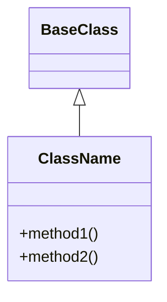
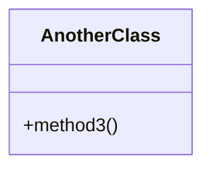

# Code to Design Transformer

## Overview

The CodeToDesign class provides functionality to analyze Python code and generate modular Markdown files with Mermaid diagrams. This tool implements the "Code to Design" transformation process, which is part of a bidirectional design system that helps visualize code structure through automatically generated diagrams.

## Purpose

The code-to-design transformer serves as the deterministic, non-AI component of a bidirectional design system. It:

- Analyzes Python code using static analysis (AST)
- Extracts code structures (classes, methods, inheritance)
- Maps these structures to Mermaid diagrams
- Generates modular Markdown files organized by structure type
- Creates an index for easy navigation

This enables developers to:
- Visualize existing code architecture
- Compare original designs with generated representations
- Maintain design-code consistency
- Increase "digital input" bandwidth for code comprehension

## Key Features

### Static Analysis
- Uses Python's `ast` module for parsing
- Extracts classes, methods, and inheritance relationships
- No dependency on external parsers
- Fast and deterministic processing

### Modular Output Structure
- **design/generated/module_dir/**: Directory structure mirroring source code
- **design/generated/module_dir/_module.md**: Module overview with class links
- **design/generated/module_dir/filename_class.md**: Class diagrams per source file
- **design/generated/_index.md**: Hierarchical navigation index
- **design/original/**: Reserved for human-created designs

### Mermaid Integration
- Generates valid Mermaid classDiagram syntax
- Compatible with modern Markdown editors
- Renders in GitHub, VSCode, and other platforms

## Usage

### CLI Command
```bash
# Analyze a directory
uv run autocode code-to-design --directory src/

# Specify output directory
uv run autocode code-to-design --directory src/ --output-dir designs/

# Custom file pattern
uv run autocode code-to-design --directory src/ --pattern "*.py"
```

### Programmatic Usage
```python
from autocode.core.code_to_design import CodeToDesign
from pathlib import Path

# Initialize transformer
transformer = CodeToDesign(
    project_root=Path.cwd(),
    config={
        "output_dir": "design",
        "language": "python",
        "diagrams": ["classes"]
    }
)

# Generate design
result = transformer.generate_design("src/")
print(f"Generated {len(result['generated_files'])} files")
```

## Configuration

### YAML Configuration
```yaml
code_to_design:
  enabled: true
  output_dir: "design"
  language: "python"
  diagrams:
    - "classes"
```

### Configuration Options
- **enabled**: Enable/disable the transformer
- **output_dir**: Base directory for generated files
- **language**: Programming language (currently supports "python")
- **diagrams**: List of diagram types to generate

## Implementation Details

### Class Structure
```python
class CodeToDesign:
    def __init__(self, project_root: Path, config: Dict[str, Any] = None)
    def analyze_directory(self, directory: str, pattern: str = "*.py") -> Dict[str, List[Dict]]
    def generate_mermaid_class_diagram(self, class_info: Dict) -> str
    def generate_markdown_files(self, structures: Dict[str, List[Dict]]) -> List[Path]
    def generate_design(self, directory: str, pattern: str = "*.py") -> Dict[str, Any]
```

### Analysis Process
1. **Directory Scanning**: Recursively find Python files
2. **AST Parsing**: Parse each file using `ast.parse()`
3. **Structure Extraction**: Walk AST nodes to find classes and methods
4. **Diagram Generation**: Map structures to Mermaid syntax
5. **File Creation**: Write modular Markdown files

### Output Format
Each generated class file contains:
```markdown
# Classes from filename.py

Source: `path/to/filename.py`

## ClassName



## AnotherClass


```

### Generated Structure Example
```
design/generated/
├── _index.md                           # Hierarchical navigation
├── autocode/
│   └── core/
│       ├── _module.md                  # Module overview
│       ├── doc_checker_class.md        # Classes from doc_checker.py
│       ├── git_analyzer_class.md       # Classes from git_analyzer.py
│       └── test_checker_class.md       # Classes from test_checker.py
└── api/
    ├── _module.md                      # Module overview
    ├── models_class.md                 # Classes from models.py
    └── server_class.md                 # Classes from server.py
```

## Limitations

### Current Scope
- **Language Support**: Python only (extensible to other languages)
- **Diagram Types**: Class diagrams only (future: sequences, flows)
- **Analysis Depth**: Basic class/method extraction (no complex relationships)

### Known Limitations
- Dynamic code features (eval, exec) not analyzed
- Complex inheritance patterns may be simplified
- Method signatures not captured (parameters, return types)
- Private/protected method distinction not shown

## Future Enhancements

### Planned Features
1. **Multi-language Support**: JavaScript, TypeScript, Java
2. **Additional Diagrams**: Sequence diagrams, flowcharts
3. **Enhanced Analysis**: Method parameters, docstrings, decorators
4. **Integration**: Daemon monitoring, web dashboard visualization

### Extensibility Points
- **Language Parsers**: Plugin system for different languages
- **Diagram Generators**: Modular diagram creation
- **Output Formats**: Support for PlantUML, other formats

## Integration

### With Autocode Daemon
The transformer can be integrated with the monitoring daemon for:
- Automatic regeneration on code changes
- Continuous design-code synchronization
- Web dashboard visualization

### With Documentation System
Compatible with Autocode's documentation structure:
- Follows modular documentation patterns
- Integrates with doc indexing
- Maintains consistency with existing tools

## Performance

### Benchmarks
- **Small Projects** (< 50 classes): < 1 second
- **Medium Projects** (< 500 classes): < 10 seconds
- **Large Projects** (< 5000 classes): < 60 seconds

### Optimization Features
- **Incremental Processing**: Only analyze changed files
- **Memory Efficient**: Processes files one at a time
- **Parallel Processing**: Future enhancement for large codebases

## Error Handling

### Graceful Degradation
- Syntax errors in source files are logged and skipped
- Invalid AST nodes are ignored with warnings
- Partial results are still generated for valid files

### Error Recovery
- Failed file processing doesn't stop entire analysis
- Detailed error messages for debugging
- Rollback capability for failed generations

## Security

### Safe Operations
- Read-only analysis of source code
- No code execution or evaluation
- Safe file path handling
- Input validation for all parameters

## Testing

### Test Coverage
- Unit tests for all major components
- Integration tests for full workflow
- Edge case testing (empty files, syntax errors)
- Performance benchmarks

### Test Examples
```python
def test_analyze_simple_class():
    transformer = CodeToDesign(tmp_path)
    structures = transformer.analyze_directory(".")
    assert len(structures["classes"]) == 1
    assert structures["classes"][0]["name"] == "MyClass"
```

See `tests/test_code_to_design.py` for complete test suite.
