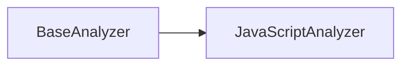

# Módulo: JavaScript Analyzer

## 🎯 Propósito del Módulo
Este módulo contiene el analizador de código especializado para JavaScript y TypeScript. Su propósito es implementar la lógica para parsear archivos de frontend (`.js`, `.ts`, `.jsx`, `.tsx`) y extraer una representación estructurada de su contenido, como clases, funciones y módulos ES6.

## 🏗️ Arquitectura del Módulo
El módulo consiste en una única clase, `JavaScriptAnalyzer`, que hereda de `BaseAnalyzer`. A diferencia del analizador de Python, este se basa en **expresiones regulares (regex)** para identificar las estructuras del código, lo que lo hace rápido pero menos preciso que un análisis basado en AST.

## 📁 Componentes del Módulo
### `analyzer.py` - Analizador de JavaScript/TypeScript
**Propósito**: Utiliza expresiones regulares para extraer clases, funciones, imports y exports de archivos de código de frontend.
**Documentación**: [analyzer.md](analyzer.md)

## 🔗 Dependencias del Módulo
### Internas
- `autocode.core.design.analyzers.base_analyzer`: Proporciona la interfaz base.

### Externas
- `re`: Módulo incorporado de Python para el uso de expresiones regulares.

## 💡 Flujo de Trabajo Típico
`AnalyzerFactory` instancia `JavaScriptAnalyzer` cuando detecta archivos con extensiones `.js`, `.ts`, etc. `CodeToDesign` lo utiliza para analizar estos archivos y obtener datos que pueden ser usados por `ComponentTreeGenerator` para visualizar la estructura de la UI.
