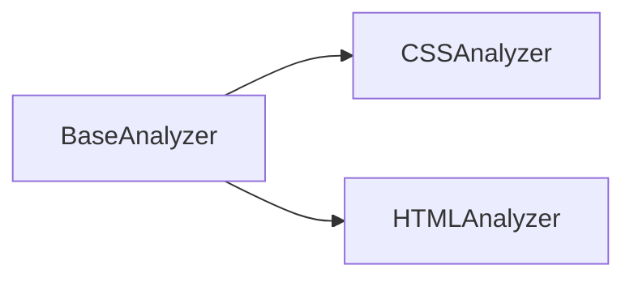

# Módulo: Web Analyzers

## 🎯 Propósito del Módulo
Este módulo contiene los analizadores especializados en extraer información de tecnologías web estándar (HTML y CSS). Su propósito es proporcionar los datos necesarios para entender la estructura y el estilo de las interfaces de usuario.

## 🏗️ Arquitectura del Módulo
El módulo sigue el patrón de los demás analizadores, con implementaciones concretas que heredan de `BaseAnalyzer`. Cada analizador se enfoca en una tecnología web específica.

## 📁 Componentes del Módulo
### `css_analyzer.py` - Analizador de CSS
**Propósito**: Extrae reglas, selectores, propiedades y variables de archivos CSS y sus variantes (SCSS, etc.).
**Documentación**: [css_analyzer.md](css_analyzer.md)

### `html_analyzer.py` - Analizador de HTML
**Propósito**: Parsea archivos HTML para extraer la estructura del DOM, componentes personalizados y otros elementos relevantes.
**Documentación**: [html_analyzer.md](html_analyzer.md)

## 🔗 Dependencias del Módulo
### Internas
- `autocode.core.design.analyzers.base_analyzer`: Proporciona la interfaz base para los analizadores.

### Externas
- `beautifulsoup4`: Utilizada por `HTMLAnalyzer` para parsear HTML.

## 💡 Flujo de Trabajo Típico
El `AnalyzerFactory` instancia los analizadores de este módulo cuando detecta archivos con extensiones `.html`, `.css`, etc. `CodeToDesign` luego utiliza estos analizadores para obtener los datos de la interfaz de usuario, que son procesados por `ComponentTreeGenerator` para crear diagramas visuales.
