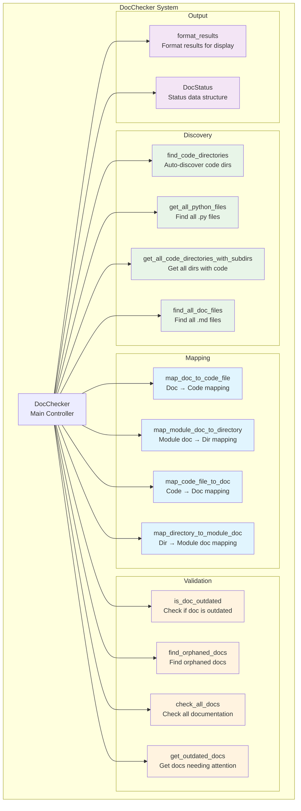
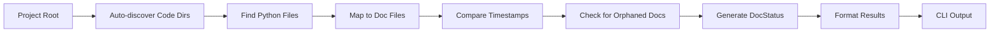

# DocChecker - Verificador de Documentación

## 🎯 Propósito
DocChecker es el componente central para verificar el estado de la documentación modular en el proyecto Vidi. Su responsabilidad es comparar fechas de modificación entre archivos de código fuente y su documentación correspondiente, siguiendo la estructura modular establecida (_index.md, _module.md, archivo.md).

## 🏗️ Arquitectura


## 📋 Responsabilidades
- **Auto-descubrimiento**: Encontrar automáticamente directorios con código Python
- **Mapeo de archivos**: Crear correspondencias entre archivos de código y documentación
- **Verificación de estado**: Comparar fechas de modificación para detectar documentación desactualizada
- **Detección de documentación huérfana**: Encontrar documentación sin código correspondiente
- **Validación de estructura**: Verificar que la estructura de documentación modular esté completa
- **Reporte de resultados**: Formatear y presentar resultados de manera clara

## 🔗 Dependencias
### Internas
- Ninguna (módulo independiente)

### Externas
- `pathlib`: Manipulación de rutas y archivos
- `typing`: Tipos de datos y anotaciones
- `os`: Operaciones del sistema operativo

## 📊 Interfaces Públicas

### Clase Principal
```python
class DocChecker:
    """Verifica el estado de la documentación contra los archivos de código."""
    
    def __init__(self, project_root: Path = None):
        """Inicializar con el directorio raíz del proyecto."""
    
    def get_outdated_docs(self) -> List[DocStatus]:
        """Obtener documentación que necesita atención."""
    
    def format_results(self, results: List[DocStatus]) -> str:
        """Formatear resultados para mostrar."""
```

### Estructura de Datos
```python
class DocStatus(NamedTuple):
    """Estado de un par código-documentación."""
    code_file: Path          # Archivo de código
    doc_file: Path          # Archivo de documentación
    status: str             # 'outdated', 'missing', 'up_to_date', 'orphaned'
    doc_type: str           # 'file', 'module', 'index'
```

### Métodos de Descubrimiento
```python
def find_code_directories(self) -> List[Path]:
    """Auto-descubrir directorios con código Python."""

def get_all_python_files(self) -> List[Path]:
    """Obtener todos los archivos Python, excluyendo __init__.py."""

def get_all_code_directories_with_subdirs(self) -> Set[Path]:
    """Obtener todos los directorios que contienen código Python."""
```

### Métodos de Mapeo
```python
def map_code_file_to_doc(self, code_file: Path) -> Path:
    """Mapear archivo de código a su documentación correspondiente."""

def map_directory_to_module_doc(self, code_dir: Path) -> Path:
    """Mapear directorio de código a su _module.md correspondiente."""
```

### Métodos de Validación
```python
def is_doc_outdated(self, code_path: Path, doc_file: Path) -> str:
    """Verificar si la documentación está desactualizada."""

def find_orphaned_docs(self) -> List[DocStatus]:
    """Encontrar documentación huérfana (sin código correspondiente)."""

def check_all_docs(self) -> List[DocStatus]:
    """Verificar estado de toda la documentación."""
```

## 🔧 Configuración
### Estructura de Directorios Esperada
```
project_root/
├── docs/                           # Directorio de documentación
│   ├── _index.md                  # Documentación principal
│   ├── autocode/                  # Módulo autocode
│   │   ├── _module.md            # Documentación del módulo
│   │   ├── cli.md                # Documenta autocode/cli.py
│   │   └── core/                 # Submódulo core
│   │       ├── _module.md        # Documentación del submódulo
│   │       └── doc_checker.md    # Documenta autocode/core/doc_checker.py
│   └── vidi/                     # Módulo vidi
│       ├── _module.md            # Documentación del módulo
│       └── ...
├── autocode/                      # Código fuente
│   ├── __init__.py               # ← NO se documenta
│   ├── cli.py                    # ← Documentado en docs/autocode/cli.md
│   └── core/
│       ├── __init__.py           # ← NO se documenta
│       └── doc_checker.py        # ← Documentado en docs/autocode/core/doc_checker.md
└── vidi/                         # Código fuente
    ├── __init__.py               # ← NO se documenta
    └── ...
```

### Reglas de Mapeo
```python
# Mapeo exacto archivo por archivo
"autocode/cli.py" → "docs/autocode/cli.md"
"vidi/inference/engine.py" → "docs/vidi/inference/engine.md"

# Mapeo de directorios a _module.md
"autocode/" → "docs/autocode/_module.md"
"vidi/inference/" → "docs/vidi/inference/_module.md"

# Documentación principal
"project_root/" → "docs/_index.md"
```

## 💡 Patrones de Uso

### Verificación Básica
```python
from autocode.core.doc_checker import DocChecker

# Inicializar checker
checker = DocChecker(project_root=Path("/path/to/project"))

# Verificar documentación desactualizada
outdated_docs = checker.get_outdated_docs()

# Mostrar resultados
output = checker.format_results(outdated_docs)
print(output)
```

### Verificación Detallada
```python
# Verificar todo el estado de documentación
all_results = checker.check_all_docs()

# Filtrar por tipo de estado
missing = [r for r in all_results if r.status == 'missing']
outdated = [r for r in all_results if r.status == 'outdated']
orphaned = [r for r in all_results if r.status == 'orphaned']

# Análisis por tipo de documentación
file_docs = [r for r in all_results if r.doc_type == 'file']
module_docs = [r for r in all_results if r.doc_type == 'module']
index_docs = [r for r in all_results if r.doc_type == 'index']
```

### Integración con CLI
```python
# Usado en autocode CLI
def check_docs_command(args) -> int:
    checker = DocChecker(project_root)
    outdated_results = checker.get_outdated_docs()
    output = checker.format_results(outdated_results)
    print(output)
    return 1 if outdated_results else 0
```

## ⚠️ Consideraciones
- **Exclusión de __init__.py**: Los archivos __init__.py nunca se documentan
- **Detección automática**: El sistema descubre automáticamente directorios con código
- **Comparación temporal**: Usa fechas de modificación para detectar cambios
- **Documentación huérfana**: Detecta documentación sin código correspondiente
- **Estructura modular**: Sigue estrictamente el patrón _index.md, _module.md, archivo.md
- **Subdirectorios**: Maneja correctamente estructuras de código anidadas

## 🧪 Testing
### Verificar Descubrimiento de Código
```python
checker = DocChecker(project_root)

# Verificar que encuentra directorios de código
code_dirs = checker.find_code_directories()
assert "autocode" in [d.name for d in code_dirs]
assert "vidi" in [d.name for d in code_dirs]

# Verificar que excluye __init__.py
python_files = checker.get_all_python_files()
init_files = [f for f in python_files if f.name == "__init__.py"]
assert len(init_files) == 0
```

### Verificar Mapeo
```python
# Verificar mapeo de archivos
code_file = Path("autocode/cli.py")
doc_file = checker.map_code_file_to_doc(code_file)
assert doc_file == Path("docs/autocode/cli.md")

# Verificar mapeo de directorios
code_dir = Path("autocode/core")
module_doc = checker.map_directory_to_module_doc(code_dir)
assert module_doc == Path("docs/autocode/core/_module.md")
```

### Verificar Estado de Documentación
```python
# Crear archivos de prueba
test_code = project_root / "test_file.py"
test_doc = project_root / "docs" / "test_file.md"

# Verificar estado cuando falta documentación
status = checker.is_doc_outdated(test_code, test_doc)
assert status == "missing"
```

## 🔄 Flujo de Datos


## 🚀 Casos de Uso Principales

### Verificación Automática
```bash
# Desde CLI
uv run -m autocode.cli check-docs

# Salida típica
Archivos sin documentación:
- autocode/core/new_module.py
- vidi/inference/new_feature.py

Total: 2 archivos requieren atención
```

### Integración en CI/CD
```yaml
# GitHub Actions
- name: Check Documentation
  run: |
    uv run -m autocode.cli check-docs
    if [ $? -ne 0 ]; then
      echo "Documentation is out of date"
      exit 1
    fi
```

### Monitoreo Continuo
```python
# En daemon de autocode
results = checker.get_outdated_docs()
if results:
    logger.warning(f"Documentation needs attention: {len(results)} files")
    # Enviar alertas o notificaciones
```

El DocChecker es el componente fundamental que permite mantener la documentación modular sincronizada automáticamente con el código fuente, asegurando que siempre esté actualizada y completa.
