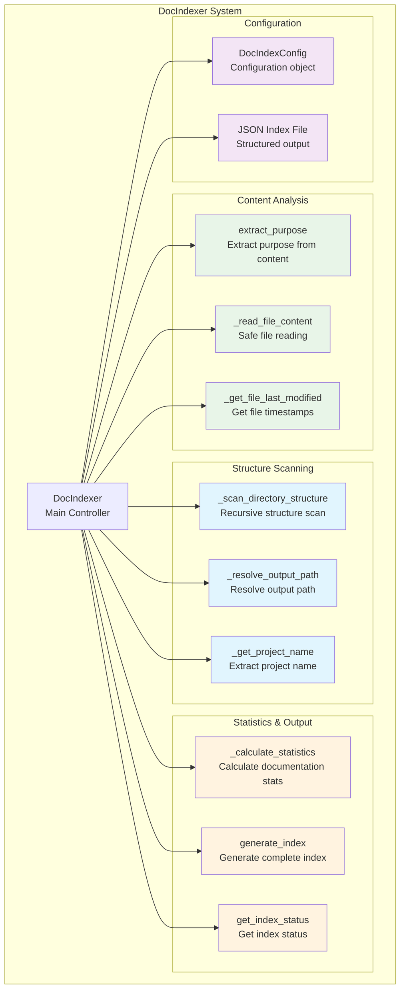
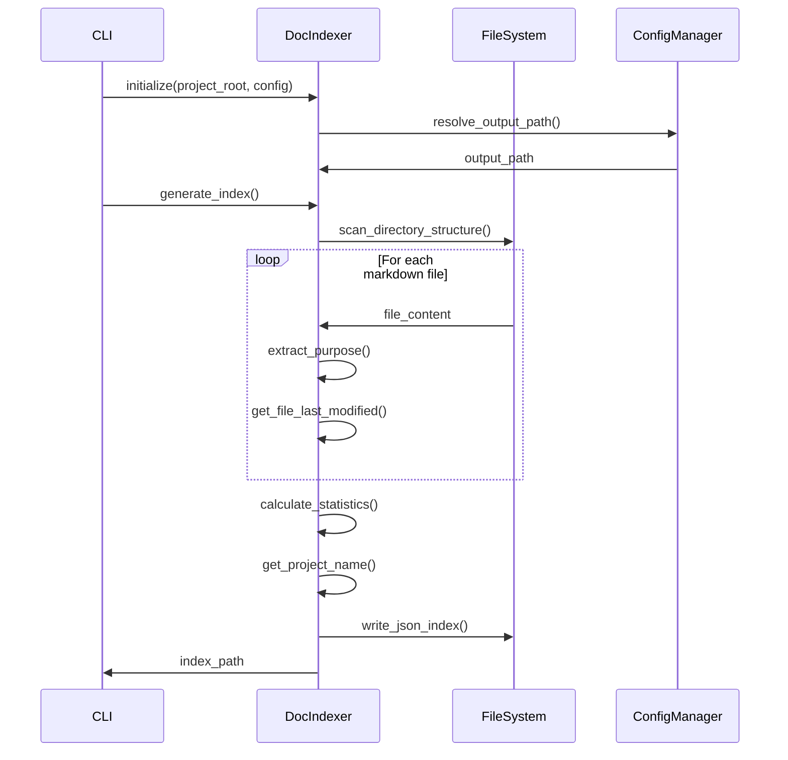

# DocIndexer - Generador de Índices de Documentación

## 🎯 Propósito
Genera índices estructurados de documentación modular en formato JSON, aprovechando la estructura jerárquica de documentación del proyecto (\_index.md, \_module.md, archivo.md) para crear un mapa completo con propósitos extraídos automáticamente.

## 🏗️ Arquitectura


## 📋 Responsabilidades
- **Escaneo de estructura**: Analizar recursivamente la estructura de documentación
- **Extracción de propósitos**: Extraer automáticamente propósitos de archivos markdown
- **Generación de índices**: Crear índices JSON estructurados con jerarquía completa
- **Cálculo de estadísticas**: Generar estadísticas sobre la documentación
- **Gestión de configuración**: Manejar rutas de salida y configuraciones flexibles
- **Monitoreo de estado**: Proporcionar información del estado del índice

## 🔗 Dependencias
### Internas
- `autocode.api.models`: DocIndexConfig para configuración

### Externas
- `json`: Generación de índices JSON
- `re`: Análisis de expresiones regulares para extracción de propósitos
- `datetime`: Manejo de timestamps
- `pathlib`: Manipulación de rutas

## 📊 Interfaces Públicas

### Clase Principal
```python
class DocIndexer:
    """Genera índices estructurados de documentación modular."""
    
    def __init__(self, project_root: Path, config: DocIndexConfig, output_override: Optional[str] = None):
        """Inicializar el indexador de documentación."""
    
    def generate_index(self) -> Path:
        """Generar índice completo de documentación."""
    
    def get_index_status(self) -> Dict[str, Any]:
        """Obtener estado del índice de documentación."""
```

### Métodos de Análisis de Contenido
```python
def extract_purpose(self, content: str) -> str:
    """Extraer propósito del contenido de documentación."""

def _read_file_content(self, file_path: Path) -> str:
    """Leer contenido de archivo de manera segura."""

def _get_file_last_modified(self, file_path: Path) -> Optional[str]:
    """Obtener timestamp de última modificación."""
```

### Métodos de Escaneo de Estructura
```python
def _scan_directory_structure(self, docs_dir: Path) -> Dict[str, Any]:
    """Escanear recursivamente la estructura de documentación."""

def _get_project_name(self) -> str:
    """Extraer nombre del proyecto de la documentación principal."""

def _resolve_output_path(self, output_override: Optional[str]) -> Path:
    """Resolver ruta de salida con prioridades."""
```

### Métodos de Estadísticas
```python
def _calculate_statistics(self, structure: Dict[str, Any]) -> Dict[str, int]:
    """Calcular estadísticas de la estructura de documentación."""
```

## 🔧 Configuración
### Configuración por Defecto
```python
# DocIndexConfig defaults
output_path: ".clinerules/docs_index.json"
enabled: True
auto_generate: True
update_on_docs_change: True
```

### Prioridades de Configuración
```python
# Orden de prioridad para ruta de salida:
# 1. CLI override (--doc-index-output)
# 2. Config file (autocode_config.yml)
# 3. Default (.clinerules/docs_index.json)
```

### Estructura de Salida JSON
```json
{
  "timestamp": "2025-01-01T12:00:00",
  "project_name": "Vidi - Unified Inference Engine",
  "config": {
    "output_path": ".clinerules/docs_index.json",
    "generated_by": "autocode-doc-indexer",
    "version": "1.0.0"
  },
  "documentation_stats": {
    "total_files": 35,
    "total_modules": 14,
    "total_directories": 13,
    "total_purposes_found": 48
  },
  "structure": {
    "docs/": {
      "type": "root",
      "index_file": "docs/_index.md",
      "purpose": "Documentación principal del proyecto",
      "last_modified": "2025-01-01T12:00:00",
      "subdirectories": {
        "docs/vidi/": {
          "type": "module",
          "module_file": "docs/vidi/_module.md",
          "purpose": "Motor de inferencia unificado",
          "files": {
            "docs/vidi/engine.md": {
              "type": "file_doc",
              "purpose": "Motor principal de inferencia",
              "last_modified": "2025-01-01T12:00:00"
            }
          }
        }
      }
    }
  }
}
```

## 💡 Patrones de Uso

### Generación Básica de Índice
```python
from autocode.core.doc_indexer import DocIndexer
from autocode.api.models import DocIndexConfig

# Configuración básica
config = DocIndexConfig(
    output_path=".clinerules/docs_index.json",
    enabled=True
)

# Inicializar indexador
indexer = DocIndexer(project_root=Path.cwd(), config=config)

# Generar índice
index_path = indexer.generate_index()
print(f"Índice generado en: {index_path}")
```

### Uso con Override de CLI
```python
# Con override desde CLI
indexer = DocIndexer(
    project_root=Path.cwd(),
    config=config,
    output_override="custom_docs_index.json"
)

index_path = indexer.generate_index()
```

### Verificación de Estado
```python
# Verificar estado del índice
status = indexer.get_index_status()

if status["exists"]:
    print(f"Índice existe: {status['last_generated']}")
    print(f"Estadísticas: {status['stats']}")
else:
    print("Índice no existe, generando...")
    indexer.generate_index()
```

### Integración con CLI
```python
# Uso en autocode CLI
if not outdated_results and config.doc_index.enabled and config.doc_index.auto_generate:
    indexer = DocIndexer(project_root, config.doc_index, args.doc_index_output)
    index_path = indexer.generate_index()
    print(f"📋 Documentation index generated: {index_path}")
```

## ⚠️ Consideraciones
- **Extracción de propósitos**: Busca patrones específicos ("## 🎯 Propósito") en markdown
- **Estructura jerárquica**: Respeta la estructura _index.md, _module.md, archivo.md
- **Generación automática**: Se ejecuta automáticamente cuando la documentación está actualizada
- **Encoding UTF-8**: Maneja correctamente caracteres especiales en documentación
- **Manejo de errores**: Captura y reporta errores de lectura de archivos
- **Timestamps**: Incluye información de última modificación para cada archivo

## 🧪 Testing
### Verificar Extracción de Propósitos
```python
# Contenido de prueba
content = """
# Título

## 🎯 Propósito
Este es el propósito del módulo de prueba.

## Contenido adicional
"""

indexer = DocIndexer(project_root, config)
purpose = indexer.extract_purpose(content)
assert purpose == "Este es el propósito del módulo de prueba."
```

### Verificar Generación de Índice
```python
# Generar índice de prueba
index_path = indexer.generate_index()
assert index_path.exists()

# Verificar estructura JSON
with open(index_path) as f:
    data = json.load(f)
    
assert "timestamp" in data
assert "project_name" in data
assert "documentation_stats" in data
assert "structure" in data
```

### Verificar Estadísticas
```python
# Verificar cálculo de estadísticas
structure = {
    "type": "root",
    "files": {
        "test.md": {"type": "file_doc", "purpose": "Test file"}
    },
    "subdirectories": {
        "subdir/": {
            "type": "module",
            "purpose": "Test module"
        }
    }
}

stats = indexer._calculate_statistics(structure)
assert stats["total_files"] == 1
assert stats["total_modules"] == 1
assert stats["total_purposes_found"] == 2
```

## 🔄 Flujo de Datos


## 🚀 Casos de Uso Principales

### Generación Automática
```bash
# Automáticamente después de check-docs exitoso
uv run -m autocode.cli check-docs
# Si no hay problemas, genera índice automáticamente
# Output: 📋 Documentation index generated: .clinerules/docs_index.json
```

### Generación Manual con Override
```bash
# Con ruta personalizada
uv run -m autocode.cli check-docs --doc-index-output custom_index.json
```

### Integración con Herramientas Externas
```python
# Usar el índice generado en otras herramientas
with open(".clinerules/docs_index.json") as f:
    doc_index = json.load(f)

# Analizar estadísticas del proyecto
stats = doc_index["documentation_stats"]
print(f"Total files documented: {stats['total_files']}")
print(f"Documentation coverage: {stats['total_purposes_found']}/{stats['total_files']}")
```

### Monitoreo de Documentación
```python
# Verificar estado del índice
status = indexer.get_index_status()
if status["exists"]:
    age_hours = (datetime.now() - datetime.fromisoformat(status["last_generated"])).total_seconds() / 3600
    if age_hours > 24:
        print("⚠️ Documentation index is older than 24 hours")
```

## 📈 Métricas y Estadísticas
### Estadísticas Generadas
- **total_files**: Número total de archivos de documentación
- **total_modules**: Número total de módulos documentados
- **total_directories**: Número total de directorios con documentación
- **total_purposes_found**: Número de propósitos extraídos exitosamente

### Información de Archivos
- **last_modified**: Timestamp de última modificación
- **purpose**: Propósito extraído del archivo
- **type**: Tipo de documentación (file_doc, module, root, index)

El DocIndexer es una herramienta fundamental para mantener un mapa actualizado de toda la documentación del proyecto, facilitando la navegación y análisis de la estructura documental.
