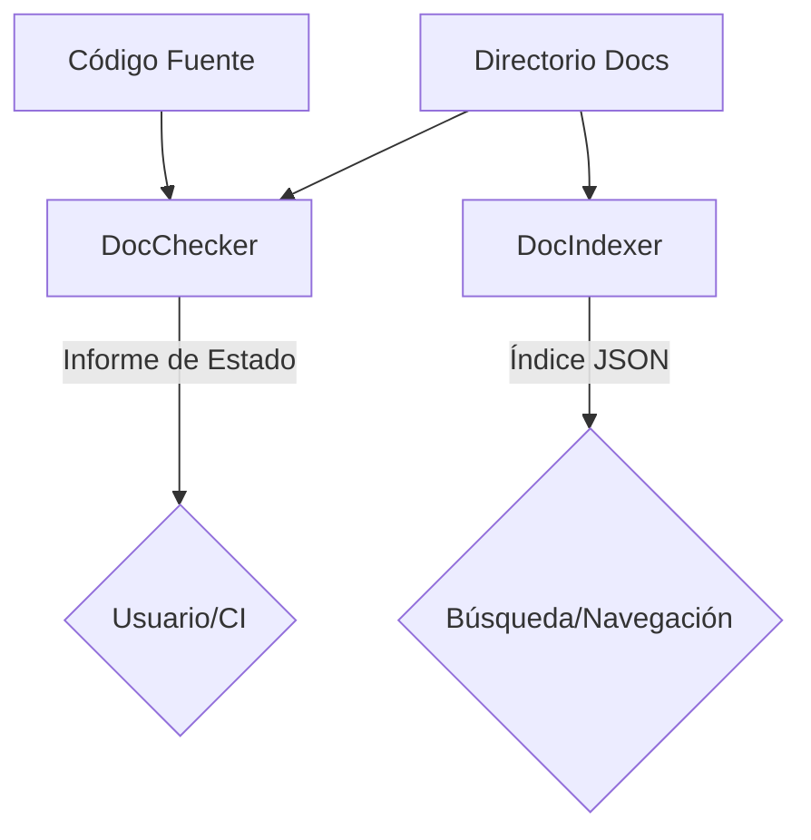

# Módulo: Docs

## 🎯 Propósito del Módulo
Este módulo se centra en la **meta-documentación**: herramientas para analizar y gestionar la propia documentación del proyecto. Su propósito es asegurar que la documentación se mantenga actualizada, completa y sea fácilmente navegable.

## 🏗️ Arquitectura del Módulo
El módulo está compuesto por dos componentes principales que realizan tareas complementarias:

## 📁 Componentes del Módulo
### `doc_checker.py` - Verificador de Documentación
**Propósito**: Compara los archivos de código con sus archivos de documentación correspondientes para encontrar documentación faltante, desactualizada o huérfana.
**Documentación**: [doc_checker.md](doc_checker.md)

### `doc_indexer.py` - Indexador de Documentación
**Propósito**: Escanea todo el directorio de documentación para generar un índice JSON estructurado, extrayendo el propósito de cada documento.
**Documentación**: [doc_indexer.md](doc_indexer.md)

## 💡 Flujo de Trabajo Típico
1.  Un desarrollador modifica el código fuente.
2.  Antes de hacer commit, ejecuta `autocode check-docs`, que invoca a `DocChecker`.
3.  `DocChecker` informa que la documentación para el archivo modificado está desactualizada.
4.  El desarrollador actualiza el archivo `.md` correspondiente.
5.  Periódicamente, un proceso de CI ejecuta `autocode index-docs`, que invoca a `DocIndexer`.
6.  `DocIndexer` genera un nuevo índice JSON, que puede ser consumido por un sitio de documentación estática para potenciar la búsqueda o la navegación.
