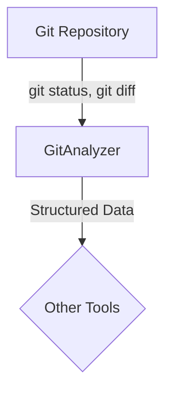

# Módulo: Git

## 🎯 Propósito del Módulo
Este módulo encapsula toda la lógica para interactuar con el sistema de control de versiones Git. Su propósito principal es analizar el estado de un repositorio, identificar los cambios en los archivos y estructurar esa información para que pueda ser utilizada por otras herramientas, como generadores automáticos de mensajes de commit.

## 🏗️ Arquitectura del Módulo
El módulo se centra en la clase `GitAnalyzer`, que actúa como una fachada para ejecutar comandos de Git a través de subprocesos. No depende de bibliotecas de terceros, lo que lo hace ligero y portable.

## 📁 Componentes del Módulo
### `git_analyzer.py` - Analizador de Git
**Propósito**: Analiza el estado del repositorio de Git, obtiene los diffs de los archivos modificados y estructura la información en un formato JSON.
**Documentación**: [git_analyzer.md](git_analyzer.md)

## 🔗 Dependencias del Módulo
### Externas
- `subprocess`: Para ejecutar comandos de la CLI de Git.
- `fnmatch`: Para el filtrado de archivos basado en patrones de `.gitignore`.

## 💡 Flujo de Trabajo Típico
Un flujo de trabajo automatizado (por ejemplo, un hook de pre-commit o una acción de CLI) podría invocar a `GitAnalyzer` para obtener un resumen de los cambios. Esta información estructurada se pasaría a un modelo de lenguaje grande (LLM) para generar un mensaje de commit descriptivo y estandarizado.
