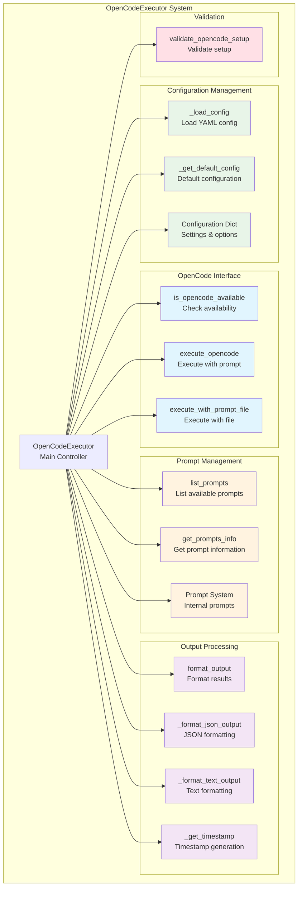
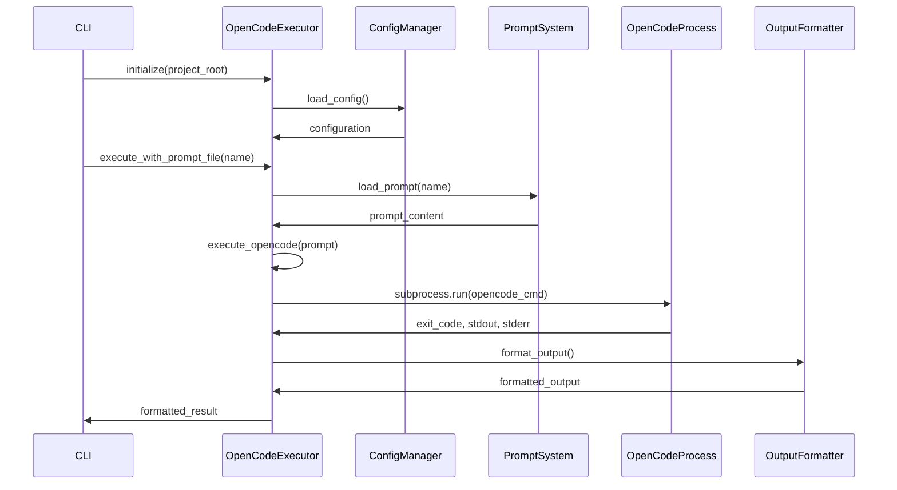

# OpenCodeExecutor - Integración con OpenCode AI

## 🎯 Propósito
La clase OpenCodeExecutor proporciona integración con OpenCode AI para análisis inteligente de código en modo headless (sin interfaz gráfica). Su responsabilidad principal es ejecutar OpenCode de forma automatizada, gestionar configuración, y formatear resultados para procesamiento posterior en pipelines de automatización.

## 🏗️ Arquitectura


## 📋 Responsabilidades
- **Integración con OpenCode**: Ejecutar OpenCode AI de forma programática
- **Gestión de configuración**: Cargar y aplicar configuraciones desde YAML
- **Gestión de prompts**: Manejar prompts internos y cargar desde archivos
- **Formateo de salida**: Procesar y formatear resultados en JSON o texto
- **Validación del sistema**: Verificar que OpenCode esté disponible y configurado
- **Manejo de errores**: Capturar y reportar errores de ejecución

## 🔗 Dependencias
### Internas
- `autocode.prompts`: Sistema de prompts internos

### Externas
- `subprocess`: Ejecución de comandos OpenCode
- `yaml`: Carga de configuración
- `json`: Formateo de salida JSON
- `pathlib`: Manipulación de rutas

## 📊 Interfaces Públicas

### Clase Principal
```python
class OpenCodeExecutor:
    """Ejecutor para OpenCode en modo headless."""
    
    def __init__(self, project_root: Path, config_file: Optional[Path] = None):
        """Inicializar ejecutor de OpenCode."""
    
    def execute_opencode(self, prompt: str, **kwargs) -> Tuple[int, str, str]:
        """Ejecutar OpenCode con el prompt dado."""
    
    def execute_with_prompt_file(self, prompt_name: str, **kwargs) -> Tuple[int, str, str]:
        """Ejecutar OpenCode con prompt cargado desde archivo."""
```

### Métodos de Gestión
```python
def is_opencode_available(self) -> bool:
    """Verificar si OpenCode está disponible en el sistema."""

def list_prompts(self) -> List[str]:
    """Listar todos los archivos de prompt disponibles."""

def get_prompts_info(self) -> Dict[str, str]:
    """Obtener información sobre prompts disponibles."""
```

### Métodos de Formateo
```python
def format_output(self, exit_code: int, stdout: str, stderr: str, 
                 json_output: bool = False, verbose: bool = False) -> str:
    """Formatear la salida para mostrar."""

def _format_json_output(self, exit_code: int, stdout: str, stderr: str) -> str:
    """Formatear salida como JSON."""

def _format_text_output(self, exit_code: int, stdout: str, stderr: str, verbose: bool) -> str:
    """Formatear salida como texto legible."""
```

### Función de Validación
```python
def validate_opencode_setup(project_root: Path) -> Tuple[bool, str]:
    """Validar que OpenCode esté configurado correctamente."""
```

## 🔧 Configuración
### Configuración por Defecto
```python
{
    'enabled': True,
    'model': 'claude-4-sonnet',
    'max_tokens': 64000,
    'debug': False,
    'config_path': '.opencode.json',
    'quiet_mode': True,
    'json_output': False,
    'timeout': 300,
    'retry_attempts': 3
}
```

### Configuración en autocode_config.yml
```yaml
opencode:
  enabled: true
  model: "claude-4-sonnet"
  max_tokens: 64000
  debug: false
  config_path: ".opencode.json"
  quiet_mode: true
  json_output: false
  timeout: 300
  retry_attempts: 3
```

### Estructura de Salida JSON
```json
{
  "exit_code": 0,
  "success": true,
  "stdout": "OpenCode analysis results...",
  "stderr": "Debug information...",
  "timestamp": "2025-01-01T12:00:00",
  "parsed_response": {
    "analysis": "Structured analysis data"
  }
}
```

## 💡 Patrones de Uso

### Ejecución Básica con Prompt
```python
from autocode.core.opencode_executor import OpenCodeExecutor

# Inicializar ejecutor
executor = OpenCodeExecutor(project_root=Path.cwd())

# Ejecutar con prompt directo
exit_code, stdout, stderr = executor.execute_opencode(
    "Analyze this code for potential improvements",
    debug=True,
    json_output=False
)

# Formatear resultados
output = executor.format_output(exit_code, stdout, stderr, verbose=True)
print(output)
```

### Ejecución con Archivo de Prompt
```python
# Listar prompts disponibles
available_prompts = executor.list_prompts()
print(f"Available prompts: {available_prompts}")

# Obtener información de prompts
prompts_info = executor.get_prompts_info()
for name, description in prompts_info.items():
    print(f"{name}: {description}")

# Ejecutar con prompt específico
exit_code, stdout, stderr = executor.execute_with_prompt_file(
    "code-review",
    debug=False,
    quiet=True
)
```

### Validación del Sistema
```python
# Verificar que OpenCode esté disponible
if not executor.is_opencode_available():
    print("❌ OpenCode no está disponible")
    exit(1)

# Validación completa del setup
is_valid, message = validate_opencode_setup(project_root)
if not is_valid:
    print(f"❌ Setup inválido: {message}")
else:
    print(f"✅ {message}")
```

### Integración con CLI
```python
# Uso en autocode CLI
def opencode_command(args) -> int:
    executor = OpenCodeExecutor(project_root)
    
    if args.validate:
        is_valid, message = validate_opencode_setup(project_root)
        print(f"✅ {message}" if is_valid else f"❌ {message}")
        return 0 if is_valid else 1
    
    if args.prompt_file:
        exit_code, stdout, stderr = executor.execute_with_prompt_file(
            args.prompt_file,
            debug=args.debug,
            json_output=args.json
        )
    else:
        exit_code, stdout, stderr = executor.execute_opencode(
            args.prompt,
            debug=args.debug,
            json_output=args.json
        )
    
    formatted_output = executor.format_output(
        exit_code, stdout, stderr,
        json_output=args.json,
        verbose=args.verbose
    )
    print(formatted_output)
    
    return exit_code
```

## ⚠️ Consideraciones
- **Dependencia externa**: Requiere que OpenCode esté instalado en el sistema
- **Configuración requerida**: Necesita archivo .opencode.json válido
- **Timeouts**: Configurar timeouts apropiados para análisis largos
- **Manejo de errores**: Captura errores de subprocess y formateo
- **Encoding**: Maneja correctamente caracteres especiales en prompts
- **Recursos**: El análisis puede consumir tiempo y recursos significativos

## 🧪 Testing
### Verificar Disponibilidad de OpenCode
```python
executor = OpenCodeExecutor(project_root)

# Verificar que OpenCode esté disponible
assert executor.is_opencode_available() == True

# Verificar configuración válida
assert executor.config['enabled'] == True
assert 'model' in executor.config
```

### Verificar Gestión de Prompts
```python
# Verificar que se puedan listar prompts
prompts = executor.list_prompts()
assert isinstance(prompts, list)

# Verificar información de prompts
prompts_info = executor.get_prompts_info()
assert isinstance(prompts_info, dict)

# Verificar carga de prompt específico
if prompts:
    exit_code, stdout, stderr = executor.execute_with_prompt_file(
        prompts[0],
        debug=True
    )
    assert isinstance(exit_code, int)
```

### Verificar Formateo de Salida
```python
# Verificar formateo JSON
json_output = executor._format_json_output(0, "test output", "test error")
import json
parsed = json.loads(json_output)
assert parsed['exit_code'] == 0
assert parsed['success'] == True

# Verificar formateo de texto
text_output = executor._format_text_output(0, "test output", "test error", True)
assert "OpenCode Analysis Complete" in text_output
```

## 🔄 Flujo de Datos


## 🚀 Casos de Uso Principales

### Análisis Automatizado de Código
```bash
# Análisis con prompt directo
uv run -m autocode.cli opencode --prompt "Review this code for security issues"

# Análisis con prompt predefinido
uv run -m autocode.cli opencode --prompt-file code-review --json
```

### Validación del Setup
```bash
# Verificar configuración
uv run -m autocode.cli opencode --validate

# Listar prompts disponibles
uv run -m autocode.cli opencode --list-prompts
```

### Integración en Pipelines
```python
# Pipeline de análisis automático
def analyze_code_changes():
    executor = OpenCodeExecutor(project_root)
    
    # Validar setup
    is_valid, _ = validate_opencode_setup(project_root)
    if not is_valid:
        return False
    
    # Ejecutar análisis
    exit_code, stdout, stderr = executor.execute_with_prompt_file(
        "security-audit",
        json_output=True,
        quiet=True
    )
    
    if exit_code == 0:
        # Procesar resultados JSON
        results = json.loads(stdout)
        return process_analysis_results(results)
    
    return False
```

### Análisis Condicional
```python
# Análisis basado en cambios de git
from autocode.core.git_analyzer import GitAnalyzer

git_analyzer = GitAnalyzer(project_root)
changes = git_analyzer.get_all_changes()

# Solo analizar si hay cambios en archivos Python
python_changes = [c for c in changes if c.file.endswith('.py')]

if python_changes:
    executor = OpenCodeExecutor(project_root)
    exit_code, stdout, stderr = executor.execute_with_prompt_file(
        "python-security-check",
        debug=False
    )
    
    if exit_code == 0:
        print("🔍 Security analysis completed")
        print(stdout)
```

## 🔧 Comandos OpenCode Utilizados
### Estructura del Comando
```bash
# Comando base
opencode -p "prompt text" [-q] [-d] [-f json] [-c working_dir]

# Opciones principales
-p, --prompt: Texto del prompt
-q, --quiet: Modo silencioso
-d, --debug: Modo debug
-f, --format: Formato de salida (json, text)
-c, --cwd: Directorio de trabajo
```

### Manejo de Configuración
- **Archivo de configuración**: `.opencode.json` en el directorio raíz
- **Variables de entorno**: Configuración adicional via env vars
- **Timeouts**: Control de tiempo límite de ejecución
- **Reintentos**: Mecanismo de reintentos en caso de fallos

## 📋 Prompts Internos Soportados
### Prompts Disponibles
- **code-review**: Revisión general de código
- **security-audit**: Auditoría de seguridad
- **performance-analysis**: Análisis de rendimiento
- **documentation-check**: Verificación de documentación
- **architecture-review**: Revisión de arquitectura

### Gestión de Prompts
```python
# Crear prompt personalizado
custom_prompt = """
Analyze this Python code for:
1. Code quality issues
2. Performance optimizations
3. Security vulnerabilities
4. Documentation gaps
"""

exit_code, stdout, stderr = executor.execute_opencode(custom_prompt)
```

El OpenCodeExecutor es una interfaz robusta para integrar análisis de IA en pipelines de desarrollo automatizado, proporcionando análisis inteligente de código de forma programática y escalable.
