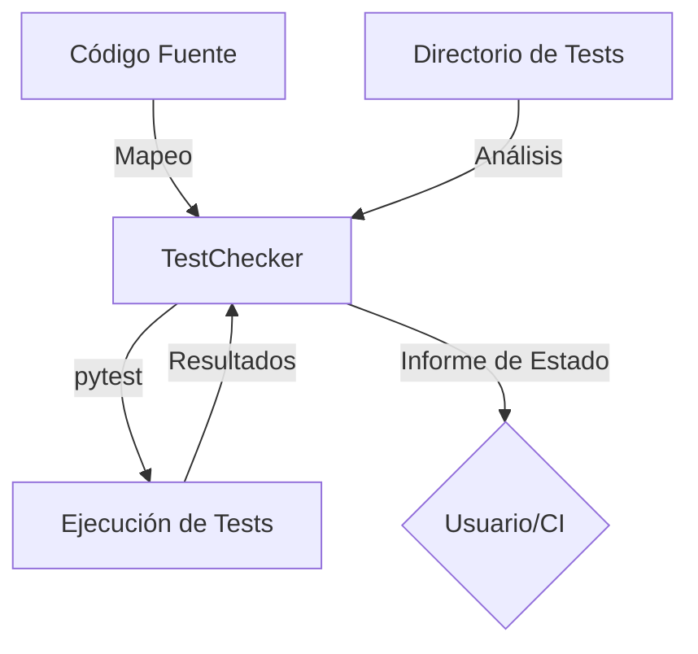

# Módulo: Test

## 🎯 Propósito del Módulo
Este módulo se encarga de la **verificación del estado de los tests** del proyecto. Su responsabilidad es analizar la cobertura de tests siguiendo una estructura modular, identificar tests faltantes o huérfanos, y ejecutar los tests existentes para validar su estado.

## 🏗️ Arquitectura del Módulo
El módulo se centra en la clase `TestChecker`, que implementa la lógica de mapeo entre el código fuente y los archivos de test.

## 📁 Componentes del Módulo
### `test_checker.py` - Verificador de Tests
**Propósito**: Detecta tests faltantes, huérfanos y fallidos, siguiendo una convención de nombrado y estructura de directorios.
**Documentación**: [test_checker.md](test_checker.md)

## 🔗 Dependencias del Módulo
### Externas
- `subprocess`: Para ejecutar `pytest` en un proceso separado.

## 💡 Flujo de Trabajo Típico
El `TestChecker` es invocado por la CLI de `autocode` o por un proceso de CI. Escanea el proyecto, compara el código fuente con el directorio `tests/`, ejecuta `pytest`, y finalmente genera un informe que lista todos los problemas encontrados, ayudando a los desarrolladores a mantener una alta calidad y cobertura de tests.
