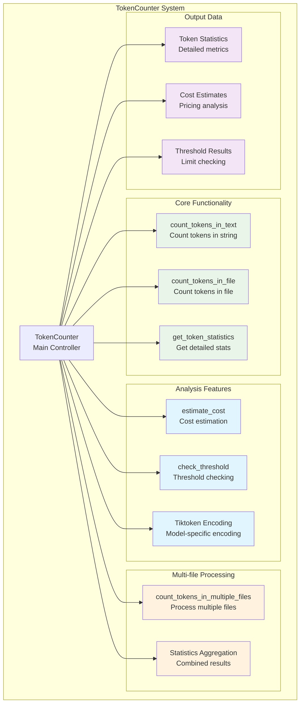
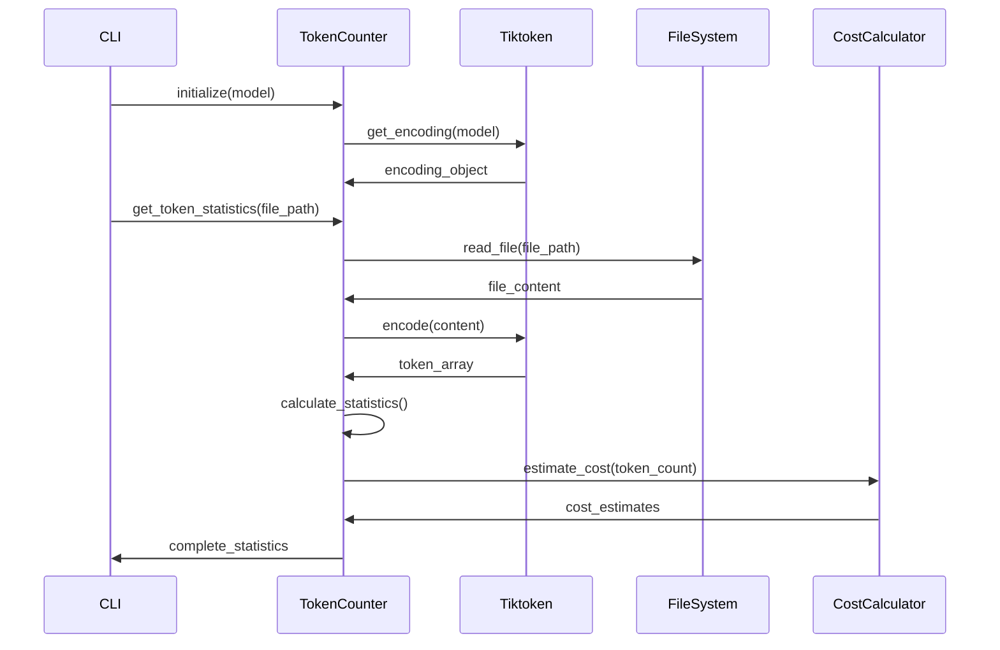

# TokenCounter - Contador de Tokens para LLM

## 🎯 Propósito
El módulo token_counter.py proporciona funcionalidad para contar tokens en texto y archivos para varios modelos de LLM. Su responsabilidad principal es la medición precisa de tokens usando tiktoken, estimación de costos de API, y análisis de límites de contexto para operaciones de IA.

## 🏗️ Arquitectura


## 📋 Responsabilidades
- **Conteo de tokens preciso**: Usar tiktoken para medición exacta por modelo de LLM
- **Análisis de archivos**: Procesar archivos individuales y múltiples
- **Estimación de costos**: Calcular costos estimados basados en precios de API
- **Verificación de límites**: Comprobar límites de contexto y thresholds
- **Estadísticas detalladas**: Generar métricas comprehensivas de tokens
- **Soporte multi-modelo**: Trabajar con diferentes encodings de LLM

## 🔗 Dependencias
### Internas
- Ninguna (módulo independiente)

### Externas
- `tiktoken`: Librería de tokenización de OpenAI
- `pathlib`: Manipulación de rutas de archivos

## 📊 Interfaces Públicas

### Clase Principal
```python
class TokenCounter:
    """Contador de tokens para modelos LLM usando tiktoken."""
    
    def __init__(self, model: str = "gpt-4"):
        """Inicializar con encoding específico del modelo."""
    
    def count_tokens_in_text(self, text: str) -> int:
        """Contar tokens en una cadena de texto."""
    
    def count_tokens_in_file(self, file_path: Path) -> int:
        """Contar tokens en un archivo."""
    
    def get_token_statistics(self, file_path: Path) -> Dict:
        """Obtener estadísticas detalladas de tokens para un archivo."""
```

### Métodos de Análisis
```python
def estimate_cost(self, token_count: int, input_cost_per_1k: float = 0.03, 
                 output_cost_per_1k: float = 0.06) -> Dict:
    """Estimar costo para conteo de tokens basado en precios típicos."""

def check_threshold(self, token_count: int, threshold: int = 50000) -> Dict:
    """Verificar si el conteo de tokens excede un threshold."""
```

### Función Utilitaria
```python
def count_tokens_in_multiple_files(file_paths: list[Path], model: str = "gpt-4") -> Dict:
    """Contar tokens en múltiples archivos."""
```

## 🔧 Configuración
### Modelos Soportados
```python
# Modelos principales soportados por tiktoken
"gpt-4"           # GPT-4 models
"gpt-4-turbo"     # GPT-4 Turbo
"gpt-3.5-turbo"   # GPT-3.5 Turbo
"text-davinci-003" # Legacy models
"claude-3"        # Fallback to cl100k_base
```

### Encoding por Defecto
```python
# Fallback encoding para modelos desconocidos
DEFAULT_ENCODING = "cl100k_base"
```

### Estructura de Estadísticas Detalladas
```python
{
    "file_path": "path/to/file.py",
    "token_count": 1234,
    "model": "gpt-4",
    "file_size_bytes": 5678,
    "file_size_mb": 0.005678,
    "tokens_per_kb": 217.3
}
```

### Estructura de Estimación de Costos
```python
{
    "input_cost_usd": 0.037,
    "output_cost_usd": 0.074,
    "total_cost_usd": 0.111,
    "token_count": 1234,
    "cost_per_1k_input": 0.03,
    "cost_per_1k_output": 0.06
}
```

### Estructura de Verificación de Threshold
```python
{
    "token_count": 75000,
    "threshold": 50000,
    "exceeds_threshold": True,
    "percentage": 150.0,
    "tokens_over": 25000,
    "tokens_remaining": 0
}
```

## 💡 Patrones de Uso

### Conteo Básico de Tokens
```python
from autocode.core.token_counter import TokenCounter

# Inicializar contador para GPT-4
counter = TokenCounter("gpt-4")

# Contar tokens en texto
text = "Este es un ejemplo de texto para analizar"
token_count = counter.count_tokens_in_text(text)
print(f"Tokens: {token_count}")

# Contar tokens en archivo
file_path = Path("example.py")
file_tokens = counter.count_tokens_in_file(file_path)
print(f"File tokens: {file_tokens}")
```

### Estadísticas Detalladas
```python
# Obtener estadísticas completas
stats = counter.get_token_statistics(file_path)

print(f"Archivo: {stats['file_path']}")
print(f"Tokens: {stats['token_count']:,}")
print(f"Tamaño: {stats['file_size_mb']:.2f} MB")
print(f"Tokens por KB: {stats['tokens_per_kb']:.1f}")
```

### Estimación de Costos
```python
# Estimar costos con precios de GPT-4
cost_estimate = counter.estimate_cost(
    token_count=10000,
    input_cost_per_1k=0.03,
    output_cost_per_1k=0.06
)

print(f"Costo estimado: ${cost_estimate['total_cost_usd']:.4f}")
print(f"Input: ${cost_estimate['input_cost_usd']:.4f}")
print(f"Output: ${cost_estimate['output_cost_usd']:.4f}")
```

### Verificación de Límites
```python
# Verificar threshold de contexto
threshold_check = counter.check_threshold(
    token_count=75000,
    threshold=50000
)

if threshold_check['exceeds_threshold']:
    print(f"⚠️ Excede threshold por {threshold_check['tokens_over']:,} tokens")
    print(f"Porcentaje: {threshold_check['percentage']:.1f}%")
else:
    print(f"✅ Dentro del límite: {threshold_check['tokens_remaining']:,} tokens restantes")
```

### Análisis de Múltiples Archivos
```python
from autocode.core.token_counter import count_tokens_in_multiple_files

# Analizar múltiples archivos
file_paths = [
    Path("file1.py"),
    Path("file2.py"),
    Path("file3.py")
]

results = count_tokens_in_multiple_files(file_paths, "gpt-4")

print(f"Total tokens: {results['total_tokens']:,}")
print(f"Archivos analizados: {results['file_count']}")
print(f"Promedio por archivo: {results['average_tokens_per_file']:.0f}")

# Estadísticas por archivo
for file_stat in results['file_statistics']:
    print(f"{file_stat['file_path']}: {file_stat['token_count']:,} tokens")
```

### Integración con CLI
```python
# Uso en autocode CLI
def count_tokens_command(args) -> int:
    token_counter = TokenCounter(args.model)
    
    if args.file:
        # Análisis de archivo único
        stats = token_counter.get_token_statistics(Path(args.file))
        print(f"📊 Token Analysis for {args.file}:")
        print(f"   Tokens: {stats['token_count']:,}")
        
        # Verificar threshold si se proporciona
        if args.threshold:
            threshold_check = token_counter.check_threshold(
                stats['token_count'], 
                args.threshold
            )
            if threshold_check['exceeds_threshold']:
                print(f"⚠️ WARNING: Exceeds threshold")
            else:
                print(f"✅ Within threshold")
    
    elif args.directory:
        # Análisis de directorio
        file_paths = list(Path(args.directory).rglob(args.pattern))
        results = count_tokens_in_multiple_files(file_paths, args.model)
        
        print(f"📊 Directory Analysis:")
        print(f"   Total tokens: {results['total_tokens']:,}")
        print(f"   Files analyzed: {results['file_count']}")
    
    return 0
```

## ⚠️ Consideraciones
- **Dependencia de tiktoken**: Requiere instalación de tiktoken para funcionar
- **Encoding específico**: Diferentes modelos usan diferentes encodings
- **Manejo de errores**: Captura errores de lectura de archivos y encoding
- **Memoria**: Archivos muy grandes pueden consumir memoria significativa
- **Precisión**: Los conteos son específicos del modelo seleccionado
- **Costos estimados**: Los precios pueden cambiar, usar como referencia

## 🧪 Testing
### Verificar Conteo Básico
```python
counter = TokenCounter("gpt-4")

# Verificar conteo de texto simple
text = "Hello world"
tokens = counter.count_tokens_in_text(text)
assert tokens > 0
assert isinstance(tokens, int)

# Verificar texto vacío
empty_tokens = counter.count_tokens_in_text("")
assert empty_tokens == 0
```

### Verificar Estadísticas de Archivo
```python
# Crear archivo de prueba
test_file = Path("test.txt")
test_file.write_text("Este es un archivo de prueba")

# Obtener estadísticas
stats = counter.get_token_statistics(test_file)

assert stats['token_count'] > 0
assert stats['file_size_bytes'] > 0
assert stats['model'] == "gpt-4"
assert 'tokens_per_kb' in stats

# Limpiar
test_file.unlink()
```

### Verificar Estimación de Costos
```python
cost_estimate = counter.estimate_cost(1000, 0.03, 0.06)

assert cost_estimate['token_count'] == 1000
assert cost_estimate['input_cost_usd'] == 0.03
assert cost_estimate['output_cost_usd'] == 0.06
assert cost_estimate['total_cost_usd'] == 0.09
```

### Verificar Threshold
```python
# Threshold excedido
over_check = counter.check_threshold(60000, 50000)
assert over_check['exceeds_threshold'] == True
assert over_check['tokens_over'] == 10000
assert over_check['percentage'] == 120.0

# Dentro del threshold
under_check = counter.check_threshold(30000, 50000)
assert under_check['exceeds_threshold'] == False
assert under_check['tokens_remaining'] == 20000
```

## 🔄 Flujo de Datos


## 🚀 Casos de Uso Principales

### Análisis de Límites de Contexto
```bash
# Verificar si archivos están dentro de límites
uv run -m autocode.cli count-tokens --file large_prompt.txt --threshold 50000

# Análisis de directorio completo
uv run -m autocode.cli count-tokens --directory ./src --pattern "*.py" --threshold 100000
```

### Estimación de Costos de API
```python
# Calcular costos antes de enviar a API
counter = TokenCounter("gpt-4")
prompt_tokens = counter.count_tokens_in_text(large_prompt)

cost_estimate = counter.estimate_cost(prompt_tokens)
if cost_estimate['total_cost_usd'] > 5.0:
    print("⚠️ High cost estimate, consider reducing prompt size")
```

### Optimización de Prompts
```python
# Comparar diferentes versiones de prompts
prompts = [
    "Version 1: detailed prompt...",
    "Version 2: concise prompt...",
    "Version 3: minimal prompt..."
]

counter = TokenCounter("gpt-4")
for i, prompt in enumerate(prompts):
    tokens = counter.count_tokens_in_text(prompt)
    cost = counter.estimate_cost(tokens)
    print(f"Prompt {i+1}: {tokens} tokens, ${cost['total_cost_usd']:.4f}")
```

### Monitoreo de Uso de Tokens
```python
# Seguimiento de uso en pipeline de automatización
total_tokens_used = 0
max_daily_tokens = 1000000

def process_with_token_tracking(text, model="gpt-4"):
    global total_tokens_used
    
    counter = TokenCounter(model)
    tokens = counter.count_tokens_in_text(text)
    
    # Verificar límite diario
    if total_tokens_used + tokens > max_daily_tokens:
        raise Exception("Daily token limit exceeded")
    
    total_tokens_used += tokens
    return tokens
```

## 📊 Precios de Referencia (por 1K tokens)
### Modelos Principales
```python
# Precios aproximados (verificar precios actuales)
PRICING = {
    "gpt-4": {"input": 0.03, "output": 0.06},
    "gpt-4-turbo": {"input": 0.01, "output": 0.03},
    "gpt-3.5-turbo": {"input": 0.001, "output": 0.002},
    "claude-3-sonnet": {"input": 0.003, "output": 0.015},
    "claude-3-haiku": {"input": 0.00025, "output": 0.00125}
}
```

## 🔧 Optimizaciones de Rendimiento
### Técnicas de Optimización
- **Caché de encoding**: Reutilizar objetos de encoding para múltiples operaciones
- **Streaming de archivos**: Para archivos muy grandes, considerar procesamiento por chunks
- **Batch processing**: Procesar múltiples archivos de forma eficiente
- **Memoria**: Monitorear uso de memoria con archivos grandes

El TokenCounter es una herramienta esencial para la gestión de costos y límites en operaciones de IA, proporcionando medición precisa y análisis detallado del uso de tokens en aplicaciones LLM.
