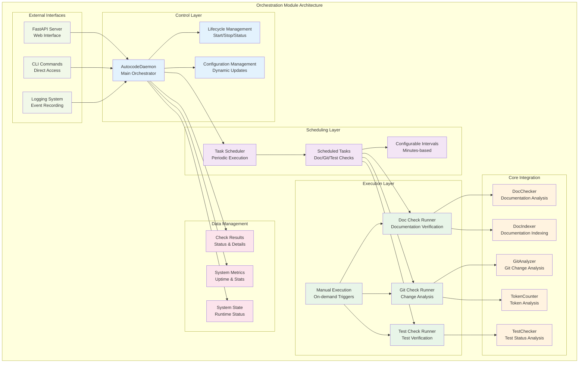
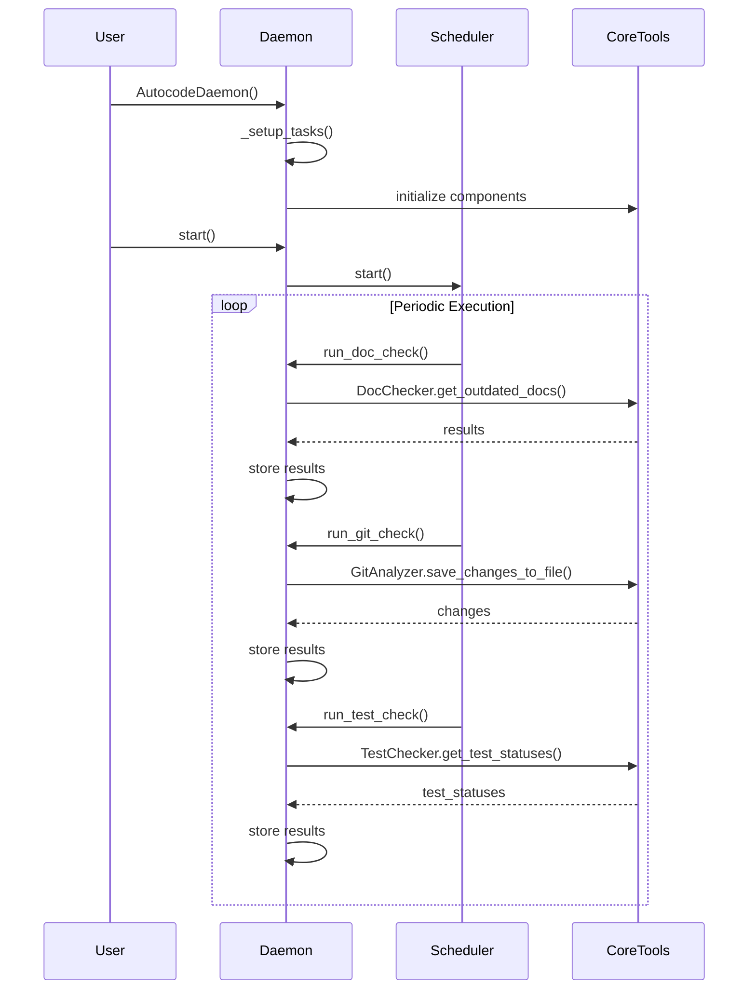
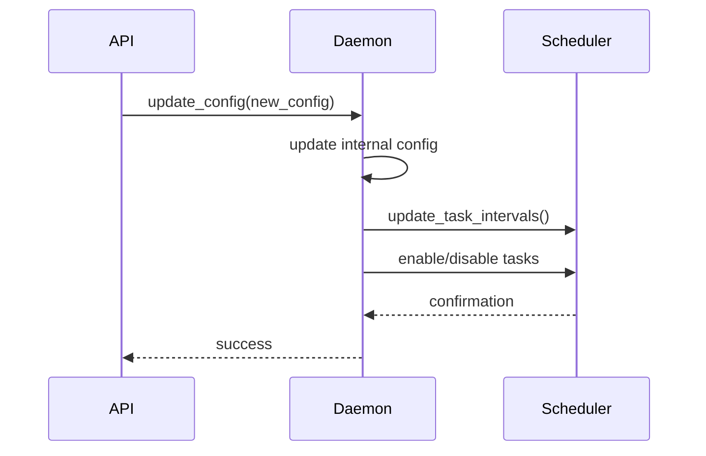
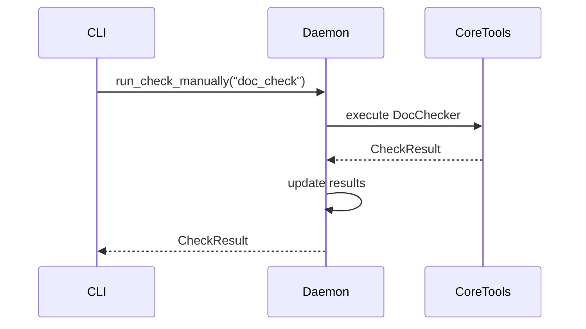

# Orchestration Module - Documentación

## 🎯 Propósito del Módulo

El módulo `autocode/orchestration` proporciona el sistema de automatización y programación para el sistema autocode. Su responsabilidad principal es orquestar la ejecución automática de verificaciones, gestionar tareas programadas, y proporcionar monitoreo continuo del sistema. Actúa como el cerebro que coordina todas las operaciones automatizadas del sistema, integrando los componentes core a través de un daemon robusto y un scheduler configurable.

## 🏗️ Arquitectura del Módulo



## 📁 Componentes del Módulo

### `daemon.py` - AutocodeDaemon Principal
**Propósito**: Orquestador central que ejecuta verificaciones periódicas automatizadas y coordina todas las operaciones de monitoreo
**Documentación**: [daemon.md](daemon.md)

**Funcionalidades principales**:
- **Coordinación de verificaciones** usando DocChecker, GitAnalyzer y TestChecker
- **Gestión del scheduler** para ejecución periódica automatizada
- **Mantenimiento del estado** del sistema y resultados de verificaciones
- **Interfaz unificada** para todas las operaciones del sistema
- **Verificación de documentación** con DocChecker + DocIndexer automático
- **Análisis de cambios git** con GitAnalyzer + conteo de tokens
- **Verificación de tests** con TestChecker + ejecución opcional
- **Triggers manuales** para ejecución bajo demanda

### `scheduler.py` - Programador de Tareas
**Propósito**: Sistema simple pero robusto de programación de tareas para la ejecución periódica de verificaciones
**Documentación**: [scheduler.md](scheduler.md)

**Funcionalidades principales**:
- **Programación de tareas** con intervalos configurables
- **Ejecución asíncrona** de verificaciones programadas
- **Gestión del estado** de tareas (habilitadas/deshabilitadas)
- **Control dinámico** de intervalos de ejecución
- **Monitoreo de ejecución** de tareas

## 🔗 Dependencias del Módulo

### Internas (otros módulos del proyecto)
- **autocode.core.doc_checker**: DocChecker para verificación de documentación
- **autocode.core.git_analyzer**: GitAnalyzer para análisis de cambios
- **autocode.core.doc_indexer**: DocIndexer para generación de índices
- **autocode.core.test_checker**: TestChecker para verificación de tests
- **autocode.core.token_counter**: TokenCounter para análisis de tokens (opcional)
- **autocode.api.models**: Modelos Pydantic para estructuras de datos

### Externas
- **asyncio**: Programación asíncrona y manejo de tasks
- **logging**: Sistema de logging para eventos y errores
- **pathlib**: Manipulación de rutas de archivos
- **typing**: Type hints para mejor documentación del código
- **datetime**: Manejo de fechas y tiempos
- **time**: Medición de duración y timestamps

## 💡 Flujo de Trabajo Típico

### Inicialización del Sistema


### Gestión de Configuración


### Ejecución Manual de Verificaciones


## 🔧 Configuración del Módulo

### Configuración por Defecto
```python
config = AutocodeConfig(
    daemon=DaemonConfig(
        doc_check=CheckConfig(enabled=True, interval_minutes=10),
        git_check=CheckConfig(enabled=True, interval_minutes=5),
        test_check=CheckConfig(enabled=True, interval_minutes=5),
        token_alerts=TokenConfig(enabled=True, threshold=50000, model="gpt-4")
    ),
    api=ApiConfig(port=8080, host="127.0.0.1"),
    doc_index=DocIndexConfig(enabled=True, auto_generate=True),
    tests=TestConfig(enabled=True, auto_execute=True)
)
```

### Variables de Entorno
```env
# Configuración del daemon
AUTOCODE_DOC_CHECK_INTERVAL=10
AUTOCODE_GIT_CHECK_INTERVAL=5
AUTOCODE_TEST_CHECK_INTERVAL=5
AUTOCODE_TOKEN_THRESHOLD=50000
AUTOCODE_TOKEN_MODEL=gpt-4

# Configuración de indexación
AUTOCODE_DOC_INDEX_ENABLED=true
AUTOCODE_DOC_INDEX_AUTO_GENERATE=true
AUTOCODE_DOC_INDEX_PATH=.clinerules/docs_index.json

# Configuración de tests
AUTOCODE_TESTS_ENABLED=true
AUTOCODE_TESTS_AUTO_EXECUTE=true
```

### Configuración Dinámica
```python
# Actualizar configuración sin reiniciar
daemon.update_config(AutocodeConfig(
    daemon=DaemonConfig(
        doc_check=CheckConfig(enabled=True, interval_minutes=15),
        git_check=CheckConfig(enabled=False),  # Deshabilitar git checks
        test_check=CheckConfig(enabled=True, interval_minutes=3),
        token_alerts=TokenConfig(threshold=100000)  # Aumentar threshold
    )
))
```

## 🔍 Verificaciones Implementadas

### Verificación de Documentación (doc_check)
- **Ejecutar DocChecker** para detectar documentación desactualizada
- **Generar índice automático** si está habilitado (`doc_index.auto_generate`)
- **Formatear resultados** con estadísticas y detalles
- **Status**: success (✅ All documentation is up to date!) | warning (⚠️ X documents need attention) | error (❌ Error)

### Análisis de Cambios Git (git_check)
- **Generar git_changes.json** usando GitAnalyzer
- **Contar tokens** en el archivo generado (si está habilitado)
- **Verificar umbrales** de tokens y generar alertas
- **Status**: success (✅ No changes detected) | warning (📊 X files changed o ⚠️ TOKEN ALERT) | error (❌ Error)

### Verificación de Tests (test_check)
- **Ejecutar TestChecker** para obtener estado de tests
- **Categorizar tests** por estado (missing, passing, failing, orphaned)
- **Ejecutar tests automáticamente** si está habilitado (`auto_execute`)
- **Status**: success (✅ All tests found and passing) | warning (⚠️ X tests missing) | error (❌ X tests failing)

## ⚠️ Consideraciones Especiales

### Gestión de Estado Global
- **Singleton daemon**: Una instancia global del daemon
- **Task management**: Gestión cuidadosa de asyncio tasks
- **Memory leaks**: Prevención de memory leaks en long-running daemon
- **Graceful shutdown**: Shutdown limpio del daemon y tasks

### Concurrencia y Thread Safety
- **Async operations**: Todas las operaciones son asíncronas
- **Background tasks**: Ejecución de verificaciones en background
- **Shared state**: Acceso concurrente al estado del daemon
- **Lock-free design**: Diseño sin locks para mejor performance

### Error Handling y Recovery
- **Errores no fatales**: Las verificaciones que fallan no detienen el daemon
- **Logging detallado**: Todos los errores se registran con contexto completo
- **Recovery automático**: El scheduler continúa ejecutando otras tareas
- **Estado de error**: Los CheckResult reflejan errores para debugging

### Performance y Recursos
- **Ejecución asíncrona**: Todas las operaciones son no-bloqueantes
- **Memory usage**: Resultados se mantienen en memoria para acceso rápido
- **CPU usage**: Las verificaciones son IO-bound, no CPU-intensive
- **Disk usage**: Se generan archivos temporales (git_changes.json, índices)

## 🧪 Testing y Validación

### Unit Tests
```python
def test_daemon_initialization():
    daemon = AutocodeDaemon()
    assert daemon.project_root == Path.cwd()
    assert isinstance(daemon.config, AutocodeConfig)
    assert daemon.total_checks_run == 0

def test_scheduler_task_management():
    scheduler = Scheduler()
    scheduler.add_task("test", lambda: None, 60)
    assert "test" in scheduler.tasks
```

### Integration Tests
```python
async def test_daemon_lifecycle():
    daemon = AutocodeDaemon()
    
    # Test start
    await daemon.start()
    assert daemon.is_running()
    assert daemon.start_time is not None
    
    # Test stop
    daemon.stop()
    assert not daemon.is_running()
    assert daemon.start_time is None
```

### Performance Tests
```python
def test_concurrent_check_execution():
    daemon = AutocodeDaemon()
    
    # Execute multiple checks simultaneously
    results = []
    for check_name in ["doc_check", "git_check", "test_check"]:
        result = daemon.run_check_manually(check_name)
        results.append(result)
    
    assert all(isinstance(r, CheckResult) for r in results)
```

## 🔄 Flujo de Datos

### Entrada de Datos
1. **Configuration**: Archivos de configuración AutocodeConfig
2. **Manual Triggers**: Comandos CLI y requests API
3. **Scheduled Events**: Eventos del scheduler basados en intervalos
4. **System State**: Estado actual del sistema y resultados previos

### Procesamiento Interno
1. **Task Scheduling**: Programación y ejecución de tareas
2. **Check Execution**: Ejecución de verificaciones usando core tools
3. **Result Processing**: Procesamiento y almacenamiento de resultados
4. **State Management**: Mantenimiento del estado del sistema

### Salida de Datos
1. **Check Results**: Resultados estructurados de verificaciones (CheckResult)
2. **System Status**: Estado actual del daemon y métricas (DaemonStatus)
3. **Log Events**: Eventos de logging para monitoreo
4. **API Responses**: Respuestas para requests API (StatusResponse)

## 📖 Navegación Detallada

### Documentación de Componentes
- [Daemon Documentation](daemon.md) - AutocodeDaemon central orchestrator
- [Scheduler Documentation](scheduler.md) - Task scheduling system

### Casos de Uso Típicos
- **Development Monitoring**: Monitoreo continuo durante desarrollo
- **CI/CD Integration**: Integración en pipelines de CI/CD
- **Automated Reporting**: Generación automatizada de reportes
- **Quality Assurance**: Verificación continua de calidad del código

### Patrones de Integración
- **FastAPI Integration**: Integración con servidores web
- **CLI Integration**: Uso desde línea de comandos
- **Containerized Deployment**: Despliegue en contenedores
- **Service Integration**: Integración como servicio del sistema

## 🚀 Extensibilidad

### Añadir Nuevas Verificaciones
```python
def run_custom_check(self) -> CheckResult:
    """Add custom verification logic."""
    start_time = time.time()
    
    try:
        # Custom verification logic
        result_data = self.custom_checker.perform_check()
        
        result = CheckResult(
            check_name="custom_check",
            status="success" if result_data.is_success else "warning",
            message="✅ Custom check passed" if result_data.is_success else f"⚠️ Custom check found {len(result_data.issues)} issues",
            details={"issues": result_data.issues},
            timestamp=datetime.now(),
            duration_seconds=time.time() - start_time
        )
        
        return result
    except Exception as e:
        # Error handling...
        pass

# Register in daemon setup
def _setup_tasks(self):
    # ... existing tasks ...
    if self.config.daemon.custom_check.enabled:
        self.scheduler.add_task(
            name="custom_check",
            func=self.run_custom_check,
            interval_seconds=self.config.daemon.custom_check.interval_minutes * 60
        )
```

### Custom Event Handlers
```python
def on_check_completed(self, check_name: str, result: CheckResult):
    """Handle check completion events."""
    if result.status == "error":
        self.send_notification(f"Check {check_name} failed: {result.message}")
    
    self.update_metrics(check_name, result)
```

### Plugin System
```python
class CheckPlugin:
    """Base class for check plugins."""
    
    def __init__(self, daemon: AutocodeDaemon):
        self.daemon = daemon
    
    def execute(self) -> CheckResult:
        """Execute the plugin check."""
        raise NotImplementedError
    
    def get_config(self) -> CheckConfig:
        """Get plugin configuration."""
        raise NotImplementedError
```

## 📈 Métricas y Monitoreo

### Métricas del Daemon
- **Uptime**: Tiempo total de funcionamiento
- **Total checks**: Número total de verificaciones ejecutadas
- **Success rate**: Porcentaje de verificaciones exitosas
- **Average duration**: Duración promedio de verificaciones

### Métricas por Verificación
- **Execution count**: Número de ejecuciones por tipo de verificación
- **Success/Warning/Error rate**: Distribución de estados por verificación
- **Average duration**: Tiempo promedio por tipo de verificación
- **Last execution**: Timestamp de la última ejecución

### Health Monitoring
```python
def get_health_metrics(self) -> Dict[str, Any]:
    """Get comprehensive health metrics."""
    return {
        "daemon": {
            "is_running": self.is_running(),
            "uptime_seconds": time.time() - self.start_time if self.start_time else 0,
            "total_checks_run": self.total_checks_run
        },
        "checks": {
            check_name: {
                "last_status": result.status,
                "last_execution": result.timestamp.isoformat(),
                "duration_seconds": result.duration_seconds
            } for check_name, result in self.results.items()
        },
        "scheduler": {
            "is_running": self.scheduler.is_running(),
            "active_tasks": len(self.scheduler.get_active_tasks()),
            "task_statuses": self.scheduler.get_all_tasks_status()
        }
    }
```

## 🔧 Configuración Avanzada

### Multi-Environment Support
```python
# Development configuration
dev_config = AutocodeConfig(
    daemon=DaemonConfig(
        doc_check=CheckConfig(interval_minutes=5),  # More frequent
        git_check=CheckConfig(interval_minutes=2)   # Very frequent
    )
)

# Production configuration
prod_config = AutocodeConfig(
    daemon=DaemonConfig(
        doc_check=CheckConfig(interval_minutes=30),  # Less frequent
        git_check=CheckConfig(interval_minutes=15)   # Moderate frequency
    )
)
```

### Resource Limits
```python
# Configure resource limits
config = AutocodeConfig(
    daemon=DaemonConfig(
        max_concurrent_checks=2,
        check_timeout_seconds=300,
        max_memory_usage_mb=512
    )
)
```

### Notification Integration
```python
# Configure notifications
config = AutocodeConfig(
    notifications=NotificationConfig(
        enabled=True,
        error_threshold=3,  # Send notification after 3 consecutive errors
        channels=["email", "slack"],
        email_recipients=["team@example.com"],
        slack_webhook="https://hooks.slack.com/..."
    )
)
