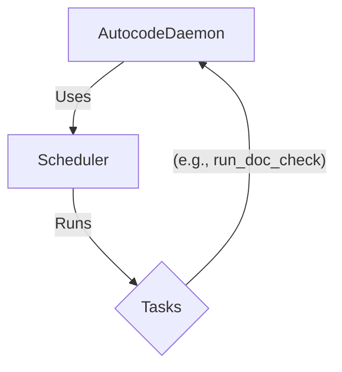

# Módulo: Orchestration

## 🎯 Propósito del Módulo
Este módulo proporciona el sistema de automatización y programación para `autocode`. Su responsabilidad principal es orquestar la ejecución automática de las verificaciones, gestionar tareas programadas y proporcionar la base para el monitoreo continuo del sistema. Actúa como el cerebro que coordina todas las operaciones automatizadas.

## 🏗️ Arquitectura del Módulo
El módulo se compone de dos clases principales que trabajan juntas:

1.  **`Scheduler`**: Un planificador de tareas genérico que puede ejecutar funciones de forma periódica en un bucle asíncrono.
2.  **`AutocodeDaemon`**: Utiliza el `Scheduler` para registrar y ejecutar las tareas de verificación específicas del proyecto (`run_doc_check`, `run_git_check`, etc.). Mantiene el estado de los resultados de estas verificaciones.

## 📁 Componentes del Módulo
### `daemon.py` - Daemon de Monitoreo
**Propósito**: Orquesta la ejecución periódica de las verificaciones del sistema (`DocChecker`, `GitAnalyzer`, etc.) y mantiene el estado de sus resultados.
**Documentación**: [daemon.md](daemon.md)

### `scheduler.py` - Planificador de Tareas
**Propósito**: Proporciona un sistema genérico para programar y ejecutar funciones (síncronas o asíncronas) a intervalos regulares.
**Documentación**: [scheduler.md](scheduler.md)

## 🔗 Dependencias del Módulo
### Internas
- `autocode.core`: El `AutocodeDaemon` depende de los componentes del core para ejecutar las verificaciones.
- `autocode.api.models`: Para las estructuras de datos de estado y resultados.

### Externas
- `asyncio`: Para la ejecución asíncrona del planificador.

## 💡 Flujo de Trabajo Típico
El `api/server.py` crea una instancia de `AutocodeDaemon` al arrancar. El daemon, a su vez, crea una instancia del `Scheduler` y le añade las tareas de verificación configuradas. El `Scheduler` se encarga de llamar a los métodos de verificación del daemon a los intervalos definidos, y el daemon actualiza su estado interno, que luego es expuesto por la API.
