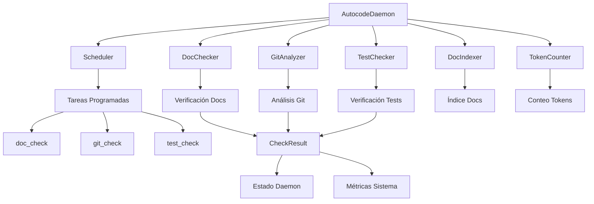

# daemon.py

## 🎯 Propósito
Daemon de monitoreo continuo que ejecuta verificaciones periódicas automatizadas usando DocChecker, GitAnalyzer y TestChecker. Coordina la ejecución programada de verificaciones, mantiene estado y resultados, y proporciona interfaz para el dashboard web.

## 🏗️ Arquitectura


## 📋 Responsabilidades
- **Orquestación central**: Coordinar ejecución de DocChecker, GitAnalyzer y TestChecker
- **Ejecución periódica**: Usar Scheduler para ejecutar verificaciones automáticamente
- **Gestión de estado**: Mantener resultados de verificaciones y métricas del sistema
- **Configuración dinámica**: Actualizar intervalos y habilitar/deshabilitar checks
- **Interfaz para API**: Proporcionar datos estructurados para dashboard web
- **Manejo de errores**: Recuperación automática de errores no fatales

## 🔗 Dependencias
### Internas
- `autocode.core.doc_checker.DocChecker` - Verificación de documentación
- `autocode.core.git_analyzer.GitAnalyzer` - Análisis de cambios git
- `autocode.core.test_checker.TestChecker` - Verificación de tests
- `autocode.core.doc_indexer.DocIndexer` - Generación de índices de documentación
- `autocode.core.token_counter.TokenCounter` - Conteo de tokens (opcional)
- `autocode.orchestration.scheduler.Scheduler` - Programación de tareas
- `autocode.api.models.CheckResult` - Modelo de resultados
- `autocode.api.models.DaemonStatus` - Modelo de estado del daemon
- `autocode.api.models.AutocodeConfig` - Configuración del sistema
- `autocode.cli.load_config` - Carga de configuración

### Externas
- `asyncio` - Programación asíncrona
- `logging` - Sistema de logging
- `time` - Medición de tiempo y duración
- `datetime` - Manejo de fechas y timestamps
- `pathlib.Path` - Manipulación de rutas
- `typing.Dict` - Type hints

## 📊 Interfaces Públicas
### Clase Principal
```python
class AutocodeDaemon:
    def __init__(self, project_root: Path = None, config: AutocodeConfig = None)
    async def start(self) -> None
    def stop(self) -> None
    def is_running(self) -> bool
    def run_check_manually(self, check_name: str) -> CheckResult
    def get_daemon_status(self) -> DaemonStatus
    def get_all_results(self) -> Dict[str, CheckResult]
    def update_config(self, config: AutocodeConfig) -> None
```

### Métodos de Verificación
```python
def run_doc_check(self) -> CheckResult
def run_git_check(self) -> CheckResult
def run_test_check(self) -> CheckResult
```

## 🔧 Configuración
### Inicialización
```python
def __init__(self, project_root: Path = None, config: AutocodeConfig = None):
    self.project_root = project_root or Path.cwd()
    self.config = config or load_config(self.project_root)
    
    # Componentes
    self.doc_checker = DocChecker(self.project_root, self.config.docs)
    self.git_analyzer = GitAnalyzer(self.project_root)
    self.test_checker = TestChecker(self.project_root, self.config.tests)
    self.scheduler = Scheduler()
    
    # Estado
    self.start_time = None
    self.total_checks_run = 0
    self.results: Dict[str, CheckResult] = {}
```

### Configuración de Tareas
```yaml
daemon:
  doc_check:
    enabled: true
    interval_minutes: 1
  git_check:
    enabled: true
    interval_minutes: 1
  test_check:
    enabled: true
    interval_minutes: 5
  token_alerts:
    enabled: true
    threshold: 50000
    model: "gpt-4"
```

## 💡 Patrones de Uso
### Inicialización Básica
```python
# Uso básico
daemon = AutocodeDaemon()
await daemon.start()

# Con configuración específica
config = load_config(Path("/path/to/project"))
daemon = AutocodeDaemon(project_root=Path("/path/to/project"), config=config)
await daemon.start()
```

### Ejecución Manual
```python
# Ejecutar verificación específica
doc_result = daemon.run_check_manually("doc_check")
git_result = daemon.run_check_manually("git_check")
test_result = daemon.run_check_manually("test_check")

# Verificar estado
status = daemon.get_daemon_status()
print(f"Uptime: {status.uptime_seconds}s")
print(f"Total checks: {status.total_checks_run}")
```

### Gestión de Estado
```python
# Obtener todos los resultados
all_results = daemon.get_all_results()
for check_name, result in all_results.items():
    print(f"{check_name}: {result.status} - {result.message}")

# Actualizar configuración
new_config = AutocodeConfig()
new_config.daemon.doc_check.interval_minutes = 10
daemon.update_config(new_config)
```

## ⚠️ Consideraciones
### Funcionamiento
- **Ejecución síncrona**: Las verificaciones se ejecutan secuencialmente
- **Memoria**: Resultados se mantienen en memoria durante la ejecución
- **Configuración**: Cambios de configuración se aplican inmediatamente
- **Errores**: Errores en una verificación no afectan otras

### Limitaciones
- **Persistencia**: Estado se pierde al reiniciar el daemon
- **Concurrencia**: Diseñado para un solo proceso
- **Dependencias**: Token counting requiere tiktoken instalado
- **Rendimiento**: Verificaciones frecuentes pueden impactar performance

## 🧪 Testing
### Pruebas Básicas
```python
# Test inicialización
daemon = AutocodeDaemon()
assert daemon.project_root == Path.cwd()
assert daemon.total_checks_run == 0

# Test ejecución manual
result = daemon.run_check_manually("doc_check")
assert result.check_name == "doc_check"
assert result.status in ["success", "warning", "error"]
assert daemon.total_checks_run == 1
```

### Pruebas de Estado
```python
# Test estado del daemon
status = daemon.get_daemon_status()
assert isinstance(status.total_checks_run, int)
assert status.uptime_seconds is None  # No iniciado aún

# Test después de inicio
await daemon.start()
assert daemon.is_running()
assert daemon.start_time is not None
```

## 🔄 Flujo de Datos
### Flujo de Verificaciones
1. **Trigger**: Scheduler o ejecución manual
2. **Ejecución**: Uso de DocChecker/GitAnalyzer/TestChecker
3. **Procesamiento**: Formateo de resultados en CheckResult
4. **Almacenamiento**: Guardar en self.results[check_name]
5. **Métricas**: Actualizar total_checks_run y logs

### Flujo de Documentación
1. **DocChecker**: Verificar documentación desactualizada
2. **DocIndexer**: Generar índice si está habilitado y docs actualizadas
3. **Resultado**: Status success/warning/error con detalles
4. **Información**: Conteo de archivos desactualizados y lista detallada

### Flujo de Git
1. **GitAnalyzer**: Generar git_changes.json
2. **TokenCounter**: Contar tokens si está habilitado
3. **Alertas**: Verificar umbrales de tokens
4. **Resultado**: Estadísticas de cambios y alertas de tokens

### Flujo de Tests
1. **TestChecker**: Obtener estado de tests
2. **Categorización**: Clasificar por missing/passing/failing/orphaned
3. **Ejecución**: Ejecutar tests si auto_execute está habilitado
4. **Resultado**: Estadísticas detalladas y resultados de ejecución

## 📈 Métricas del Sistema
### Estado del Daemon
```python
DaemonStatus(
    is_running=True,
    uptime_seconds=1234.5,
    last_check_run=datetime.now(),
    total_checks_run=42
)
```

### Resultados de Verificaciones
```python
CheckResult(
    check_name="doc_check",
    status="success",
    message="✅ All documentation is up to date!",
    details={
        "outdated_count": 0,
        "files": [],
        "doc_index_generated": ".clinerules/docs_index.json"
    },
    timestamp=datetime.now(),
    duration_seconds=1.23
)
```

### Logging
```python
# Logs importantes
logger.info("Starting autocode daemon")
logger.info(f"Doc check completed: {result.status} - {result.message}")
logger.error(f"Git check failed: {e}")
logger.warning(f"Token alert: {token_count} tokens exceeds threshold")
```

## 🚀 Extensibilidad
### Nuevas Verificaciones
```python
def run_custom_check(self) -> CheckResult:
    start_time = time.time()
    try:
        # Lógica personalizada
        custom_result = self.custom_checker.perform_check()
        
        result = CheckResult(
            check_name="custom_check",
            status="success" if custom_result.ok else "warning",
            message=custom_result.message,
            details=custom_result.details,
            timestamp=datetime.now(),
            duration_seconds=time.time() - start_time
        )
        
        self.results["custom_check"] = result
        self.total_checks_run += 1
        return result
        
    except Exception as e:
        # Manejo de errores
        error_result = CheckResult(
            check_name="custom_check",
            status="error",
            message=f"❌ Error: {str(e)}",
            details={"error": str(e)},
            timestamp=datetime.now(),
            duration_seconds=time.time() - start_time
        )
        self.results["custom_check"] = error_result
        self.total_checks_run += 1
        return error_result

# Registrar en _setup_tasks()
def _setup_tasks(self):
    # Tareas existentes...
    
    if self.config.daemon.custom_check.enabled:
        self.scheduler.add_task(
            name="custom_check",
            func=self.run_custom_check,
            interval_seconds=self.config.daemon.custom_check.interval_minutes * 60,
            enabled=True
        )
```

### Personalización de Resultados
```python
# Enriquecer resultados con información adicional
def enhance_doc_result(self, result: CheckResult) -> CheckResult:
    if result.status == "success":
        # Añadir métricas adicionales
        result.details["performance_metrics"] = {
            "files_processed": len(result.details.get("files", [])),
            "processing_speed": result.details.get("files_processed", 0) / result.duration_seconds
        }
    return result
