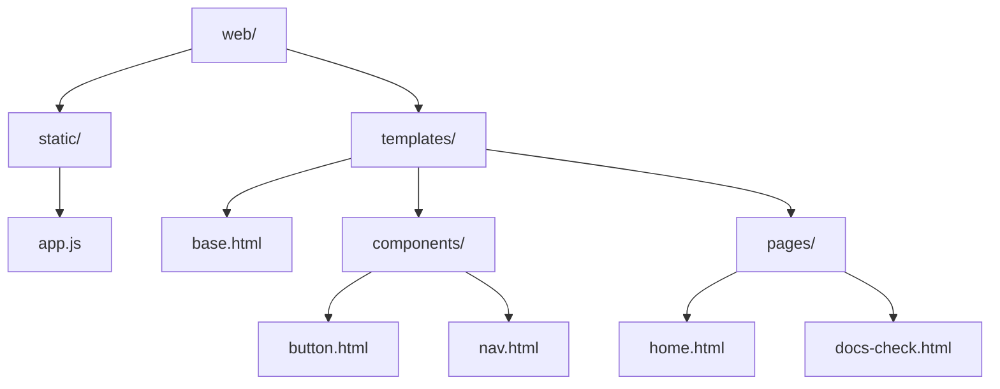

# Web Module - Documentación

## 🎯 Propósito del Módulo
Este módulo contiene todos los componentes necesarios para construir y servir el frontend del dashboard de monitoreo de autocode. Su responsabilidad es proporcionar una interfaz de usuario web moderna e interactiva para la visualización en tiempo real del estado del sistema.

## 🏗️ Arquitectura del Módulo

## 📁 Componentes del Módulo
### `static/` - Assets Estáticos
**Propósito**: Contiene archivos JavaScript, CSS y otros recursos estáticos servidos directamente al navegador
**Documentación**: [static/_module.md](static/_module.md)

### `templates/` - Plantillas de Jinja2
**Propósito**: Contiene todas las plantillas HTML que construyen la interfaz de usuario
**Documentación**: [templates/_module.md](templates/_module.md)

## 🔗 Dependencias del Módulo
### Internas (otros módulos del proyecto)
- `autocode.api` - Para servir las plantillas y manejar rutas
- `autocode.core` - Para obtener datos de verificaciones y análisis

### Externas
- **Jinja2** - Motor de plantillas para generar HTML dinámico
- **Tailwind CSS** - Framework CSS para estilos (CDN)
- **Fetch API** - Para comunicación asíncrona con el backend

## 💡 Flujo de Trabajo Típico
1. **Carga de página**: El servidor (api/server.py) renderiza las plantillas con datos iniciales
2. **Interacción del usuario**: JavaScript (app.js) maneja eventos y estados de la UI
3. **Comunicación con API**: Peticiones fetch a endpoints del backend
4. **Actualización de UI**: Manipulación del DOM basada en respuestas de la API

## 🔧 Configuración del Módulo
- **Templates Engine**: Jinja2 con herencia de templates
- **CSS Framework**: Tailwind CSS vía CDN
- **JavaScript**: Vanilla JS (sin frameworks)
- **Estructura**: Patrón de componentes reutilizables

## ⚠️ Consideraciones Especiales
- **Responsivo**: Todas las interfaces están optimizadas para desktop y móvil
- **Accesibilidad**: Uso de clases semánticas y estructura HTML apropiada
- **Performance**: Assets mínimos, CSS via CDN para carga rápida
- **Mantenibilidad**: Separación clara entre componentes, páginas y lógica

## 📖 Navegación Detallada
- [Static Assets](static/_module.md)
  - [app.js - JavaScript principal](static/app.md)
- [Templates](templates/_module.md)
  - [base.html - Template base](templates/base.md)
  - [Componentes](templates/components/_module.md)
    - [button.html](templates/components/button.md)
    - [nav.html](templates/components/nav.md)
  - [Páginas](templates/pages/_module.md)
    - [home.html](templates/pages/home.md)
    - [docs-check.html](templates/pages/docs-check.md)
