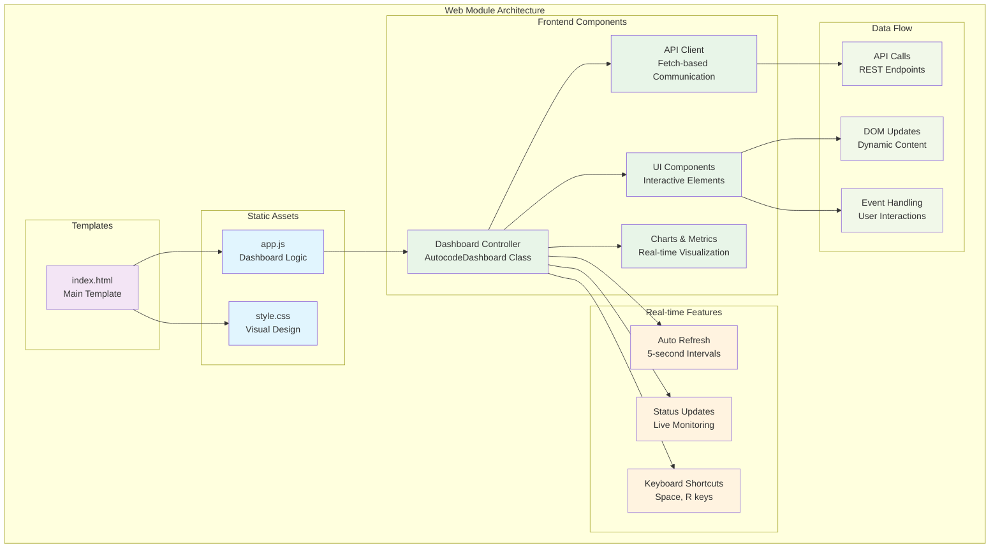
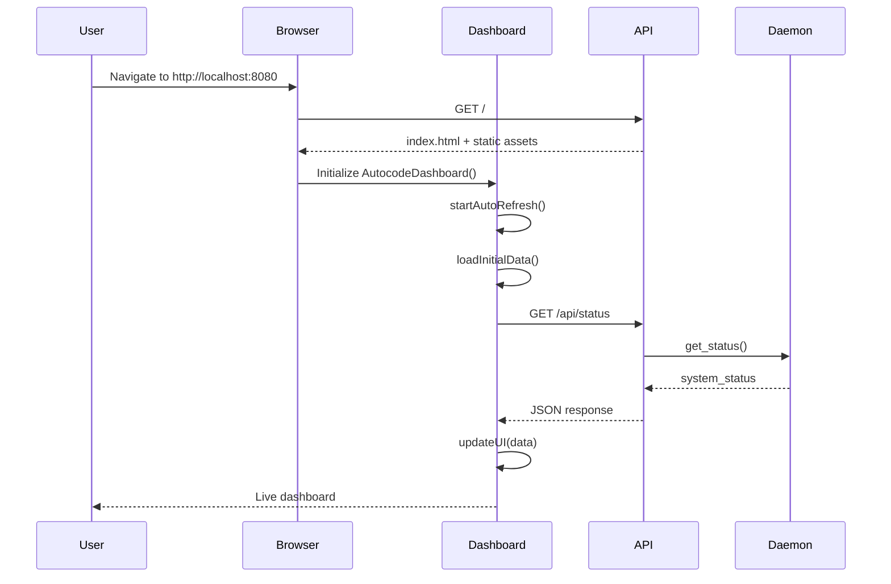
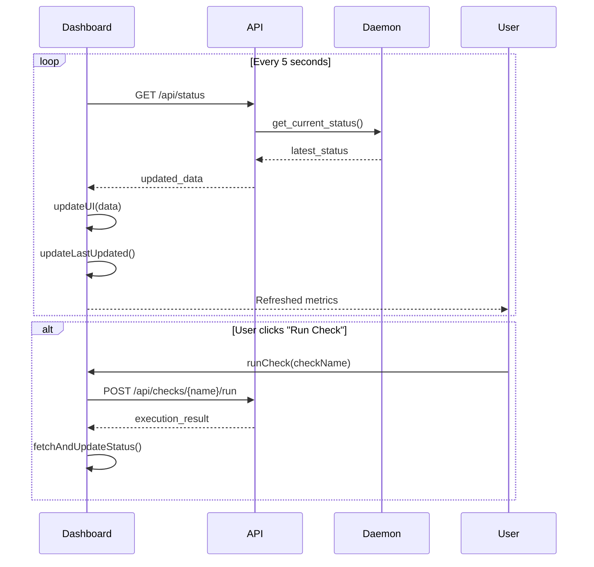
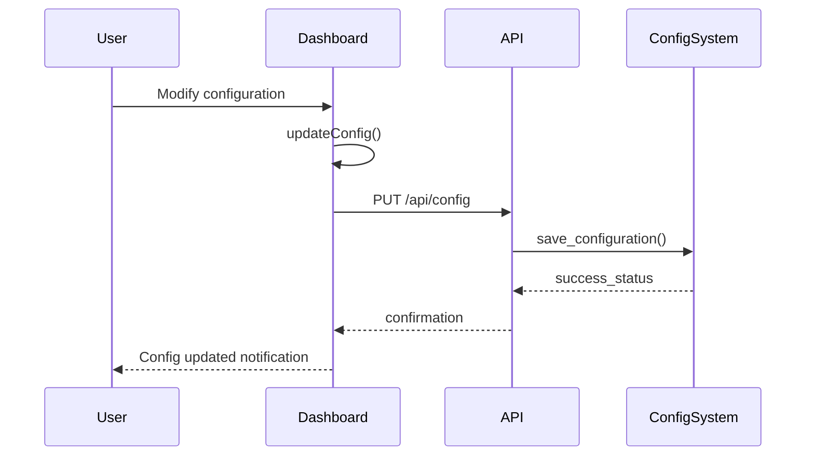

# Autocode Web Module - Documentación

## 🎯 Propósito del Módulo

El módulo `autocode/web` proporciona una interfaz web moderna y dashboard interactivo para el monitoreo visual en tiempo real del sistema autocode. Su responsabilidad principal es ofrecer una experiencia de usuario amigable y responsiva para supervisar el estado de verificaciones, métricas del sistema y configuración de automatización, complementando la API REST con componentes frontend completos.

## 🏗️ Arquitectura del Módulo



## 📁 Componentes del Módulo

### `/static` - Assets Estáticos
**Propósito**: Contiene recursos estáticos del frontend (JavaScript, CSS)
**Documentación**: [static/_module.md](static/_module.md)

#### `static/app.js` - Dashboard JavaScript Interactivo
**Propósito**: Lógica principal del dashboard con actualizaciones en tiempo real y gestión completa del estado
**Documentación**: [static/app.md](static/app.md)

**Características implementadas**:
- **Clase AutocodeDashboard**: Gestión completa del estado con propiedades:
  - `refreshInterval: 5000` (5 segundos)
  - `refreshTimer: TimerID` para control de intervalos
  - `isLoading: boolean` para prevenir requests concurrentes
- **Auto-refresh inteligente**: Pausa automática cuando la página no está visible
- **API Client robusto**: Manejo completo de errores HTTP y timeouts
- **Actualización dinámica**: Métricas, estados, y estadísticas en tiempo real
- **Keyboard shortcuts**: Space (refresh manual), R (toggle auto-refresh)
- **Gestión de visibilidad**: `document.visibilitychange` para optimización de recursos

**Funcionalidades específicas**:
- **`runCheck(checkName)`**: Ejecución manual de checks con UI feedback
- **`updateConfig()`**: Actualización dinámica de configuración via API
- **Token alerts**: Visualización de alertas con thresholds configurables
- **Documentation index**: Estadísticas dinámicas de documentación generada
- **Test breakdown**: Desglose detallado por tipos (unit/integration) y estados
- **Connection status**: Indicadores visuales de estado de conexión API

#### `static/style.css` - Estilos CSS del Dashboard
**Propósito**: Diseño visual y responsivo para la interfaz web
**Documentación**: [static/style.css.md](static/style.css.md)

**Características principales**:
- Diseño responsivo para diferentes resoluciones
- Sistema de colores para estados (success, warning, error)
- Animaciones suaves para transiciones
- Layout de cards para organización visual
- Estilos para gráficos y métricas

### `/templates` - Plantillas HTML
**Propósito**: Templates HTML para la interfaz web
**Documentación**: [templates/_module.md](templates/_module.md)

#### `templates/index.html` - Template Principal del Dashboard
**Propósito**: Estructura HTML principal del dashboard de monitoreo
**Documentación**: [templates/index.html.md](templates/index.html.md)

**Características principales**:
- Estructura semántica con secciones bien definidas
- Integración con Jinja2 para templating dinámico
- Meta tags optimizados para performance
- Viewport responsivo para dispositivos móviles
- Estructura de cards para métricas y estados

## 🔗 Dependencias del Módulo

### Internas (otros módulos del proyecto)
- **autocode.api.server**: Servidor FastAPI que sirve los templates y endpoints
- **autocode.api.models**: Modelos de datos consumidos por la interfaz
- **autocode.orchestration.daemon**: Fuente de datos para el monitoreo

### Externas
- **Navegadores Web**: Chrome, Firefox, Safari, Edge (ES6+ required)
- **HTTP Fetch API**: Para comunicación con backend
- **DOM APIs**: Para manipulación dinámica de la interfaz
- **JavaScript ES6+**: Features modernas como classes, async/await

### Assets CDN (opcional)
- **Font Awesome**: Para iconos (si se implementa)
- **Chart.js**: Para gráficos avanzados (futura implementación)

## 💡 Flujo de Trabajo Típico

### Inicialización del Dashboard


### Monitoreo en Tiempo Real


### Gestión de Configuración


## 🔧 Configuración del Módulo

### Estructura de Archivos
```
autocode/web/
├── static/           # Assets estáticos
│   ├── app.js       # Dashboard JavaScript
│   └── style.css    # Estilos CSS
└── templates/        # Templates HTML
    └── index.html   # Página principal
```

### Configuración del Servidor
```python
# En autocode/api/server.py
app.mount("/static", StaticFiles(directory="autocode/web/static"), name="static")
templates = Jinja2Templates(directory="autocode/web/templates")

@app.get("/", response_class=HTMLResponse)
async def dashboard(request: Request):
    return templates.TemplateResponse("index.html", {"request": request})
```

### Variables de Configuración
```yaml
# En autocode_config.yml
web:
  enabled: true
  static_files_dir: "autocode/web/static"
  templates_dir: "autocode/web/templates"
  auto_refresh_interval: 5000  # milliseconds
  api_base_url: "/api"
  
dashboard:
  title: "Autocode Monitoring Dashboard"
  show_uptime: true
  show_metrics: true
  enable_keyboard_shortcuts: true
  enable_auto_pause: true  # pause when tab not visible
```

## ⚠️ Consideraciones Especiales

### Compatibilidad de Navegadores
- **Mínimo Requerido**: ES6+ support (Chrome 51+, Firefox 54+, Safari 10+)
- **Fetch API**: Requerido para comunicación con backend
- **JavaScript Modules**: Usado para estructura de código modular
- **CSS Grid/Flexbox**: Para layout responsivo

### Performance y Optimización
- **Auto-pause**: Pausa automática cuando la página no está visible
- **Debouncing**: Previene múltiples requests simultáneos
- **Error Handling**: Gestión robusta de errores de red
- **Memory Management**: Limpieza de timers y event listeners

### Seguridad
- **CORS**: Configurado para desarrollo local
- **XSS Protection**: Sanitización de datos del servidor
- **CSP**: Content Security Policy recomendada
- **API Authentication**: Preparado para futuras implementaciones

### Accesibilidad
- **Semantic HTML**: Estructura semántica correcta
- **ARIA Labels**: Para screen readers (implementación futura)
- **Keyboard Navigation**: Soporte completo de teclado
- **Color Contrast**: Colores accesibles para usuarios con daltonismo

## 🧪 Testing y Validación

### Testing Manual
```bash
# Iniciar servidor
uv run -m autocode.cli daemon

# Abrir navegador
open http://localhost:8080

# Verificar funcionalidades:
# 1. Dashboard carga correctamente
# 2. Métricas se actualizan automáticamente
# 3. Botones "Run Now" funcionan
# 4. Configuración se puede modificar
# 5. Keyboard shortcuts responden
```

### Validación de Funcionalidad
```javascript
// En console del navegador
// Verificar que dashboard existe
console.log(typeof dashboard !== 'undefined');

// Verificar auto-refresh
console.log(dashboard.refreshTimer !== null);

// Verificar conexión API
fetch('/api/status')
  .then(response => response.json())
  .then(data => console.log('API Working:', data));
```

### Debugging
```javascript
// Habilitar logs detallados
dashboard.debug = true;

// Verificar estado interno
console.log('Dashboard state:', {
  isLoading: dashboard.isLoading,
  refreshInterval: dashboard.refreshInterval,
  refreshTimer: dashboard.refreshTimer
});
```

## 🔄 Flujo de Datos y Estados

### Estado del Dashboard
```javascript
// Estado interno de AutocodeDashboard
{
  refreshInterval: 5000,
  refreshTimer: TimerID,
  isLoading: boolean,
  lastUpdated: Date,
  connectionStatus: 'connected' | 'error' | 'loading'
}
```

### Ciclo de Actualización de Datos
1. **Timer Trigger**: Cada 5 segundos
2. **API Call**: GET /api/status
3. **Data Processing**: Procesar respuesta JSON
4. **DOM Update**: Actualizar elementos visuales
5. **Status Update**: Actualizar timestamp y estado
6. **Error Handling**: Manejar fallos de conexión

### Gestión de Estados UI
- **Loading States**: Indicadores de carga durante requests
- **Error States**: Mensajes de error y reconexión automática
- **Success States**: Confirmaciones de acciones exitosas
- **Empty States**: Manejo de datos vacíos o no disponibles

## 📊 Métricas y Monitoreo Disponibles

### Métricas del Sistema
- **Daemon Status**: Running/Stopped con indicadores visuales
- **System Uptime**: Tiempo de funcionamiento continuo
- **Total Checks**: Número total de verificaciones ejecutadas
- **Last Check**: Timestamp de la última verificación

### Métricas por Check Type
- **Documentation Check**: Estado de documentación y archivos desactualizados
- **Git Check**: Análisis de cambios y actividad del repositorio
- **Test Check**: Estado de tests y cobertura
- **Token Analysis**: Uso de tokens y alertas de límites

### Métricas de Performance
- **API Response Time**: Tiempo de respuesta del backend
- **Dashboard Load Time**: Tiempo de carga inicial
- **Auto-refresh Success Rate**: Porcentaje de refreshes exitosos
- **Error Rate**: Frecuencia de errores de conexión

## 🎨 Diseño y UX

### Sistema de Colores
- **Success**: Verde (#28a745) para estados correctos
- **Warning**: Amarillo (#ffc107) para alertas
- **Error**: Rojo (#dc3545) para errores
- **Info**: Azul (#17a2b8) para información
- **Neutral**: Gris (#6c757d) para elementos inactivos

### Layout y Organización
- **Header**: Título y estado general del sistema
- **Metrics Cards**: Métricas principales en formato card
- **Check Results**: Estado detallado de cada verificación
- **Configuration Panel**: Controles para configuración del sistema
- **Footer**: Información de actualización y controles

### Responsividad
- **Desktop**: Layout completo con todas las métricas
- **Tablet**: Cards reorganizadas en 2 columnas
- **Mobile**: Cards apiladas verticalmente
- **Touch Support**: Botones y controles optimizados para touch

## 🚀 Extensibilidad y Personalización

### Agregar Nuevas Métricas
```javascript
// Extender AutocodeDashboard
class EnhancedDashboard extends AutocodeDashboard {
    updateCustomMetrics(data) {
        // Implementar métricas personalizadas
        this.updateNewMetricCard(data.custom_metric);
    }
}
```

### Nuevos Tipos de Check
```javascript
// Añadir soporte para nuevos checks
updateCheckResults(checks) {
    // Existing checks
    super.updateCheckResults(checks);
    
    // New check types
    if (checks.custom_check) {
        this.updateCustomCheckCard('custom-check', checks.custom_check);
    }
}
```

### Personalización Visual
```css
/* Custom theme variables */
:root {
    --primary-color: #your-color;
    --dashboard-bg: #your-background;
    --card-border: #your-border;
}
```

## 📖 Navegación Detallada

### Assets Estáticos
- [Static Assets Module](static/_module.md) - Overview de assets estáticos
- [JavaScript Dashboard](static/app.js.md) - Lógica del dashboard
- [CSS Styles](static/style.css.md) - Diseño visual

### Templates HTML
- [Templates Module](templates/_module.md) - Overview de templates
- [Main Template](templates/index.html.md) - Template principal

## 🔧 Configuración Avanzada

### Custom Event Listeners
```javascript
// Añadir listeners personalizados
document.addEventListener('DOMContentLoaded', function() {
    // Custom initialization
    dashboard.addCustomEventListeners();
    
    // Custom keyboard shortcuts
    document.addEventListener('keydown', function(event) {
        // Custom shortcuts implementation
    });
});
```

### API Extensions
```javascript
// Extender cliente API
class ExtendedApiClient {
    async fetchCustomData() {
        const response = await fetch('/api/custom-endpoint');
        return response.json();
    }
}
```

### Performance Monitoring
```javascript
// Monitor performance
const perfObserver = new PerformanceObserver((list) => {
    for (const entry of list.getEntries()) {
        console.log('Performance:', entry.name, entry.duration);
    }
});
perfObserver.observe({entryTypes: ['navigation', 'resource']});
```

## 🔄 Integración con el Sistema

### Integración con FastAPI
- **Static File Serving**: Automático via FastAPI StaticFiles
- **Template Rendering**: Jinja2Templates para rendering dinámico
- **API Endpoints**: Consumo de endpoints REST del servidor
- **Error Handling**: Manejo coordinado de errores backend/frontend

### Integración con Autocode Daemon
- **Real-time Data**: Consumo de datos del daemon en tiempo real
- **Configuration Sync**: Sincronización de configuración bidireccional
- **Command Execution**: Ejecución de comandos via API calls
- **Status Monitoring**: Monitoreo continuo del estado del sistema

### Futuras Integraciones
- **WebSocket Support**: Para updates más eficientes
- **Progressive Web App**: Para funcionalidad offline
- **Mobile App**: Versión nativa para iOS/Android
- **Desktop App**: Electron wrapper para aplicación desktop
