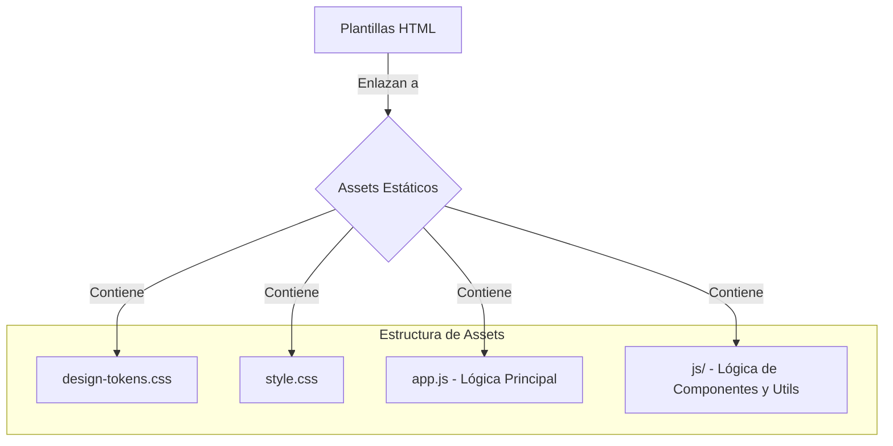

# Módulo: Assets Estáticos (Static)

## 🎯 Propósito del Módulo
Este módulo contiene todos los assets estáticos del frontend para la aplicación web `autocode`. Su responsabilidad es proporcionar los archivos (CSS y JavaScript) que son servidos directamente al navegador para definir la apariencia visual de la interfaz de usuario y dotarla de interactividad.

## 🏗️ Arquitectura del Módulo
La arquitectura de los assets estáticos separa claramente los estilos (CSS) de la lógica (JavaScript) en diferentes directorios y archivos.

## 📁 Componentes del Módulo
### `design-tokens.css` - Sistema de Diseño
**Propósito**: Define todas las variables CSS (colores, fuentes, espaciado) que constituyen el sistema de diseño de la aplicación.
**Documentación**: [design-tokens.md](design-tokens.md)

### `style.css` - Hoja de Estilos Principal
**Propósito**: Aplica los design tokens para estilizar todos los componentes del dashboard, definiendo el layout y la apariencia visual.
**Documentación**: [style.md](style.md)

### `app.js` - Lógica Principal del Frontend
**Propósito**: Contiene la lógica de inicialización y orquestación principal del lado del cliente, comunicándose con la API y actualizando el DOM en tiempo real.
**Documentación**: [app.md](app.md)

### `/js` - Módulos de JavaScript
**Propósito**: Contiene scripts más específicos, organizados por funcionalidad (componentes, utilidades).
**Documentación**: [js/_module.md](js/_module.md)

## 💡 Flujo de Trabajo Típico
1.  El servidor renderiza una plantilla HTML.
2.  La plantilla contiene etiquetas `<link>` y `<script>` que apuntan a los archivos de este directorio.
3.  El navegador solicita, descarga y procesa estos archivos.
4.  Los CSS definen la apariencia visual.
5.  Los JavaScripts se ejecutan para añadir interactividad y cargar datos dinámicos.
