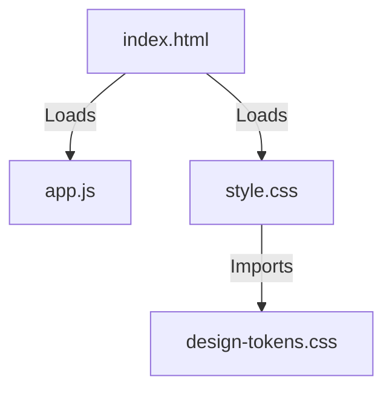

# Módulo: Static

## 🎯 Propósito del Módulo
Este módulo contiene todos los assets estáticos del frontend para el dashboard web de `autocode`. Su responsabilidad es proporcionar los archivos de JavaScript y CSS que son servidos directamente al navegador para construir la interfaz de usuario, definir su estilo y dotarla de interactividad.

## 🏗️ Arquitectura del Módulo
El módulo se compone de archivos CSS y JS que trabajan en conjunto, enlazados desde la plantilla `index.html`.

## 📁 Componentes del Módulo
### `design-tokens.css` - Sistema de Diseño
**Propósito**: Define todas las variables CSS (colores, fuentes, espaciado) que constituyen el sistema de diseño de la aplicación.
**Documentación**: [design-tokens.md](design-tokens.md)

### `style.css` - Hoja de Estilos Principal
**Propósito**: Aplica los design tokens para estilizar todos los componentes del dashboard, definiendo el layout y la apariencia visual.
**Documentación**: [style.md](style.md)

### `app.js` - Lógica del Frontend
**Propósito**: Contiene toda la lógica del lado del cliente para hacer la página interactiva, comunicarse con la API y actualizar el DOM en tiempo real.
**Documentación**: [app.md](app.md)

## 💡 Flujo de Trabajo Típico
Cuando un usuario carga el dashboard, el servidor FastAPI sirve la plantilla `index.html`, que a su vez contiene etiquetas `<link>` y `<script>` que le piden al navegador que descargue y aplique estos tres archivos. `design-tokens.css` y `style.css` definen la apariencia, mientras que `app.js` se encarga de toda la funcionalidad dinámica.
