# Web Static Assets Module

## 🎯 Propósito
Módulo que contiene los assets estáticos del dashboard web de autocode: JavaScript para interactividad, CSS para estilos visuales y cualquier recurso estático necesario para el funcionamiento de la interfaz web de monitoreo.

## 🏗️ Arquitectura del Módulo

```mermaid
graph TB
    A[autocode/web/static/] --> B[app.js]
    A --> C[style.css]
    
    B --> D[AutocodeDashboard Class]
    B --> E[API Communication]
    B --> F[UI Management]
    B --> G[Event Handling]
    
    C --> H[Visual Styles]
    C --> I[Layout System]
    C --> J[Responsive Design]
    C --> K[Component Styling]
    
    D --> L[Auto-refresh System]
    D --> M[Manual Triggers]
    D --> N[Config Management]
    
    E --> O[REST API Calls]
    E --> P[Data Processing]
    
    F --> Q[DOM Manipulation]
    F --> R[State Updates]
    
    G --> S[Keyboard Shortcuts]
    G --> T[Button Clicks]
    G --> U[Form Changes]
    
    H --> V[Status Indicators]
    H --> W[Cards Design]
    H --> X[Typography]
    
    I --> Y[Grid Systems]
    I --> Z[Flexbox Layout]
    
    J --> AA[Mobile Breakpoints]
    J --> BB[Desktop Layout]
    
    K --> CC[Check Cards]
    K --> DD[Configuration Forms]
    K --> EE[Navigation Elements]
```


## 📁 Componentes del Módulo
### `app.js` - Dashboard JavaScript Application
**Propósito**: Lógica principal del dashboard que maneja la interacción con la API, actualización de UI en tiempo real, y gestión de eventos de usuario.

**Responsabilidades**:
- Comunicación con API REST para obtener estado y configuración
- Auto-refresh automático cada 5 segundos
- Actualización dinámica de elementos DOM
- Manejo de ejecución manual de verificaciones
- Gestión de configuración en tiempo real
- Keyboard shortcuts (Space para refresh, R para toggle auto-refresh)

**Interfaces principales**:
- `AutocodeDashboard` class con métodos para gestión de estado
- `runCheck(checkName)` para ejecución manual
- `updateConfig()` para actualización de configuración
- Event listeners para interacción de usuario

**Documentación**: [app.md](app.md)

### `style.css` - Dashboard Styles
**Propósito**: Estilos visuales completos para el dashboard incluyendo layout responsive, indicadores de estado, animaciones y temas visuales.

**Responsabilidades**:
- Diseño visual profesional y moderno
- Sistema de colores para diferentes estados (success, warning, error)
- Layout responsive para desktop y mobile
- Animaciones suaves y transiciones
- Componentes estilizados (cards, forms, buttons)
- Información especializada (doc index, tokens, tests)

**Características principales**:
- Mobile-first responsive design
- CSS Grid y Flexbox para layouts
- Sistema de colores consistente
- Transiciones y hover effects
- Utility classes para uso común

**Documentación**: [style.md](style.md)

## 🔗 Dependencias del Módulo
### Internas (otros módulos del proyecto)
- `autocode.api.server` - Endpoints REST para comunicación
- `autocode.web.templates` - Templates HTML que cargan estos assets
- `autocode.orchestration.daemon` - Fuente de datos para el dashboard

### Externas
- **Navegadores modernos** - API Fetch, DOM manipulation, CSS Grid/Flexbox
- **FastAPI static files** - Servicio de archivos estáticos
- **HTTP/JSON** - Comunicación con API

## 💡 Flujo de Trabajo Típico
### Inicialización del Dashboard
1. **Carga de página**: Navegador carga HTML template
2. **Assets loading**: Se cargan style.css y app.js
3. **Dashboard init**: AutocodeDashboard se inicializa
4. **Initial data**: Se obtienen datos de status y configuración
5. **UI update**: Se actualiza interfaz con datos iniciales
6. **Auto-refresh**: Se inicia timer para actualizaciones periódicas

### Interacción Usuario
1. **User action**: Click en botón "Run Now" o cambio de configuración
2. **Event handling**: JavaScript captura evento
3. **API call**: Request a endpoint apropiado
4. **Response processing**: Datos se procesan y formatean
5. **UI update**: Interfaz se actualiza con nuevos datos
6. **Visual feedback**: Animaciones y transiciones proporcionan feedback

### Actualización Automática
1. **Timer trigger**: Cada 5 segundos se ejecuta auto-refresh
2. **Status fetch**: GET request a `/api/status`
3. **Data comparison**: Se comparan nuevos datos con estado actual
4. **Selective update**: Solo se actualizan elementos que cambiaron
5. **Timestamp update**: Se actualiza "Last updated" timestamp

## 🔧 Configuración del Módulo
### Configuración JavaScript
```javascript
// Configuración del dashboard
class AutocodeDashboard {
    constructor() {
        this.refreshInterval = 5000; // 5 segundos
        this.refreshTimer = null;
        this.isLoading = false;
    }
}
```

### Configuración CSS
```css
/* Configuración responsive */
.container {
    max-width: 1200px;
    margin: 0 auto;
    padding: 20px;
}

/* Breakpoints */
@media (max-width: 768px) {
    .container {
        padding: 10px;
    }
}
```

### Integración con Templates
```html
<!-- En index.html -->
<link rel="stylesheet" href="{{ url_for('static', path='/style.css') }}">
<script src="{{ url_for('static', path='/app.js') }}"></script>
```

## ⚠️ Consideraciones Especiales
### Rendimiento
- **Auto-refresh optimizado**: Solo actualiza cuando hay cambios
- **Loading states**: Previene múltiples requests simultáneos
- **Efficient DOM updates**: Actualiza solo elementos necesarios
- **CSS transitions**: Animaciones suaves sin impacto en performance

### Compatibilidad
- **Navegadores modernos**: Requiere soporte para Fetch API y ES6
- **Responsive design**: Funciona en desktop, tablet y mobile
- **Graceful degradation**: Funciona sin JavaScript para contenido básico

### Extensibilidad
- **Modular JavaScript**: Fácil añadir nuevas verificaciones
- **CSS variables**: Preparado para theming
- **Component-based**: Estilos organizados por componentes
- **API-driven**: Toda la funcionalidad basada en API REST

## 📊 Métricas y Monitoreo
### Métricas JavaScript
- **Auto-refresh status**: ON/OFF
- **API response times**: Tiempo de respuesta de requests
- **Update frequency**: Frecuencia de actualizaciones de UI
- **Error rates**: Errores en comunicación con API

### Métricas CSS
- **Layout performance**: Tiempo de renderizado
- **Animation smoothness**: Fluidez de transiciones
- **Responsive behavior**: Adaptación a diferentes tamaños
- **Visual consistency**: Consistencia en diferentes navegadores

## 🚀 Casos de Uso Comunes
### Monitoreo en Tiempo Real
```javascript
// Dashboard se actualiza automáticamente
dashboard.startAutoRefresh();

// Usuario puede ver estado actual sin intervención
// - Estado del daemon
// - Resultados de verificaciones
// - Métricas del sistema
```

### Ejecución Manual
```javascript
// Usuario ejecuta verificación específica
await runCheck('doc_check');

// Dashboard se actualiza inmediatamente
// - Botón cambia a "Running..."
// - Resultado se muestra al completar
// - Estado se actualiza en tiempo real
```

### Configuración Dinámica
```javascript
// Usuario cambia configuración
updateConfig();

// Cambios se aplican inmediatamente
// - Daemon actualiza intervalos
// - UI refleja nuevos valores
// - No requiere reinicio
```

### Responsive Usage
```css
/* Desktop: Layout completo */
.config-card {
    display: grid;
    grid-template-columns: repeat(auto-fit, minmax(250px, 1fr));
}

/* Mobile: Layout apilado */
@media (max-width: 768px) {
    .config-card {
        grid-template-columns: 1fr;
    }
}
```

## 🔄 Integración con Otros Módulos
### Con Templates Module
- **HTML estructura**: Templates proporcionan DOM structure
- **Asset loading**: Templates cargan CSS y JS
- **Element IDs**: Templates definen IDs que JavaScript manipula

### Con API Server
- **REST endpoints**: JavaScript consume API endpoints
- **Real-time data**: Obtiene datos actualizados del daemon
- **Configuration updates**: Envía cambios de configuración

### Con Core Modules
- **Indirect integration**: A través de API obtiene datos de DocChecker, GitAnalyzer, etc.
- **Status display**: Muestra resultados de verificaciones core
- **Configuration management**: Permite configurar comportamiento core

## 📈 Evolución del Módulo
### Funcionalidad Actual
- Dashboard básico con auto-refresh
- Tres tipos de verificaciones (doc, git, test)
- Configuración dinámica
- Responsive design
- Keyboard shortcuts

### Posibles Extensiones
- **WebSocket support**: Para updates en tiempo real
- **Dark mode**: Tema oscuro para la interfaz
- **Charts/Graphs**: Visualización de métricas históricas
- **Notifications**: Alertas para cambios importantes
- **Export functionality**: Exportar datos a CSV/JSON
- **Advanced filtering**: Filtros para diferentes tipos de datos

### Mejoras Técnicas
- **Service Worker**: Para funcionamiento offline
- **CSS Grid Level 2**: Layouts más avanzados
- **Web Components**: Componentes reutilizables
- **TypeScript**: Mejor type safety
- **CSS-in-JS**: Estilos más dinámicos
- **Performance monitoring**: Métricas de rendimiento client-side
