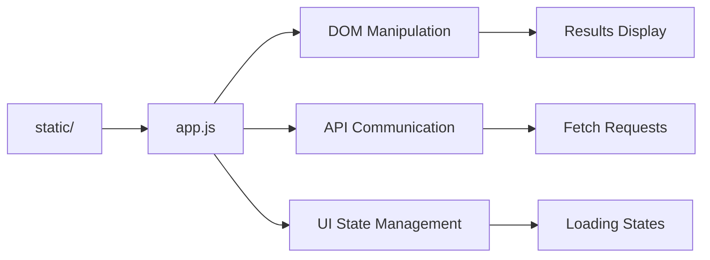
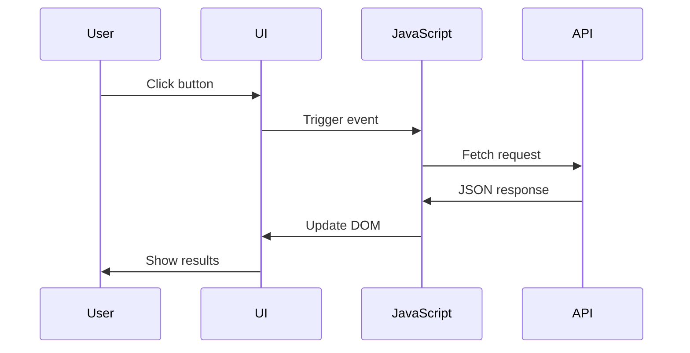

# Static Assets Module - Documentación

## 🎯 Propósito del Módulo
Este módulo contiene todos los assets estáticos del frontend para la aplicación web autocode. Su responsabilidad es proporcionar los archivos (CSS y JavaScript) que son servidos directamente al navegador para definir la apariencia visual de la interfaz de usuario y dotarla de interactividad.

## 🏗️ Arquitectura del Módulo

## 📁 Componentes del Módulo
### `app.js` - JavaScript Principal
**Propósito**: Controlador principal de la aplicación que maneja toda la lógica de frontend
**Documentación**: [app.md](app.md)

## 🔗 Dependencias del Módulo
### Internas (otros módulos del proyecto)
- `autocode.api.server` - Endpoints HTTP para comunicación con el backend

### Externas
- **Fetch API** - API nativa del navegador para peticiones HTTP asíncronas
- **DOM API** - API nativa para manipulación del Document Object Model
- **Tailwind CSS Classes** - Clases de utilidad para styling dinámico

## 💡 Flujo de Trabajo Típico
1. **Carga inicial**: Los scripts se cargan cuando se renderiza la página
2. **Event binding**: Se asignan event listeners a elementos de la UI
3. **User interaction**: El usuario interactúa con botones y controles
4. **API calls**: Se realizan peticiones asíncronas al backend
5. **UI updates**: Se actualiza el DOM con los resultados obtenidos

## 🔧 Configuración del Módulo
- **Tipo de JavaScript**: Vanilla JS (ES6+)
- **Módulos**: Sin sistema de módulos, carga directa via `<script>`
- **API Communication**: Fetch API con async/await
- **Error Handling**: Try-catch blocks para manejo de errores

## ⚠️ Consideraciones Especiales
- **Compatibilidad**: Compatible con navegadores modernos (ES6+)
- **Sin dependencias**: No requiere frameworks externos como React o Vue
- **Performance**: Código mínimo y optimizado para carga rápida
- **Mantenibilidad**: Funciones modulares y bien documentadas
- **Responsive**: Clases Tailwind responsive para diferentes tamaños de pantalla

## 🧪 Testing
- **Testing manual**: Verificación en diferentes navegadores
- **Console debugging**: Uso de console.log para debugging
- **Error handling**: Manejo graceful de errores de red y API

## 🔄 Flujo de Datos

## 📖 Navegación Detallada
- [app.js - Controlador principal](app.md)
