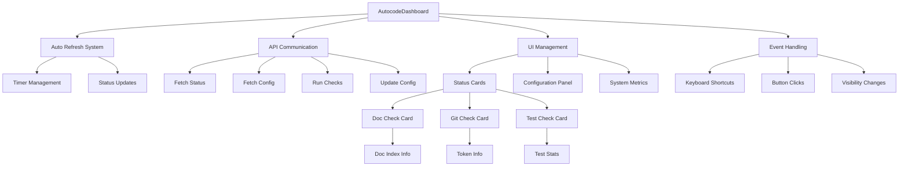

# app.js

## 🎯 Propósito
JavaScript del dashboard de monitoreo que proporciona interfaz interactiva en tiempo real para el daemon de autocode. Maneja la actualización automática de estado, ejecución manual de verificaciones, configuración dinámica y interacción con la API REST.

## 🏗️ Arquitectura


## 📋 Responsabilidades
- **Gestión de estado**: Actualizar UI con datos en tiempo real del daemon
- **Comunicación API**: Interactuar con endpoints REST para obtener datos y ejecutar comandos
- **Auto-refresh**: Actualizar automáticamente el estado cada 5 segundos
- **Configuración dinámica**: Permitir modificar configuración sin reiniciar daemon
- **Interacción usuario**: Manejar clicks, keyboard shortcuts y eventos de navegador
- **Formateo de datos**: Mostrar información de forma legible y estructurada

## 🔗 Dependencias
### Externas
- **Fetch API** - Comunicación HTTP con el servidor
- **DOM API** - Manipulación de elementos HTML
- **Event API** - Manejo de eventos de navegador
- **JSON** - Serialización/deserialización de datos
- **Date** - Formateo de timestamps y duraciones

### Endpoints API
- `GET /api/status` - Estado completo del daemon y verificaciones
- `GET /api/config` - Configuración actual del daemon
- `PUT /api/config` - Actualización de configuración
- `POST /api/checks/{check_name}/run` - Ejecución manual de verificaciones

## 📊 Interfaces Públicas
### Clase Principal
```javascript
class AutocodeDashboard {
    constructor()
    init()
    
    // Data Management
    async loadInitialData()
    async fetchAndUpdateStatus()
    async fetchAndUpdateConfig()
    
    // Auto Refresh
    startAutoRefresh()
    stopAutoRefresh()
    
    // UI Updates
    updateUI(data)
    updateDaemonStatus(daemon)
    updateSystemStats(daemon)
    updateCheckResults(checks)
    updateCheckCard(checkName, result)
    updateConfigUI(config)
    
    // Specialized Updates
    updateDocIndexInfo(details)
    updateTokenInfo(details)
    updateTestInfo(details)
    
    // Formatting
    formatDuration(seconds)
    formatTimestamp(timestamp)
    formatGitDetails(details)
    formatTestDetails(details)
    
    // Error Handling
    handleError(error)
}
```

### Funciones Globales
```javascript
async function runCheck(checkName)
async function updateConfig()
```

## 🔧 Configuración
### Inicialización
```javascript
constructor() {
    this.refreshInterval = 5000; // 5 segundos
    this.refreshTimer = null;
    this.isLoading = false;
    
    this.init();
}
```

### Auto-refresh System
```javascript
startAutoRefresh() {
    this.refreshTimer = setInterval(() => {
        if (!this.isLoading) {
            this.fetchAndUpdateStatus();
        }
    }, this.refreshInterval);
}
```

## 💡 Patrones de Uso
### Inicialización del Dashboard
```javascript
// Inicialización automática cuando DOM está listo
document.addEventListener('DOMContentLoaded', function() {
    dashboard = new AutocodeDashboard();
});
```

### Actualización Manual
```javascript
// Ejecutar verificación específica
await runCheck('doc_check');
await runCheck('git_check');
await runCheck('test_check');

// Actualizar configuración
await updateConfig();
```

### Keyboard Shortcuts
```javascript
// Espacio: Actualizar estado manualmente
// R: Toggle auto-refresh on/off
document.addEventListener('keydown', function(event) {
    if (event.code === 'Space') {
        dashboard.fetchAndUpdateStatus();
    }
    if (event.code === 'KeyR') {
        if (dashboard.refreshTimer) {
            dashboard.stopAutoRefresh();
        } else {
            dashboard.startAutoRefresh();
        }
    }
});
```

## ⚠️ Consideraciones
### Funcionamiento
- **Auto-refresh**: Se actualiza cada 5 segundos automáticamente
- **Pause on hide**: Se pausa cuando la pestaña no está visible
- **Error handling**: Maneja errores de red y API graciosamente
- **Loading states**: Previene múltiples requests simultáneos

### Limitaciones
- **Dependencia de API**: Requiere que el servidor esté funcionando
- **Polling**: Usa polling en lugar de WebSockets para simplicidad
- **Browser compatibility**: Requiere navegador moderno con Fetch API
- **No persistencia**: Estado se pierde al recargar página

## 🧪 Testing
### Pruebas Manuales
```javascript
// Test inicialización
const dashboard = new AutocodeDashboard();
console.log('Dashboard initialized');

// Test fetch status
await dashboard.fetchAndUpdateStatus();
console.log('Status updated');

// Test run check
await runCheck('doc_check');
console.log('Check executed');
```

### Debugging
```javascript
// Habilitar logging detallado
console.log('Dashboard status:', {
    isLoading: dashboard.isLoading,
    refreshTimer: dashboard.refreshTimer,
    refreshInterval: dashboard.refreshInterval
});
```

## 🔄 Flujo de Datos
### Flujo de Inicialización
1. **DOM Ready**: Evento DOMContentLoaded dispara inicialización
2. **Constructor**: Configura propiedades y llama init()
3. **Init**: Inicia auto-refresh y carga datos iniciales
4. **Load Initial**: Obtiene status y configuración inicial
5. **Update UI**: Actualiza todos los elementos de la interfaz

### Flujo de Auto-refresh
1. **Timer**: Se ejecuta cada 5 segundos
2. **Check Loading**: Verifica si hay request en progreso
3. **Fetch Status**: Obtiene estado actual del daemon
4. **Update UI**: Actualiza elementos del dashboard
5. **Update Timestamp**: Muestra hora de última actualización

### Flujo de Ejecución Manual
1. **Button Click**: Usuario hace click en "Run Now"
2. **Disable Button**: Cambia estado a "Running..."
3. **API Call**: POST a /api/checks/{check_name}/run
4. **Handle Response**: Procesa respuesta del servidor
5. **Re-enable Button**: Restaura estado original
6. **Refresh Status**: Actualiza estado inmediatamente

### Flujo de Actualización de Configuración
1. **Get Form Values**: Obtiene valores de formulario
2. **Build Config**: Construye objeto de configuración
3. **API Call**: PUT a /api/config
4. **Handle Response**: Procesa confirmación del servidor
5. **Update UI**: Refleja cambios en la interfaz

## 📈 Elementos de UI Gestionados
### Cards de Estado
```javascript
// Doc Check Card
updateCheckCard('doc_check', result) {
    // Actualiza status, mensaje, timestamp
    // Muestra información de índice de documentación
    // Formatea salida detallada
}

// Git Check Card
updateCheckCard('git_check', result) {
    // Actualiza estadísticas de repositorio
    // Muestra información de tokens
    // Formatea cambios detallados
}

// Test Check Card
updateCheckCard('test_check', result) {
    // Actualiza contadores de tests
    // Muestra estadísticas por tipo
    // Formatea resultados de ejecución
}
```

### Información Especializada
```javascript
// Doc Index Info
updateDocIndexInfo(details) {
    // Modules count
    // Files count
    // Purposes found
}

// Token Info
updateTokenInfo(details) {
    // Token count
    // Threshold comparison
    // Warning indicators
}

// Test Info
updateTestInfo(details) {
    // Missing/Passing/Failing/Orphaned counts
    // Unit/Integration breakdown
}
```

### System Stats
```javascript
updateSystemStats(daemon) {
    // Uptime formatting
    // Total checks counter
    // Last check timestamp
}
```

## 🚀 Extensibilidad
### Nuevas Verificaciones
```javascript
// Añadir nueva card de verificación
updateCheckCard('custom_check', result) {
    // Lógica específica para nueva verificación
    if (checkName === 'custom_check' && result.details) {
        this.updateCustomInfo(result.details);
    }
}

// Función de actualización específica
updateCustomInfo(details) {
    const customInfo = document.getElementById('custom-check-info');
    // Actualizar elementos específicos
}
```

### Nuevos Endpoints
```javascript
// Añadir nuevo endpoint
async function callCustomEndpoint(data) {
    try {
        const response = await fetch('/api/custom-endpoint', {
            method: 'POST',
            headers: {'Content-Type': 'application/json'},
            body: JSON.stringify(data)
        });
        
        if (!response.ok) {
            throw new Error(`HTTP ${response.status}`);
        }
        
        return await response.json();
    } catch (error) {
        console.error('Custom endpoint error:', error);
        throw error;
    }
}
```

### Nuevos Keyboard Shortcuts
```javascript
document.addEventListener('keydown', function(event) {
    // Existing shortcuts...
    
    // Nueva funcionalidad
    if (event.code === 'KeyC' && event.target.tagName !== 'INPUT') {
        event.preventDefault();
        // Ejecutar acción personalizada
        dashboard.customAction();
    }
});
```

### Formateo Personalizado
```javascript
// Añadir nuevo formateador
formatCustomDetails(details) {
    let output = `Custom Status:\n`;
    output += `  Metric 1: ${details.metric1}\n`;
    output += `  Metric 2: ${details.metric2}\n`;
    
    if (details.items) {
        output += `\nItems:\n`;
        details.items.forEach(item => {
            output += `  - ${item.name}: ${item.value}\n`;
        });
    }
    
    return output;
}
```

### Event Handling Personalizado
```javascript
// Añadir nuevo event handler
document.addEventListener('custom-event', function(event) {
    if (dashboard) {
        dashboard.handleCustomEvent(event.detail);
    }
});

// En la clase AutocodeDashboard
handleCustomEvent(data) {
    // Procesar evento personalizado
    this.updateCustomUI(data);
}
```

### Configuración Dinámica
```javascript
// Añadir nuevos campos de configuración
updateConfigUI(config) {
    // Configuración existente...
    
    // Nuevos campos
    if (config.custom_settings) {
        const customSetting = document.getElementById('custom-setting');
        customSetting.checked = config.custom_settings.enabled;
    }
}
