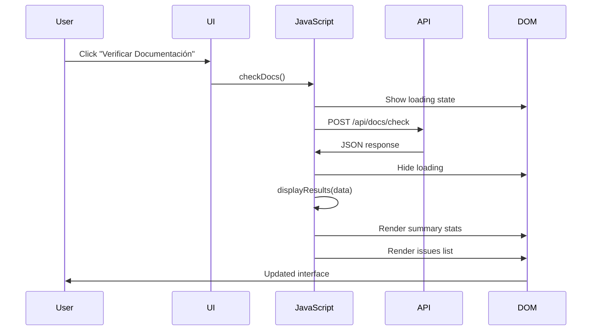

# App.js - JavaScript Principal

## 🎯 Propósito
Este archivo JavaScript es el orquestador principal del frontend de autocode. Su responsabilidad es dar vida a la interfaz de usuario, gestionando el estado de la aplicación, la comunicación con la API, la actualización dinámica del DOM y la interacción del usuario en las diferentes páginas.

## 🏗️ Arquitectura
```mermaid
graph TB
    A[app.js] --> B[checkDocs()]
    A --> C[displayResults()]
    B --> D[DOM State Management]
    B --> E[API Communication]
    C --> F[Results Rendering]
    C --> G[UI Updates]
    D --> H[Show/Hide Elements]
    E --> I[Fetch /api/docs/check]
    F --> J[Summary Display]
    F --> K[Issues Display]
```

## 📋 Responsabilidades
- **Estado de UI**: Manejo de estados de carga, éxito, error y resultados
- **Comunicación con API**: Peticiones HTTP asíncronas al backend
- **Renderizado dinámico**: Generación de HTML dinámico basado en datos de API
- **Manipulación del DOM**: Mostrar/ocultar elementos y actualizar contenido
- **Manejo de errores**: Captura y presentación de errores de red y API

## 🔗 Dependencias
### Internas
- `/api/docs/check` - Endpoint POST para verificación de documentación
- Elementos DOM específicos con IDs predefinidos

### Externas
- **Fetch API** - Para peticiones HTTP asíncronas
- **DOM API** - Para manipulación de elementos HTML
- **Tailwind CSS Classes** - Para styling dinámico de elementos

## 📊 Interfaces Públicas
### Funciones Principales
- `checkDocs()` - Función principal para verificar documentación
- `displayResults(data)` - Función para renderizar resultados en la UI

### Elementos DOM Requeridos
- `#results` - Contenedor principal de resultados
- `#loading` - Indicador de carga
- `#success` - Mensaje de éxito
- `#error` - Mensaje de error
- `#results-content` - Contenido de resultados
- `#summary-content` - Resumen estadístico
- `#issues-content` - Lista de problemas

## 🔧 Configuración
### Estados de la Aplicación
- **Initial**: Estado inicial sin resultados
- **Loading**: Mostrando indicador de carga
- **Success**: Resultados exitosos mostrados
- **Error**: Error de comunicación o procesamiento

### Estructura de Datos Esperada
```javascript
{
  "success": boolean,
  "data": {
    "summary": {
      "total_files": number,
      "up_to_date_count": number,
      "outdated_count": number,
      "missing_count": number
    },
    "issues": [
      {
        "code_path": string,
        "doc_type": string,
        "status": "missing" | "outdated"
      }
    ]
  }
}
```

## 💡 Patrones de Uso
### Verificación de Documentación
```javascript
// Llamada desde template HTML
onclick="checkDocs()"

// Flujo interno
async function checkDocs() {
  // 1. Actualizar estado UI a loading
  // 2. Hacer petición a API
  // 3. Procesar respuesta
  // 4. Actualizar UI con resultados
}
```

### Renderizado Dinámico
```javascript
// Generación de HTML dinámico con interpolación
const issuesHTML = data.data.issues.map(issue => {
  const statusColor = issue.status === 'missing' ? 'red' : 'yellow';
  return `<div class="border-l-4 border-${statusColor}-400">...</div>`;
}).join('');
```

## ⚠️ Consideraciones
### Limitaciones
- **Browser support**: Requiere navegadores con soporte para ES6+ (async/await)
- **Error handling**: Manejo básico de errores de red, no validación exhaustiva
- **Security**: Confianza en que la API devuelve datos válidos

### Efectos Secundarios
- **DOM mutations**: Modifica directamente elementos del DOM
- **Network requests**: Realiza peticiones HTTP que pueden fallar
- **UI state**: Mantiene estado en el DOM, no en JavaScript

## 🧪 Testing
### Casos de Prueba Manual
1. **Verificación exitosa**: Botón → Loading → Resultados con estadísticas
2. **Error de red**: Botón → Loading → Mensaje de error
3. **Respuesta vacía**: Botón → Loading → Manejo de datos ausentes

### Debugging
```javascript
// Console logging disponible para debugging
console.log('Response data:', data);
console.error('API Error:', err.message);
```

## 🔄 Flujo de Datos


## 🚀 Mejoras Futuras
- **Estado centralizado**: Implementar un store de estado más robusto
- **Validación**: Validación de datos de respuesta de API
- **Progressive enhancement**: Funcionalidad básica sin JavaScript
- **Error recovery**: Mecanismos de reintento automático
- **Loading indicators**: Indicadores de progreso más detallados
