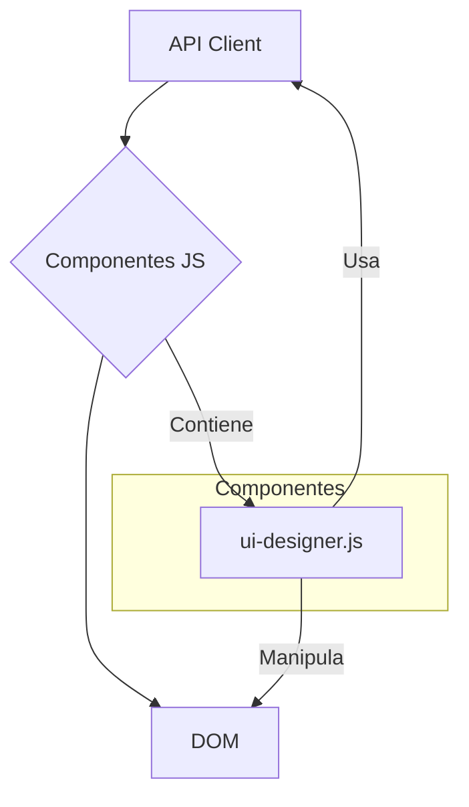

# Módulo: Componentes de JavaScript

## 🎯 Propósito del Módulo
Este módulo contiene los scripts de JavaScript que dotan de lógica y funcionalidad a los componentes de la interfaz de usuario (UI) de la aplicación `autocode`. Cada archivo en este directorio es responsable de controlar un componente HTML específico, manejando eventos de usuario, interactuando con la API y actualizando el DOM.

## 🏗️ Arquitectura del Módulo
Los componentes de este módulo siguen un patrón de encapsulación en clases o se exponen a través de funciones globales para ser invocados desde el HTML. Están diseñados para ser la contraparte lógica de las plantillas de componentes de Jinja2.

## 📁 Componentes del Módulo
### `ui-designer.js` - Visor de Documentación de Diseño
**Propósito**: Controla la lógica del visor de diagramas de diseño, incluyendo la carga de archivos desde la API y el renderizado de diagramas Mermaid.
**Documentación**: [ui-designer.md](ui-designer.md)

## 🔗 Dependencias del Módulo
### Internas (otros módulos del proyecto)
- **`autocode.web.static.js.utils`**: Utiliza el `APIClient` de este módulo para comunicarse con el backend.
- **`autocode.web.templates.components`**: Cada script aquí está fuertemente acoplado a la estructura HTML de una plantilla de componente.

### Externas
- **`mermaid.js`**: Algunos componentes, como `ui-designer.js`, dependen de esta librería para renderizar contenido.

## 💡 Flujo de Trabajo Típico
1. Una plantilla HTML (`.html`) define la estructura de un componente.
2. Un script de este módulo (`.js`) se carga junto con la plantilla.
3. El script se inicializa (normalmente en el evento `DOMContentLoaded`).
4. El script añade manejadores de eventos, realiza llamadas a la API a través del `APIClient` y actualiza los elementos del DOM del componente para mostrar datos dinámicos.
