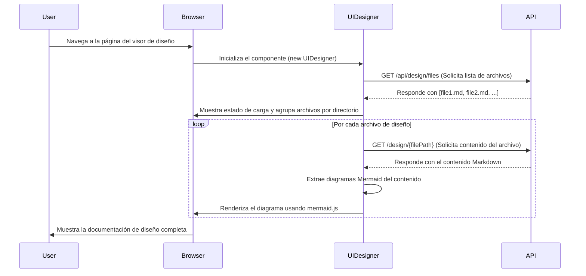

# UIDesigner (Design Documentation Viewer)

## 🎯 Propósito
Este script gestiona un visor dinámico para la documentación de diseño del proyecto. Su función es obtener archivos de diseño (Markdown con diagramas Mermaid) desde una API, procesarlos y renderizarlos en el frontend, proporcionando una interfaz interactiva para explorar la arquitectura visual del sistema.

## 🏗️ Arquitectura
El componente se encapsula en la clase `UIDesigner`, que maneja todo el ciclo de vida de la visualización de la documentación. Se inicializa automáticamente cuando el DOM está cargado y opera de forma asíncrona para no bloquear la interfaz de usuario.



## 📋 Responsabilidades
- **Inicializar el visor**: Se activa al cargar la página de diseño.
- **Obtener datos de la API**: Realiza peticiones para obtener la lista de archivos de diseño y el contenido de cada uno.
- **Gestionar estados**: Controla y muestra estados de carga, éxito y error.
- **Renderizar contenido**: Genera dinámicamente el HTML para mostrar los archivos de diseño, agrupados por directorios.
- **Extraer y renderizar diagramas**: Identifica bloques de código `mermaid` dentro de los archivos Markdown y los renderiza como diagramas visuales.
- **Proporcionar interactividad**: Expone funciones globales para botones de carga y refresco.

## 🔗 Dependencias
### Internas (API del proyecto)
- `GET /api/design/files`: Para obtener la lista de rutas de los archivos de diseño.
- `GET /design/{filePath}`: Para obtener el contenido de un archivo de diseño específico.

### Externas
- `mermaid.js`: Librería externa fundamental para renderizar los diagramas de texto a formato visual.

## 📊 Interfaces Públicas
### Clase `UIDesigner`
- `constructor()`: Inicializa el componente.
- `init()`: Configuración inicial y carga automática de archivos.
- `loadDesignFiles()`: Orquesta la carga y renderizado de todos los archivos.
- `refreshDesignFiles()`: Vuelve a cargar todos los archivos para mostrar actualizaciones.

### Funciones Globales
- `loadDesignFiles()`: Función de envoltura para ser llamada desde un `onclick` en un botón.
- `refreshDesignFiles()`: Función de envoltura para refrescar el contenido desde un botón.

## 🔧 Configuración
El componente no requiere configuración externa. La URL de la API (`/api/design/`) está hardcodeada. Se espera que los siguientes elementos HTML existan en la página para su correcto funcionamiento:
- `#ui-designer-title`
- `#ui-designer-summary`
- `#design-files-list`

## 💡 Patrones de Uso
El componente está diseñado para ser autocontenido. Simplemente incluyendo el script en una página HTML con la estructura de DOM requerida, el visor se activará.

```html
<!-- Ejemplo de botón para activar la carga -->
<button onclick="loadDesignFiles()">Cargar Documentación de Diseño</button>

<!-- Contenedores requeridos por el script -->
<h1 id="ui-designer-title"></h1>
<p id="ui-designer-summary"></p>
<div id="design-files-list"></div>

<!-- Inclusión del script -->
<script src="/static/js/components/ui-designer.js"></script>
```

## ⚠️ Consideraciones
- **Dependencia de Mermaid**: El script asume que la librería `mermaid.js` ya está cargada en la página. Si no se encuentra, los diagramas no se renderizarán.
- **Seguridad**: El nivel de seguridad de Mermaid se establece en `'loose'`, lo que permite el uso de etiquetas HTML en los diagramas.
- **Manejo de errores**: Si una petición a la API falla o un archivo no contiene diagramas, el componente lo gestiona mostrando mensajes de error o informativos en la interfaz.

## 🧪 Testing
Para probar este componente:
1. Asegurarse de que el servidor de `autocode` esté en ejecución.
2. Haber generado previamente la documentación de diseño con el comando `autocode code-to-design`.
3. Navegar a la página del visor de diseño (`/ui-designer`).
4. Verificar que los archivos de diseño se cargan y los diagramas se renderizan correctamente.
5. Probar los casos de error (ej. deteniendo el servidor backend) para confirmar que los mensajes de error aparecen.
