# style.css

## 🎯 Propósito
Estilos CSS para el dashboard de monitoreo de autocode que define la apariencia visual, layout responsive, indicadores de estado, animaciones y temas visuales. Proporciona una interfaz profesional y moderna para el monitoreo en tiempo real del daemon.

## 🏗️ Arquitectura

```mermaid
graph TB
    A[style.css] --> B[Global Styles]
    A --> C[Layout System]
    A --> D[Component Styles]
    A --> E[State Indicators]
    A --> F[Responsive Design]
    A --> G[Animations]
    A --> H[Utility Classes]
    
    B --> I[CSS Reset]
    B --> J[Typography]
    B --> K[Base Colors]
    
    C --> L[Container]
    C --> M[Header]
    C --> N[Main Content]
    C --> O[Footer]
    
    D --> P[Cards]
    D --> Q[Check Cards]
    D --> R[Config Forms]
    D --> S[Buttons]
    
    E --> T[Success]
    E --> U[Warning]
    E --> V[Error]
    E --> W[Unknown]
    
    F --> X[Mobile]
    F --> Y[Tablet]
    F --> Z[Desktop]
    
    G --> AA[Transitions]
    G --> BB[Hover Effects]
    G --> CC[Status Changes]
    
    H --> DD[Text Colors]
    H --> EE[Display Utils]
    H --> FF[Loading States]
```


## 📋 Responsabilidades
- **Diseño visual**: Definir apariencia profesional y moderna del dashboard
- **Layout responsive**: Adaptar interfaz a diferentes tamaños de pantalla
- **Indicadores de estado**: Mostrar visualmente el estado de verificaciones y daemon
- **Interactividad**: Proporcionar feedback visual para interacciones de usuario
- **Legibilidad**: Asegurar tipografía clara y contrastes apropiados
- **Consistencia**: Mantener estilo uniforme en todos los componentes

## 🔗 Dependencias
### Fuentes
- **System Fonts**: `-apple-system, BlinkMacSystemFont, 'Segoe UI', Roboto, Oxygen, Ubuntu, Cantarell, sans-serif`
- **Monospace**: `'Courier New', monospace` (para código y detalles)

### Tecnologías CSS
- **CSS Grid**: Layout de configuración y estadísticas
- **Flexbox**: Alineación y distribución de elementos
- **CSS Transitions**: Animaciones suaves
- **Media Queries**: Responsive design
- **CSS Variables**: (implícitas en colores consistentes)

## 📊 Sistema de Colores
### Colores Principales
```css
/* Texto */
--text-primary: #2c3e50;
--text-secondary: #495057;
--text-muted: #6c757d;

/* Backgrounds */
--bg-primary: #ffffff;
--bg-secondary: #f8f9fa;
--bg-page: #f5f5f5;

/* Estados */
--success: #28a745;
--warning: #ffc107;
--error: #dc3545;
--unknown: #6c757d;

/* Interacción */
--primary: #007bff;
--primary-hover: #0056b3;
```

### Aplicación de Colores
```css
/* Success (Verde) */
.status-indicator.success { background-color: #28a745; }
.text-success { color: #28a745; }

/* Warning (Amarillo) */
.status-indicator.warning { background-color: #ffc107; }
.text-warning { color: #ffc107; }

/* Error (Rojo) */
.status-indicator.error { background-color: #dc3545; }
.text-error { color: #dc3545; }

/* Unknown (Gris) */
.status-indicator.unknown { background-color: #6c757d; }
.text-muted { color: #6c757d; }
```

## 🔧 Configuración
### Global Reset
```css
* {
    box-sizing: border-box;
    margin: 0;
    padding: 0;
}
```

### Tipografía Base
```css
body {
    font-family: -apple-system, BlinkMacSystemFont, 'Segoe UI', Roboto, Oxygen, Ubuntu, Cantarell, sans-serif;
    background-color: #f5f5f5;
    color: #333;
    line-height: 1.6;
}
```

### Layout Principal
```css
.container {
    max-width: 1200px;
    margin: 0 auto;
    padding: 20px;
}
```

## 💡 Patrones de Uso
### Cards System
```css
.card {
    background: white;
    border-radius: 8px;
    padding: 20px;
    box-shadow: 0 2px 4px rgba(0,0,0,0.1);
    margin-bottom: 20px;
}

.card:hover {
    box-shadow: 0 4px 8px rgba(0,0,0,0.15);
}
```

### Status Indicators
```css
.status-indicator {
    width: 10px;
    height: 10px;
    border-radius: 50%;
    display: inline-block;
    transition: background-color 0.3s ease;
}
```

### Responsive Grid
```css
.status-grid {
    display: grid;
    grid-template-columns: repeat(auto-fit, minmax(150px, 1fr));
    gap: 20px;
}
```

## ⚠️ Consideraciones
### Funcionamiento
- **Mobile-first**: Diseño responsive que se adapta a todos los dispositivos
- **Accessibility**: Contrastes y tamaños apropiados para legibilidad
- **Performance**: Transiciones suaves sin impacto en rendimiento
- **Browser support**: Compatible con navegadores modernos

### Limitaciones
- **No dark mode**: Solo tema claro implementado
- **Fixed colors**: Colores hardcodeados sin sistema de temas
- **No CSS variables**: Colores definidos directamente en reglas
- **Limited animations**: Solo transiciones básicas

## 🧪 Testing
### Pruebas Visuales
```html
<!-- Test de colores de estado -->
<div class="status-indicator success"></div>
<div class="status-indicator warning"></div>
<div class="status-indicator error"></div>
<div class="status-indicator unknown"></div>

<!-- Test de cards -->
<div class="card">
    <h2>Test Card</h2>
    <p>Card content</p>
</div>
```

### Pruebas Responsive
```css
/* Verificar breakpoints */
@media (max-width: 768px) {
    /* Estilos mobile */
}

/* Test en diferentes tamaños */
.container { max-width: 1200px; } /* Desktop */
.container { padding: 10px; }     /* Mobile */
```

## 🔄 Estructura de Componentes
### Header Section
```css
.header {
    display: flex;
    justify-content: space-between;
    align-items: center;
    margin-bottom: 30px;
    padding: 20px;
    background: white;
    border-radius: 8px;
    box-shadow: 0 2px 4px rgba(0,0,0,0.1);
}

.daemon-status {
    display: flex;
    align-items: center;
    gap: 8px;
    padding: 8px 16px;
    background: #f8f9fa;
    border-radius: 20px;
    font-weight: 500;
}
```

### Check Cards
```css
.check-card {
    background: white;
    border-radius: 8px;
    padding: 20px;
    margin-bottom: 15px;
    box-shadow: 0 2px 4px rgba(0,0,0,0.1);
    transition: all 0.3s ease;
}

.check-card.success { border-left: 4px solid #28a745; }
.check-card.warning { border-left: 4px solid #ffc107; }
.check-card.error { border-left: 4px solid #dc3545; }
```

### Configuration Forms
```css
.config-card {
    background: white;
    border-radius: 8px;
    padding: 20px;
    box-shadow: 0 2px 4px rgba(0,0,0,0.1);
    display: grid;
    grid-template-columns: repeat(auto-fit, minmax(250px, 1fr));
    gap: 30px;
}

.config-item input[type="checkbox"] {
    width: 18px;
    height: 18px;
}

.config-item input[type="number"] {
    width: 80px;
    padding: 4px 8px;
    border: 1px solid #ced4da;
    border-radius: 4px;
}
```

## 📈 Información Especializada
### Documentation Index
```css
.doc-index-info {
    margin-bottom: 15px;
    padding: 12px;
    background: #e8f5e8;
    border-radius: 4px;
    border-left: 3px solid #28a745;
}

.index-stats-grid {
    display: flex;
    gap: 20px;
    align-items: center;
}

.index-stat-value {
    font-size: 1.2rem;
    font-weight: 600;
    color: #28a745;
}
```

### Token Information
```css
.token-info {
    margin-bottom: 15px;
    padding: 12px;
    background: #fff3cd;
    border-radius: 4px;
    border-left: 3px solid #ffc107;
}

.token-stats {
    display: flex;
    align-items: center;
    gap: 8px;
    flex-wrap: wrap;
}

.token-warning {
    font-weight: 500;
    margin-left: 10px;
}
```

### Test Information
```css
.test-info {
    margin-bottom: 15px;
    padding: 12px;
    background: #e3f2fd;
    border-radius: 4px;
    border-left: 3px solid #2196f3;
}

.test-stats-grid {
    display: flex;
    gap: 15px;
    align-items: center;
    flex-wrap: wrap;
}

.test-stat-value {
    font-size: 1.1rem;
    font-weight: 600;
    color: #2196f3;
}
```

## 🚀 Responsive Design
### Breakpoints
```css
/* Mobile First Approach */
@media (max-width: 768px) {
    .container {
        padding: 10px;
    }
    
    .header {
        flex-direction: column;
        gap: 15px;
        text-align: center;
    }
    
    .check-header {
        flex-direction: column;
        gap: 15px;
        align-items: flex-start;
    }
    
    .config-card {
        grid-template-columns: 1fr;
    }
}
```

### Responsive Grids
```css
/* Auto-fit grid system */
.status-grid {
    display: grid;
    grid-template-columns: repeat(auto-fit, minmax(150px, 1fr));
    gap: 20px;
}

.config-card {
    display: grid;
    grid-template-columns: repeat(auto-fit, minmax(250px, 1fr));
    gap: 30px;
}
```

## 🎨 Animaciones y Transiciones
### Smooth Transitions
```css
.check-card {
    transition: all 0.3s ease;
}

.status-indicator {
    transition: background-color 0.3s ease;
}

.btn-run {
    transition: background-color 0.3s ease;
}
```

### Hover Effects
```css
.check-card:hover {
    box-shadow: 0 4px 8px rgba(0,0,0,0.15);
}

.btn-run:hover {
    background: #0056b3;
}
```

### State Changes
```css
.check-card {
    transition: border-left 0.3s ease;
}

.check-card.success {
    border-left: 4px solid #28a745;
}

.check-card.warning {
    border-left: 4px solid #ffc107;
}

.check-card.error {
    border-left: 4px solid #dc3545;
}
```

## 🔧 Utility Classes
### Text Colors
```css
.text-success {
    color: #28a745;
}

.text-warning {
    color: #ffc107;
}

.text-error {
    color: #dc3545;
}

.text-muted {
    color: #6c757d;
}
```

### Display Utils
```css
.hidden {
    display: none;
}

.loading {
    opacity: 0.6;
    pointer-events: none;
}
```

## 🚀 Extensibilidad
### Nuevos Componentes
```css
/* Añadir nuevo tipo de card */
.custom-card {
    background: white;
    border-radius: 8px;
    padding: 20px;
    box-shadow: 0 2px 4px rgba(0,0,0,0.1);
    border-left: 4px solid #6f42c1;
}

/* Nuevo estado */
.status-indicator.custom {
    background-color: #6f42c1;
}

.check-card.custom {
    border-left: 4px solid #6f42c1;
}
```

### Dark Mode Support
```css
/* Preparación para dark mode */
:root {
    --bg-primary: #ffffff;
    --bg-secondary: #f8f9fa;
    --text-primary: #2c3e50;
    --text-secondary: #495057;
}

[data-theme="dark"] {
    --bg-primary: #2d3748;
    --bg-secondary: #4a5568;
    --text-primary: #e2e8f0;
    --text-secondary: #cbd5e0;
}

.card {
    background: var(--bg-primary);
    color: var(--text-primary);
}
```

### Nuevas Animaciones
```css
/* Fade in animation */
@keyframes fadeIn {
    from { opacity: 0; transform: translateY(10px); }
    to { opacity: 1; transform: translateY(0); }
}

.fade-in {
    animation: fadeIn 0.3s ease-out;
}

/* Pulse animation for updates */
@keyframes pulse {
    0% { transform: scale(1); }
    50% { transform: scale(1.05); }
    100% { transform: scale(1); }
}

.pulse {
    animation: pulse 1s ease-in-out;
}
```

### Responsive Utilities
```css
/* Responsive visibility */
.mobile-only {
    display: none;
}

.desktop-only {
    display: block;
}

@media (max-width: 768px) {
    .mobile-only {
        display: block;
    }
    
    .desktop-only {
        display: none;
    }
}
```

### Custom Properties
```css
/* CSS Variables for easy theming */
:root {
    --primary-color: #007bff;
    --success-color: #28a745;
    --warning-color: #ffc107;
    --error-color: #dc3545;
    --border-radius: 8px;
    --box-shadow: 0 2px 4px rgba(0,0,0,0.1);
    --transition-speed: 0.3s;
}

.btn-run {
    background: var(--primary-color);
    border-radius: var(--border-radius);
    transition: all var(--transition-speed) ease;
}
```

### Print Styles
```css
/* Estilos para impresión */
@media print {
    .header, .footer, .config {
        display: none;
    }
    
    .check-card {
        page-break-inside: avoid;
        box-shadow: none;
        border: 1px solid #000;
    }
    
    .status-indicator {
        border: 1px solid #000;
    }
}
```

### Accessibility Enhancements
```css
/* Focus states */
.btn-run:focus,
input:focus {
    outline: 2px solid #007bff;
    outline-offset: 2px;
}

/* Reduced motion */
@media (prefers-reduced-motion: reduce) {
    * {
        animation-duration: 0.01ms !important;
        animation-iteration-count: 1 !important;
        transition-duration: 0.01ms !important;
    }
}

/* High contrast mode */
@media (prefers-contrast: high) {
    .card {
        border: 2px solid #000;
    }
    
    .status-indicator {
        border: 2px solid #000;
    }
}
