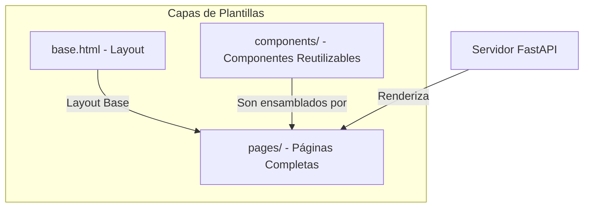

# Módulo: Plantillas Web (Templates)

## 🎯 Propósito del Módulo
Este módulo contiene todas las plantillas HTML de Jinja2 que construyen la interfaz de usuario de la aplicación web `autocode`. Su responsabilidad es definir la estructura, el layout y los componentes visuales, separando la presentación de la lógica del servidor.

## 🏗️ Arquitectura del Módulo
La arquitectura de las plantillas sigue un modelo jerárquico y componentizado, inspirado en patrones como Atomic Design.

1.  **`base.html`**: Actúa como la plantilla maestra que define el layout global (cabecera, pie de página, navegación).
2.  **`components/`**: Contiene fragmentos de UI reutilizables (tarjetas, botones, etc.), a menudo como macros.
3.  **`pages/`**: Ensambla los componentes sobre el layout base para construir las páginas finales que ve el usuario.

## 📁 Componentes del Módulo
### `base.html` - Plantilla Maestra
**Propósito**: Define la estructura HTML común para toda la aplicación.
**Documentación**: [base.md](base.md)

### `/components` - Componentes de UI
**Propósito**: Contiene todos los fragmentos de UI reutilizables.
**Documentación**: [components/_module.md](components/_module.md)

### `/pages` - Páginas de la Aplicación
**Propósito**: Contiene las plantillas para las páginas completas que se sirven en las diferentes rutas.
**Documentación**: [pages/_module.md](pages/_module.md)

## 🔗 Dependencias del Módulo
### Internas
- **`autocode.web.static`**: Las plantillas enlazan a los assets (CSS, JS) de este módulo.
- **`autocode.api.server`**: El servidor FastAPI es responsable de renderizar estas plantillas.

### Externas
- **Jinja2**: El motor de plantillas utilizado para procesar la lógica, la herencia y las macros.

## 💡 Flujo de Trabajo Típico
1.  Una petición llega a una ruta de la API de FastAPI.
2.  El servidor renderiza una plantilla del directorio `pages/`.
3.  Esa plantilla extiende `base.html` e incluye/importa los componentes necesarios de `components/`.
4.  Jinja2 procesa todo y genera un único archivo HTML que se envía al navegador.
