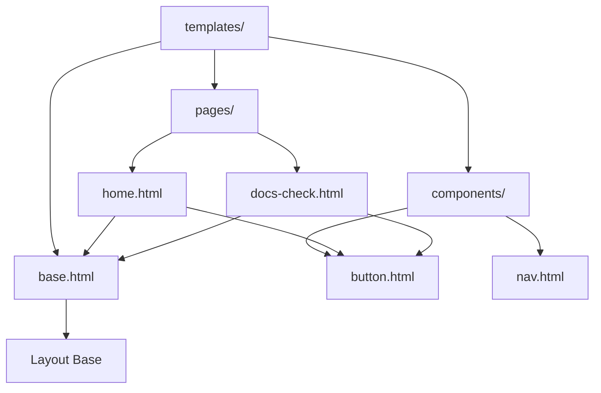
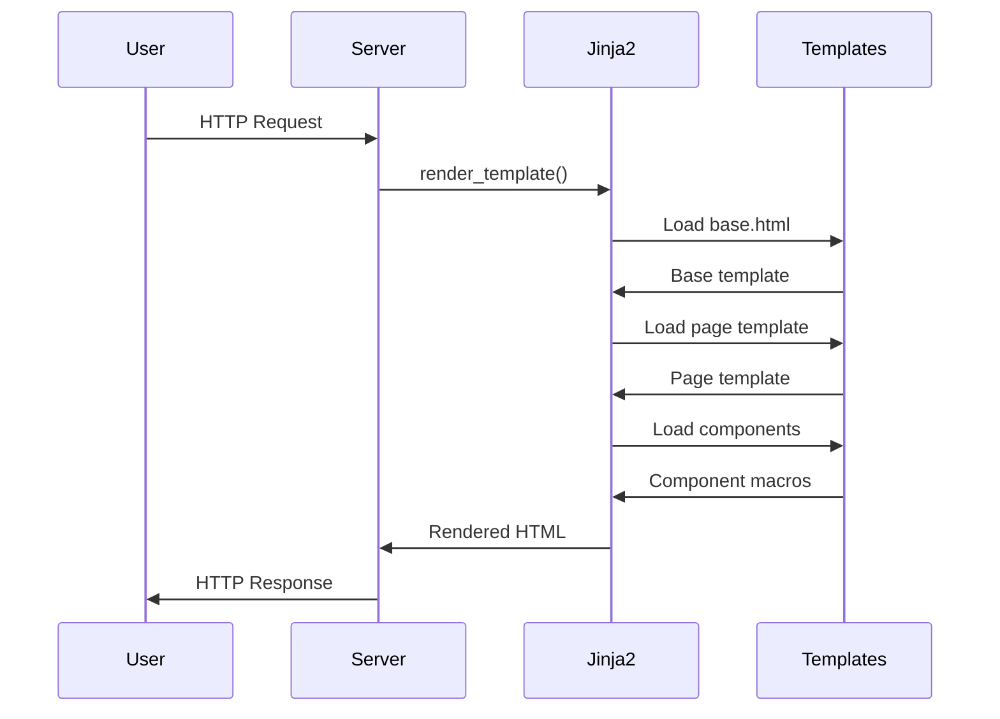

# Templates Module - Documentación

## 🎯 Propósito del Módulo
Este módulo contiene todas las plantillas HTML de Jinja2 que construyen la interfaz de usuario de la aplicación web autocode. Su responsabilidad es definir la estructura, el layout y los componentes visuales, separando la presentación de la lógica del servidor.

## 🏗️ Arquitectura del Módulo

## 📁 Componentes del Módulo
### `base.html` - Template Base
**Propósito**: Plantilla maestra que define la estructura HTML común a todas las páginas
**Documentación**: [base.md](base.md)

### `components/` - Componentes Reutilizables
**Propósito**: Contiene macros y componentes HTML reutilizables
**Documentación**: [components/_module.md](components/_module.md)

### `pages/` - Páginas Completas
**Propósito**: Contiene las plantillas de páginas específicas de la aplicación
**Documentación**: [pages/_module.md](pages/_module.md)

## 🔗 Dependencias del Módulo
### Internas (otros módulos del proyecto)
- `autocode.api.server` - Servidor que renderiza las plantillas
- `autocode.web.static` - Assets JavaScript y CSS

### Externas
- **Jinja2** - Motor de plantillas para Python
- **Tailwind CSS** - Framework CSS para estilos (via CDN)

## 💡 Flujo de Trabajo Típico
1. **Request HTTP**: Usuario accede a una ruta de la aplicación
2. **Server routing**: FastAPI enruta la petición al handler correspondiente
3. **Template rendering**: Jinja2 renderiza la plantilla con datos del contexto
4. **HTML generation**: Se genera HTML final combinando base + página + componentes
5. **Response**: Se envía el HTML renderizado al navegador

## 🔧 Configuración del Módulo
- **Engine**: Jinja2 con herencia de templates
- **Syntax**: `` para lógica, `{{ }}` para variables, `{# #}` para comentarios
- **Herencia**: Patrón de template base con bloques extensibles
- **Componentes**: Macros de Jinja2 para reutilización

## ⚠️ Consideraciones Especiales
- **Herencia**: Todas las páginas extienden de `base.html`
- **Bloques**: Sistema de bloques (`title`, `content`, `scripts`) para extensibilidad
- **Macros**: Componentes definidos como macros para reutilización
- **Context**: Variables pasadas desde el servidor para renderizado dinámico
- **Responsive**: Uso de clases Tailwind para diferentes tamaños de pantalla

## 🧪 Testing
- **Renderizado**: Verificar que las plantillas se renderizan correctamente
- **Herencia**: Comprobar que los bloques se extienden apropiadamente
- **Macros**: Validar que los componentes reciben parámetros correctos
- **Links**: Verificar que la navegación funciona entre páginas

## 🔄 Flujo de Renderizado

## 📖 Navegación Detallada
- [base.html - Template base](base.md)
- [Componentes Reutilizables](components/_module.md)
  - [button.html - Macro de botón](components/button.md)
  - [nav.html - Barra de navegación](components/nav.md)
- [Páginas](pages/_module.md)
  - [home.html - Página de inicio](pages/home.md)
  - [docs-check.html - Página de verificación](pages/docs-check.md)
