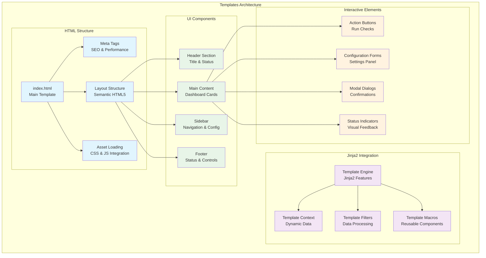
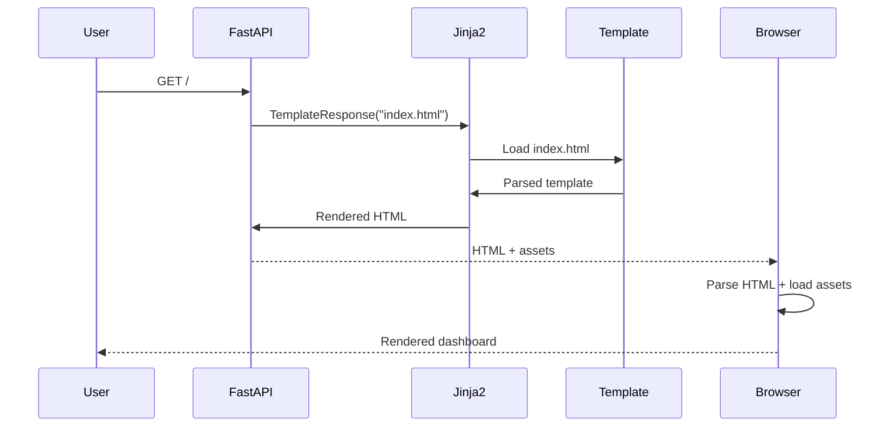
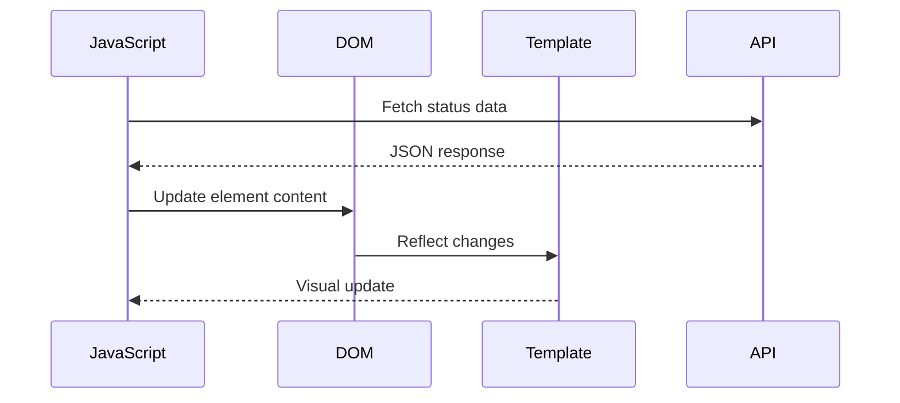
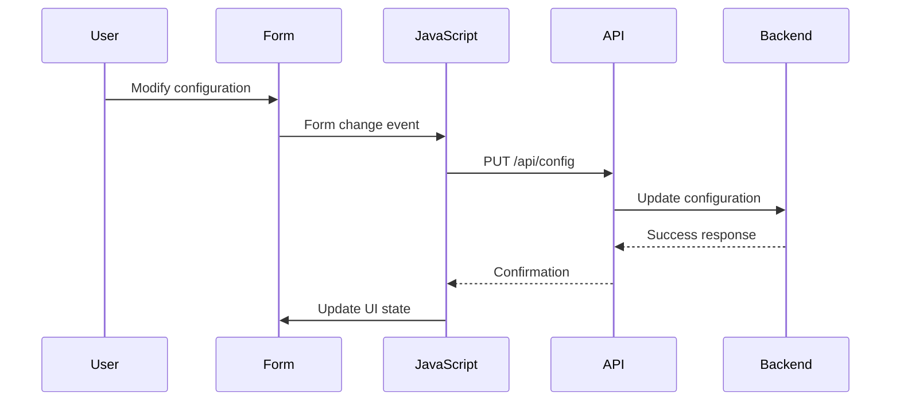

# Autocode Web Templates Module - Documentación

## 🎯 Propósito del Módulo

El módulo `autocode/web/templates` contiene las plantillas HTML que definen la estructura y layout del dashboard web de autocode. Su responsabilidad principal es proporcionar templates Jinja2 bien estructurados, semánticos y optimizados que sirven como base para la interfaz web, integrándose perfectamente con FastAPI y los assets estáticos para crear una experiencia de usuario cohesiva.

## 🏗️ Arquitectura del Módulo



## 📁 Componentes del Módulo

### `index.html` - Template Principal del Dashboard
**Propósito**: Template HTML principal que define toda la estructura del dashboard autocode
**Documentación**: [index.html.md](index.html.md)

**Características principales**:
- **HTML5 Semantic Structure**: Uso correcto de elementos semánticos
- **Jinja2 Template Integration**: Templates dinámicos con FastAPI
- **Responsive Design Foundation**: Base HTML para diseño adaptativo
- **Asset Integration**: Carga optimizada de CSS y JavaScript
- **Accessibility Features**: Estructura accesible para screen readers
- **SEO Optimization**: Meta tags y estructura optimizada
- **Performance Optimization**: Carga eficiente de recursos

**Secciones principales**:
- **Document Head**: Meta tags, title, asset loading
- **Header Section**: Título del dashboard y estado general
- **Main Dashboard**: Cards de métricas y estado de checks
- **Configuration Panel**: Controles de configuración del sistema
- **Footer Section**: Información de estado y controles secundarios

## 🔗 Dependencias del Módulo

### Dependencias de Templating
- **Jinja2**: Motor de templates para renderizado dinámico
- **FastAPI Templates**: Integración con FastAPI Jinja2Templates
- **HTML5**: Estándares modernos de HTML5
- **CSS3**: Integración con hojas de estilo modernas

### Integración con Assets
- **Static Files**: CSS y JavaScript del módulo static
- **FastAPI StaticFiles**: Servicio automático de assets estáticos
- **CDN Support**: Preparado para assets externos (futuro)

### Compatibilidad de Navegadores
- **Modern HTML5**: Chrome 60+, Firefox 55+, Safari 12+, Edge 79+
- **Semantic Elements**: nav, main, section, article, aside
- **Forms API**: Elementos de formulario modernos
- **Accessibility APIs**: ARIA attributes y roles

## 💡 Flujo de Trabajo Típico

### Renderizado del Template


### Actualización Dinámica de Contenido


### Gestión de Formularios


## 🔧 Configuración del Módulo

### Estructura de Archivos
```
autocode/web/templates/
└── index.html          # Main dashboard template
```

### Configuración FastAPI
```python
# En autocode/api/server.py
from fastapi.templating import Jinja2Templates

templates = Jinja2Templates(directory="autocode/web/templates")

@app.get("/", response_class=HTMLResponse)
async def dashboard(request: Request):
    return templates.TemplateResponse("index.html", {
        "request": request,
        "title": "Autocode Monitoring Dashboard",
        "version": "3.1.0"
    })
```

### Variables de Template
```html
<!-- Variables disponibles en template -->
{{ request }}        <!-- FastAPI Request object -->
{{ title }}          <!-- Título del dashboard -->
{{ version }}        <!-- Versión del sistema -->
{{ debug }}          <!-- Modo debug (opcional) -->
```

### Meta Tags de Configuración
```html
<!-- En index.html -->
<meta charset="UTF-8">
<meta name="viewport" content="width=device-width, initial-scale=1.0">
<meta name="description" content="Autocode Monitoring Dashboard">
<meta name="author" content="Autocode System">
<meta name="robots" content="noindex, nofollow">
```

## ⚠️ Consideraciones Especiales

### Seguridad de Templates
- **XSS Prevention**: Jinja2 auto-escaping habilitado
- **CSRF Protection**: Tokens CSRF en formularios (futuro)
- **Content Security Policy**: Meta tags CSP apropiados
- **Input Sanitization**: Validación de datos del template context

### Performance y Optimización
- **Template Caching**: Jinja2 template caching habilitado
- **Asset Optimization**: Carga eficiente de CSS/JS
- **Critical CSS**: Estilos críticos inline (futuro)
- **Resource Hints**: Preload/prefetch de recursos importantes

### Accesibilidad (WCAG 2.1)
- **Semantic HTML**: Uso correcto de elementos semánticos
- **ARIA Attributes**: Labels, roles y properties apropiados
- **Keyboard Navigation**: Orden de tabulación lógico
- **Screen Reader Support**: Estructura navegable para lectores

### SEO y Meta Tags
- **Title Optimization**: Títulos descriptivos y únicos
- **Meta Description**: Descripciones optimizadas
- **Open Graph**: Tags OG para compartir social (futuro)
- **Structured Data**: Schema.org markup (futuro)

## 🧪 Testing y Validación

### Validación HTML
```bash
# Validar HTML5 compliance
curl -s "https://validator.w3.org/nu/?doc=http://localhost:8080" | grep -E "(error|warning)"

# Verificar estructura semántica
# Usar herramientas como axe-core o WAVE
```

### Testing de Templates
```python
# Test de renderizado
def test_index_template():
    from fastapi.testclient import TestClient
    response = client.get("/")
    assert response.status_code == 200
    assert "Autocode Monitoring Dashboard" in response.text
    assert "<!DOCTYPE html>" in response.text
```

### Validación de Accesibilidad
```javascript
// En browser console
// Verificar contraste de colores
axe.run().then(results => {
    console.log('Accessibility issues:', results.violations);
});

// Verificar estructura semántica
console.log('Headings structure:', 
    Array.from(document.querySelectorAll('h1,h2,h3,h4,h5,h6'))
         .map(h => h.tagName + ': ' + h.textContent)
);
```

### Performance Testing
```javascript
// Medir tiempo de renderizado
performance.mark('template-start');
// ... después de carga completa
performance.mark('template-end');
performance.measure('template-render', 'template-start', 'template-end');
```

## 🔄 Flujo de Datos y Estados

### Template Context Data
```python
# Datos pasados al template
{
    "request": Request,
    "title": "Autocode Monitoring Dashboard",
    "version": "3.1.0",
    "debug": False,
    "initial_data": {
        "daemon_status": "running",
        "last_check": "2024-01-01T12:00:00Z",
        "total_checks": 42
    }
}
```

### Estados del Template
- **Loading State**: Skeleton loading mientras se cargan datos
- **Error State**: Mensaje de error si falla la carga inicial
- **Active State**: Dashboard completamente funcional
- **Offline State**: Manejo de pérdida de conexión

### Gestión de Estado con JavaScript
```html
<!-- Estado inicial en template -->
<script>
window.INITIAL_STATE = {
    daemonStatus: '{{ daemon_status|default("unknown") }}',
    lastCheck: '{{ last_check|default("") }}',
    version: '{{ version }}'
};
</script>
```

## 📊 Métricas y Monitoreo del Template

### Métricas de Renderizado
- **Template Render Time**: Tiempo de renderizado server-side
- **First Contentful Paint**: Tiempo hasta primer contenido visible
- **Largest Contentful Paint**: Tiempo hasta contenido principal
- **Cumulative Layout Shift**: Estabilidad visual del layout

### Analytics de Template (futuro)
```html
<!-- Google Analytics / tracking -->
<script>
// Template usage analytics
gtag('event', 'page_view', {
    page_title: '{{ title }}',
    page_location: window.location.href
});
</script>
```

## 🚀 Extensibilidad

### Template Inheritance (futuro)
```html
<!-- base.html template -->
<!DOCTYPE html>
<html>
<head>
    
</head>
<body>
    
</body>
</html>

<!-- index.html extendido -->


    <!-- Dashboard content -->

```

### Template Macros
```html
<!-- Macros reutilizables -->

<div class="status-card {{ status }}">
    <h3>{{ title }}</h3>
    <div class="status-indicator {{ status }}"></div>
    <p>{{ details }}</p>
</div>

```

### Componentes Dinámicos
```html
<!-- Template components -->

<div id="{{ check_name }}-card" class="check-card">
    <div class="card-header">
        <h3>{{ check_data.title }}</h3>
        <button onclick="runCheck('{{ check_name }}')">Run Now</button>
    </div>
    <div class="card-content">
        <div class="check-status {{ check_data.status }}">
            <span class="status-indicator"></span>
            <span class="status-text">{{ check_data.status }}</span>
        </div>
        <p class="check-message">{{ check_data.message }}</p>
    </div>
</div>

```

## 🔧 Debugging y Desarrollo

### Template Debugging
```html
<!-- Debug mode template -->

<div class="debug-panel">
    <h4>Template Debug Info</h4>
    <pre>{{ request|pprint }}</pre>
    <pre>Context: {{ context|pprint }}</pre>
</div>

```

### Development Tools
```python
# Template auto-reload en desarrollo
templates = Jinja2Templates(
    directory="autocode/web/templates",
    auto_reload=True  # Solo en desarrollo
)
```

### Live Reload (desarrollo)
```html
<!-- Hot reload en desarrollo -->

<script>
new EventSource('/dev/reload').onmessage = () => location.reload();
</script>

```

## 📖 Navegación Detallada

### Archivos del Módulo
- [Main Template](index.html.md) - Template principal del dashboard

### Recursos Relacionados
- [Web Module Overview](../_module.md) - Módulo web completo
- [Static Assets](../static/_module.md) - CSS y JavaScript
- [API Integration](../../api/_module.md) - Backend data integration

## 🔄 Integración con Otros Módulos

### Integración con FastAPI
- **Template Engine**: Jinja2Templates automático
- **Static Files**: Referencias a assets del módulo static
- **API Data**: Consumo de datos via JavaScript desde templates

### Integración con Static Assets
- **CSS Loading**: Links a archivos CSS optimizados
- **JavaScript Loading**: Scripts con defer/async apropiados
- **Asset Versioning**: Cache busting para assets (futuro)

### Integración con Backend Data
- **Initial State**: Datos iniciales embebidos en template
- **API Endpoints**: Referencias a endpoints REST
- **Dynamic Updates**: Actualización via JavaScript sin reload

## 🎨 Diseño y UX Considerations

### Layout Responsive
```html
<!-- Responsive structure -->
<div class="dashboard-container">
    <header class="dashboard-header"><!-- Title & status --></header>
    <main class="dashboard-main">
        <aside class="dashboard-sidebar"><!-- Navigation --></aside>
        <section class="dashboard-content"><!-- Main content --></section>
    </main>
    <footer class="dashboard-footer"><!-- Controls --></footer>
</div>
```

### Progressive Enhancement
- **Base Functionality**: Funciona sin JavaScript
- **Enhanced Experience**: JavaScript añade interactividad
- **Graceful Degradation**: Fallbacks para browsers limitados

### User Experience
- **Loading States**: Skeleton screens durante carga
- **Error Handling**: Mensajes de error claros
- **Success Feedback**: Confirmaciones visuales
- **Accessibility**: Navegación por teclado completa

## 🔮 Futuras Mejoras

### Template Features Avanzados
- **Template Inheritance**: Sistema de templates base
- **Component System**: Componentes reutilizables
- **Internationalization**: Soporte multi-idioma
- **Theme System**: Múltiples temas visuales

### Performance Optimizations
- **Server-Side Rendering**: SSR optimizado
- **Template Precompilation**: Templates precompilados
- **Critical CSS Inline**: CSS crítico inline
- **Resource Optimization**: Optimización automática de assets

### Modern Web Features
- **Progressive Web App**: Funcionalidad offline
- **Web Components**: Custom elements estándar
- **CSS-in-JS**: Estilos dinámicos (futuro)
- **WebAssembly**: Procesamiento client-side optimizado
