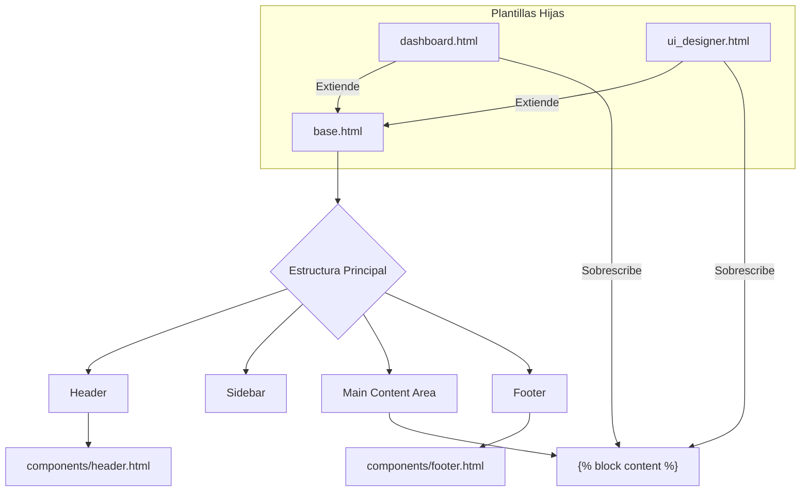

# Plantilla Base (base.html)

## 🎯 Propósito
Este archivo es la plantilla maestra o "layout" principal para toda la interfaz web de `autocode`. Su propósito es definir la estructura HTML común a todas las páginas, incluyendo la cabecera, el pie de página, la barra de navegación lateral y las áreas de contenido dinámico. Garantiza una apariencia y estructura consistentes en toda la aplicación.

## 🏗️ Arquitectura
La plantilla utiliza el motor de plantillas Jinja2 y se basa en el concepto de **herencia de plantillas**. Define una estructura base y expone varios "bloques" (``) que las plantillas hijas pueden sobrescribir para inyectar su propio contenido.



## 📋 Responsabilidades
- **Definir el esqueleto HTML**: Establece la estructura `<html>`, `<head>` y `<body>`.
- **Cargar assets globales**: Incluye los archivos CSS y JavaScript que son necesarios en todas las páginas (e.g., `design-tokens.css`, `style.css`, `api-fetch.js`, `app.js`, y la librería `mermaid.js`).
- **Definir la navegación principal**: Implementa la barra de navegación lateral con enlaces a las secciones principales de la aplicación (Dashboard, UI Designer).
- **Incluir componentes reutilizables**: Utiliza `` para insertar componentes de UI comunes como la cabecera y el pie de página.
- **Proporcionar puntos de extensión**: Define bloques (`title`, `extra_css`, `content`, `extra_js`) que las plantillas hijas pueden personalizar.

## 🔗 Dependencias
### Internas (Plantillas y Assets)
- `components/header.html`: Incluido para la cabecera.
- `components/footer.html`: Incluido para el pie de página.
- `/static/design-tokens.css`: Sistema de diseño base.
- `/static/style.css`: Estilos principales de la aplicación.
- `/static/js/utils/api-fetch.js`: Utilidades para la comunicación con la API.
- `/static/app.js`: Lógica principal del frontend.

### Externas
- `mermaid.js`: Librería externa para renderizar diagramas, cargada desde un CDN.

## 📊 Interfaces Públicas (Bloques de Jinja2)
- ``: Permite a las páginas hijas establecer su propio título en la etiqueta `<title>`. Por defecto es "Dashboard".
- ``: Permite a las páginas hijas añadir hojas de estilo adicionales.
- ``: El bloque principal donde las páginas hijas inyectan su contenido específico.
- ``: Permite a las páginas hijas añadir scripts adicionales.

## 💡 Patrones de Uso
Cualquier nueva página en la aplicación debe extender esta plantilla base.

```jinja
{# Ejemplo de una nueva página que extiende base.html #}



    Mi Nueva Página



    <link rel="stylesheet" href="/static/css/mi-pagina.css">



    <h1>Contenido de Mi Nueva Página</h1>
    <p>Este contenido se insertará en el área principal.</p>



    <script src="/static/js/mi-pagina.js"></script>

```

## ⚠️ Consideraciones
- **Rutas de Assets**: Las rutas a los archivos CSS y JS son absolutas desde la raíz del sitio (e.g., `/static/...`).
- **Estado Activo de Navegación**: La clase `active` en los enlaces de la barra lateral se aplica dinámicamente comparando la ruta de la URL actual (`request.url.path`).
- **Carga de Scripts**: Los scripts principales se cargan con el atributo `defer` para evitar que bloqueen el renderizado del DOM.

## 🧪 Testing
Para verificar esta plantilla:
1. Navegar a las diferentes páginas de la aplicación que la extienden (e.g., `/dashboard`, `/ui-designer`).
2. Comprobar que la estructura base (cabecera, pie de página, sidebar) es consistente en todas ellas.
3. Verificar que el contenido específico de cada página se renderiza correctamente dentro del bloque `content`.
4. Usar las herramientas de desarrollador del navegador para confirmar que todos los assets (CSS, JS) se cargan correctamente.
