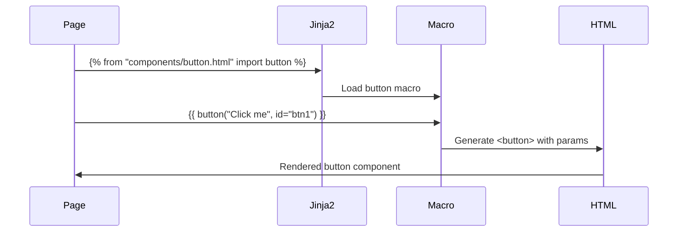

# Templates Components Module - Documentación

## 🎯 Propósito del Módulo
Este módulo contiene todos los componentes de UI reutilizables de la aplicación, definidos como plantillas de Jinja2. Su propósito es encapsular fragmentos de HTML en piezas modulares y configurables (a menudo como macros) que pueden ser fácilmente incluidas o importadas en las plantillas de página principales. Esto promueve la reutilización de código y un desarrollo de la interfaz más limpio y mantenible.

## 🏗️ Arquitectura del Módulo
```mermaid
graph LR
    A[components/] --> B[button.html]
    A --> C[nav.html]
    B --> D[Macro: button()]
    C --> E[Navigation Bar]
    D --> F[Reusable Button]
    E --> G[Static Navigation]
```

## 📁 Componentes del Módulo
### `button.html` - Macro de Botón
**Propósito**: Define una macro reutilizable para generar botones con estilos consistentes
**Documentación**: [button.md](button.md)

### `nav.html` - Barra de Navegación
**Propósito**: Componente de navegación principal con enlaces a las páginas de la aplicación
**Documentación**: [nav.md](nav.md)

## 🔗 Dependencias del Módulo
### Internas (otros módulos del proyecto)
- `autocode.web.templates.base` - Template base que incluye estos componentes

### Externas
- **Jinja2** - Para sintaxis de macros y templates
- **Tailwind CSS** - Para clases de estilo y responsive design

## 💡 Flujo de Trabajo Típico
1. **Definición**: Los componentes se definen como macros o HTML estático
2. **Import**: Las páginas importan los componentes necesarios
3. **Uso**: Se llaman las macros con parámetros específicos
4. **Renderizado**: Jinja2 renderiza los componentes con los valores pasados

## 🔧 Configuración del Módulo
- **Tipo**: Macros de Jinja2 y componentes HTML estáticos
- **Parámetros**: Los macros aceptan parámetros para personalización
- **Estilos**: Uso extensivo de clases Tailwind CSS
- **Accesibilidad**: Elementos semánticamente correctos

## ⚠️ Consideraciones Especiales
- **Reutilización**: Todos los componentes están diseñados para ser reutilizables
- **Consistencia**: Mantienen un estilo visual consistente en toda la aplicación
- **Parámetros**: Los macros validan y manejan parámetros opcionales apropiadamente
- **Responsive**: Todos los componentes son responsive por defecto
- **Estados**: Soporte para diferentes estados (hover, focus, active)

## 🧪 Testing
- **Macros**: Verificar que las macros aceptan parámetros correctos
- **Renderizado**: Comprobar que el HTML generado es válido
- **Estilos**: Validar que las clases CSS se aplican correctamente
- **Responsive**: Verificar comportamiento en diferentes tamaños de pantalla

## 🔄 Flujo de Uso de Macros


## 📖 Navegación Detallada
- [button.html - Macro de botón reutilizable](button.md)
- [nav.html - Barra de navegación principal](nav.md)
