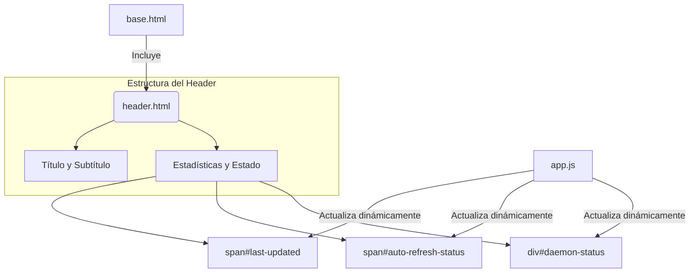

# Componente: Header (header.html)

## 🎯 Propósito
Este archivo define el componente de cabecera (`<header>`) para la interfaz web de `autocode`. Su propósito es proporcionar una barra superior consistente en toda la aplicación, mostrando el título del proyecto, un subtítulo, y estadísticas clave del estado del sistema, como la conexión con el daemon de fondo.

## 🏗️ Arquitectura
Es un componente HTML autocontenido, diseñado para ser incluido en plantillas de layout como `base.html`. Al igual que el footer, su contenido inicial es mayormente estático, pero expone elementos con IDs específicos para que sean actualizados dinámicamente por JavaScript.



## 📋 Responsabilidades
- **Proporcionar una identidad visual**: Muestra el nombre y el ícono de la aplicación.
- **Mostrar el título de la página**: Incluye un subtítulo ("Monitoring Dashboard") que da contexto sobre la aplicación.
- **Presentar información de estado clave**: Muestra la hora de la última actualización, el estado del auto-refresco y, lo más importante, el estado de la conexión con el `AutocodeDaemon` del backend.
- **Proporcionar hooks para JavaScript**: Utiliza IDs para permitir que `app.js` actualice los valores de estado en tiempo real.

## 🔗 Dependencias
### Internas
- **`base.html`**: Este componente está diseñado para ser incluido por la plantilla base.

### Externas
- **JavaScript (`app.js`)**: Esencial para la funcionalidad. `app.js` se encarga de:
    - Poblar la hora de la "Última Actualización".
    - Mostrar el estado del "Auto-refresh".
    - Actualizar el indicador y texto del "Daemon Status" (e.g., "Connecting...", "Connected", "Error").

## 📊 Interfaces Públicas
La "interfaz" de este componente son los IDs que expone para la manipulación por JavaScript:
- `id="last-updated"`: Para mostrar la marca de tiempo de la última actualización.
- `id="auto-refresh-status"`: Para mostrar si el refresco automático está "ON" o "OFF".
- `id="daemon-status"`: El contenedor del estado del daemon.
- `id="daemon-indicator"`: El indicador visual (círculo de color) del estado del daemon.
- `id="daemon-text"`: El texto que describe el estado del daemon.

## 💡 Patrones de Uso
Este componente se utiliza incluyéndolo directamente en una plantilla de layout, típicamente al principio del `<body>`.

```jinja
{# En base.html o cualquier otra plantilla de layout #}
<body>
    
    
    <div class="app-layout">
        ...
    </div>
    ...
</body>
```

## ⚠️ Consideraciones
- **Contenido Dinámico**: La mayor parte de la información útil en el header es dinámica. Sin `app.js`, mostrará valores estáticos y placeholders.
- **Duplicación de Información**: Nótese que `last-updated` y `auto-refresh-status` aparecen tanto en el `header.html` como en el `footer.html`. El JavaScript (`app.js`) debe actualizar ambos conjuntos de elementos. Esta duplicación podría ser intencional para asegurar la visibilidad de la información en todo momento.
- **Estilo**: El estilo visual se define en los archivos CSS globales (`style.css`).

## 🧪 Testing
Para verificar este componente:
1. Cargar cualquier página de la aplicación que lo incluya.
2. Verificar que el título y subtítulo se muestran correctamente.
3. Observar los indicadores de estado a la derecha. Confirmar que `app.js` los actualiza después de conectarse a la API (e.g., el estado del daemon cambia de "Connecting..." a "Connected").
4. Comprobar que la información de "Last Updated" y "Auto-refresh" es consistente con la que se muestra en el `footer.html`.
