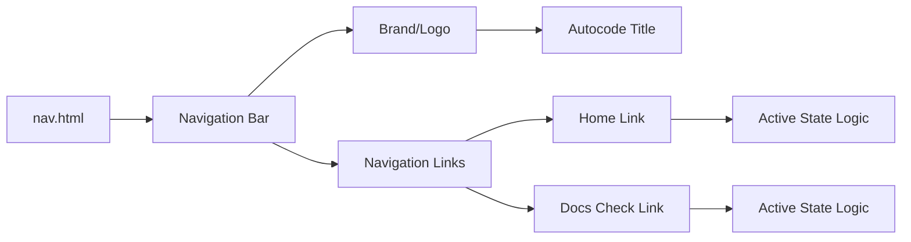
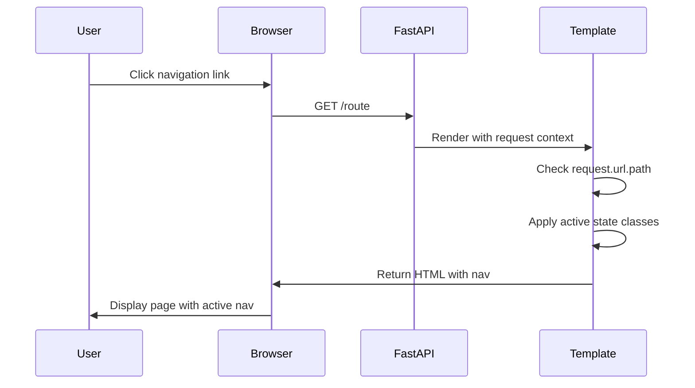

# Nav.html - Barra de Navegación

## 🎯 Propósito
Este archivo define el componente de navegación principal para la interfaz web de autocode. Su propósito es proporcionar una barra superior consistente en toda la aplicación, mostrando el título del proyecto y enlaces de navegación con estados activos visuales. Facilita la navegación entre las diferentes páginas de la aplicación.

## 🏗️ Arquitectura


## 📋 Responsabilidades
- **Brand identity**: Muestra el nombre "Autocode" como marca/título
- **Navigation links**: Proporciona enlaces a las páginas principales
- **Active state**: Indica visualmente la página actual
- **Responsive design**: Se adapta a diferentes tamaños de pantalla
- **Consistent styling**: Mantiene apariencia uniforme en toda la app

## 🔗 Dependencias
### Internas
- `base.html` - Incluido via ``
- **request.url.path** - Variable de contexto de FastAPI para determinar página activa

### Externas
- **Tailwind CSS** - Para styling y responsive utilities
- **FastAPI Request object** - Para acceso a información de la URL actual

## 📊 Interfaces Públicas
### HTML Structure
```html
<nav class="bg-white shadow-md">
  <div class="container mx-auto px-4">
    <div class="flex justify-between items-center py-4">
      <!-- Brand -->
      <div class="text-xl font-bold text-gray-800">Autocode</div>
      
      <!-- Navigation Links -->
      <div class="flex space-x-4">
        <a href="/" class="...">Inicio</a>
        <a href="/docs-check" class="...">Docs Check</a>
      </div>
    </div>
  </div>
</nav>
```

### CSS Classes Principales
- **Container**: `bg-white shadow-md` - Fondo blanco con sombra
- **Layout**: `flex justify-between items-center` - Distribución horizontal
- **Brand**: `text-xl font-bold text-gray-800` - Título prominente
- **Links**: `text-gray-600 hover:text-blue-600 transition-colors` - Estados normal y hover

## 🔧 Configuración
### Active State Logic
```html
text-blue-600 font-semibold
text-blue-600 font-semibold
```

### Navigation Structure
- **Home** (`/`): Página de inicio con resumen de características
- **Docs Check** (`/docs-check`): Interfaz de verificación de documentación

### Responsive Design
- **Container**: `container mx-auto px-4` - Contenedor responsive con padding
- **Spacing**: `space-x-4` - Espaciado horizontal entre links
- **Mobile**: Funciona en dispositivos móviles sin colapsing menu

## 💡 Patrones de Uso
### Inclusión en Base Template
```html
<!-- En base.html -->
<nav>
  
</nav>
```

### Active State Rendering
```html
<!-- Link activo en home -->
<a href="/" class="text-gray-600 hover:text-blue-600 transition-colors text-blue-600 font-semibold">
  Inicio
</a>

<!-- Link inactivo -->
<a href="/docs-check" class="text-gray-600 hover:text-blue-600 transition-colors">
  Docs Check
</a>
```

## ⚠️ Consideraciones
### Limitaciones
- **Static navigation**: Solo dos enlaces hardcodeados, no dinámico
- **No mobile menu**: No hay menú colapsable para móviles (aunque funciona)
- **Path dependency**: Depende de `request.url.path` para estados activos
- **No nested routes**: Solo soporta rutas de primer nivel

### Active State Management
- **URL matching**: Usa comparación exacta de paths para determinar estado activo
- **Visual feedback**: Color azul y font weight para indicar página actual
- **Hover states**: Feedback visual consistente en interacciones

### Responsive Behavior
- **Small screens**: Navigation links pueden ser pequeños en móviles
- **No overflow**: No maneja overflow si se añaden más links
- **Flexbox layout**: Se mantiene horizontal en todos los tamaños

## 🧪 Testing
### Navigation Testing
1. **Home navigation**: Click en "Inicio" debe navegar a `/`
2. **Docs navigation**: Click en "Docs Check" debe navegar a `/docs-check`
3. **Active states**: La página actual debe mostrarse destacada
4. **Hover effects**: Links deben cambiar color en hover

### Responsive Testing
- **Mobile**: Verificar que navigation se mantiene legible
- **Desktop**: Comprobar espaciado y alineación correctos
- **Tablet**: Validar comportamiento en tamaños intermedios

## 🔄 Flujo de Navegación


## 🚀 Mejoras Futuras
- **Dynamic navigation**: Generar links desde configuración
- **Mobile menu**: Hamburger menu para dispositivos móviles
- **Breadcrumbs**: Navegación jerárquica para páginas anidadas
- **User menu**: Área de usuario/settings cuando se implemente auth
- **Search**: Barra de búsqueda integrada
- **Accessibility**: Mejores atributos ARIA y navegación por teclado
- **Sub-navigation**: Soporte para menús desplegables o sub-secciones
