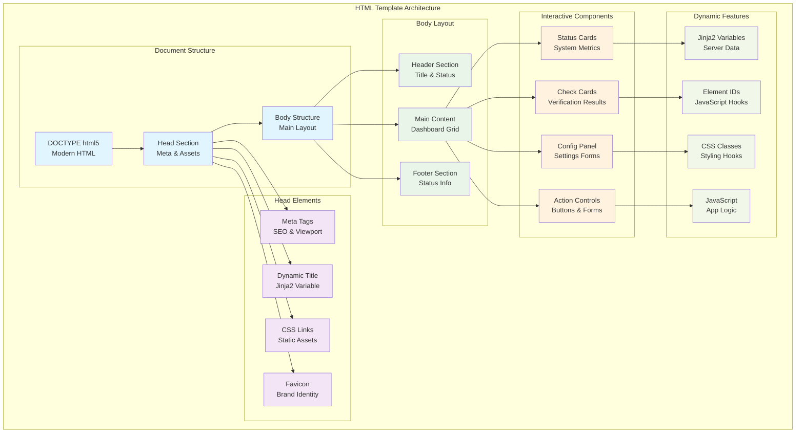
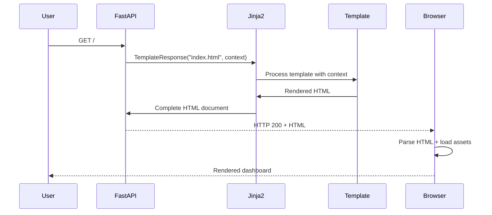

# Autocode Dashboard HTML Template (index.html)

## 🎯 Propósito

El archivo `index.html` es el template principal Jinja2 que define la estructura HTML completa del dashboard web de autocode. Su responsabilidad principal es proporcionar un esqueleto semántico, accesible y bien estructurado que sirve como base para la interfaz web, integrando perfectamente con los assets estáticos y la lógica JavaScript para crear una experiencia de usuario cohesiva.

## 🏗️ Arquitectura del Archivo



## 📋 Responsabilidades

### Estructura del Documento
- **HTML5 Semantic Structure**: Uso correcto de elementos semánticos
- **Document Head**: Meta tags, title, y enlaces a assets
- **Body Layout**: Estructura principal del dashboard
- **Accessibility**: Atributos ARIA y estructura accesible
- **SEO Optimization**: Meta tags y estructura optimizada

### Integración con Assets
- **CSS Loading**: Enlaces a hojas de estilo estáticas
- **JavaScript Loading**: Scripts con defer/async apropiados
- **Favicon Integration**: Iconos y meta tags de branding
- **Font Loading**: Carga optimizada de fuentes web
- **Asset Versioning**: Preparado para cache busting

### Jinja2 Template Features
- **Dynamic Content**: Variables del contexto del template
- **Conditional Rendering**: Bloques condicionales Jinja2
- **Template Inheritance**: Preparado para sistema de templates base
- **Data Binding**: Integración de datos del servidor
- **Escape Handling**: Manejo seguro de contenido dinámico

### JavaScript Integration
- **DOM Structure**: IDs y clases para JavaScript binding
- **Event Targets**: Elementos preparados para event listeners
- **Data Attributes**: Atributos para configuración JavaScript
- **Initial State**: Estado inicial embebido para JavaScript
- **Progressive Enhancement**: Funcionalidad básica sin JavaScript

## 🔗 Dependencias

### Template Engine
- **Jinja2**: Motor de templates para renderizado dinámico
- **FastAPI**: Framework que proporciona el contexto del template
- **HTML5**: Estándares modernos de markup semántico

### Static Assets
- **style.css**: Hoja de estilos principal del dashboard
- **app.js**: Lógica JavaScript del dashboard
- **Favicon Files**: Iconos para diferentes dispositivos

### Browser Requirements
- **HTML5 Support**: Elementos semánticos modernos
- **CSS3 Support**: Para estilos avanzados
- **JavaScript ES6+**: Para funcionalidad interactiva
- **Modern DOM APIs**: Para manipulación dinámica

### Template Context
```python
# Contexto esperado del template
{
    "request": Request,
    "title": "Autocode Monitoring Dashboard",
    "version": "3.1.0",
    "debug": False,
    "initial_data": {
        "daemon_status": "running",
        "last_check": "2024-01-01T12:00:00Z"
    }
}
```

## 💡 Patrones de Uso

### Document Head Structure
```html
<!DOCTYPE html>
<html lang="en">
<head>
    <meta charset="UTF-8">
    <meta name="viewport" content="width=device-width, initial-scale=1.0">
    <meta name="description" content="Autocode Monitoring Dashboard - Real-time system monitoring">
    <meta name="author" content="Autocode System">
    <meta name="robots" content="noindex, nofollow">
    
    <!-- Security Headers -->
    <meta http-equiv="X-Content-Type-Options" content="nosniff">
    <meta http-equiv="X-Frame-Options" content="DENY">
    
    <!-- Title with Jinja2 variable -->
    <title>{{ title|default("Autocode Dashboard") }}</title>
    
    <!-- CSS Assets -->
    <link rel="stylesheet" href="{{ url_for('static', path='/style.css') }}">
    
    <!-- Favicon -->
    <link rel="icon" type="image/x-icon" href="/static/favicon.ico">
</head>
```

### Body Layout Structure
```html
<body>
    <div class="dashboard-container" data-version="{{ version }}">
        <!-- Header Section -->
        <header class="dashboard-header">
            <h1>{{ title|default("Autocode Monitoring Dashboard") }}</h1>
            <div class="system-status">
                <div id="daemon-indicator" class="status-indicator"></div>
                <span id="daemon-text">Loading...</span>
            </div>
        </header>

        <!-- Main Content -->
        <main class="dashboard-main">
            <!-- System Metrics -->
            <section class="system-metrics">
                <div class="metric-card">
                    <h3>System Uptime</h3>
                    <span id="uptime">--</span>
                </div>
                <div class="metric-card">
                    <h3>Total Checks</h3>
                    <span id="total-checks">--</span>
                </div>
                <div class="metric-card">
                    <h3>Last Check</h3>
                    <span id="last-check">--</span>
                </div>
            </section>

            <!-- Check Results -->
            <section class="check-results">
                <!-- Dynamic check cards -->
            </section>
        </main>

        <!-- Footer -->
        <footer class="dashboard-footer">
            <div class="status-info">
                <span>Last updated: <span id="last-updated">--</span></span>
                <span>Auto-refresh: <span id="auto-refresh-status">ON</span></span>
            </div>
        </footer>
    </div>

    <!-- JavaScript -->
    <script src="{{ url_for('static', path='/app.js') }}" defer></script>
</body>
</html>
```

### Check Card Template Pattern
```html
<!-- Documentation Check Card -->
<div id="doc-check" class="check-card">
    <div class="card-header">
        <h3>Documentation Check</h3>
        <button onclick="runCheck('doc_check')" class="btn btn-primary">Run Now</button>
    </div>
    
    <div class="card-content">
        <div class="check-status">
            <div class="status-indicator"></div>
            <span class="status-text">Unknown</span>
        </div>
        
        <p class="check-message">Checking documentation status...</p>
        
        <div class="check-timestamp">
            Last run: <span class="timestamp">--</span>
        </div>
        
        <!-- Expandable details -->
        <details class="check-details">
            <summary>Details</summary>
            <pre class="check-details-content">No details available</pre>
        </details>
    </div>
</div>
```

## 🔧 Configuración

### Meta Tags Configuration
```html
<!-- Essential Meta Tags -->
<meta charset="UTF-8">
<meta name="viewport" content="width=device-width, initial-scale=1.0">
<meta name="description" content="Real-time monitoring dashboard for autocode system">
<meta name="keywords" content="autocode, monitoring, dashboard, development tools">
<meta name="author" content="Autocode System">

<!-- Security Meta Tags -->
<meta http-equiv="X-Content-Type-Options" content="nosniff">
<meta http-equiv="X-Frame-Options" content="DENY">
<meta http-equiv="X-XSS-Protection" content="1; mode=block">

<!-- CSP (Content Security Policy) -->
<meta http-equiv="Content-Security-Policy" 
      content="default-src 'self'; script-src 'self' 'unsafe-inline'; style-src 'self' 'unsafe-inline';">

<!-- Robots -->
<meta name="robots" content="noindex, nofollow">
```

### Asset Loading Configuration
```html
<!-- CSS Assets -->
<link rel="stylesheet" href="{{ url_for('static', path='/style.css') }}">

<!-- Preload Critical Assets -->
<link rel="preload" href="{{ url_for('static', path='/style.css') }}" as="style">
<link rel="preload" href="{{ url_for('static', path='/app.js') }}" as="script">

<!-- JavaScript Assets -->
<script src="{{ url_for('static', path='/app.js') }}" defer></script>

<!-- Conditional Debug Assets -->

<script>
    window.DEBUG = true;
    console.log('Debug mode enabled');
</script>

```

### Jinja2 Variables Configuration
```html
<!-- Template Variables -->
<title>{{ title|default("Autocode Dashboard") }} - v{{ version|default("1.0") }}</title>

<!-- Data Attributes -->
<div class="dashboard-container" 
     data-version="{{ version }}"
     data-debug="{{ debug|lower }}"
     data-initial-state='{{ initial_data|tojson if initial_data else "{}" }}'>

<!-- Conditional Content -->

<div class="debug-info">
    <h4>Debug Information</h4>
    <pre>{{ request|pprint }}</pre>
</div>

```

## ⚠️ Consideraciones Especiales

### Security Considerations
- **XSS Prevention**: Jinja2 auto-escaping habilitado por defecto
- **CSRF Protection**: Preparado para tokens CSRF en formularios
- **Content Security Policy**: Headers CSP apropiados
- **Input Sanitization**: Validación de datos del template context
- **Secure Headers**: X-Frame-Options, X-Content-Type-Options

### Performance Optimization
- **Critical CSS**: Posibilidad de inline critical CSS
- **Asset Loading**: Defer/async para JavaScript no crítico
- **Preload Hints**: Preload para assets críticos
- **Compression**: Preparado para gzip/brotli compression
- **Caching**: Headers apropiados para caching

### Accessibility (WCAG 2.1)
- **Semantic HTML**: Uso correcto de elementos semánticos
- **ARIA Attributes**: Labels, roles y properties apropiados
- **Keyboard Navigation**: Orden de tabulación lógico
- **Screen Reader Support**: Estructura navegable
- **Focus Management**: Indicadores de focus claros

### SEO Optimization
- **Title Tags**: Títulos descriptivos y únicos
- **Meta Description**: Descripciones optimizadas
- **Structured Data**: Preparado para Schema.org markup
- **Heading Hierarchy**: Estructura H1-H6 lógica
- **Alt Text**: Textos alternativos para imágenes

## 🧪 Testing y Validación

### HTML Validation
```bash
# Validar HTML con W3C Validator
curl -F "file=@autocode/web/templates/index.html" \
     https://validator.w3.org/nu/

# Validar renderizado final
curl http://localhost:8080 | tidy -errors
```

### Template Testing
```python
# Test de renderizado de template
def test_index_template():
    from fastapi.testclient import TestClient
    from autocode.api.server import app
    
    client = TestClient(app)
    response = client.get("/")
    
    assert response.status_code == 200
    assert "<!DOCTYPE html>" in response.text
    assert "Autocode Monitoring Dashboard" in response.text
    assert 'id="daemon-indicator"' in response.text
```

### Accessibility Testing
```javascript
// Test de accesibilidad en browser console
// Verificar estructura semántica
const headings = Array.from(document.querySelectorAll('h1,h2,h3,h4,h5,h6'));
console.log('Heading structure:', headings.map(h => h.tagName + ': ' + h.textContent));

// Verificar labels de formularios
const inputs = Array.from(document.querySelectorAll('input, select, textarea'));
const unlabeled = inputs.filter(input => !input.labels || input.labels.length === 0);
console.log('Unlabeled inputs:', unlabeled);

// Verificar contraste
axe.run().then(results => {
    console.log('Accessibility violations:', results.violations);
});
```

### Performance Testing
```javascript
// Medir performance de carga
performance.mark('template-start');
window.addEventListener('load', () => {
    performance.mark('template-end');
    performance.measure('template-load', 'template-start', 'template-end');
    
    const measure = performance.getEntriesByName('template-load')[0];
    console.log('Template load time:', measure.duration + 'ms');
});
```

## 🔄 Flujo de Datos y Estados

### Template Rendering Flow


### State Management in Template
```html
<!-- Initial state embedding -->
<script>
window.INITIAL_STATE = {
    daemonStatus: '{{ initial_data.daemon_status|default("unknown") }}',
    lastCheck: '{{ initial_data.last_check|default("") }}',
    version: '{{ version }}',
    debug: {{ debug|lower }}
};
</script>

<!-- State-dependent rendering -->

<div class="system-status success">
    <span class="status-indicator success"></span>
    <span>System Running</span>
</div>

<div class="system-status warning">
    <span class="status-indicator warning"></span>
    <span>System Status Unknown</span>
</div>

```

### Dynamic Content Areas
```html
<!-- Areas for JavaScript updates -->
<div id="dynamic-metrics">
    <!-- JavaScript will populate system metrics -->
</div>

<div id="check-results-container">
    <!-- JavaScript will populate check results -->
</div>

<div id="notifications">
    <!-- JavaScript will show notifications -->
</div>
```

## 📊 Métricas y Monitoreo

### Template Performance Metrics
```html
<!-- Performance monitoring -->
<script>
// Monitor template rendering performance
performance.mark('template-render-start');

window.addEventListener('DOMContentLoaded', () => {
    performance.mark('template-render-end');
    performance.measure('template-render', 'template-render-start', 'template-render-end');
    
    // Log performance metrics
    const renderTime = performance.getEntriesByName('template-render')[0];
    console.log('Template render time:', renderTime.duration);
});
</script>
```

### User Interaction Tracking
```html
<!-- Analytics integration points -->
<script>
// Track template usage
if (window.gtag) {
    gtag('event', 'page_view', {
        page_title: '{{ title }}',
        page_location: window.location.href,
        template_version: '{{ version }}'
    });
}

// Track interactive elements
document.addEventListener('click', (event) => {
    if (event.target.matches('[data-track]')) {
        const action = event.target.dataset.track;
        console.log('User interaction:', action);
    }
});
</script>
```

## 🚀 Extensibilidad

### Template Inheritance (Future)
```html
<!-- Base template pattern -->


{{ title }} - Autocode Dashboard


    {{ super() }}
    <link rel="stylesheet" href="{{ url_for('static', path='/dashboard.css') }}">



    <div class="dashboard-container">
        <!-- Dashboard specific content -->
    </div>



    {{ super() }}
    <script src="{{ url_for('static', path='/dashboard.js') }}"></script>

```

### Component Macros
```html
<!-- Reusable template macros -->

<div id="{{ check_name }}" class="check-card {{ check_data.status }}">
    <div class="card-header">
        <h3>{{ check_data.title }}</h3>
        <button onclick="runCheck('{{ check_name }}')" class="btn btn-primary">
            Run Now
        </button>
    </div>
    <div class="card-content">
        <div class="check-status">
            <span class="status-indicator {{ check_data.status }}"></span>
            <span class="status-text">{{ check_data.status|title }}</span>
        </div>
        <p class="check-message">{{ check_data.message }}</p>
    </div>
</div>


<!-- Usage -->
{{ render_check_card('doc-check', doc_check_data) }}
```

### Conditional Features
```html
<!-- Feature flags in template -->

<section class="advanced-metrics">
    <!-- Advanced metrics UI -->
</section>



<button onclick="toggleTheme()" class="theme-toggle">
    🌙 Toggle Theme
</button>



<section class="admin-controls">
    <!-- Admin-only controls -->
</section>

```

## 🔧 Debugging y Desarrollo

### Debug Mode Features
```html
<!-- Debug mode template additions -->

<div class="debug-panel">
    <h4>Debug Information</h4>
    <details>
        <summary>Template Context</summary>
        <pre>{{ context|pprint }}</pre>
    </details>
    <details>
        <summary>Request Info</summary>
        <pre>{{ request|pprint }}</pre>
    </details>
    <details>
        <summary>Performance Metrics</summary>
        <div id="debug-performance"></div>
    </details>
</div>

<style>
.debug-panel {
    position: fixed;
    top: 10px;
    right: 10px;
    background: #fff;
    border: 1px solid #ddd;
    padding: 10px;
    font-size: 12px;
    max-width: 300px;
    z-index: 9999;
}
</style>

```

### Development Helpers
```html
<!-- Development utilities -->

<script>
// Development console helpers
window.dev = {
    template: {
        context: {{ context|tojson if context else '{}' }},
        version: '{{ version }}',
        renderTime: null
    },
    utils: {
        reloadCSS: () => {
            const links = document.querySelectorAll('link[rel="stylesheet"]');
            links.forEach(link => {
                const href = link.href;
                link.href = href + '?v=' + Date.now();
            });
        },
        highlightElements: (selector) => {
            document.querySelectorAll(selector).forEach(el => {
                el.style.outline = '2px solid red';
            });
        }
    }
};

console.log('Development utilities available at window.dev');
</script>

```

### Live Reload Support
```html
<!-- Live reload for development -->

<script>
// Hot reload support
const eventSource = new EventSource('/dev/reload');
eventSource.onmessage = function(event) {
    if (event.data === 'reload') {
        location.reload();
    }
};

// CSS hot reload
eventSource.addEventListener('css-reload', function(event) {
    window.dev.utils.reloadCSS();
});
</script>

```

## 📖 HTML Structure Reference

### Document Outline
```html
<!DOCTYPE html>
<html lang="en">
<head>
    <!-- Meta tags -->
    <!-- Title -->
    <!-- CSS assets -->
    <!-- Favicon -->
</head>
<body>
    <div class="dashboard-container">
        <header class="dashboard-header">
            <!-- System title and status -->
        </header>
        
        <main class="dashboard-main">
            <section class="system-metrics">
                <!-- Key metrics cards -->
            </section>
            
            <section class="check-results">
                <!-- Check status cards -->
            </section>
            
            <section class="configuration">
                <!-- Settings and controls -->
            </section>
        </main>
        
        <footer class="dashboard-footer">
            <!-- Status info and controls -->
        </footer>
    </div>
    
    <!-- JavaScript assets -->
    <!-- Initial state script -->
</body>
</html>
```

### Element ID Reference
```html
<!-- System Status -->
<div id="daemon-indicator">      <!-- Daemon status indicator -->
<span id="daemon-text">          <!-- Daemon status text -->

<!-- Metrics -->
<span id="uptime">               <!-- System uptime -->
<span id="total-checks">         <!-- Total checks run -->
<span id="last-check">           <!-- Last check timestamp -->

<!-- Footer Status -->
<span id="last-updated">         <!-- Last UI update -->
<span id="auto-refresh-status">  <!-- Auto-refresh status -->

<!-- Check Cards -->
<div id="doc-check">             <!-- Documentation check card -->
<div id="git-check">             <!-- Git analysis check card -->
<div id="test-check">            <!-- Test validation check card -->
```

### CSS Class Reference
```html
<!-- Layout Classes -->
.dashboard-container             <!-- Main container -->
.dashboard-header               <!-- Header section -->
.dashboard-main                 <!-- Main content area -->
.dashboard-footer               <!-- Footer section -->

<!-- Component Classes -->
.check-card                     <!-- Individual check card -->
.status-indicator               <!-- Status dot indicator -->
.metric-card                    <!-- System metric card -->
.btn                           <!-- Button component -->

<!-- State Classes -->
.success                       <!-- Success state -->
.warning                       <!-- Warning state -->
.error                         <!-- Error state -->
.loading                       <!-- Loading state -->
```

## 🔄 Integración con Sistema

### FastAPI Integration
```python
# Template rendering in FastAPI
@app.get("/", response_class=HTMLResponse)
async def dashboard(request: Request):
    context = {
        "request": request,
        "title": "Autocode Monitoring Dashboard",
        "version": "3.1.0",
        "debug": settings.DEBUG,
        "initial_data": await get_initial_dashboard_data()
    }
    return templates.TemplateResponse("index.html", context)
```

### JavaScript Integration
```html
<!-- JavaScript hooks in template -->
<script>
// Make template data available to JavaScript
window.TEMPLATE_DATA = {
    version: '{{ version }}',
    debug: {{ debug|lower }},
    initialState: {{ initial_data|tojson if initial_data else '{}' }}
};

// Initialize dashboard when DOM is ready
document.addEventListener('DOMContentLoaded', function() {
    if (typeof AutocodeDashboard !== 'undefined') {
        window.dashboard = new AutocodeDashboard();
    }
});
</script>
```

### CSS Integration
```html
<!-- CSS integration patterns -->
<!-- Theme support -->
<html data-theme="{{ theme|default('light') }}">

<!-- State classes -->
<body class="{{ 'debug' if debug else '' }}">

<!-- Dynamic classes -->
<div class="dashboard-container" data-state="{{ initial_state }}">
```

## 🔮 Futuras Mejoras

### Progressive Web App Features
```html
<!-- PWA manifest -->
<link rel="manifest" href="/static/manifest.json">

<!-- Service worker registration -->
<script>
if ('serviceWorker' in navigator) {
    navigator.serviceWorker.register('/static/sw.js');
}
</script>

<!-- Offline support -->
<div id="offline-indicator" class="hidden">
    You are currently offline. Some features may be limited.
</div>
```

### Advanced Accessibility
```html
<!-- Enhanced accessibility features -->
<div role="main" aria-label="Dashboard content">
    <section aria-labelledby="metrics-heading">
        <h2 id="metrics-heading">System Metrics</h2>
        <!-- Metrics content -->
    </section>
</div>

<!-- Live regions for dynamic updates -->
<div aria-live="polite" aria-label="System notifications" id="notifications">
</div>

<!-- Skip navigation -->
<a href="#main-content" class="skip-link">Skip to main content</a>
```

### Internationalization Support
```html
<!-- i18n attributes -->
<html lang="{{ locale|default('en') }}" dir="{{ text_direction|default('ltr') }}">

<!-- Translatable content -->
<h1>{{ _('Dashboard Title') }}</h1>
<button>{{ _('Run Check') }}</button>

<!-- Locale-specific formatting -->
<time datetime="{{ timestamp.isoformat() }}">
    {{ timestamp.strftime(locale_date_format) }}
</time>
