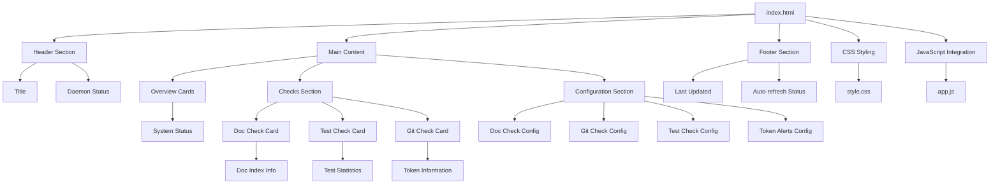

# index.html

## 🎯 Propósito
Template HTML principal del dashboard de monitoreo de autocode que proporciona interfaz web completa para visualizar estado del daemon, resultados de verificaciones, configuración dinámica y control manual. Utiliza FastAPI templates con Jinja2 para servir contenido dinámico.

## 🏗️ Arquitectura


## 📋 Responsabilidades
- **Estructura HTML**: Proporcionar estructura semántica para el dashboard
- **Interfaz de estado**: Mostrar estado del daemon y verificaciones en tiempo real
- **Controles interactivos**: Botones para ejecutar verificaciones manualmente
- **Configuración dinámica**: Formularios para ajustar configuración sin reiniciar
- **Información detallada**: Mostrar estadísticas específicas por tipo de verificación
- **Responsive design**: Interfaz que funciona en diferentes tamaños de pantalla

## 🔗 Dependencias
### Template Engine
- **FastAPI Templates**: Sistema de templates basado en Jinja2
- **Jinja2**: Motor de templates para contenido dinámico

### Assets
- **CSS**: `{{ url_for('static', path='/style.css') }}`
- **JavaScript**: `{{ url_for('static', path='/app.js') }}`

### JavaScript Functions
- `runCheck(checkName)` - Ejecutar verificación manual
- `updateConfig()` - Actualizar configuración del daemon

## 📊 Estructura de Elementos
### Header Section
```html
<header class="header">
    <h1>🔧 Autocode Monitoring Dashboard</h1>
    <div class="daemon-status" id="daemon-status">
        <span class="status-indicator" id="daemon-indicator"></span>
        <span id="daemon-text">Connecting...</span>
    </div>
</header>
```

### System Status Overview
```html
<section class="overview">
    <div class="card">
        <h2>📊 System Status</h2>
        <div class="status-grid">
            <div class="stat">
                <span class="stat-label">Uptime</span>
                <span class="stat-value" id="uptime">--</span>
            </div>
            <div class="stat">
                <span class="stat-label">Total Checks</span>
                <span class="stat-value" id="total-checks">--</span>
            </div>
            <div class="stat">
                <span class="stat-label">Last Check</span>
                <span class="stat-value" id="last-check">--</span>
            </div>
        </div>
    </div>
</section>
```

### Check Cards Structure
```html
<div class="check-card" id="doc-check">
    <div class="check-header">
        <h3>📚 Documentation Check</h3>
        <div class="check-controls">
            <button class="btn-run" onclick="runCheck('doc_check')">Run Now</button>
            <div class="check-status">
                <span class="status-indicator unknown"></span>
                <span class="status-text">Unknown</span>
            </div>
        </div>
    </div>
    <div class="check-details">
        <!-- Status info, specialized data, details -->
    </div>
</div>
```

## 🔧 Configuración
### Document Structure
```html
<!DOCTYPE html>
<html lang="en">
<head>
    <meta charset="UTF-8">
    <meta name="viewport" content="width=device-width, initial-scale=1.0">
    <title>Autocode Monitoring Dashboard</title>
    <!-- CSS and JS links -->
</head>
<body>
    <div class="container">
        <!-- Content structure -->
    </div>
</body>
</html>
```

### CSS Classes
- `.container` - Contenedor principal
- `.header` - Cabecera con título y estado
- `.main` - Contenido principal
- `.overview` - Sección de estadísticas generales
- `.checks` - Sección de verificaciones
- `.config` - Sección de configuración
- `.footer` - Pie de página

## 💡 Patrones de Uso
### Estado del Daemon
```html
<!-- Indicador de estado que cambia dinámicamente -->
<div class="daemon-status" id="daemon-status">
    <span class="status-indicator" id="daemon-indicator"></span>
    <span id="daemon-text">Connecting...</span>
</div>
```

### Botones de Acción
```html
<!-- Botón para ejecutar verificación manual -->
<button class="btn-run" onclick="runCheck('doc_check')">Run Now</button>
```

### Configuración Dinámica
```html
<!-- Checkbox con callback para actualizar configuración -->
<input type="checkbox" id="doc-check-enabled" onchange="updateConfig()">

<!-- Number input con callback -->
<input type="number" id="doc-check-interval" min="1" max="1440" value="10" onchange="updateConfig()">
```

## ⚠️ Consideraciones
### Funcionalidad
- **JavaScript requerido**: Todas las funciones interactivas dependen de JavaScript
- **FastAPI templates**: Requiere servidor FastAPI para renderizar correctamente
- **Auto-refresh**: Contenido se actualiza automáticamente vía JavaScript
- **Estado inicial**: Elementos muestran "--" hasta que se cargan datos

### Limitaciones
- **No SSR**: Contenido dinámico se carga vía JavaScript, no server-side rendering
- **Single page**: Todo el contenido está en una sola página HTML
- **Dependencia de API**: Requiere que la API REST esté funcionando
- **No offline**: No funciona sin conexión al servidor

## 🧪 Testing
### Pruebas Visuales
```html
<!-- Verificar elementos clave están presentes -->
<script>
function testElements() {
    const requiredElements = [
        'daemon-indicator',
        'daemon-text',
        'uptime',
        'total-checks',
        'last-check',
        'doc-check',
        'git-check',
        'test-check'
    ];
    
    requiredElements.forEach(id => {
        const element = document.getElementById(id);
        console.log(`${id}: ${element ? 'Found' : 'Missing'}`);
    });
}
</script>
```

### Pruebas de Interacción
```html
<!-- Verificar que botones responden -->
<script>
function testButtons() {
    const buttons = document.querySelectorAll('.btn-run');
    buttons.forEach(button => {
        button.click();
        console.log(`Button clicked: ${button.textContent}`);
    });
}
</script>
```

## 🔄 Flujo de Datos
### Inicialización
1. **Page Load**: Navegador carga HTML
2. **CSS Load**: Estilos se aplican
3. **JavaScript Load**: app.js se ejecuta
4. **Dashboard Init**: AutocodeDashboard se inicializa
5. **Data Fetch**: Se obtienen datos iniciales de la API

### Actualizaciones de Estado
1. **Timer Trigger**: Auto-refresh cada 5 segundos
2. **API Call**: Fetch a /api/status
3. **DOM Update**: JavaScript actualiza elementos
4. **Visual Update**: Usuario ve cambios en tiempo real

### Interacciones del Usuario
1. **Button Click**: Usuario hace click en "Run Now"
2. **JavaScript Handler**: runCheck() se ejecuta
3. **API Call**: POST a /api/checks/{check_name}/run
4. **Response**: Servidor responde con resultado
5. **UI Update**: Interfaz se actualiza inmediatamente

## 📈 Elementos Especializados
### Documentation Check
```html
<div class="doc-index-info" id="doc-index-info">
    <div class="index-stats">
        <span class="index-label">📋 Documentation Index:</span>
        <div class="index-stats-grid">
            <div class="index-stat">
                <span class="index-stat-value" id="doc-index-modules">--</span>
                <span class="index-stat-label">Modules</span>
            </div>
            <div class="index-stat">
                <span class="index-stat-value" id="doc-index-files">--</span>
                <span class="index-stat-label">Files</span>
            </div>
            <div class="index-stat">
                <span class="index-stat-value" id="doc-index-purposes">--</span>
                <span class="index-stat-label">Purposes</span>
            </div>
        </div>
    </div>
</div>
```

### Test Check Statistics
```html
<div class="test-info" id="test-check-stats">
    <div class="test-breakdown">
        <span class="test-label">🧪 Tests:</span>
        <div class="test-stats-grid">
            <div class="test-stat">
                <span class="test-stat-value" id="test-missing-count">--</span>
                <span class="test-stat-label">Missing</span>
            </div>
            <div class="test-stat">
                <span class="test-stat-value" id="test-passing-count">--</span>
                <span class="test-stat-label">Passing</span>
            </div>
            <div class="test-stat">
                <span class="test-stat-value" id="test-failing-count">--</span>
                <span class="test-stat-label">Failing</span>
            </div>
            <div class="test-stat">
                <span class="test-stat-value" id="test-orphaned-count">--</span>
                <span class="test-stat-label">Orphaned</span>
            </div>
        </div>
    </div>
</div>
```

### Git Check Token Information
```html
<div class="token-info" id="git-check-tokens">
    <div class="token-stats">
        <span class="token-label">📊 Tokens:</span>
        <span class="token-count" id="git-token-count">0</span>
        <span class="token-threshold" id="git-token-threshold">/ 50,000</span>
        <span class="token-warning" id="git-token-warning"></span>
    </div>
</div>
```

### Configuration Forms
```html
<div class="config-group">
    <h4>📚 Documentation Check</h4>
    <div class="config-item">
        <label>
            <input type="checkbox" id="doc-check-enabled" onchange="updateConfig()">
            Enabled
        </label>
    </div>
    <div class="config-item">
        <label>
            Interval (minutes):
            <input type="number" id="doc-check-interval" min="1" max="1440" value="10" onchange="updateConfig()">
        </label>
    </div>
</div>
```

## 🚀 Extensibilidad
### Nuevas Verificaciones
```html
<!-- Añadir nueva card de verificación -->
<div class="check-card" id="custom-check">
    <div class="check-header">
        <h3>🎯 Custom Check</h3>
        <div class="check-controls">
            <button class="btn-run" onclick="runCheck('custom_check')">Run Now</button>
            <div class="check-status" id="custom-check-status">
                <span class="status-indicator unknown"></span>
                <span class="status-text">Unknown</span>
            </div>
        </div>
    </div>
    <div class="check-details">
        <div class="check-info">
            <span class="check-message" id="custom-check-message">No data available</span>
            <span class="check-timestamp" id="custom-check-timestamp"></span>
        </div>
        <!-- Información específica para custom check -->
        <div class="custom-info" id="custom-check-info" style="display: none;">
            <!-- Elementos específicos -->
        </div>
        <div class="check-details-content" id="custom-check-details"></div>
    </div>
</div>
```

### Nueva Configuración
```html
<!-- Añadir nueva sección de configuración -->
<div class="config-group">
    <h4>🎯 Custom Check</h4>
    <div class="config-item">
        <label>
            <input type="checkbox" id="custom-check-enabled" onchange="updateConfig()">
            Enabled
        </label>
    </div>
    <div class="config-item">
        <label>
            Custom Setting:
            <input type="text" id="custom-setting" onchange="updateConfig()">
        </label>
    </div>
</div>
```

### Nuevos Elementos de Estado
```html
<!-- Añadir nuevas métricas al overview -->
<div class="stat">
    <span class="stat-label">Custom Metric</span>
    <span class="stat-value" id="custom-metric">--</span>
</div>
```

### Elementos Condicionales
```html
<!-- Mostrar elementos solo cuando hay datos -->
<div class="conditional-info" id="conditional-info" style="display: none;">
    <div class="conditional-stats">
        <span class="conditional-label">📊 Conditional Data:</span>
        <span class="conditional-value" id="conditional-value">--</span>
    </div>
</div>
```

### Integración con JavaScript
```html
<!-- Elementos que JavaScript puede manipular -->
<div class="dynamic-content" id="dynamic-content">
    <!-- Contenido que se actualiza dinámicamente -->
</div>

<script>
// JavaScript puede acceder a elementos por ID
const dynamicContent = document.getElementById('dynamic-content');
dynamicContent.innerHTML = 'Updated content';
</script>
```

### Responsive Design
```html
<!-- Usar meta viewport para responsive design -->
<meta name="viewport" content="width=device-width, initial-scale=1.0">

<!-- Clases CSS para diferentes tamaños -->
<div class="responsive-grid">
    <div class="grid-item">Item 1</div>
    <div class="grid-item">Item 2</div>
    <div class="grid-item">Item 3</div>
</div>
```

### Accesibilidad
```html
<!-- Añadir atributos para accesibilidad -->
<button class="btn-run" onclick="runCheck('doc_check')" aria-label="Run documentation check">
    Run Now
</button>

<div class="status-indicator" id="daemon-indicator" role="status" aria-live="polite"></div>

<input type="checkbox" id="doc-check-enabled" onchange="updateConfig()" 
       aria-describedby="doc-check-help">
<div id="doc-check-help">Enable or disable documentation checking</div>
