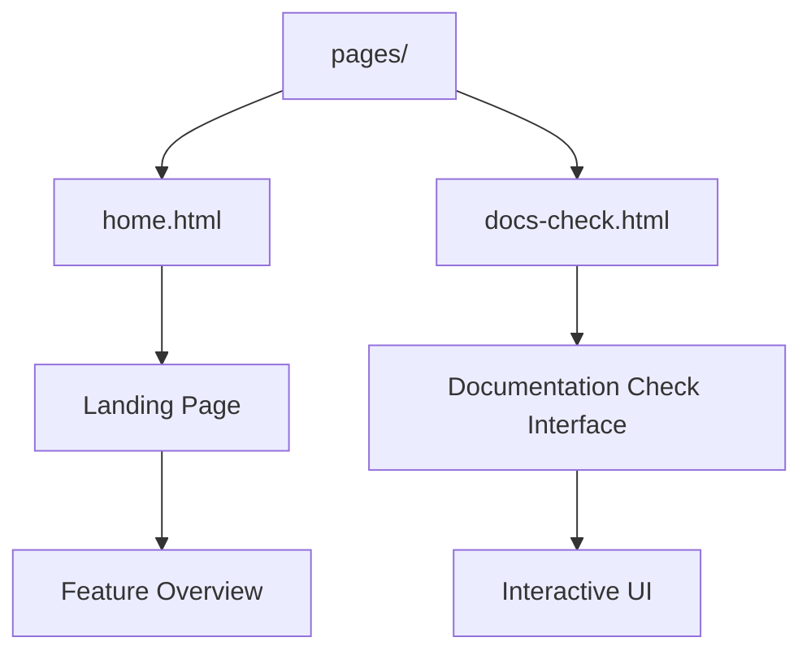

# Templates Pages Module - Documentación

## 🎯 Propósito del Módulo
Este módulo contiene las plantillas de Jinja2 que definen las páginas principales y completas de la aplicación web autocode. Cada archivo en este directorio representa una vista o ruta accesible para el usuario, y su principal responsabilidad es ensamblar los componentes de UI necesarios sobre la plantilla base para construir una página cohesiva y funcional.

## 🏗️ Arquitectura del Módulo


## 📁 Componentes del Módulo
### `home.html` - Página de Inicio
**Propósito**: Landing page principal que presenta las características de autocode
**Documentación**: [home.md](home.md)

### `docs-check.html` - Página de Verificación de Documentación
**Propósito**: Interfaz interactiva para ejecutar y mostrar los resultados de verificación de documentación
**Documentación**: [docs-check.md](docs-check.md)

## 🔗 Dependencias del Módulo
### Internas (otros módulos del proyecto)
- `autocode.web.templates.base` - Template base que todas las páginas extienden
- `autocode.web.templates.components` - Componentes reutilizables (botones, nav)
- `autocode.web.static` - JavaScript y CSS para funcionalidad

### Externas
- **Jinja2** - Motor de plantillas para herencia y renderizado
- **Tailwind CSS** - Framework CSS para estilos responsive
- **FastAPI** - Framework web que sirve estas plantillas

## 💡 Flujo de Trabajo Típico
1. **Usuario navega**: Accede a una URL específica (/, /docs-check)
2. **Routing**: FastAPI identifica la ruta y el handler correspondiente
3. **Context preparation**: El servidor prepara datos necesarios para la plantilla
4. **Template rendering**: Jinja2 renderiza la plantilla extendiendo base.html
5. **Component assembly**: Se incluyen componentes necesarios (nav, buttons)
6. **HTML delivery**: Se envía el HTML completo al navegador

## 🔧 Configuración del Módulo
- **Herencia**: Todas las páginas extienden `base.html`
- **Bloques**: Implementan bloques `title`, `content`, y opcionalmente `scripts`
- **Componentes**: Importan y usan macros de componentes reutilizables
- **Context**: Reciben datos dinámicos del servidor para renderizado

## ⚠️ Consideraciones Especiales
- **SEO Ready**: Cada página define su propio título y meta información
- **Responsive**: Layouts optimizados para desktop y móvil
- **Accessibility**: Estructura semántica y navegación accesible
- **Performance**: HTML optimizado con assets mínimos
- **Interactividad**: Páginas que requieren JavaScript lo cargan específicamente

## 🧪 Testing
- **Renderizado**: Verificar que cada página se renderiza correctamente
- **Herencia**: Comprobar que extienden base.html apropiadamente
- **Links**: Validar que la navegación entre páginas funciona
- **JavaScript**: Verificar que la funcionalidad interactiva opera correctamente

## 🔄 Flujo de Navegación
```mermaid
graph LR
    A[Usuario] --> B[/]
    A --> C[/docs-check]
    B --> D[home.html]
    C --> E[docs-check.html]
    D --> F[Feature Overview]
    E --> G[Documentation Interface]
    F --> C
    G --> B
```

## 📖 Navegación Detallada
- [home.html - Página de inicio y características](home.md)
- [docs-check.html - Interfaz de verificación de documentación](docs-check.md)
