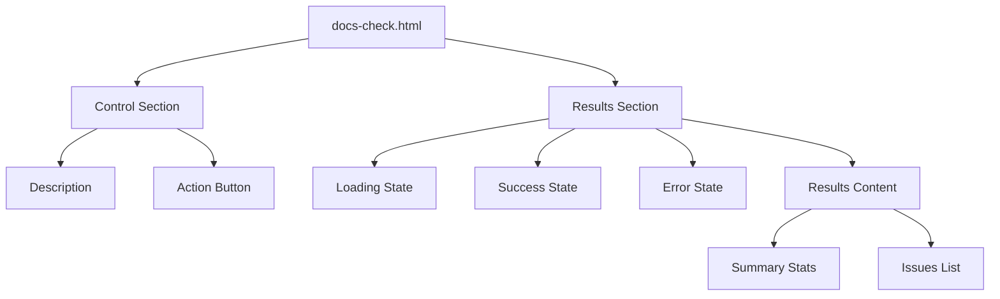
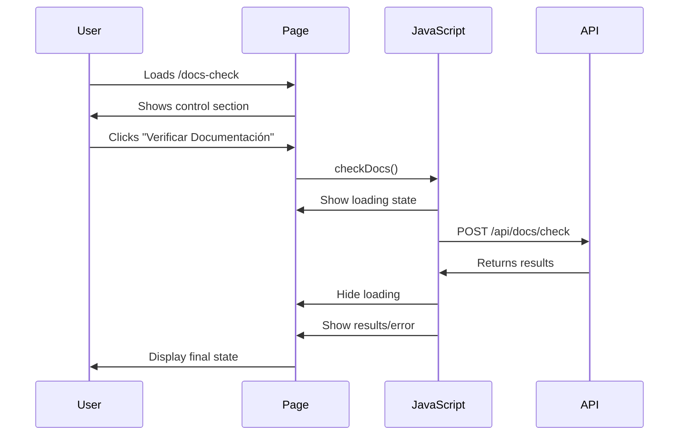

# Docs-Check.html - Página de Verificación de Documentación

## 🎯 Propósito
Este archivo define la página del "Docs Check" o verificador de documentación de autocode. Su propósito principal es proporcionar una interfaz interactiva donde los usuarios pueden ejecutar verificaciones de documentación y visualizar los resultados de forma clara y estructurada. Es la página funcional más importante de la aplicación.

## 🏗️ Arquitectura


## 📋 Responsabilidades
- **User interface**: Interfaz principal para la funcionalidad de docs check
- **Action trigger**: Botón para iniciar verificación de documentación
- **State management**: Manejo visual de estados (loading, success, error)
- **Results display**: Presentación estructurada de resultados
- **Data visualization**: Estadísticas y lista de problemas encontrados

## 🔗 Dependencias
### Internas
- `base.html` - Hereda estructura y layout base
- `components/button.html` - Macro para el botón de verificación
- `static/app.js` - JavaScript para funcionalidad interactiva
- `/api/docs/check` - Endpoint de API para verificación

### Externas
- **Jinja2** - Para herencia de templates y macros
- **Tailwind CSS** - Para styling responsive y estados visuales

## 📊 Interfaces Públicas
### Template Blocks
- `Docs Check` - Título específico de la página
- `` - Contenido principal de la interfaz
- `` - Carga del JavaScript específico

### UI States
1. **Initial State**: Solo muestra control section con botón
2. **Loading State**: Spinner y mensaje de análisis
3. **Success State**: Mensaje de éxito (si aplica)
4. **Error State**: Mensaje de error con detalles
5. **Results State**: Estadísticas y lista de problemas

## 🔧 Configuración
### Control Section
```html
<div class="bg-white p-8 rounded-lg shadow-md mb-8">
  <p class="text-gray-600 mb-6 text-center">
    Haz clic en el botón para verificar el estado de la documentación de tu proyecto.
  </p>
  <div class="text-center">
    {{ button("Verificar Documentación", id="check-docs-btn", onclick="checkDocs()") }}
  </div>
</div>
```

### Results Container Structure
```html
<div id="results" class="hidden">
  <!-- Loading State -->
  <div id="loading">...</div>
  
  <!-- Success State -->
  <div id="success" class="hidden">...</div>
  
  <!-- Error State -->
  <div id="error" class="hidden">...</div>
  
  <!-- Results Content -->
  <div id="results-content" class="hidden">...</div>
</div>
```

## 💡 Patrones de Uso
### Macro Import and Usage
```html


{{ button("Verificar Documentación", id="check-docs-btn", onclick="checkDocs()") }}
```

### JavaScript Integration
```html

<script src="/static/app.js"></script>

```

### State Management Classes
- **Hidden by default**: `class="hidden"` para estados iniciales
- **Show/hide logic**: Controlado por JavaScript via classList
- **Visual feedback**: Colores y iconos para diferentes estados

## ⚠️ Consideraciones
### User Experience
- **Progressive disclosure**: Solo muestra información relevante en cada estado
- **Visual feedback**: Estados claros con colores semánticos (azul=loading, verde=success, rojo=error)
- **Loading indication**: Spinner animado para feedback durante procesamiento
- **Error handling**: Mensajes de error amigables y descriptivos

### State Management
- **Initial load**: Solo control section visible
- **During processing**: Loading state con spinner
- **After completion**: Results o error state según outcome
- **State transitions**: Controladas por JavaScript, no por server

### Data Presentation
- **Summary statistics**: Grid responsive con métricas clave
- **Issues list**: Lista estructurada con colores de estado
- **Responsive design**: Se adapta a diferentes tamaños de pantalla

## 🧪 Testing
### Functional Testing
1. **Initial load**: Verificar que solo se muestra control section
2. **Button click**: Comprobar que se ejecuta checkDocs()
3. **Loading state**: Validar que se muestra spinner durante procesamiento
4. **Success flow**: Verificar renderizado correcto de resultados
5. **Error handling**: Comprobar manejo de errores de API

### Visual Testing
- **Loading spinner**: Verificar animación de spinner
- **Color coding**: Validar colores para diferentes estados de issues
- **Responsive**: Comprobar layout en diferentes tamaños
- **Typography**: Validar jerarquía visual y legibilidad

## 🔄 Flujo de Interacción


## 📋 Content Structure
### Control Section
- **Instructional text**: Explicación clara de qué hace el botón
- **Primary action**: Botón prominente para ejecutar verificación
- **Centered layout**: Diseño centrado para focus en la acción

### Results Visualization
- **Summary grid**: 4 métricas principales (total, actualizados, desactualizados, faltantes)
- **Issues list**: Lista detallada con path, tipo y estado
- **Color coding**: Sistema de colores para identificar tipos de problemas

### State Indicators
- **Loading**: Spinner azul con texto explicativo
- **Success**: Checkmark verde con mensaje de éxito
- **Error**: X roja con mensaje de error detallado

## 🚀 Mejoras Futuras
- **Real-time updates**: WebSocket para updates en tiempo real
- **Batch actions**: Acciones en lote para múltiples problemas
- **Filtering**: Filtros para diferentes tipos de problemas
- **Export results**: Exportar resultados a diferentes formatos
- **Historical tracking**: Historial de verificaciones anteriores
- **Integration**: Links directos para arreglar problemas identificados
- **Progress indication**: Barra de progreso más detallada durante procesamiento
- **Auto-refresh**: Refresco automático periódico de resultados
